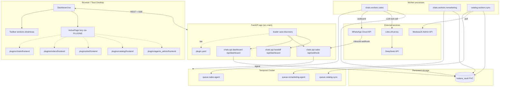
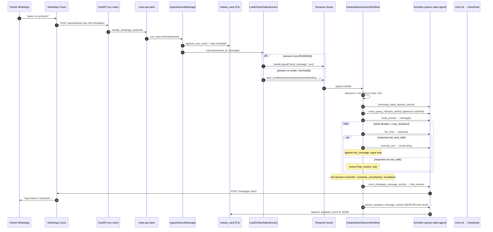

# Sección 01 — General (vista 30k pies + layout + plugin system + flujos)

> **Cuándo leer esto:** SIEMPRE como primer paso. Es la base mental que
> hace que las otras secciones tengan sentido.
> **Tamaño:** ~12 KB. **Pre-requisito:** ninguno.
> **Siguiente recomendado:** la sección específica a tu task (02-06).

---

## §1. ¿Qué es AgencyHubara?

Una **plataforma agéntica multi-plugin** donde cada plugin es una unidad
funcional autocontenida que puede tener:

- **Frontend** (React/TS) — paneles en un shell macOS-style.
- **API HTTP** (FastAPI) — webhooks o endpoints REST.
- **Agentes Temporal** — workflows + activities + tools para procesos
  long-running.

El producto canónico (y único plugin agéntico full-stack hoy) es `chats`:
agente WhatsApp que vende productos del catálogo, escala a humano, y hace
remarketing automático.

### Stack tecnológico

| Capa | Tecnología | Función |
|---|---|---|
| HTTP edge | FastAPI + uvicorn | Webhooks (WhatsApp inbound) + REST API del dashboard |
| Orquestación | Temporal.io (`temporalio>=1.0`) | Workflows long-lived (sesiones de chat, remarketing programado) |
| LLM | DeepSeek via LiteLLM proxy | Tool-calling para el agente conversacional |
| Conversación | `exoclaw_conversation` (paquete externo) | Build prompt + record turn (history JSONL) |
| Frontend | React 19 + Vite + Tauri | Dashboard desktop y web. **FSD estricto** |
| Catálogo | MedusaJS | Source-of-truth productos; snapshot local cacheado |
| Storage | Filesystem (PVC EFS en K8s) | Vault per-session: `metadata.json` + `history.jsonl` |
| Lenguajes | Python 3.11+ (uv workspace) / TypeScript 5.x | |

### Workspace uv (monorepo Python)

```
AgencyHubara/                    ← uv workspace root (pyproject.toml)
├── exoclaw-temporal/            ← member: motor genérico (activities base + DTOs comunes)
│   └── exoclaw_temporal/
│       ├── activities/          # build_prompt, llm_chat, record_turn (compartidas)
│       ├── session_based/       # template workflow (NO usado en prod hoy)
│       ├── turn_based/          # template workflow (idem)
│       └── config.py            # SessionInput, LLMConfig, WorkspaceConfig
└── hubara_agency/               ← member: la "agencia" (plugins + platform layer)
    └── src/
        ├── main.py              # LOADER FastAPI
        ├── run_workers.py       # META-LAUNCHER de workers Temporal
        ├── platform/            # librería compartida cross-plugin
        └── plugins/             # tus plugins viven acá
```

`exoclaw-temporal` provee el runtime básico. `hubara_agency` lo usa y
agrega su propia capa `platform/` (helpers cross-plugin) + los plugins
concretos bajo `src/plugins/`.

---

## §2. Layout completo del repositorio

```
AgencyHubara/
│
├── ARCHITECTURE.md                       # fuente de verdad humana
├── PLUGIN_ARCHITECTURE.md                # contrato formal del plugin system
├── PLUGIN_REFACTOR_PLAN.md               # plan ejecutable (cronología)
├── PLUGIN_REFACTOR_LOG.md                # bitácora append-only de PRs
├── HUBARA_PIPELINE_PLAN.md               # plan del pipeline Archon hubara
├── HUBARA_SKILL_BLUEPRINT.md             # spec de este skill
├── HUBARA_WORKFLOWS_BLUEPRINT.md         # spec de los 3 workflows hubara
├── pyproject.toml                        # uv workspace root
├── Dockerfile                            # imagen única hubara-agency-prod
│
├── exoclaw-temporal/                     # motor Temporal genérico (uv member)
│   └── exoclaw_temporal/...
│
├── hubara_agency/                        # la "agencia" (uv member)
│   ├── run_api.py                        # entrypoint uvicorn
│   ├── docker-compose.local.yml          # AUTOGEN — no editar
│   ├── docker-compose.base.yml           # fijo: infra services
│   ├── .importlinter                     # contratos R-DIP
│   ├── .hubara/                          # convenciones del pipeline
│   │   ├── spinal-files.yaml
│   │   ├── project-context.md
│   │   ├── refinements/<HU_ID>-tech.md
│   │   ├── plans/<HU_ID>/
│   │   └── results/<HU_ID>/
│   ├── k8s/aws-produccion/               # K8s manifests (1 deployment por worker)
│   ├── scripts/
│   │   ├── render-compose.py             # autogen del compose desde manifests
│   │   └── trigger_catalog_sync.py
│   └── src/
│       ├── main.py                       # LOADER FastAPI
│       ├── run_workers.py                # META-LAUNCHER Temporal
│       │
│       ├── platform/                     # librería compartida cross-plugin
│       │   ├── config.py                 # env vars globales
│       │   ├── constants.py              # solo cross-plugin: ROUTE_*, WHATSAPP_SESSION_PREFIX
│       │   ├── contracts.py              # DTOs cross-boundary
│       │   ├── logging.py                # setup_logging() loguru
│       │   ├── plugin_manifest.py        # API de lectura de manifests
│       │   ├── registries.py             # tool registry base
│       │   ├── state.py                  # FilesystemMetadataStore
│       │   ├── tool_extensions.py        # registro de tools por dominio (DI invertida)
│       │   ├── workflow_helpers.py       # run_agent_turn + PendingMessage + coalesce_pending
│       │   ├── temporal/                 # client + dispatcher + activities + heartbeat + retry
│       │   ├── whatsapp/                 # client + activities
│       │   ├── session_history/          # JSONL store + activities
│       │   ├── catalog/                  # CatalogPort + LocalSnapshot
│       │   ├── medusa/                   # MedusaJS HTTP client live
│       │   └── tools/                    # tools shared (TransferToSalesAgent, EscalateToHuman)
│       │
│       └── plugins/                      # DOMINIO ─ los plugins Python
│           ├── __init__.py
│           ├── chats/                    # plugin agéntico (template D: full-stack)
│           │   ├── api/                  # routers FastAPI (webhook, dashboard SSE, handoff)
│           │   ├── agent/
│           │   │   ├── sales/            # HubaraSalesSessionWorkflow + tools + activities
│           │   │   └── remarketing/      # RemarketingSessionWorkflow + activities
│           │   └── workers/              # entrypoints async def main() — 1 por sub-agente
│           ├── catalog/                  # plugin con worker (template C)
│           │   ├── agent/                # CatalogSyncWorkflow + activities
│           │   └── workers/sync.py       # entrypoint
│           ├── agents_admin/             # plugin frontend-only (template A)
│           ├── eta/                      # plugin frontend-only (template A)
│           └── orders/                   # plugin frontend-only (template A)
│
└── frontend_dashboard/                   # React + Vite + Tauri
    ├── package.json                      # scripts: predev/prebuild → plugins:sync
    ├── vite.config.ts                    # alias @ → ./src, @plugins → ./src/plugins
    ├── tsconfig.app.json                 # paths espejo del vite
    ├── .dependency-cruiser.cjs           # contratos FSD + plugin isolation
    ├── .frontend/                        # convenciones (legacy pipeline frontend)
    ├── scripts/
    │   └── plugins-sync.ts               # generador del registry
    └── src/
        ├── main.tsx                      # mount + providers
        ├── index.css                     # estilos macOS-style globales + @theme tokens
        ├── pages/
        │   └── Dashboard.tsx             # ÚNICA "página" — shell macOS, 100% data-driven
        ├── app/
        │   ├── index.tsx                 # AppProviders
        │   ├── providers/
        │   └── plugin-registry.generated.ts   # AUTOGEN, gitignored
        ├── shared/                       # floor de FSD
        │   ├── ui/                       # Icon, Button, Panel, Toolbar, TitleBar, StatusBar
        │   ├── lib/                      # utils, IS_DESKTOP, etc.
        │   ├── api/                      # fetch wrapper base
        │   └── config/                   # env runtime
        ├── entities/                     # dominio shared cross-plugin (no se mueven a plugins)
        │   ├── chat/                     # useChatInbox, useSessionsStream (SSE)
        │   ├── order/, tracked-order/
        │   ├── agent/
        │   └── ...                       # 8 entidades en total
        └── plugins/                      # PLUGINS frontend + MANIFESTS
            ├── _schema/
            │   └── plugin.schema.yaml    # JSON Schema del manifest
            ├── chats/
            │   ├── plugin.yaml           # ← MANIFEST (única fuente de verdad)
            │   └── frontend/
            │       ├── index.ts          # barrel: export default ChatsSection
            │       ├── ChatsSection.tsx
            │       └── features/         # FSD interno relajado (cross-feature OK dentro del plugin)
            ├── agents_admin/             # mismo patrón
            ├── catalog/
            ├── eta/
            └── orders/
```

---

## §3. El sistema de plugins — núcleo del refactor

### §3.1 ¿Qué es un plugin?

Una **carpeta autocontenida** que puede contribuir en hasta 3 stacks:

- **Frontend**: un componente "Page" + sections del shell + sidebar entries.
- **API HTTP**: routers FastAPI con prefix/tags propios.
- **Agente Temporal**: workflows + activities + tools + uno o más workers.

Cada plugin **declara** sus contribuciones en un único archivo
`plugin.yaml`. El sistema (loaders) descubre y registra automáticamente.

### §3.2 Anatomía del manifest (post-PR11 — Single Source of Truth)

`plugin.yaml` es **el ÚNICO archivo** donde se declaran las conexiones
del plugin con el sistema. Todo lo demás (queues, docker-compose, k8s,
registries) se descubre o auto-genera desde acá.

```yaml
# frontend_dashboard/src/plugins/chats/plugin.yaml — ejemplo full-stack
id: chats                          # MUST match directory name; pattern ^[a-z][a-z0-9_]*$
version: 0.1.0
display_name: Chats
description: Conversaciones WhatsApp con agente Temporal.
depends_on: []                     # ids de otros plugins requeridos (reservado)

frontend:
  entry: ./frontend
  contributes:
    sections:                      # entradas del segmented control del Toolbar
      - { key: chat, label: Chats, order: 1, icon: chat }
    sidebar:                       # reservado para futuro
      - { route: /chats, label: Chats, icon: chat }

api:
  python_module: src.plugins.chats.api        # ancla simbólica
  prefix: /api/chats
  tags: [Chats]
  legacy_routers:                  # múltiples routers con prefijos heterogéneos
    - { module: src.plugins.chats.api.sales,     prefix: /api,           tags: [WhatsApp_Sales_Domain] }
    - { module: src.plugins.chats.api.dashboard, prefix: /api/dashboard, tags: [Dashboard] }
    - { module: src.plugins.chats.api.handoff,   prefix: /api/dashboard, tags: [Dashboard_Handoff] }

agent:
  python_module: src.plugins.chats.agent
  workers:                         # MÚLTIPLES workers por plugin
    - name: sales
      module: src.plugins.chats.workers.sales
      task_queue: queue-sales-agent   # ← SSoT post-PR11
      deployment:                     # ← hint K8s
        replicas: 3
        cpu_request: 500m
        memory_request: 512Mi
        env_secrets:
          - { var: DEEPSEEK_API_KEY, secret: hubara-llm-secret, key: DEEPSEEK_API_KEY }
      compose:                        # ← input de render-compose.py
        env:
          TEMPORAL_URL: temporal:7233
          API_BASE_LLMLITE: http://litellm:4000
        volumes:
          - hubara-vault-local:/app/hubara_vault
        depends_on: [temporal, litellm]
    - name: remarketing
      module: src.plugins.chats.workers.remarketing
      task_queue: queue-remarketing-agent
      # ...

wiring_intents:                    # declarativo; no se aplica automático
  filesystem_volumes: [hubara-vault]
  env_vars_required:
    - DEEPSEEK_API_KEY
    - WHATSAPP_PHONE_NUMBER_ID
    - WHATSAPP_ACCESS_TOKEN
```

Schema completo en `references/manifest-schema.md`. Ejemplos por
template en `examples/`.

### §3.3 Los 3 loaders

Cada stack tiene **un descubridor** que lee los manifests y registra lo
declarado. Filtrado por env var `ENABLED_PLUGINS` (csv; vacío = todos).

```
┌────────────────────────────────────────────────────────────────────┐
│  frontend_dashboard/src/plugins/<id>/plugin.yaml                   │
│                       (única fuente de verdad)                      │
└────┬─────────────────────────┬─────────────────────────┬───────────┘
     │                         │                         │
     ▼                         ▼                         ▼
┌──────────────┐    ┌──────────────────────┐    ┌──────────────────┐
│ plugins-sync │    │  src/main.py loader  │    │  run_workers.py  │
│   .ts (Node) │    │  (FastAPI bootstrap) │    │  (meta-launcher) │
├──────────────┤    ├──────────────────────┤    ├──────────────────┤
│ Lee YAML     │    │ Lee YAML             │    │ Lee YAML         │
│ Filtra ENV   │    │ Filtra ENV           │    │ Filtra ENV       │
│ Genera TS    │    │ importlib import     │    │ importlib import │
│   registry   │    │ app.include_router() │    │ asyncio.gather() │
│              │    │ legacy_routers >     │    │   sobre workers  │
│              │    │ python_module        │    │                  │
└──────┬───────┘    └──────────┬───────────┘    └────────┬─────────┘
       │                       │                         │
       ▼                       ▼                         ▼
   Frontend                FastAPI app             Temporal Workers
   bundle code             (uvicorn)               (1 por sub-agente)
   splitted via
   lazy()/Suspense
```

### §3.4 Quién lee qué del manifest (tabla rápida)

| Herramienta | Sección que lee | Output |
|---|---|---|
| `scripts/plugins-sync.ts` | `id`, `version`, `frontend.contributes` | `src/app/plugin-registry.generated.ts` |
| `src.main` (loader FastAPI) | `api.python_module`, `api.legacy_routers` | Rutas montadas en `app: FastAPI` |
| `src.run_workers` (meta-launcher) | `agent.workers[]` (`name`, `module`) | `asyncio.gather` de N tasks |
| `src.platform.plugin_manifest.get_task_queue` | `agent.workers[].task_queue` | string queue para `Worker(...)` / `start_workflow(...)` |
| `scripts/render-compose.py` | `agent.workers[].compose` + `module` | `docker-compose.local.yml` |
| `tests/plugins/test_premortem_invariants.py` | TODO el manifest + escaneo de `k8s/` y `plugins-sync.ts` | Invariantes que rompen si divergen |

**Regla de oro:** si una conexión del plugin con el sistema no se puede
expresar en el manifest, **eso es un bug del schema** — agregar el campo
necesario al `_schema/plugin.schema.yaml` antes que hacerlo "a mano" en
un archivo shared.

### §3.5 El frontend registry generado

`plugins-sync.ts` (Node) escanea `src/plugins/*/plugin.yaml` y genera
`src/app/plugin-registry.generated.ts` (gitignored). Ejemplo del output:

```typescript
// AUTO-GENERATED — DO NOT EDIT
import { lazy, type ComponentType, type LazyExoticComponent } from "react";

export const PLUGINS: PluginEntry[] = [
  {
    id: "chats",
    displayName: "Chats",
    sidebar: [{ "route": "/chats", "label": "Chats", "icon": "chat" }],
    sections: [{ "key": "chat", "label": "Chats", "order": 1, "icon": "chat" }],
    dashboardWidgets: [],
    Page: lazy(() => import("@plugins/chats/frontend")),  // ← code splitting
  },
  // ... uno por plugin habilitado
];
```

`Dashboard.tsx` consume `PLUGINS` y deriva todo desde ahí — **no hay
ningún id hardcoded en el shell**.

---

## §4. Diagrama de componentes (alto nivel)



### Aislamiento por task queue

Cada sub-agente tiene su **task queue exclusiva** en Temporal:

| Worker | Task queue | Workflow registrado | Razón del aislamiento |
|---|---|---|---|
| `chats.workers.sales` | `queue-sales-agent` | `HubaraSalesSessionWorkflow` | Deploy + escalado independiente; sales recibe alto throughput |
| `chats.workers.remarketing` | `queue-remarketing-agent` | `RemarketingSessionWorkflow` | Workflows long-lived que duermen días; baja replica count |
| `catalog.workers.sync` | `queue-catalog-sync` | `CatalogSyncWorkflow` | Single-writer (`os.replace` race); 1 replica con `strategy: Recreate` |

**El LLM de Sales no puede invocar tools de Catalog por accidente** —
cada worker registra solo las tools de su plugin via
`register_tool_extension(...)` al boot.

---

## §5. Flujo end-to-end de un mensaje de WhatsApp (sales)

Desde "hola" del cliente hasta la respuesta del agente.



### Puntos clave del flujo (mnemotécnicos)

1. **Webhook libera la conexión inmediato** (`BackgroundTasks.add_task`)
   y devuelve 200 OK. Si tarda, Meta cierra y reenvía → workflow
   duplicado.
2. **Debounce server-side** 1.5s silencio / 12s cap: si el cliente manda
   5 mensajes rápidos, se coalescan en un solo turno LLM.
3. **`run_agent_turn` encapsula el tool-loop** (vive en
   `src/platform/workflow_helpers.py`). Detalle en
   `sections/04-backend-agents.md`.
4. **`send_typing_indicator` va ANTES del LLM**, gated por
   `workflow.patched("typing-indicator-v1")` para no romper workflows
   in-flight pre-deploy.
5. **Tool decisions post-loop**: las tools devuelven decision DTOs
   (`TransferDecision`, etc.) que el workflow consume vía dispatcher
   activities (ADR-001).
6. **`persist_assistant_message` corre DESPUÉS del send** a Meta. Si el
   send falla con retry, no se contamina el JSONL.
7. **Continue-as-new cada 50 turnos** evita que el history del workflow
   crezca >50MB (límite Temporal).

---

## §6. Vault (storage compartido cross-plugin)

`hubara_vault/` es **PVC EFS en producción** / **bind mount en
docker-compose**. Cross-plugin: varios plugins escriben/leen acá.

```
$WORKSPACE_VAULT_DIR/             ← env var, default ./hubara_vault
├── wa_<phone>/                   ← runtime sessions (plugin chats)
│   ├── metadata.json             ← active_route, tag, status_history
│   └── sessions/<session_id>.jsonl   ← message history
└── catalog/                      ← snapshot (escribe catalog, lee chats)
    ├── manifest.json
    └── products/
```

**Reglas críticas:**

1. Cada plugin que escribe usa su propio **sub-namespace top-level**
   (`wa_*/` para chats, `catalog/` para catalog).
2. **Ningún test puede escribir al vault real.** Fixture autouse
   `_isolate_vault_dir` en `tests/conftest.py` redirige
   `WORKSPACE_VAULT_DIR` a `tmp_path` por test.
3. Los `wa_*/metadata.json` están commiteados como seed data para que el
   frontend dev local muestre UI realista.

---

## §7. Paralelismo de implementadores (la promesa del refactor)

Diseñado para que múltiples implementadores trabajen en plugins distintos
**en paralelo sin pisarse en archivos compartidos**.

**Garantía post-PR11:** crear un plugin nuevo con worker requiere editar
**solo archivos nuevos o auto-generados**:

| Archivo | Tipo | Conflict si 2 PRs en paralelo? |
|---|---|---|
| `frontend_dashboard/src/plugins/<id>/plugin.yaml` | NUEVO (por plugin) | ❌ no |
| `hubara_agency/src/plugins/<id>/` (árbol Python) | NUEVO | ❌ no |
| `frontend_dashboard/src/plugins/<id>/frontend/` | NUEVO | ❌ no |
| `k8s/aws-produccion/worker-<name>.yaml` | NUEVO (por worker) | ❌ no |
| `docker-compose.local.yml` | autogen por `render-compose.py` | ⚠️ regen mecánico |
| `uv.lock` / `package-lock.json` | lock file de package manager | ⚠️ inherente |
| `PLUGIN_REFACTOR_LOG.md` | append-only | ⚠️ trivial |

**Conflicts eliminados en PR11** (antes eran share-edit):

- `src/platform/constants.py` (queues hardcoded) → eliminado, viven en manifest.
- `tests/plugins/test_premortem_invariants.py:_EXPECTED_K8S_DEPLOYMENTS` → auto-discover.
- `tests/conftest.py:_VAULT_CAPTURING_MODULES` → AST scan auto-discover.
- `docker-compose.local.yml` → autogen desde `agent.workers[].compose`.

**Lo que sigue siendo spinal (raro, pero existe):** ver `sections/07-shared-files.md`.

---

## §8. Plugins existentes (snapshot — cambia con cada PR de feature)

| Plugin | Template | Workers | Routers | Notas |
|---|---|---|---|---|
| `chats` | D — full-stack | sales (3 replicas) + remarketing (1 replica) | 3 (sales / dashboard / handoff) | Plugin canónico; primer caso de uso real |
| `catalog` | C — frontend + worker | sync (1 replica, single-writer) | 0 | UI muestra jobs + dispara syncs |
| `orders` | A — frontend-only | 0 | 0 | UI consume `entities/order` shared |
| `eta` | A — frontend-only | 0 | 0 | UI tracking envíos |
| `agents_admin` | A — frontend-only | 0 | 0 | UI gestión agentes |

Para detalles de cada uno, ver `examples/`:
- `examples/plugin-frontend-only.md` → orders / eta / agents_admin
- `examples/plugin-with-worker.md` → catalog
- `examples/plugin-full-stack-agentic.md` → chats

---

## §9. Próxima sección recomendada según tu task

| Task | Leé después |
|---|---|
| "Agregar tool LLM al agente sales" | `sections/04-backend-agents.md` + `sections/10-cookbook.md` |
| "Crear plugin nuevo full-stack" | `sections/03-backend-plugin.md` (templates A-D) |
| "Agregar feature React al dashboard chats" | `sections/06-frontend-plugin.md` + `sections/05-frontend-fsd.md` |
| "Agregar webhook nuevo" | `sections/03-backend-plugin.md` (template B) |
| "Editar `plugin_manifest.py` o agregar helper a `platform/`" | `sections/02-backend-platform.md` |
| "Agregar entity shared cross-plugin" | `sections/05-frontend-fsd.md` + `sections/07-shared-files.md` |
| "Diagnosticar fallo de architecture gate" | `sections/08-tests-and-gates.md` + `references/deha-rules.md` |
| "Saber qué task_queue tiene un worker" | `cd hubara_agency && uv run python -c "from src.platform.plugin_manifest import get_task_queue; print(get_task_queue('<plugin>', '<worker>'))"` |

---

**Fin sección 01.** Si llegaste hasta acá entendés la arquitectura. Lo
demás son detalles de implementación por área.
