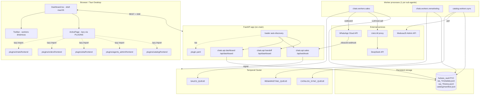
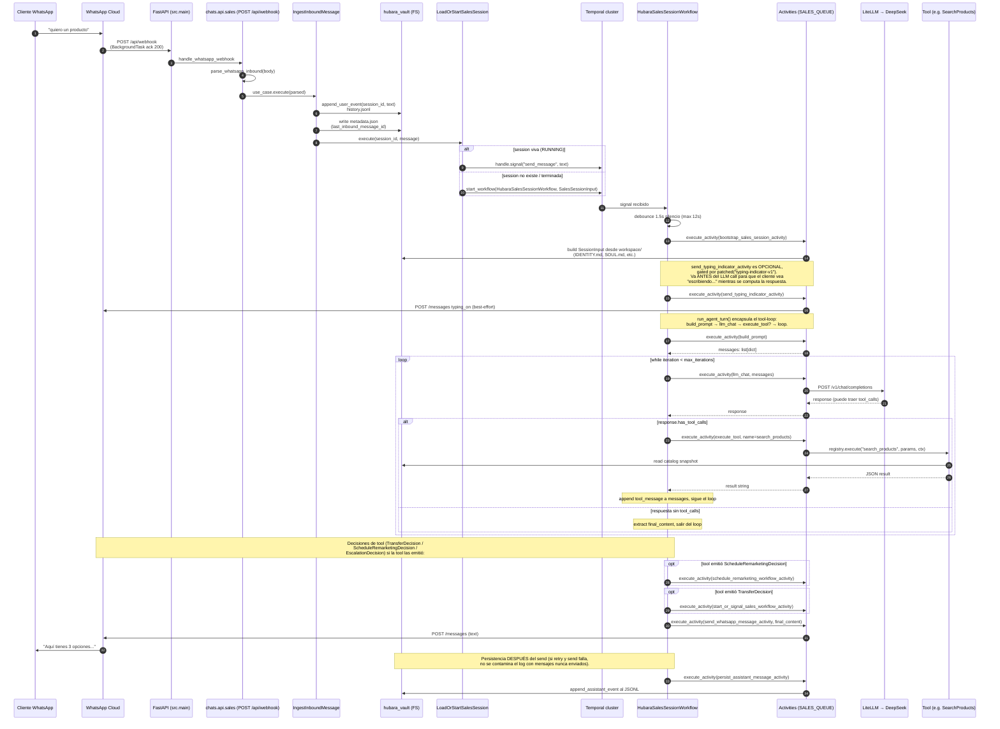
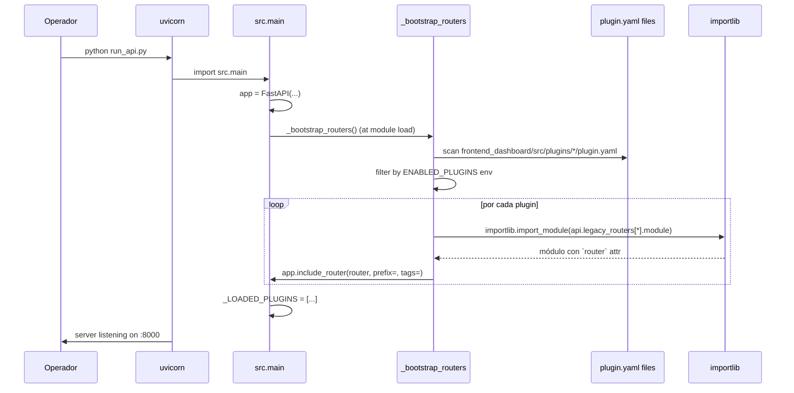
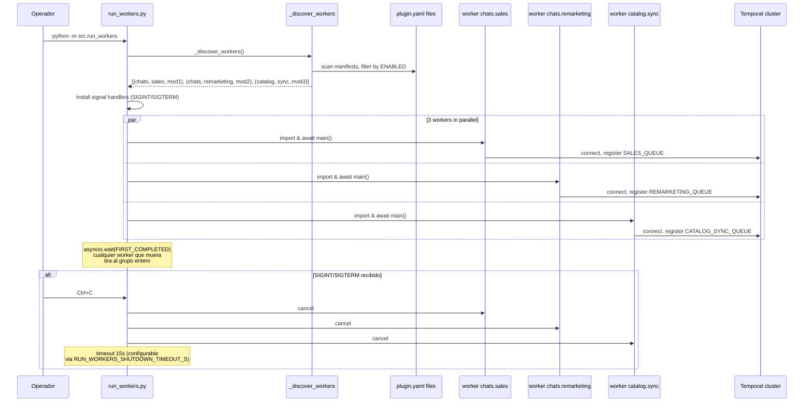
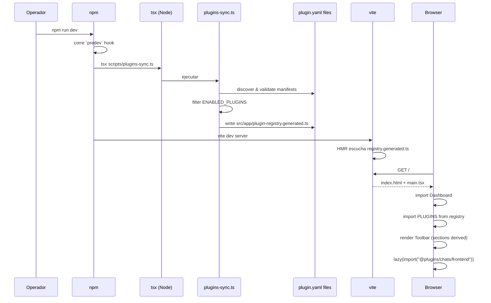

# Arquitectura de AgencyHubara

> **Audiencia:** desarrollador que entra al repo por primera vez y necesita
> entender (a) cómo está organizado el código, (b) cómo flota un mensaje end-to-end
> y (c) qué editar para agregar un plugin nuevo.
>
> **Documentos relacionados:**
> - `PLUGIN_ARCHITECTURE.md` — contrato formal del sistema de plugins.
> - `PLUGIN_REFACTOR_PLAN.md` — el plan que se ejecutó para llegar acá.
> - `PLUGIN_REFACTOR_LOG.md` — bitácora de cada PR.
> - Este documento describe el **estado actual** post-PR10 (2026-05-16).

---

## §1. Vista de 30.000 pies — ¿qué es AgencyHubara?

AgencyHubara es una **plataforma agéntica multi-plugin** donde cada
"plugin" es una unidad de funcionalidad autocontenida que puede tener:

- **Frontend** (React/TS) — paneles en un shell macOS-style.
- **API HTTP** (FastAPI) — webhooks o endpoints REST.
- **Agentes Temporal** — workflows + activities + tools para procesos largos.

El producto canónico (y el único plugin agéntico hoy) es `chats`: un agente
de WhatsApp que vende productos del catálogo, escala a humano, y hace
remarketing automático.

### Stack tecnológico

| Capa | Tecnología | Función |
|---|---|---|
| HTTP edge | **FastAPI** + uvicorn | Webhooks (WhatsApp inbound) + REST API del dashboard. |
| Orquestación | **Temporal.io** (`temporalio>=1.0`) | Workflows long-lived (sesiones de chat, remarketing programado). |
| LLM | **DeepSeek** via **LiteLLM proxy** | Tool-calling para el agente conversacional. La dep `litellm>=1.40` vive en `exoclaw-temporal`. |
| Conversación | **exoclaw_conversation** (paquete externo, dep transitiva de `exoclaw-temporal`) | Build prompt + record turn (manejo de history JSONL). |
| Frontend | **React 19 + Vite + Tauri** | Dashboard desktop y web. **Feature-Sliced Design (FSD)** estricto. |
| Catálogo | **MedusaJS** | Source-of-truth de productos; snapshot local cacheado. |
| Storage | **Filesystem (PVC EFS en K8s)** | Vault per-session: metadata.json + history.jsonl. |
| Lenguajes | Python 3.11+ (uv workspace) / TypeScript 5.x | |

### Workspace uv

El monorepo Python es un **uv workspace** con dos members:

```
AgencyHubara/
├── exoclaw-temporal/          # member: motor genérico (activities base, configs)
└── hubara_agency/             # member: la "agencia" (plugins + platform layer)
```

`exoclaw-temporal` provee el runtime básico de Temporal (build_prompt,
record_turn, llm_chat). `hubara_agency` lo usa y agrega su propia capa
`platform/` (helpers compartidos cross-plugin) y los plugins concretos
bajo `src/plugins/`.

---

## §2. Layout completo del repositorio

```
AgencyHubara/
│
├── ARCHITECTURE.md                    # ESTE DOCUMENTO
├── PLUGIN_ARCHITECTURE.md             # contrato formal de plugins
├── PLUGIN_REFACTOR_PLAN.md            # plan ejecutable
├── PLUGIN_REFACTOR_LOG.md             # bitácora append-only
├── pyproject.toml                     # uv workspace root
├── Dockerfile                         # imagen única hubara-agency-prod
│
├── exoclaw-temporal/                  # ─── motor Temporal genérico ───
│   └── exoclaw_temporal/
│       ├── activities/                # build_prompt, llm_chat, record_turn (compartidas)
│       ├── session_based/             # template workflow (no usado en prod hoy)
│       ├── turn_based/                # template workflow (idem)
│       └── config.py                  # DTOs comunes: SessionInput, LLMConfig, WorkspaceConfig
│
├── hubara_agency/                     # ─── la "agencia" ───
│   ├── run_api.py                     # entrypoint uvicorn → src.main:app
│   ├── docker-compose.local.yml       # stack completo para dev (db, temporal, litellm, workers)
│   ├── .importlinter                  # contratos R-DIP (DEHA)
│   ├── k8s/aws-produccion/            # manifests K8s (api + workers + EFS)
│   │
│   └── src/
│       ├── main.py                    # LOADER FastAPI (auto-discovery de plugins)
│       ├── run_workers.py             # META-LAUNCHER de workers Temporal
│       │
│       ├── platform/                  # ─── librería compartida cross-plugin ───
│       │   ├── config.py              # env vars globales (WORKSPACE_VAULT_DIR, WHATSAPP_*)
│       │   ├── constants.py           # queues + rutas: SALES_QUEUE="queue-sales-agent" etc.
│       │   ├── contracts.py           # DTOs cross-boundary (TransferDecision, EscalationDecision, etc.)
│       │   ├── logging.py             # setup_logging() — loguru config compartida por todos los workers
│       │   ├── registries.py          # tool registry base (cross-plugin tools)
│       │   ├── state.py               # FilesystemMetadataStore (canonical; hay un shim en chats/sales)
│       │   ├── tool_extensions.py     # registro de tools por dominio (DI invertida)
│       │   ├── workflow_helpers.py    # PendingMessage, coalesce_pending, run_agent_turn (loop LLM+tool)
│       │   ├── temporal/              # client, dispatcher, activities (execute_tool, claim_routing), retry_policies, heartbeat
│       │   ├── whatsapp/              # client + activities (send_message, typing_indicator)
│       │   ├── session_history/       # JSONL store + activities (persist_assistant_message)
│       │   ├── catalog/               # CatalogPort + LocalSnapshot reader + MedusaCheckoutVerification
│       │   ├── medusa/                # MedusaJS HTTP client (live, para checkout verification)
│       │   └── tools/                 # tools compartidas (TransferToSalesAgent, EscalateToHuman)
│       │
│       └── plugins/                   # ─── DOMINIO ─ los plugins ───
│           ├── __init__.py
│           │
│           ├── chats/                 # Plugin agéntico WhatsApp (sales + remarketing)
│           │   ├── api/               # routers FastAPI (webhook, dashboard SSE, handoff)
│           │   ├── agent/
│           │   │   ├── sales/         # HubaraSalesSessionWorkflow + tools + activities
│           │   │   └── remarketing/   # RemarketingSessionWorkflow + activities
│           │   └── workers/           # entrypoints async def main() — uno por sub-agente
│           │
│           ├── catalog/               # Plugin agéntico (worker on-demand, sin LLM)
│           │   ├── agent/             # CatalogSyncWorkflow + activities
│           │   └── workers/sync.py    # entrypoint
│           │
│           ├── agents_admin/          # Plugin frontend-only (UI gestión agentes)
│           ├── eta/                   # Plugin frontend-only (UI tracking envíos)
│           └── orders/                # Plugin frontend-only (UI órdenes)
│
└── frontend_dashboard/                # ─── React + Vite + Tauri ───
    ├── package.json                   # scripts: predev/prebuild → plugins:sync
    ├── vite.config.ts                 # alias @ → ./src ; @plugins → ./src/plugins
    ├── tsconfig.app.json              # paths espejo del vite
    ├── .dependency-cruiser.cjs        # contratos FSD + plugin isolation
    │
    ├── scripts/
    │   └── plugins-sync.ts            # GENERADOR del registry (lee plugin.yaml)
    │
    └── src/
        ├── main.tsx                   # mount + providers
        ├── index.css                  # estilos macOS-style globales
        │
        ├── app/                       # providers + el REGISTRY autogenerado
        │   ├── index.tsx              # AppProviders
        │   ├── providers/
        │   └── plugin-registry.generated.ts   # ← AUTOGEN, gitignored
        │
        ├── pages/
        │   └── Dashboard.tsx          # ÚNICA "página" — shell macOS, 100% data-driven
        │
        ├── shared/                    # ─── floor de FSD: ningún plugin importa por encima ───
        │   ├── ui/                    # Icon, Button, Panel, Toolbar, TitleBar, StatusBar
        │   ├── lib/                   # utils, IS_DESKTOP, etc.
        │   ├── api/                   # fetch wrapper base
        │   └── config/                # env runtime
        │
        ├── entities/                  # ─── dominio shared cross-plugin ───
        │   ├── chat/                  # useChatInbox, useSessionsStream (SSE)
        │   ├── order/                 # useOrders
        │   ├── tracked-order/         # useTrackedOrders
        │   ├── agent/                 # useAgents
        │   └── ...                    # (8 entidades — no se mueven a plugins)
        │
        └── plugins/                   # ─── PLUGINS frontend ───
            ├── _schema/
            │   └── plugin.schema.yaml # JSON Schema del manifest
            │
            ├── chats/
            │   ├── plugin.yaml        # ← MANIFEST (única fuente de verdad)
            │   └── frontend/
            │       ├── index.ts       # barrel: export default ChatsSection
            │       ├── ChatsSection.tsx
            │       └── features/      # FSD interno relajado: cross-feature OK dentro del plugin
            │
            ├── agents_admin/          # mismo patrón
            ├── catalog/
            ├── eta/
            └── orders/
```

---

## §3. El sistema de plugins — núcleo del refactor

### §3.1 ¿Qué es un plugin?

Un plugin es una **carpeta autocontenida** que puede contribuir en hasta 3 stacks:

- **Frontend**: un componente "Page" + sections del shell + sidebar entries.
- **API HTTP**: routers FastAPI con prefix/tags propios.
- **Agente Temporal**: workflows + activities + tools + uno o más workers.

Cada plugin **declara** sus contribuciones en un único archivo `plugin.yaml`.
El sistema (loaders) descubre y registra automáticamente.

### §3.2 Anatomía del manifest (post-PR11 — Single Source of Truth)

El `plugin.yaml` es **el ÚNICO archivo** donde se declaran las conexiones
del plugin con el sistema. Todo lo demás (queues, docker-compose, k8s,
registries) se descubre o auto-genera desde acá.

```yaml
# frontend_dashboard/src/plugins/chats/plugin.yaml
id: chats                          # MUST match directory name; pattern ^[a-z][a-z0-9_]*$
version: 0.1.0                     # SemVer
display_name: Chats
description: Conversaciones WhatsApp con agente Temporal.

depends_on: []                     # ids de otros plugins requeridos (reservado, no usado hoy)

# ── Frontend ───────────────────────────────────────────────────────────
# Consumido por scripts/plugins-sync.ts → src/app/plugin-registry.generated.ts
frontend:
  entry: ./frontend                # path relativo al manifest; debe existir
  contributes:
    sections:                      # entradas del segmented control del Toolbar
      - { key: chat, label: Chats, order: 1, icon: chat }
    sidebar:                       # entradas del sidebar (reservado)
      - { route: /chats, label: Chats, icon: chat }

# ── API REST ────────────────────────────────────────────────────────────
# Consumido por src.main (FastAPI loader).
# Política: legacy_routers > python_module. Si ambos están, gana legacy.
api:
  python_module: src.plugins.chats.api    # ancla simbólica; ignorado si hay legacy_routers
  prefix: /api/chats
  tags: [Chats]
  legacy_routers:                  # múltiples routers con prefijos heterogéneos
    - { module: src.plugins.chats.api.sales,     prefix: /api,           tags: [WhatsApp_Sales_Domain] }
    - { module: src.plugins.chats.api.dashboard, prefix: /api/dashboard, tags: [Dashboard] }
    - { module: src.plugins.chats.api.handoff,   prefix: /api/dashboard, tags: [Dashboard_Handoff] }

# ── Agente Temporal ────────────────────────────────────────────────────
# Consumido por:
#   - src.run_workers (meta-launcher) → arranca cada worker
#   - src.platform.plugin_manifest.get_task_queue → resuelve task_queue
#   - scripts/render-compose.py → genera service en docker-compose.local.yml
#   - tests/plugins/test_premortem_invariants.py → invariantes (queue única, k8s paridad)
agent:
  python_module: src.plugins.chats.agent    # ancla simbólica (introspección futura)
  workers:                                  # MÚLTIPLES workers por plugin (sales + remarketing)
    - name: sales
      module: src.plugins.chats.workers.sales
      task_queue: queue-sales-agent         # ← SSoT de la Temporal queue (PR11)
      deployment:                           # ← hint para K8s manifest (auto-gen pendiente)
        replicas: 3
        cpu_request: 500m
        memory_request: 512Mi
        env_secrets:                        # secretos K8s para producción
          - { var: DEEPSEEK_API_KEY,        secret: hubara-llm-secret,      key: DEEPSEEK_API_KEY }
          - { var: WHATSAPP_ACCESS_TOKEN,   secret: hubara-whatsapp-secret, key: WHATSAPP_ACCESS_TOKEN }
      compose:                              # ← input de render-compose.py
        env:
          TEMPORAL_URL: temporal:7233
          API_BASE_LLMLITE: http://litellm:4000
          WORKSPACE_VAULT_DIR: /app/hubara_vault
          DEEPSEEK_API_KEY: ${DEEPSEEK_API_KEY}
        volumes:
          - hubara-vault-local:/app/hubara_vault
        depends_on:
          - temporal
          - litellm
    - name: remarketing
      module: src.plugins.chats.workers.remarketing
      task_queue: queue-remarketing-agent
      deployment: { replicas: 1, ... }
      compose: { ... }

# ── Wiring intents (declarativo; no se aplica automáticamente) ──────────
wiring_intents:
  filesystem_volumes:
    - hubara-vault                 # PVC compartido cross-plugin (ver §6)
  env_vars_required:
    - DEEPSEEK_API_KEY
    - WHATSAPP_PHONE_NUMBER_ID
    - WHATSAPP_ACCESS_TOKEN
    - WHATSAPP_VERIFY_TOKEN
    - TEMPORAL_URL
    - WORKSPACE_VAULT_DIR
```

**Cambios clave introducidos por PR11:**

- `agent.workers[].task_queue` (**required**) — antes vivía hardcoded en
  `src/platform/constants.py`, causaba conflict de merge cuando 2 agentes
  en paralelo agregaban workers. Ahora vive en el manifest del plugin.
- `agent.workers[].deployment` (opcional) — hint para auto-gen del K8s
  manifest (script pendiente; el invariante de paridad ya está activo).
- `agent.workers[].compose` (opcional pero recomendado) — input de
  `scripts/render-compose.py` que genera el `docker-compose.local.yml`.

### §3.3 Los 3 loaders

Cada stack tiene **un descubridor** que lee los manifests y registra lo que
declaran. Filtrado por env var `ENABLED_PLUGINS` (csv; vacío = todos).

```
┌────────────────────────────────────────────────────────────────────┐
│  frontend_dashboard/src/plugins/<id>/plugin.yaml                   │
│                       (única fuente de verdad)                      │
└────┬─────────────────────────┬─────────────────────────┬───────────┘
     │                         │                         │
     ▼                         ▼                         ▼
┌──────────────┐    ┌──────────────────────┐    ┌──────────────────┐
│ plugins-sync │    │  src/main.py loader  │    │  run_workers.py  │
│   .ts (Node) │    │  (FastAPI bootstrap) │    │  (meta-launcher) │
├──────────────┤    ├──────────────────────┤    ├──────────────────┤
│ Lee YAML     │    │ Lee YAML             │    │ Lee YAML         │
│ Filtra ENV   │    │ Filtra ENV           │    │ Filtra ENV       │
│ Genera TS    │    │ importlib import     │    │ importlib import │
│   registry   │    │ app.include_router() │    │ asyncio.gather() │
│              │    │ con 'legacy_routers' │    │   sobre workers  │
│              │    │ > 'python_module'    │    │                  │
└──────────────┘    └──────────────────────┘    └──────────────────┘
     │                         │                         │
     ▼                         ▼                         ▼
  Frontend                 FastAPI app             Temporal Workers
  bundle code              (uvicorn)               (uno por sub-agente)
  splitted con
  lazy()/Suspense
```

### §3.4 Quién lee qué del manifest

Cada herramienta del sistema consume secciones específicas del `plugin.yaml`:

| Herramienta | Sección leída | Output |
|---|---|---|
| `scripts/plugins-sync.ts` | `id`, `version`, `frontend.contributes` | `src/app/plugin-registry.generated.ts` (TS module) |
| `src.main` (loader FastAPI) | `api.python_module`, `api.legacy_routers` | Rutas montadas en `app: FastAPI` |
| `src.run_workers` (meta-launcher) | `agent.workers[]` (`name`, `module`) | `asyncio.gather` de N tasks |
| `src.platform.plugin_manifest.get_task_queue` | `agent.workers[].task_queue` | string queue para `Worker(...)` / `start_workflow(...)` |
| `scripts/render-compose.py` | `agent.workers[].compose` + `module` | `docker-compose.local.yml` (auto-generado) |
| `tests/plugins/test_premortem_invariants.py` | TODO el manifest + escaneo de `k8s/` y `plugins-sync.ts` | Invariantes que rompen si manifest y código divergen |

**Regla de oro:** si una conexión del plugin con el sistema no se puede
expresar en el manifest, **eso es un bug del schema** — agregar el campo
necesario al `_schema/plugin.schema.yaml` antes que hacerlo "a mano" en un
archivo shared.

### §3.5 El frontend registry generado

`plugins-sync.ts` (Node) escanea `src/plugins/*/plugin.yaml` y genera
`src/app/plugin-registry.generated.ts` (gitignored). Ejemplo del output:

```typescript
// AUTO-GENERATED — DO NOT EDIT
import { lazy, type ComponentType, type LazyExoticComponent } from "react";

export const PLUGINS: PluginEntry[] = [
  {
    id: "chats",
    displayName: "Chats",
    sidebar: [{ "route": "/chats", "label": "Chats", "icon": "chat" }],
    sections: [{ "key": "chat", "label": "Chats", "order": 1, "icon": "chat" }],
    dashboardWidgets: [],
    Page: lazy(() => import("@plugins/chats/frontend")),  // ← code splitting automático
  },
  // ... uno por plugin habilitado
];
```

`Dashboard.tsx` consume `PLUGINS` y deriva todo desde ahí — **no hay ningún
id hardcoded en el shell**.

---

## §4. Diagrama de componentes (alto nivel)



### Aislamiento por task queue

Cada sub-agente tiene su **task queue exclusiva** en Temporal. Esto significa:

| Worker | Task queue | Workflow registrado | Activities |
|---|---|---|---|
| `chats.workers.sales` | `SALES_QUEUE` | `HubaraSalesSessionWorkflow` | bootstrap_sales, decide_ghosting, send_whatsapp, llm_chat, build_prompt, execute_tool, … |
| `chats.workers.remarketing` | `REMARKETING_QUEUE` | `RemarketingSessionWorkflow` | bootstrap_remarketing, build_remarketing_trigger, send_whatsapp, … |
| `catalog.workers.sync` | `CATALOG_SYNC_QUEUE` | `CatalogSyncWorkflow` | pull_medusa_catalog, write_snapshot |

Razón: aislamiento operacional (deploys independientes, escalado independiente) +
seguridad (el LLM de Sales no puede invocar tools de Catalog por accidente).

---

## §5. Flujo end-to-end de un mensaje de WhatsApp

Desde que el cliente envía "hola" hasta que recibe la respuesta del agente.



### Puntos clave del flujo

1. **El webhook libera la conexión inmediato** (`BackgroundTasks.add_task`) y
   devuelve 200 OK. Si tarda, Meta cierra y reenvía → workflow duplicado.

2. **Debounce server-side**: si el cliente manda 5 mensajes en 8 segundos,
   el workflow espera 1.5s de silencio antes de procesar (los coalesca).
   El cap duro es 12s. Implementado en `workflow.wait_condition` (replay-safe).

3. **`run_agent_turn` encapsula el tool-loop**: vive en
   `src/platform/workflow_helpers.py`. Internamente ejecuta `build_prompt`
   una vez y luego entra a un loop `llm_chat` → si hay tool_calls,
   `execute_tool` → loop hasta que el LLM responde sin tool calls o se
   alcanza `max_iterations`. El workflow concreto (sales/remarketing) solo
   invoca `run_agent_turn(...)` y consume el `TurnResult`.

4. **`send_typing_indicator_activity` va ANTES del LLM**, no después de
   procesar el turno. Es best-effort (catch & ignore si falla) y está
   gated por `workflow.patched("typing-indicator-v1")` para no romper
   workflows in-flight pre-deploy.

5. **Tool decisions** (post-loop): las tools como `manage_conversation_tag`
   y `transfer_to_sales_agent` devuelven una decisión (`ScheduleRemarketingDecision`,
   `TransferDecision`, `EscalationDecision`) que el workflow consume DESPUÉS
   del loop. Ejecuta `schedule_remarketing_workflow_activity` y/o
   `start_or_signal_sales_workflow_activity` antes de mandar la respuesta
   al cliente. Patrón ADR-001 — separa la decisión (tool pura) de la acción
   (activity con I/O).

6. **`persist_assistant_message_activity` corre DESPUÉS del send a Meta**.
   Si el send falla con retry, no se contamina el JSONL con mensajes que
   el cliente nunca vio.

7. **Continue-as-new cada 50 turnos** (`_CONTINUE_AS_NEW_AFTER_TURNS`):
   evita que el history del workflow crezca indefinidamente (Temporal tiene
   límite ~50MB por workflow).

8. **Route resolution**: `LoadOrStartSalesSession` lee `metadata.json` y
   decide si signaliza al workflow de Sales, al de Remarketing, o ignora
   (si `active_route == humano`).

9. **Tools de dominio se registran al boot del worker** vía
   `register_tool_extension(...)` en `chats/workers/sales.py`. El
   `execute_tool` activity las descubre dinámicamente — `platform/` no
   conoce las tools de los plugins.

---

## §6. El vault — almacenamiento compartido cross-plugin

`hubara_vault/` es un **PVC EFS en producción** / **bind mount en docker-compose**.
Cross-plugin: varios plugins escriben/leen acá.

```
$WORKSPACE_VAULT_DIR/                       ← env var, default ./hubara_vault
├── wa_<phone>/                             ← runtime sessions (plugin chats)
│   ├── metadata.json                       ← active_route, tag, status_history
│   └── sessions/<session_id>.jsonl         ← message history (sales + remarketing)
└── catalog/                                ← snapshot (escribe plugin catalog, lee chats)
    ├── manifest.json
    └── products/
```

**Reglas críticas (ver `PLUGIN_REFACTOR_PLAN.md` §8):**

1. Cada plugin que escribe usa su propio **sub-namespace top-level**
   (`wa_*/` para chats, `catalog/` para catalog).
2. **Ningún test puede escribir al vault real.** Hay defensa en profundidad:
   - Fixture autouse `_isolate_vault_dir` en `tests/conftest.py` redirige
     `WORKSPACE_VAULT_DIR` a `tmp_path` por test.
   - Tools que aceptan `vault_dir=` reciben `tmp_path` en constructor.
3. Los `wa_*/metadata.json` están **commiteados como seed data** para que el
   frontend dev local muestre UI realista.

---

## §7. 🎯 Cómo crear un plugin nuevo (checklist completo)

Hay 4 templates típicos según qué necesite el plugin. Identifica cuál es el tuyo:

| Template | Frontend | API | Worker | Ejemplos actuales |
|---|---|---|---|---|
| **A. Frontend-only** | ✅ | ❌ | ❌ | `agents_admin`, `eta`, `orders` |
| **B. Frontend + API** | ✅ | ✅ | ❌ | (no hay aún — `orders` cuando crezca con CRUD propio) |
| **C. Frontend + Worker** (sin API) | ✅ | ❌ | ✅ | `catalog` (UI muestra jobs + dispara syncs; worker hace pull→snapshot) |
| **D. Full-stack agéntico** | ✅ | ✅ | ✅ | `chats` (webhook WhatsApp + dashboard SSE + 2 workers) |

**Nota:** los templates son orientativos — el manifest acepta cualquier
combinación de `frontend:`, `api:`, `agent:`. Si necesitás Worker SIN
frontend (CLI tools, batch jobs), simplemente omití la sección `frontend:`.

### §7.1 Template A — Frontend-only (más simple)

**Archivos a CREAR (4):**

```
frontend_dashboard/src/plugins/<id>/
├── plugin.yaml                              # manifest
└── frontend/
    ├── index.ts                             # barrel: export default Page
    ├── <Id>Section.tsx                      # el componente Page
    └── features/                            # (opcional) features internas
        └── <feature>/
            ├── index.ts
            └── ui/
                └── <Component>.tsx

hubara_agency/src/plugins/<id>/
└── __init__.py                              # anchor; vacío con docstring
```

**Ejemplo mínimo de `plugin.yaml`:**

```yaml
id: my_plugin
version: 0.1.0
display_name: My Plugin
description: Descripción breve.

frontend:
  entry: ./frontend
  contributes:
    sections:
      - { key: myplugin, label: My Plugin, order: 6, icon: bolt }
    sidebar:
      - { route: /myplugin, label: My Plugin, icon: bolt }
```

**Ejemplo de `frontend/index.ts`:**

```typescript
export { default, MyPluginSection } from "./MyPluginSection";
export type { MyPluginSectionProps } from "./MyPluginSection";
```

**Ejemplo de `MyPluginSection.tsx`:**

```tsx
export interface MyPluginSectionProps {
  showSidebar: boolean;
  showInspector: boolean;
}

export function MyPluginSection({ showSidebar, showInspector }: MyPluginSectionProps) {
  return (
    <>
      {showSidebar && <aside>sidebar content</aside>}
      <main>main content</main>
      {showInspector && <aside>inspector content</aside>}
    </>
  );
}

export default MyPluginSection;
```

**Verificación:**

```bash
cd frontend_dashboard
npm run plugins:sync    # genera registry; aparece my_plugin
npm run dev             # la nueva sección aparece en el Toolbar
```

**Archivos que NO se editan:** `Dashboard.tsx`, `Toolbar.tsx`, ni ningún
otro shell. El sistema lo descubre automático.

### §7.2 Template B — Frontend + API

Sumar al template A:

**Archivos a CREAR adicionales (2-3):**

```
hubara_agency/src/plugins/<id>/
├── __init__.py
└── api/
    ├── __init__.py                          # opcional: docstring si hay múltiples sub-routers
    └── routes.py                            # define `router = APIRouter()` con endpoints
```

**Editar `plugin.yaml`** agregando:

```yaml
api:
  python_module: src.plugins.my_plugin.api.routes   # módulo que expone `router`
  prefix: /api/myplugin
  tags: [MyPlugin]
```

**Ejemplo de `api/routes.py`:**

```python
from fastapi import APIRouter

router = APIRouter()

@router.get("/items")
async def list_items() -> list[dict]:
    return [{"id": 1, "name": "foo"}]
```

**Verificación:**

```bash
cd hubara_agency
uv run python run_api.py
# El loader debe loguear:
# [loader] registered src.plugins.my_plugin.api.routes → prefix='/api/myplugin' tags=['MyPlugin']
curl http://localhost:8000/api/myplugin/items
```

### §7.3 Template C — Frontend + Worker Temporal (sin API)

Es el caso de `catalog`. Sumar al **template A** (NO al B — no hay API):

**Archivos a CREAR adicionales (5-7):**

```
hubara_agency/src/plugins/<id>/
├── agent/
│   ├── __init__.py                          # docstring; NO exporta WORKFLOWS (cada worker registra a mano)
│   ├── contracts.py                         # @dataclass frozen — DTOs boundary (R-JSON)
│   ├── workflows/
│   │   ├── __init__.py
│   │   └── <name>.py                        # @workflow.defn
│   └── activities/
│       ├── __init__.py
│       └── <name>.py                        # @activity.defn
└── workers/
    ├── __init__.py
    └── <worker_name>.py                     # async def main() con Worker(...)
```

**Editar `plugin.yaml`** agregando (NOTA: `task_queue` y `compose` son críticos
post-PR11 — single source of truth):

```yaml
agent:
  python_module: src.plugins.my_plugin.agent
  workers:
    - name: sync
      module: src.plugins.my_plugin.workers.sync
      task_queue: queue-my-plugin-sync       # ← REQUIRED — la queue vive acá, no en constants.py
      deployment:                             # ← hint para K8s manifest
        replicas: 1
        cpu_request: 100m
        memory_request: 256Mi
      compose:                                # ← input de render-compose.py
        env:
          TEMPORAL_URL: temporal:7233
          WORKSPACE_VAULT_DIR: /app/hubara_vault
        volumes:
          - hubara-vault-local:/app/hubara_vault
        depends_on:
          - temporal
```

**NO editar `src/platform/constants.py`** — las queues legacy (`SALES_QUEUE`,
etc.) fueron eliminadas en PR11. Si necesitás la queue desde código, usá
`get_task_queue("my_plugin", "sync")`.

**Ejemplo de `workers/sync.py`:**

```python
import asyncio

from loguru import logger
from temporalio.worker import Worker

from src.platform.plugin_manifest import get_task_queue
from src.platform.logging import setup_logging
from src.platform.temporal.client import get_temporal_client
from src.plugins.my_plugin.agent.activities import my_activity
from src.plugins.my_plugin.agent.workflows import MyWorkflow

setup_logging()

async def main() -> None:
    logger.info("Conectando worker MyPlugin a Temporal...")
    client = await get_temporal_client()
    task_queue = get_task_queue("my_plugin", "sync")    # ← PR11: lee del manifest
    worker = Worker(
        client,
        task_queue=task_queue,
        workflows=[MyWorkflow],
        activities=[my_activity],
    )
    logger.info("MyPlugin worker up. Queue: '{}'", task_queue)
    await worker.run()


if __name__ == "__main__":
    asyncio.run(main())
```

**Crear K8s deployment**:

```bash
cp hubara_agency/k8s/aws-produccion/worker-remarketing.yaml \
   hubara_agency/k8s/aws-produccion/worker-my-plugin.yaml
# Editar command, env vars, replicas según el caso.
```

**Editar `tests/plugins/test_premortem_invariants.py`** para agregar el
mapeo manifest ↔ K8s:

```python
_EXPECTED_K8S_DEPLOYMENTS = {
    ("chats", "sales"): "worker-sales.yaml",
    ("chats", "remarketing"): "worker-remarketing.yaml",
    ("catalog", "sync"): "worker-catalog-sync.yaml",
    ("my_plugin", "sync"): "worker-my-plugin.yaml",   # ← nuevo
}
```

**NO editar `docker-compose.local.yml` a mano** — se auto-genera desde el
`compose:` block del manifest (PR11). Después de declarar el worker en
`plugin.yaml`:

```bash
cd hubara_agency
uv run python scripts/render-compose.py
# El script detecta el nuevo worker y agrega el service automáticamente.
git add docker-compose.local.yml
```

**Si el plugin define nuevas tools**, registrarlas en `workers/<name>.py`:

```python
from src.platform.tool_extensions import register_tool_extension
from src.plugins.my_plugin.agent.tools.my_tool import MyTool

register_tool_extension(
    "my_plugin.my_tool",
    lambda workspace: MyTool(workspace=str(workspace)),
)
```

**Si el plugin define un nuevo dataclass que cruza el workflow/activity boundary**,
agregarlo a `src.platform.contracts.R_JSON_FROZEN_EXEMPTIONS` solo si tiene
un motivo legítimo (e.g. inheritance). El test R-JSON rompe si no lo
declarás como `@dataclass(frozen=True)`.

**Verificación:**

```bash
# Smoke imports
uv run python -c "import src.plugins.my_plugin.workers.sync"

# Discovery
uv run python -c "from src.run_workers import _discover_workers; print(_discover_workers())"
# Debe aparecer ('my_plugin', 'sync', 'src.plugins.my_plugin.workers.sync')

# Boot del worker
uv run python -m src.plugins.my_plugin.workers.sync

# Tests architecture
uv run pytest -m architecture
uv run pytest tests/plugins/
```

### §7.4 Template D — Plugin full-stack agéntico

Combinar A + B + C. Es básicamente el plugin `chats`.

### §7.5 Checklist resumido

Para CUALQUIER plugin nuevo (post-PR11):

- [ ] Crear directorio `frontend_dashboard/src/plugins/<id>/`
- [ ] Crear `plugin.yaml` con `id` matching el dirname y pattern `^[a-z][a-z0-9_]*$`
- [ ] Crear directorio `hubara_agency/src/plugins/<id>/` con `__init__.py`
- [ ] Si tiene frontend: `frontend/index.ts` con `export default <Page>`
- [ ] Si tiene API: módulo Python que expone `router = APIRouter()`
- [ ] Si tiene workers:
  - [ ] Declarar en `agent.workers[]` del manifest con `task_queue`, `deployment`, `compose`
  - [ ] Crear `workers/<name>.py` con `async def main()` que usa `get_task_queue(...)`
  - [ ] Crear manifest K8s `k8s/aws-produccion/worker-<name>.yaml`
- [ ] Si tiene DTOs cross-boundary: `@dataclass(frozen=True)` en `contracts.py`
- [ ] Si tiene tools: registrar en `workers/<name>.py` con `register_tool_extension(...)`
- [ ] `cd hubara_agency && uv run python scripts/render-compose.py` (regen docker-compose)
- [ ] `cd frontend_dashboard && npm run plugins:sync` (regen registry frontend)
- [ ] `uv run pytest tests/plugins/` — todos los invariantes verdes
- [ ] `uv run lint-imports` — R-DIP verde
- [ ] `npm run test:arch` — FSD verde

**Lo que NO hay que hacer (los detecta automáticamente el sistema):**

- ❌ Editar `src/platform/constants.py` (la queue va al manifest, no acá)
- ❌ Editar `tests/plugins/test_premortem_invariants.py:_EXPECTED_K8S_DEPLOYMENTS` (es auto-discover ahora)
- ❌ Editar `tests/conftest.py:_VAULT_CAPTURING_MODULES` (AST scan auto-discover)
- ❌ Editar `docker-compose.local.yml` a mano (`render-compose.py` lo genera)
- ❌ Editar `Dashboard.tsx` o `Toolbar.tsx` (100% data-driven)

---

## §8. Reglas arquitectónicas (no negociables)

### §8.1 Backend (DEHA — Durable Execution Hexagonal Architecture)

5 reglas hard, enforced por `import-linter` + `pytest -m architecture`:

| Regla | Significa | Enforcement |
|---|---|---|
| **R-DET** | Workflows determinísticos: nada de I/O directo, datetime.now(), random sin seed | Code review (no auto-enforce 100%) |
| **R-JSON** | Todo lo que cruza boundary workflow/activity es `@dataclass(frozen=True)` JSON-serializable | `test_r_json.py` (AST scan) |
| **R-STATELESS** | Activities sin estado entre llamadas (todo en params/return) | Convention |
| **R-HEARTBEAT** | Activities long-running usan `@with_heartbeat` | Convention |
| **R-DIP** | `platform/` no importa plugins; plugins no importan plugins siblings | `import-linter` 4 contratos |

Contratos `import-linter` activos:

```ini
[platform-no-agents]  src.platform  ❌→  src.plugins.chats.agent.* / catalog.agent
[agents-independent]  cross-plugin agent imports prohibidos (excepto vía src.platform)
[tools-no-temporal]   src.plugins.chats.agent.sales.tools  ❌→  temporalio
[parsers-pure]        parsers.py  ❌→  httpx / requests / litellm / temporalio
```

### §8.2 Frontend (FSD — Feature-Sliced Design)

Capas (de abajo hacia arriba — solo importan hacia abajo):

```
┌─────────────────────────────────────────┐
│  app/        — providers + registry      │  ← consume todo
├─────────────────────────────────────────┤
│  pages/      — shells (Dashboard.tsx)    │  ← consume entities + plugins + shared
├─────────────────────────────────────────┤
│  plugins/<id>/frontend/  — features      │  ← consume entities + shared
├─────────────────────────────────────────┤
│  entities/   — dominio shared            │  ← consume shared
├─────────────────────────────────────────┤
│  shared/     — primitivas UI + lib       │  ← floor; no consume nada de src/*
└─────────────────────────────────────────┘
```

Reglas extra del refactor (enforced por `dependency-cruiser`):

- Cross-plugin imports prohibidos: `@plugins/chats/* ❌→ @plugins/orders/*`.
- `features/*` (legacy) prohibido importar `plugins/*`.
- Plugins prohibido importar `pages/` o `app/`.
- Excepción documentada: `pages/Dashboard.tsx → app/plugin-registry.generated.ts`
  (el shell consume el registry autogenerado).
- Dentro del mismo plugin, cross-feature OK (relajación del FSD strict).

---

## §9. Flujo de boot — qué pasa cuando arranca el sistema

### §9.1 Boot del backend (FastAPI)



### §9.2 Boot del meta-launcher de workers



### §9.3 Boot del frontend dev



---

## §10. Despliegue (producción)

```
┌──────────────────────────────────────────────────────────────────────┐
│                      Kubernetes (AWS produccion)                     │
│                                                                      │
│  ┌──────────────────┐   ┌──────────────────┐   ┌─────────────────┐  │
│  │ hubara-api       │   │ hubara-worker-   │   │ hubara-worker-  │  │
│  │ (FastAPI)        │   │   sales          │   │   remarketing   │  │
│  │ replicas: 2      │   │ replicas: 3      │   │ replicas: 1     │  │
│  │ src.main:app     │   │ SALES_QUEUE      │   │ REMARKETING_Q   │  │
│  └────────┬─────────┘   └────────┬─────────┘   └────────┬────────┘  │
│           │                      │                      │           │
│  ┌────────▼─────────┐   ┌────────▼─────────┐                        │
│  │ hubara-worker-   │   │ litellm-proxy    │                        │
│  │   catalog-sync   │   │ (DeepSeek route) │                        │
│  │ replicas: 1      │   │ replicas: 2      │                        │
│  │ CATALOG_SYNC_Q   │   └──────────────────┘                        │
│  └──────────────────┘                                                │
│                                                                      │
│  ┌──────────────────────────────────────────────────────────────┐   │
│  │  hubara-vault-efs (PVC)                                       │   │
│  │  /app/hubara_vault/  ← montado en sales + remarketing + api   │   │
│  │  /var/lib/hubara/catalog/  ← subPath catalog, RO en sales     │   │
│  └──────────────────────────────────────────────────────────────┘   │
│                                                                      │
│  ┌──────────────────────────────────────────────────────────────┐   │
│  │  Temporal Cloud (managed) — frontend en temporal.svc:7233    │   │
│  └──────────────────────────────────────────────────────────────┘   │
└──────────────────────────────────────────────────────────────────────┘
```

### Imagen Docker

**Una sola imagen** `hubara-agency-prod:latest` se usa para TODOS los workloads
(api + 3 workers). Diferencia solo el `command` del manifest:

```yaml
# api-deployment.yaml
command: ["python", "hubara_agency/run_api.py"]

# worker-sales.yaml
command: ["python", "-m", "hubara_agency.src.plugins.chats.workers.sales"]
```

Razón: simpler CI/CD; el plugin system descubre lo que necesita en runtime.

---

## §11. Comandos canónicos del día a día

```bash
# ── Dev local backend ───────────────────────────────────────────────
cd hubara_agency
uv sync                                    # instalar deps
uv run python run_api.py                   # FastAPI :8000

# Sin filtro = carga todos los plugins con `api`
# Con filtro = solo los listados:
ENABLED_PLUGINS=chats uv run python run_api.py

# ── Workers en paralelo (meta-launcher) ─────────────────────────────
uv run python -m src.run_workers           # arranca chats.sales + chats.remarketing + catalog.sync

# O un worker individual:
uv run python -m src.plugins.chats.workers.sales
uv run python -m src.plugins.chats.workers.remarketing
uv run python -m src.plugins.catalog.workers.sync

# ── Dev local frontend ──────────────────────────────────────────────
cd frontend_dashboard
npm install
npm run dev                                # corre `predev` (plugins:sync) + Vite

# ── Sync manifest manualmente ───────────────────────────────────────
npm run plugins:sync                       # regenera plugin-registry.generated.ts

# ── Stack completo dockerizado ──────────────────────────────────────
docker compose -f hubara_agency/docker-compose.local.yml up -d
# levanta: db + temporal + temporal-ui + litellm + hubara-api +
#          hubara-worker (sales) + hubara-worker-remarketing +
#          hubara-worker-catalog-sync + hubara-frontend

# ── Tests ───────────────────────────────────────────────────────────
cd hubara_agency
uv run pytest                              # full suite (290+ tests)
uv run pytest -m architecture              # solo arquitectura
uv run pytest tests/plugins/               # solo loaders + premortem invariants
uv run lint-imports                        # import-linter (R-DIP)

cd frontend_dashboard
npm test                                   # vitest
npm run test:arch                          # dependency-cruiser + arch tests
npm run arch:cruise                        # dep-cruiser standalone

# ── Build producción ────────────────────────────────────────────────
cd frontend_dashboard
npm run build                              # tauri build (requires Rust toolchain)

# ── Trigger Temporal workflow manual (debug) ─────────────────────────
cd hubara_agency
uv run python scripts/trigger_catalog_sync.py
uv run python scripts/trigger_catalog_sync.py --no-wait

# ── Regenerar docker-compose.local.yml (después de tocar manifests) ──
cd hubara_agency
uv run python scripts/render-compose.py
# Output: [render-compose] wrote hubara_agency/docker-compose.local.yml (~5500 bytes)
# Si olvidás esto y commiteás, el test `test_docker_compose_local_is_up_to_date_with_manifests` pega.

# ── Inspeccionar qué queue está asignada a un worker ────────────────
cd hubara_agency
uv run python -c "from src.platform.plugin_manifest import get_task_queue; print(get_task_queue('chats', 'sales'))"
# → queue-sales-agent
```

---

## §12. FAQ y gotchas conocidos

### Q: ¿Por qué el manifest vive en frontend_dashboard y no en hubara_agency?

Decisión §1.3 del PLAN: el operador edita los manifests más seguido cuando
agrega UI. Los loaders Python leen el mismo archivo via path relativo
(`Path(__file__).parents[2] / "frontend_dashboard" / "src" / "plugins"`).
Asimetría aceptada.

### Q: ¿Por qué no usar `App.tsx` como el plan original sugería?

El shell real es `pages/Dashboard.tsx` (FSD). `App.tsx` no existe. El plan
se actualizó en su §0.1.

### Q: ¿Por qué cada worker tiene su propia task queue?

Aislamiento operacional:
- Deploy/escala de Sales no afecta Remarketing.
- El LLM de Sales no puede invocar tools de Catalog por accidente.
- Métricas y logs separados.

### Q: ¿Cómo agrego una tool nueva?

1. Crear `src/plugins/<plugin_id>/agent/<sub>/tools/<my_tool>.py` con `ToolBase`.
2. Registrarla en `src/plugins/<plugin_id>/workers/<worker>.py` vía
   `register_tool_extension(name, factory)`.
3. Documentarla en el workspace del agente
   (`workspace/TOOLS.md`) para que el LLM la conozca.

### Q: ¿Cómo activo/desactivo un plugin sin tocar código?

`ENABLED_PLUGINS=chats,catalog` (csv) — funciona en backend (`src.main`,
`src.run_workers`) y frontend (`plugins:sync` filtra el registry).
Sin la env var → carga todos.

### Q: ¿Por qué `chats/api/__init__.py` no expone `router`?

Tiene 3 sub-routers con prefijos heterogéneos (`/api`, `/api/dashboard`,
`/api/dashboard`). Unificarlos rompería los contratos del frontend
dashboard. El manifest usa `legacy_routers` (lista) y el loader prioriza
ese modo sobre `python_module` cuando ambos están.

### Q: ¿Cómo evito contaminar los seeds del vault corriendo tests?

Defensa en 3 capas (ver `PLUGIN_REFACTOR_PLAN.md` §8):
1. Fixture autouse `_isolate_vault_dir` redirige `WORKSPACE_VAULT_DIR` a `tmp_path`.
2. Tools con DI explícita: pasar `vault_dir=tmp_path` al constructor.
3. `monkeypatch.setattr` puntual cuando un módulo capturó el global por import.

### Q: El test `test_every_worker_in_manifest_has_k8s_deployment` me está rompiendo, ¿qué hago?

Agregaste un worker al `plugin.yaml` pero no creaste el deployment K8s.
Crea `hubara_agency/k8s/aws-produccion/worker-<name>.yaml` (copia de
`worker-remarketing.yaml` como template), y agrega la entry al diccionario
`_EXPECTED_K8S_DEPLOYMENTS` en `tests/plugins/test_premortem_invariants.py`.

---

## §14. Paralelismo de implementadores (Archon-friendly)

> **Por qué existe este refactor.** Diseñado para que múltiples
> implementadores (humanos o Archon agents) trabajen en plugins distintos
> **en paralelo sin pisarse en archivos compartidos**.

### §14.1 — Garantía actual (post-PR11)

Crear un plugin nuevo con worker requiere editar **solo archivos nuevos
o auto-generados**:

| Archivo | Tipo | Conflict si 2 PRs en paralelo? |
|---|---|---|
| `frontend_dashboard/src/plugins/<id>/plugin.yaml` | NUEVO (por plugin) | ❌ no |
| `hubara_agency/src/plugins/<id>/` (árbol Python) | NUEVO (por plugin) | ❌ no |
| `frontend_dashboard/src/plugins/<id>/frontend/` (árbol TS) | NUEVO (por plugin) | ❌ no |
| `k8s/aws-produccion/worker-<name>.yaml` | NUEVO (por worker) | ❌ no |
| `docker-compose.local.yml` | auto-regenerado por `render-compose.py` | ⚠️ regen mecánico |
| `uv.lock` / `package-lock.json` | lock file de package manager | ⚠️ inherente |
| `PLUGIN_REFACTOR_LOG.md` | append-only | ⚠️ trivial |

**Conflicts eliminados en PR11** (antes eran share-edit):

- `src/platform/constants.py` (queues hardcoded) → eliminado, queues van al manifest.
- `tests/plugins/test_premortem_invariants.py:_EXPECTED_K8S_DEPLOYMENTS` → auto-descubierto desde escaneo de `k8s/`.
- `tests/conftest.py:_VAULT_CAPTURING_MODULES` → AST scan auto-descubre.
- `docker-compose.local.yml` → auto-gen desde `agent.workers[].compose`.

### §14.2 — Escenarios concretos

**3 Archon agents en paralelo, todos plugins agénticos con worker:**

```
Agent A: plugin "inventory" (frontend + worker)
Agent B: plugin "reports" (worker only)
Agent C: extiende "chats" con nuevo tool

Archivos editados por cada uno (solo lectura cross-PR):
─────────────────────────────────────────────────────
Agent A: src/plugins/inventory/**, frontend/src/plugins/inventory/**,
         k8s/.../worker-inventory.yaml         ← TODOS NUEVOS

Agent B: src/plugins/reports/**, k8s/.../worker-reports.yaml
         ← TODOS NUEVOS

Agent C: src/plugins/chats/agent/sales/tools/<new_tool>.py
         src/plugins/chats/workers/sales.py    ← REGISTRO de tool nuevo
         ← Toca solo chats/, nada de otros plugins

Conflicts entre A vs B vs C:  CERO en archivos shared.
Conflicts mecánicos:
  - docker-compose.local.yml: si A y B regeneran, último gana, re-correr script.
  - uv.lock: si dos PRs agregan deps Python distintas.
```

**Resolución de conflicts mecánicos:**

```bash
# Si docker-compose.local.yml tiene conflict
git checkout --theirs docker-compose.local.yml
uv run python scripts/render-compose.py
git add docker-compose.local.yml

# Si uv.lock tiene conflict
git checkout --theirs uv.lock
uv lock
git add uv.lock
```

### §14.3 — Reglas para que el isolation se mantenga

Si te encontrás editando uno de estos archivos para agregar un plugin,
**parate y considerá si es un bug del manifest schema:**

| Archivo | Si lo estás editando para agregar un plugin... |
|---|---|
| `src/platform/constants.py` | ❌ Mal — debería ir al manifest. ¿Qué constante? |
| `src/platform/registries.py` | ❌ Mal — usar `register_tool_extension` desde el worker del plugin. |
| `pages/Dashboard.tsx` o `Toolbar.tsx` | ❌ Mal — el shell es 100% data-driven. ¿Por qué necesitás tocar? |
| `shared/ui/Icon.tsx` | ⚠️ Por ahora OK (plugin-local icons pendiente). |
| `docker-compose.local.yml` | ❌ Mal — editar `agent.workers[].compose` del manifest + regenerar. |
| Cualquier archivo bajo `src/plugins/<other_id>/` | ❌ Mal — cross-plugin imports prohibidos por dep-cruiser + import-linter. |

### §14.4 — Tests que enforzaron el isolation

Si rompés alguno de estos, hay un test que pega:

| Test | Qué bloquea |
|---|---|
| `test_every_manifest_worker_declares_task_queue` | Worker sin `task_queue` en manifest |
| `test_task_queues_are_unique_across_workers` | Dos workers con la misma queue (rompe aislamiento) |
| `test_every_worker_in_manifest_has_k8s_deployment` | Worker declarado pero sin K8s manifest |
| `test_every_k8s_worker_corresponds_to_a_manifest_worker` | K8s manifest huérfano (worker borrado del manifest) |
| `test_docker_compose_local_is_up_to_date_with_manifests` | `docker-compose.local.yml` desincronizado del script |
| `test_plugin_id_regex_matches_between_schema_and_sync` | Regex de `id` divergente entre schema YAML y `plugins-sync.ts` |
| `plugins-no-cross-plugin` (dep-cruiser) | `@plugins/A/* → @plugins/B/*` |
| `agents-independent` (import-linter) | `src.plugins.A.agent → src.plugins.B.agent` |

---

## §13. Historia del refactor (TL;DR)

| Etapa | Qué se hizo | Commit |
|---|---|---|
| PR0 | Auditoría del estado pre-refactor + plan ejecutable | docs |
| PR1 | Plumbing: manifest schema, plugins-sync.ts, FE plumbing | `4d4d2b2` |
| PR2 | Migrar `chats` (sales + remarketing + dashboard) bajo plugins/ | `c13387f` |
| PR3 | Loaders: main.py auto-discovery + run_workers.py meta-launcher | `fa7d13e` |
| PR4 | Plugin `agents_admin` (frontend-only) | `847b2c7` |
| PR5 | Plugin `catalog` (worker + features upload) | `9b01306` |
| PR6 | Plugin `eta` (frontend-only) | `a87f8bb` |
| PR7 | Plugin `orders` — cierra el refactor de migración | `b494fa9` |
| PR8 | Vault hygiene: fix contaminación de seeds + fixture autouse | `84d5f6a` |
| PR9 | Auditoría detallada de PR1-PR8 + 12 fixes + 19 tests | (pending) |
| PR10 | Premortem sobre PR9 + 7 fixes preventivos + 7 tests | (pending) |
| PR11 | **Manifest = SSoT** — task_queue al manifest, render-compose.py, auto-discover de _VAULT_CAPTURING_MODULES y _EXPECTED_K8S_DEPLOYMENTS. Habilita paralelismo real entre Archon agents. | (pending) |

Ver `PLUGIN_REFACTOR_LOG.md` para el detalle de cada entrada.

---

**Fin del documento.** Si algo no encaja con la realidad del código,
actualizá este archivo en el mismo PR que cambia el comportamiento.
