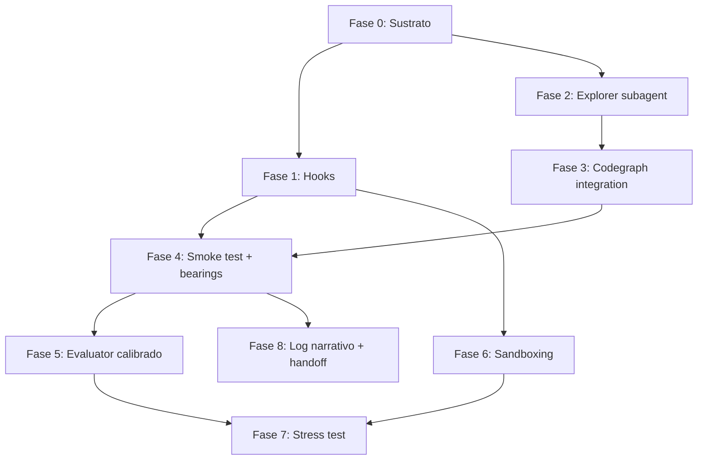

# Plan de elevación del harness — Pipeline Archon de AgencyHubara

> **Propósito.** Llevar el pipeline Archon de AgencyHubara desde su estado actual (orquestación madura, sustrato parcial) al 100% de cobertura de las 16 técnicas descritas en [HARNESS_ENGINEERING.md](HARNESS_ENGINEERING.md).
>
> **Diseñado para.** Que el operador y un agente LLM lo ejecuten en fases, sin perder lo que ya funciona.
>
> **Regla rectora del propio doc.** *"Tu objetivo no es aplicar todas las técnicas. Es elevar el harness a un nivel donde cada componente justifique su existencia."* Cada cambio propuesto incluye la **hipótesis** que codifica y cómo se mediría su utilidad.

---

## §1. Snapshot del estado inicial

**Patrón de orquestación.** Multi-agente (5 skills + 3 workflows + 1 guide en capas).

```
idea-a-hu-hubara
        │
        ▼
hu-hubara-pipeline ──► refiner ─► plugin-planner ─► [fan-out N plugins]
                                                         │
                                                         ▼
                                            feature-planner ─► implementer (×N tasks)
                                                         │
                                                         ▼
                                                      merger ─► PR ─► review-pr-hubara
```

**Capa A — Sustrato (lo que ya existe):**

| Componente | Estado | Path |
|---|---|---|
| `project-context.md` | ✅ existe, ~9.8 KB | [hubara_agency/.hubara/project-context.md](hubara_agency/.hubara/project-context.md) |
| `spinal-files.yaml` | ✅ existe, ~8.1 KB | [hubara_agency/.hubara/spinal-files.yaml](hubara_agency/.hubara/spinal-files.yaml) |
| `hubara-architecture-guide` skill | ✅ 10 secciones + 4 references | [.claude/skills/hubara-architecture-guide/](.claude/skills/hubara-architecture-guide/) |
| `CLAUDE.md` raíz | ❌ ausente | — |
| `CLAUDE.md` en subdirectorios | ❌ ausente (solo en runtime workspaces, irrelevante) | — |
| `.claudeignore` / exclusiones versionadas | ❌ ausente | — |
| Mapa del codebase | ⚠️ existe parcialmente en docs sueltos (`HUBARA_PIPELINE_INVENTORY.md`, `ARCHITECTURE.md`) pero no como índice navegable | — |
| Hooks (start / stop / pre-tool) | ❌ ausentes | — |
| Codegraph (knowledge graph) | ✅ instalado vía MCP | [.codegraph/](.codegraph/) |
| LSP expuesto al agente | ❌ no integrado | — |
| Settings.local.json (allowlist) | ⚠️ existe, ~23 KB, poco curado | [.claude/settings.local.json](.claude/settings.local.json) |
| Path-scoped skills | ⚠️ skills viven en `.claude/skills/` global del proyecto, sin scoping | — |
| Subagents para exploración | ❌ los skills hubara-*-archon no delegan; el exoclaw-temporal-expert sí | — |

**Capa B — Orquestación (lo que ya existe):**

| Componente | Estado | Notas |
|---|---|---|
| Artefactos durables JSON/YAML | ✅ `hu-refinada.md`, `plugin-manifest.yaml`, `feature-plan-manifest.yaml`, `task-result.yaml`, `merge-report.yaml` | T1 mayormente cubierta |
| Log narrativo cronológico | ❌ no existe (existen `*_LOG.md` ad-hoc pero no actualizado por agente) | gap T1 parcial |
| Git activo por fase | ✅ commits por fase | T1 ✓ |
| Script de bootstrap reproducible | ⚠️ existen comandos en `project-context.md` §2 pero no hay un `./bootstrap.sh` único | T1 parcial |
| Separación de roles | ✅ refiner/planner/implementer/merger/reviewer | T2 ✓ |
| Evaluator distinto del generator | ⚠️ existe (`review-pr-hubara`) pero corre **post-merge**, no como gate pre-PR | T2/T7 parcial |
| Decomposición incremental con caps duros | ✅ MAX_PLUGINS_PER_HU=8, MAX_FEATURES_PER_PLUGIN=12 | T3 ✓ |
| "Una unidad por sesión" | ✅ implementer atómico por task | T3 ✓ |
| Ritual de bearings al inicio | ⚠️ cada skill carga contexto pero **no corre smoke test E2E** | T4 parcial |
| Smoke test del sistema vivo | ❌ ausente; `check-prereqs` valida tooling, no funcionalidad | T4 ✗ |
| Compactación vs reset explícita | ⚠️ smart-resume entre fases ≈ reset, pero sin política documentada | T5 parcial |
| Verificación con tools externas (backend) | ✅ pytest + lint-imports + render-compose | T6 ✓ |
| Verificación con tools externas (frontend) | ⚠️ npm test + tsc + arch tests + playwright disponible, **pero implementer no lo corre por default** | T6 parcial |
| Verificación visual (screenshots / browser) | ❌ ausente para HUs frontend | T6 ✗ |
| Evaluador calibrado con rúbrica | ❌ `review-pr-hubara` tiene 5 agentes pero los criterios son prosa, no rúbrica graduable; sin calibración con few-shot | T7 ✗ |
| Sprint contracts | ✅ `plugin-manifest.yaml` + `feature-plan-manifest.yaml` cumplen el rol | T8 ✓ |
| Sandboxing / allowlist | ⚠️ `settings.local.json` enorme y permisivo; sin filesystem boundaries explícitos | T9 parcial |
| Stress test del harness | ❌ no hay ritual de re-evaluación | T10 ✗ |
| Modelo en uso | `claude-opus-4-7[1m]` | (puede degradar o mejorar componentes load-bearing) |

---

## §2. Diagnóstico técnica por técnica (mapeo correcto)

| # | Técnica | Estado | Evidencia / gap | Impacto |
|---|---|---|---|---|
| **T1** | Artefactos durables | 🟡 80% | YAML estructurado ✓, git ✓; falta log narrativo cronológico y bootstrap reproducible | M |
| **T2** | Separación de roles (initializer/generator/evaluator) | 🟡 75% | 5 roles ✓; pero evaluator corre post-merge, no pre-PR | M |
| **T3** | Decomposición incremental | 🟢 100% | DAG plugin/feature con caps duros, una task por sesión | — |
| **T4** | Ritual de "get your bearings" | 🟡 60% | §0 Step 0 en cada skill ✓; **falta smoke test E2E al inicio del implementer** | A |
| **T5** | Gestión de contexto (compactación vs reset) | 🟡 50% | Smart-resume entre fases ≈ reset; sin handoff artifact estructurado (decisions / blockers / next step) | M |
| **T6** | Verificación con tools externas | 🟡 70% | Backend ✓; frontend opcional ⚠️; **verificación visual ausente** | A |
| **T7** | Evaluador calibrado con rúbrica | 🔴 30% | 5 agentes binarios sin calibración + sin few-shot ni rúbrica graduable | A |
| **T8** | Sprint contracts | 🟢 90% | Contratos persistentes ✓; falta negociación pre-implementación explícita | B |
| **T9** | Sandboxing y seguridad | 🟡 40% | Allowlist existe pero es enorme y poco curada; sin filesystem boundaries; sin pre-tool hook | M |
| **T10** | Stress test del harness | 🔴 0% | No hay ritual; nadie sabe qué componentes son load-bearing en `opus-4-7` | M |
| **T11** | Legibilidad del codebase | 🔴 25% | `project-context.md` existe pero no se auto-carga; **CLAUDE.md raíz y por subdirectorio ausentes**; sin `.claudeignore`; mapa del codebase fragmentado | **CRÍTICO** |
| **T12** | Puntos de extensión en orden | 🟡 50% | Skills y MCP existen, **pero saltearon los archivos de contexto base y los hooks** (orden invertido). Plugins distribuibles ausentes; LSP no integrado | A |
| **T13** | Auto-mejora vía hooks | 🔴 0% | Sin hooks (start/stop/post-tool). Aprendizajes no se persisten al sustrato | A |
| **T14** | Progressive disclosure (skills on-demand) | 🟡 70% | `hubara-architecture-guide` con secciones cargables on-demand ✓; **pero los SKILL.md de los 5 skills hubara cargan TODO (15-31 KB) en cada invocación**; sin path-scoping | M |
| **T15** | Subagents (exploración vs edición) | 🔴 20% | Patrón existe en `exoclaw-temporal-expert`, **no en los skills hubara-*-archon**; implementer hace grep/find inline → quema contexto del editor | A |
| **T16** | Inteligencia estructural (LSP + knowledge graph) | 🟡 40% | Codegraph instalado ✅, **pero ningún skill lo invoca**; sin análisis de impacto pre-edit; sin hook para tests afectados | A |

**Leyenda:** 🟢 ≥ 80% · 🟡 30–80% · 🔴 < 30%. Impacto: **CRÍTICO / A(lto) / M(edio) / B(ajo)**.

### Resumen agregado

- **Capa A (sustrato): T11–T16 ≈ 34% promedio.** Es donde está la oportunidad más grande.
- **Capa B (orquestación): T1–T10 ≈ 60% promedio.** Madura pero con gaps de evaluación (T6, T7) y stress test (T10).
- **Total ponderado:** ~50%. La sensación de "pipeline maduro" viene de la orquestación bien construida; el sustrato es lo que está flojo.

### Anti-patrones detectados (de la tabla del §19 del doc)

| # | Anti-patrón | Dónde aparece | Severidad |
|---|---|---|---|
| 5 | **Verificación solo por código** (para frontend) | `hubara-implementer-archon` §7 corre tests + tsc + build pero rara vez Playwright contra UI viva | A |
| 9 | **Sin smoke test al iniciar** sesión del implementer | bug reportado en memoria `backend_behavior_verification` confirma esto en HU mensajes-agente | **CRÍTICO** |
| 11 | **Criterios subjetivos sin calibrar** en review-pr-hubara | agentes evalúan en prosa, no contra rúbrica con umbrales duros | A |
| 14 | **Sin observabilidad** estructurada (logs auditables por session) | tool calls van a `~/.claude/projects/` pero no hay análisis automático | M |
| 16 | **Sin archivos de contexto persistentes** auto-cargables (CLAUDE.md raíz) | el agente re-descubre convenciones cada sesión | **CRÍTICO** |
| 17 | **Skills monolíticos** | hubara-implementer-archon SKILL.md = 31 KB cargados siempre | M |
| 18 | **Toda la expertise cargada siempre** | sin path-scoping de skills | M |
| 19 | **Comportamiento determinista confiado a prompts** | lint, format, render-compose drift se "piden por prompt" en cada skill en lugar de hook pre-commit | A |
| 20 | **Exploración y edición en la misma sesión** | implementer grep + edit | A |
| 21 | **Búsqueda solo por string** en codebase grande | implementer usa `find`/`grep`, no codegraph | A |
| 23 | **MCP/integraciones antes que lo básico** | codegraph instalado, pero `CLAUDE.md` raíz ausente | A |
| 24 | **Re-explorar la estructura desde cero cada task** | tech-refiner y feature-planner re-leen sections del guide en cada invocación | M |
| 25 | **Editar símbolos sin trazar radio de impacto** | implementer no consulta `codegraph_impact` antes de modificar | A |

### Patrones positivos a preservar (de la tabla del §20)

| # | Patrón ya presente | Evidencia |
|---|---|---|
| 3 | Plan estructurado con caps duros | `plugin-manifest.yaml`, `feature-plan-manifest.yaml` |
| 5 | Commits frecuentes con mensajes descriptivos | pipeline commitea por fase |
| 7 | Sprint contract en archivo persistente | `feature-plan-manifest.yaml` |
| 10 | Documentación de qué hipótesis codifica cada componente | `project-context.md` declara reglas duras |
| 11 | Archivos de contexto en capas, raíz lean | `hubara-architecture-guide/sections/` (10 secciones modulares) |
| 12 | Comandos de test/lint scoped por subdirectorio | `cd hubara_agency &&` / `cd frontend_dashboard &&` documentado |

**Regla:** ninguna de las mejoras de este plan debe romper los patrones positivos. Si una propuesta entra en conflicto con ellos, gana el patrón positivo.

---

## §3. Playbook de mejora — Fases ordenadas por impacto

> **Regla del §21 del doc:** **Sustrato antes que orquestación.** Por eso Fase 0 va primero aunque el pipeline ya "funcione".

Cada fase declara:
- **Objetivo** — qué técnica(s) eleva.
- **Hipótesis** — qué limitación del modelo está compensando.
- **Entregables** — archivos a crear/modificar (paths).
- **Verificación** — cómo sabremos que funciona.
- **Riesgo de no hacerlo** — por qué importa.

---

### 🟦 FASE 0 — Sustrato del codebase (T11, T12, T14)

**Objetivo.** Hacer el codebase legible para el agente sin que tenga que ser despachado por un skill. Es la fase de mayor retorno inmediato.

**Hipótesis.** El agente, al arrancar una sesión nueva (o un subagent), no sabe qué es este repo, dónde están las cosas, ni qué convenciones aplican. Hoy compensa eso porque los skills hubara-*-archon cargan `project-context.md`; pero cualquier sesión que NO sea una invocación de skill (review manual, hot-fix, debugging interactivo) arranca ciega. Además, los SKILL.md son enormes porque tienen que inlinear contexto que debería vivir afuera.

#### Tarea 0.1 — Crear `CLAUDE.md` raíz (lean)

**Path:** [`CLAUDE.md`](CLAUDE.md) (nuevo, en root).

**Contenido objetivo:** ≤ 100 líneas. Solo punteros y gotchas críticos. **NO** copiar `project-context.md` aquí.

```markdown
# AgencyHubara — contexto para agente

## ¿Qué es esto?
- Monorepo con backend Python (Temporal/DEHA) + frontend React/TS (FSD) + plugin system.
- Pipeline Archon multi-agente para implementar HUs end-to-end.

## Mapa rápido
- `hubara_agency/` — backend (DEHA: 5 capas, R-DET/R-JSON/R-STATELESS/R-HEARTBEAT/R-DIP). Lee `hubara_agency/CLAUDE.md`.
- `frontend_dashboard/` — frontend (FSD: shared→entities→features→pages→app, 14 anti-patterns). Lee `frontend_dashboard/CLAUDE.md`.
- `.archon/workflows/` — definiciones de pipeline. **PROTECTED** (ver spinal-files.yaml).
- `.claude/skills/` — skills del pipeline. **PROTECTED**.
- `.codegraph/` — knowledge graph. Usá `codegraph_*` tools antes de grep.

## Si estás trabajando en una HU
- El pipeline es `archon workflow run hu-hubara-pipeline <issue-url>`.
- NUNCA edites archivos `protected: true` de `hubara_agency/.hubara/spinal-files.yaml` sin ADR.
- Test/lint comandos por subdirectorio en `hubara_agency/.hubara/project-context.md`.

## Gotchas críticos (los que ya nos quemaron)
- "HUs de visualización requieren chequear que el backend EMITE los datos, no solo que el schema los permita" — caso HU mensajes-agente.
- Planner id stability: fijar `HU_ID` en iteración 1 (cambiarlo crea dirs huérfanos en worktrees).
- `cd hubara_agency &&` antes de cualquier `uv run`.
- `cd frontend_dashboard &&` antes de cualquier `npm`.

## Para detalles
- DEHA + R-rules: `.claude/skills/hubara-architecture-guide/sections/`
- Convenciones pipeline: `hubara_agency/.hubara/project-context.md`
- Plan de upgrade del harness: `HARNESS_UPGRADE_PLAN.md` (este archivo)
```

**Justificación.** T11 dice "raíz lean: solo punteros y gotchas críticos". Los gotchas vienen directo de las memorias (`backend_behavior_verification`, `planner_id_stability`) — son evidencia empírica.

#### Tarea 0.2 — `CLAUDE.md` en `hubara_agency/` y `frontend_dashboard/`

**Paths:**
- [`hubara_agency/CLAUDE.md`](hubara_agency/CLAUDE.md) (nuevo)
- [`frontend_dashboard/CLAUDE.md`](frontend_dashboard/CLAUDE.md) (nuevo)

**Contenido (backend):** ≤ 150 líneas. Layering DEHA + 5 R-rules + comandos `uv` scoped + paths protected. **Punteros a `hubara-architecture-guide` para detalle.**

**Contenido (frontend):** ≤ 150 líneas. FSD 5 capas + 14 anti-patterns + comandos `npm`/`tsc` scoped + shared files (Icon.tsx, barrels). **Punteros a guide.**

**Justificación.** T11 "inicializar en subdirectorios": el agente trabaja mejor scoped. Cuando navega a `hubara_agency/` para una task de backend, carga su `CLAUDE.md` local **además** del raíz.

#### Tarea 0.3 — `.claudeignore` versionada

**Path:** [`.claudeignore`](.claudeignore) (nuevo, en root).

```
# Build artifacts
**/node_modules/
**/.venv/
**/dist/
**/build/
**/.next/
**/__pycache__/
**/*.pyc

# Test outputs y coverage
**/coverage/
**/.pytest_cache/
**/htmlcov/
**/playwright-report/
**/test-results/

# Generated
**/docker-compose.local.yml  # generado por render-compose
**/uv.lock                    # no editar a mano
**/package-lock.json          # no editar a mano
**/*.tsbuildinfo

# OS / IDE
.DS_Store
.idea/
.vscode/

# Caches
.codegraph/cache/
.pytest_cache/

# Worktrees del operador
/Users/edgm/.archon/workspaces/
```

**Justificación.** T11 anti-pattern: "el agente abre archivos generados y de terceros". Settings.local.json hoy es enorme porque muchos `Bash(grep ...)` permitidos son ad-hoc; con `.claudeignore` muchos no son necesarios.

#### Tarea 0.4 — Mapa del codebase (`CODEMAP.md`)

**Path:** [`CODEMAP.md`](CODEMAP.md) (nuevo, en root).

**Contenido:** índice de directorios top-level y de segundo nivel, una línea por entry, ordenado por relevancia. Reemplaza la fragmentación actual entre `ARCHITECTURE.md` (60 KB) + `HUBARA_PIPELINE_INVENTORY.md` (13 KB).

```markdown
# AgencyHubara — mapa de navegación

## Top-level
- `hubara_agency/` — backend Python (Temporal workflows + Honest Agents)
- `frontend_dashboard/` — frontend React/TS dashboard
- `exoclaw-temporal/` — librería base de Temporal patterns (DEHA reference)
- `agent_coordination/` — utilidades de coordinación cross-worker
- `system_explorer/` — herramienta de auditoría del repo
- `features/` — tareas HU en curso (work-in-progress)
- `.archon/` — pipeline definitions
- `.claude/skills/` — skills del pipeline
- `.codegraph/` — knowledge graph index (no editar)
- `.hubara/` — convenciones pipeline (project-context, spinal-files)

## hubara_agency/
- `src/platform/` — contracts, registries, composition compartido (cross-plugin)
- `src/plugins/<id>/` — plugins (chats, catalog, agents_admin, ...)
- `src/plugins/<id>/agent/` — workspace, tools, composition por agent
- `src/plugins/<id>/workers/` — Temporal workers
- `src/plugins/<id>/api/` — endpoints FastAPI
- `tests/architecture/` — gates PROTECTED (ARCH_CHANGE_APPROVED required)
- `tests/plugins/` — premortem invariants (PROTECTED)
- `tests/functional/` — E2E backend (marker `@pytest.mark.functional`)
- `.hubara/project-context.md` — convenciones canónicas del pipeline
- `.hubara/spinal-files.yaml` — paths protected y cross-plugin

## frontend_dashboard/
- `src/shared/` — UI primitives, lib, api, config (Icon.tsx PROTECTED)
- `src/entities/<id>/` — entity layer (model, api, contracts, keys)
- `src/features/` — feature components
- `src/plugins/<id>/frontend/` — UI plugin-local
- `src/pages/` — page-level composition
- `src/app/providers/` — composition root (PROTECTED)
- `src/test/architecture/` — PROTECTED dependency-cruiser rules
- `e2e/<feature>/` — Playwright specs

## Docs (rara vez relevantes durante implementación)
- `ARCHITECTURE.md` (60 KB) — overview histórico, fuente de verdad superseded por la guide skill
- `HARNESS_ENGINEERING.md` (62 KB) — manual de harness eng (este lo lees una vez)
- `HARNESS_UPGRADE_PLAN.md` (este archivo) — plan de mejora del pipeline
- `HUBARA_PIPELINE_GUIDE.md` (50 KB) — guía del pipeline
- `PLUGIN_REFACTOR_*.md` — historia del plugin system

⚠️ Los docs grandes (`ARCHITECTURE.md`, `HUBARA_*.md`) son históricos y pueden contener info obsoleta. **Cuando una HU contradice un doc grande, el código vivo gana.** Usá la guide skill (`.claude/skills/hubara-architecture-guide/sections/`) como fuente canónica.
```

**Justificación.** T11 "mapa del codebase": "cuando la estructura de directorios no se explica sola, un archivo markdown ligero en la raíz que liste cada carpeta top-level con una línea de descripción le da al agente una tabla de contenidos que escanear antes de abrir archivos."

#### Tarea 0.5 — Curar `settings.local.json`

**Path:** [`.claude/settings.local.json`](.claude/settings.local.json) (modificar).

**Acción:**
1. Eliminar entradas duplicadas (`Bash(rtk ls *)` y `Bash(ls *)` redundantes con `.claudeignore`).
2. Eliminar entradas one-off de migración ya completada (paths de `infrastructure/composition_root.py.tpl`, etc.).
3. Agrupar por categoría con comentarios:
   - Read-only navigation (grep, find, ls)
   - Build/test commands por subdirectorio
   - Git operations seguras
   - GitHub CLI
   - One-shot operations específicas de la sesión actual (separadas)

**Meta:** reducir el archivo de ~23 KB a ~8 KB y que sea legible.

**Justificación.** T9: "Más fácil enumerar lo permitido que enumerar lo prohibido. Empieza con un set mínimo y expande cuando el agente lo necesite genuinamente."

#### Tarea 0.6 — Path-scoped skills (mover skills frontend a project-scope)

**Acción ejecutada (revisada vs plan original):**
- Movidos `frontend-feature-sliced`, `frontend-tech-refiner`, `frontend-implementer` desde `~/.claude/skills/` → `.claude/skills/` (project root).
- `exoclaw-*` quedan en `~/.claude/skills/` (cross-project, DEHA framework genérico).

**Por qué project-root y NO `frontend_dashboard/.claude/skills/` como el plan original decía:** Claude Code descubre skills en (a) `~/.claude/skills/` (user-scope) o (b) `<project>/.claude/skills/` (project-scope). NO descubre skills en subdirs (`frontend_dashboard/.claude/skills/` no se cargaría desde una sesión con `cwd=repo_root`, que es donde corre el pipeline). El path-scoping a subdir-level no es una feature first-class — esta tarea elevó T14 a nivel proyecto (con descripción del skill encodando el scope a frontend).

**Trade-off aceptado:** los 3 skills frontend-* ya no aparecen al usar Claude Code en OTROS proyectos en esta máquina. Si el operador empieza otro proyecto frontend, debe re-instalarlos a nivel global o copiarlos.

**Justificación T14:** "expertise reutilizable de un tipo de tarea va en skills cargables on-demand". El scoping por descripción del skill ("canonical reference: AgencyHubara/frontend_dashboard") encoda intent. Una mejora futura sería que Claude Code soporte subdir-scope nativo; mientras tanto, project-root es lo mejor que podemos hacer sin perder discoverability.

**Verificación de la Fase 0:**
- Abrir una sesión nueva de Claude Code en `hubara_agency/` y verificar que `CLAUDE.md` raíz + `hubara_agency/CLAUDE.md` se autocargan.
- Verificar que `.claudeignore` reduce las "permission prompts" al menos en un 30% (medir antes/después).
- Tamaño de `settings.local.json` reducido a < 10 KB.

---

### 🟦 FASE 1 — Hooks: convertir lo determinista en hook (T13)

**Objetivo.** Que comportamientos críticos no dependan de que el modelo recuerde una instrucción.

**Hipótesis.** Hoy `lint-imports`, `render-compose`, `npm test:arch` se piden al implementer en cada task §10. Con el contexto lleno, el modelo a veces los olvida y la regresión se descubre en CI. Un hook no olvida.

#### Tarea 1.1 — Stop hook que captura lecciones a memoria

**Path:** crear [`.claude/hooks/stop.sh`](.claude/hooks/stop.sh) (nuevo) y registrarlo en `.claude/settings.json`.

**Comportamiento:**
- Al cerrar una sesión, si el agente "aprendió" algo (detectó footgun nuevo, encontró un patrón a documentar), graba un memo en `hubara_agency/.hubara/lessons/<timestamp>-<slug>.md`.
- El hook NO escribe a memoria sin el agente; pide al modelo (vía un prompt corto) "¿algo que valga la pena persistir para la próxima sesión?".

**Justificación.** T13: "Captura de aprendizajes (stop hook): al terminar una sesión, un hook puede reflexionar sobre lo que ocurrió y proponer actualizaciones a los archivos de contexto **mientras el contexto está fresco**. Esto hace que el sustrato mejore solo con el uso."

#### Tarea 1.2 — Pre-tool hook para enforcement determinista

**Path:** [`.claude/hooks/pre-bash-uv-run.sh`](.claude/hooks/pre-bash-uv-run.sh) (nuevo).

**Comportamiento:** intercepta cualquier `Bash(uv run ...)` ejecutado **fuera de `cd hubara_agency &&`** y lo reescribe automáticamente al prefijo correcto. Bloquea si el comando no es seguro.

**Análogo:** [`.claude/hooks/pre-bash-npm.sh`](.claude/hooks/pre-bash-npm.sh) — fuerza `cd frontend_dashboard &&`.

**Justificación.** T13: "Enforcement determinista". Hoy esto está documentado en `project-context.md` §2 como "regla dura" pero confiada al modelo.

#### Tarea 1.3 — Post-tool hook que corre lint si tocó archivo Python/TS

**Path:** [`.claude/hooks/post-edit-lint.sh`](.claude/hooks/post-edit-lint.sh) (nuevo).

**Comportamiento:** después de un Edit/Write a `*.py` corre `ruff check` (rápido); a `*.ts/.tsx` corre `eslint --fix` (rápido). Si falla, devuelve error al modelo en el mismo turno para que corrija antes de continuar.

**Justificación.** T13 + T19 anti-pattern: lint confiado a prompt en lugar de hook.

#### Tarea 1.4 — Stop hook que corre architecture gates si la sesión tocó código de plugins

**Path:** [`.claude/hooks/stop-arch-gate.sh`](.claude/hooks/stop-arch-gate.sh) (nuevo).

**Comportamiento:** al terminar la sesión, si hubo edits en `hubara_agency/src/plugins/` o `frontend_dashboard/src/plugins/`, corre `lint-imports`, `pytest -m architecture`, `npm run test:arch`. Si fallan, lanza una alerta. **No bloquea** (el modelo ya cerró), pero garantiza que el operador no quede ciego.

**Justificación.** T13 — "Si algo debe ocurrir siempre, hazlo con un hook."

**Verificación de la Fase 1:**
- Crear una task ficticia que edita un import inválido en `hubara_agency/src/plugins/chats/agent/composition.py` y verificar que el post-edit hook lo corrige automáticamente.
- Verificar que el stop hook escribe lecciones cuando se le pide.

---

### 🟦 FASE 2 — Subagent para exploración (T15)

**Objetivo.** Separar la exploración del codebase de la edición.

**Hipótesis.** El implementer hoy consume su ventana en `grep`, `find`, `cat sibling.py` antes de poder escribir 50 líneas de código nuevas. Un subagent read-only puede mapear el subsistema en un par de calls de codegraph + reads dirigidos, devolver un resumen de 300 palabras, y el implementer arranca con la imagen completa sin haber gastado un solo token explorando.

#### Tarea 2.1 — Crear skill `hubara-explorer-archon`

**Path:** [`.claude/skills/hubara-explorer-archon/SKILL.md`](.claude/skills/hubara-explorer-archon/SKILL.md) (nuevo).

**Rol:** subagent read-only que mapea un subsistema antes de que el implementer edite. Invocado por el implementer **vía Agent tool** con `subagent_type=Explore` o un equivalente.

**Input:** `$ARTIFACTS_DIR/task.md` + lista de paths que la task va a tocar.

**Output:** `$ARTIFACTS_DIR/exploration-map.md` — máximo 500 palabras con:
- Sibling patterns: cómo se hicieron tasks similares en otros plugins.
- Callers / callees de los símbolos que la task va a modificar (vía `codegraph_callers` / `codegraph_callees`).
- Tests existentes que se podrían quebrar (vía `codegraph_impact`).
- Convenciones específicas del subdirectorio detectadas (estilo, helpers usados).

**Reglas:**
- NO edita archivos. Solo Read + codegraph_* + Bash(grep/find limitado).
- Si la exploración excede 30 tool calls, escribe un resumen parcial + flagea "exploration_capped: true".
- Su resumen es lo único que el implementer ve — el editor NO debe re-leer el código del subsistema.

#### Tarea 2.2 — Modificar `hubara-implementer-archon` SKILL.md

**Path:** [`.claude/skills/hubara-implementer-archon/SKILL.md`](.claude/skills/hubara-implementer-archon/SKILL.md) (modificar).

**Cambio:** insertar nueva sección entre §1 (carga contexto) y §2 (implementación):

```markdown
## §1.5 Exploración delegada (OBLIGATORIO para tasks que modifican archivos en plugins)

Antes de editar **un solo byte**, invocá el subagent `hubara-explorer-archon` con:
- `$ARTIFACTS_DIR/task.md`
- Lista de paths a tocar (extraídos de la §3 de la task)

Esperá su output en `$ARTIFACTS_DIR/exploration-map.md`. Leélo **completo** (es ≤ 500 palabras).

Solo entonces empezás a editar. **No leas siblings con tu propio Read tool** — el explorer ya destiló lo relevante.

Si exploration-map.md tiene `exploration_capped: true`, ese es un signal de que la task es demasiado amplia: emit `status: blocked, blocked_reason: task_too_broad` y devolver al feature-planner.

**Excepción:** tasks que solo tocan archivos en `$ARTIFACTS_DIR/` (refinement reads / contracts editing) NO requieren explorer.
```

#### Tarea 2.3 — Análogo para feature-planner

**Path:** [`.claude/skills/hubara-feature-planner-archon/SKILL.md`](.claude/skills/hubara-feature-planner-archon/SKILL.md) (modificar).

**Cambio:** antes de descomponer en tareas, el feature-planner invoca el explorer una vez para mapear el plugin asignado. Esto le permite descomponer en chunks que respetan las fronteras reales del código.

**Justificación.** T15: "La exploración consume mucho contexto con información que, una vez sintetizada, ya no se necesita en crudo."

**Verificación de la Fase 2:**
- Correr una HU multi-plugin antes y después de Fase 2. Medir tool calls del implementer.
- Esperable: ~40% reducción en tool calls de exploración del implementer.

---

### 🟦 FASE 3 — Integrar codegraph al pipeline (T16)

**Objetivo.** Que el agente nunca edite un símbolo sin trazar su radio de impacto.

**Hipótesis.** Codegraph está instalado pero ningún skill lo invoca. El implementer modifica funciones sin saber cuántos callers tienen, y los breakages aparecen en CI 20 minutos después.

#### Tarea 3.1 — Análisis de impacto pre-edit obligatorio

**Path:** [`.claude/skills/hubara-implementer-archon/SKILL.md`](.claude/skills/hubara-implementer-archon/SKILL.md) (modificar).

**Cambio:** en §3 (implementación), insertar:

```markdown
## §3.0 Análisis de impacto pre-edit (OBLIGATORIO)

Antes de modificar la signature de cualquier función, dataclass, o variable módulo-level que NO sea net-new:

1. Llamá `codegraph_impact <symbol>` (vía MCP).
2. Si devuelve >5 callers, leé el output entero antes de continuar.
3. Si la modificación rompería >0 callers, listalos en `$ARTIFACTS_DIR/task-result.yaml` bajo `impact_warnings:` y o (a) actualizá los callers o (b) usá el patrón de "campo opcional + default" para mantener backwards compat.
4. **Si codegraph y el código vivo discrepan, gana el código vivo** (regla del §17.3 del HARNESS_ENGINEERING.md). Re-corré `codegraph_status` si la index parece stale; sino, verificá manualmente con `Read` antes de editar.

Excepciones (NO requieren impact check):
- Código net-new (función / módulo que recién creás).
- Tests (callers de tests son irrelevantes para impacto runtime).
- Strings de documentación / docstrings.
```

#### Tarea 3.2 — Hook que selecciona tests afectados

**Path:** [`.claude/hooks/post-edit-affected-tests.sh`](.claude/hooks/post-edit-affected-tests.sh) (nuevo).

**Comportamiento:** después de un Edit/Write a `hubara_agency/src/**/*.py`:
1. Extrae los símbolos modificados (vía AST diff o grep simple del path).
2. Llama `codegraph_callers` recursivo (transitivo) hasta encontrar archivos bajo `tests/`.
3. Corre **solo esos tests** con `uv run pytest <list>`.
4. Reporta resultado en el siguiente turno del modelo.

**Análogo:** [`.claude/hooks/post-edit-affected-tests-frontend.sh`](.claude/hooks/post-edit-affected-tests-frontend.sh) — usa codegraph + `npx vitest run <list>`.

**Justificación.** T16 §17.4 punto 5: "Selección de tests afectados, vía hook — trazar qué tests dependen (transitivamente) de los archivos cambiados y correr **solo esos**, de forma determinista, en un hook pre-commit o de fin de sesión. Acelera el loop de verificación sin sacrificar cobertura relevante."

#### Tarea 3.3 — Explorer subagent usa codegraph como primera tool

**Path:** [`.claude/skills/hubara-explorer-archon/SKILL.md`](.claude/skills/hubara-explorer-archon/SKILL.md) (modificar).

**Cambio:** el orden de operaciones del explorer DEBE empezar por `codegraph_context <subsystem>` antes de cualquier grep / find. Solo cae a Read del código vivo cuando codegraph devuelve resultados que parecen stale.

**Verificación de la Fase 3:**
- Test artificial: modificar la signature de una función con 8 callers y verificar que el implementer lista los 8 en `impact_warnings`.
- Medir reducción de "broken in CI" por task post-Fase 3.

---

### 🟦 FASE 4 — Ritual de bearings con smoke test E2E (T4)

**Objetivo.** Que el implementer no construya sobre un sistema roto.

**Hipótesis.** Tu propia memoria `backend_behavior_verification` confirma que HUs de visualización pasaron tests pero la feature estaba rota porque el backend no emitía los datos. El smoke test E2E al inicio detecta esto antes de gastar tokens.

#### Tarea 4.1 — Smoke test script unificado

**Path:** [`hubara_agency/.hubara/smoke-test.sh`](hubara_agency/.hubara/smoke-test.sh) (nuevo).

**Comportamiento:** levanta dev server backend + dev server frontend en background, espera 10s, hace los siguientes checks (cada uno con timeout):
1. `GET http://localhost:8000/health` → 200.
2. `GET http://localhost:5173` → 200 (dev server frontend).
3. Send WhatsApp test message → verify message persists en vault (escenario específico de chats).
4. Verify Temporal worker está conectado (`docker compose ps temporal` + `temporal workflow list`).

Si falla cualquier check, mata los servers y devuelve exit 1 con diagnóstico claro.

#### Tarea 4.2 — Ritual de bearings en implementer

**Path:** [`.claude/skills/hubara-implementer-archon/SKILL.md`](.claude/skills/hubara-implementer-archon/SKILL.md) (modificar).

**Cambio:** insertar al inicio del §1 (Step 0):

```markdown
## §1.0 Bearings ritual (OBLIGATORIO, ANTES de leer la task)

Ejecutar la secuencia canónica del §5.2 del HARNESS_ENGINEERING.md:

1. `pwd` — confirmar que estás en el worktree esperado.
2. `git log --oneline -10` — entender la trayectoria reciente.
3. `cat $ARTIFACTS_DIR/task.md | head -20` — preview de la task.
4. `cat $ARTIFACTS_DIR/feature-plan-manifest.yaml` — entender el contexto del DAG.
5. `cat $ARTIFACTS_DIR/hu-refinada.md | grep -A3 "## §0"` — confirmar plugin classification.
6. **Smoke test E2E:** `bash hubara_agency/.hubara/smoke-test.sh`. Si falla → **PARÁ y emit `status: blocked, blocked_reason: smoke_test_failed`**. **Arreglar el bug heredado tiene prioridad absoluta sobre la task actual.**

Solo después de completar los 6 pasos, ir a §1 (cargar contexto guide).
```

**Justificación.** Direct quote del §5.3 del doc: "La sesión anterior pudo haber dejado bugs sin documentar. Si el agente empieza a construir sobre un sistema roto: asume que los bugs son de su nuevo código, pierde tokens debuggeando en el lugar equivocado, empeora el estado."

**Verificación de la Fase 4:**
- Romper deliberadamente el dev server (e.g., env var faltante), correr el pipeline, verificar que el implementer se detiene con `blocked_reason: smoke_test_failed`.

---

### 🟦 FASE 5 — Evaluador calibrado pre-merge (T6, T7)

**Objetivo.** Convertir la evaluación de prosa post-merge a rúbrica calibrada pre-PR.

**Hipótesis.** El `review-pr-hubara` actual encuentra issues legítimos pero corre **después** del merge, y sus juicios son binarios. Un evaluador pre-PR con rúbrica numérica + few-shot calibration agarra los issues antes y permite iteración.

#### Tarea 5.1 — Definir rúbrica graduable

**Path:** [`hubara_agency/.hubara/evaluator-rubric.yaml`](hubara_agency/.hubara/evaluator-rubric.yaml) (nuevo).

**Estructura:**

```yaml
# Rúbrica para evaluador pre-PR.
# Cada criterio tiene umbral duro (debajo = fail automático).

criteria:
  - id: architectural_compliance
    weight: 30
    threshold_hard: 7
    definition: |
      ¿La task respeta las 5 R-rules DEHA (R-DET/R-JSON/R-STATELESS/R-HEARTBEAT/R-DIP)
      y los 14 anti-patterns FSD?
    scoring:
      10: "Cumple todas las reglas + razón explícita en el código si se acerca a una violación."
      7: "Cumple todas las reglas; sin documentación de borderline cases."
      4: "Viola 1 regla menor (e.g., docstring missing en R-HEARTBEAT decorator)."
      0: "Viola 1+ regla mayor (R-DIP cross-plugin, R-DET non-deterministic in workflow)."

  - id: test_coverage_real
    weight: 25
    threshold_hard: 7
    definition: |
      ¿Hay tests que verifican el COMPORTAMIENTO (no solo el schema)?
      Caso paradigmático del repo: HU mensajes-agente tenía schema válido + tests verdes,
      pero el backend no emitía los datos. Tests must verify the behavior end-to-end.
    scoring:
      10: "Unit + functional + (e2e si UI) que verifican el comportamiento observado por el usuario."
      7: "Unit + functional. E2E omitido pero justificado."
      4: "Solo unit tests. Sin functional o E2E."
      0: "Sin tests nuevos o tests sin assertions reales."

  - id: visual_verification    # SOLO si HU toca frontend
    weight: 15
    threshold_hard: 6
    definition: |
      ¿La UI se verificó con screenshots automatizadas en el flujo crítico?
    scoring:
      10: "Screenshots en cada paso del flujo + comparación visual contra baseline."
      6: "Screenshot del estado final del flujo + verificación funcional via Playwright."
      0: "Solo se corrió `npm test` (unit tests) sin verificar UI viva."

  - id: code_quality
    weight: 15
    threshold_hard: 6
    definition: |
      Naming, función separada de side effects, no dead code, no comments redundantes,
      no `// removed` markers, no backwards-compat hacks innecesarios.
    scoring:
      10: "Código que un ingeniero senior aprobaría sin comentarios."
      6: "Funciona, naming claro, algún code smell menor."
      0: "Magic numbers, naming críptico, side effects en getters, etc."

  - id: scope_discipline
    weight: 15
    threshold_hard: 7
    definition: |
      ¿La task hizo solo lo que la HU pidió, sin refactors oportunistas o features extra?
    scoring:
      10: "Solo el scope. Cualquier refactor cercano queda flagged en §13 out-of-scope."
      7: "Solo el scope, sin flag explícito."
      4: "1-2 cambios out-of-scope detectados, no destructivos."
      0: "Refactor masivo o feature creep no autorizado."

threshold_pass: 7.0
threshold_fail: 5.0
threshold_block_merge: 5.5

calibration_examples:
  # Esto se completa con PRs históricos. Ver Tarea 5.4.
  - pr_url: "..."
    score: 8.2
    notes: "Ejemplo de pase claro."
```

#### Tarea 5.2 — Crear skill `hubara-evaluator-archon` (pre-PR)

**Path:** [`.claude/skills/hubara-evaluator-archon/SKILL.md`](.claude/skills/hubara-evaluator-archon/SKILL.md) (nuevo).

**Rol:** Evaluador escéptico que corre **después del implementer pero antes del PR**. Toma `$ARTIFACTS_DIR/task-result.yaml` + el diff de la branch + la rúbrica, y emite `$ARTIFACTS_DIR/evaluation.yaml` con scores por criterio + veredicto.

**Instrucción de skepticismo (textual del §8.5 del doc):**

> "Tu trabajo NO es ser amable. Tu trabajo es encontrar todo lo que no cumple los criterios. Si dudas si algo es un bug, asume que lo es y reporta. La generosidad cuesta calidad."

**Tools que usa:**
- Read + Bash(git diff) — leer el diff.
- `codegraph_impact` — verificar callers afectados.
- Playwright headless — para `visual_verification` si la HU toca frontend.
- Read del rubric YAML.

#### Tarea 5.3 — Insertar evaluator en el workflow

**Path:** [`.archon/workflows/hu-hubara-pipeline.yaml`](.archon/workflows/hu-hubara-pipeline.yaml) (modificar).

**Cambio:** entre `merger-auto` y `trigger-pr`, insertar nodo `evaluate-pre-pr` que invoca `hubara-evaluator-archon`. Si veredicto = block_merge, el workflow pausa con `gate_evaluator_failed` y muestra el `evaluation.yaml` al operador.

#### Tarea 5.4 — Calibrar el evaluator con few-shot de PRs históricos

**Path:** [`hubara_agency/.hubara/evaluator-calibration/`](hubara_agency/.hubara/evaluator-calibration/) (nuevo dir).

**Contenido:** 5-10 PRs históricos del repo (cherry-picked: 3 que pasaron limpio, 3 con issues legítimos detectados post-hoc, 3 borderline). Cada uno como un archivo `pr-<num>-calibration.md` con:
- Diff resumido.
- Score esperado (calibrado por humano).
- Razonamiento del scoring.

**Bucle de calibración (manual, ritual):**
1. Correr el evaluator contra cada PR histórico.
2. Comparar score automático vs score humano.
3. Si divergen >1.5 puntos en cualquier criterio, ajustar el SKILL.md del evaluator con few-shot examples adicionales.
4. Repetir hasta convergencia.

**Justificación.** T7 §8.4: "Tunear un evaluador lleva trabajo iterativo. Esperar varias rondas de este loop. Out of the box, los LLM son malos QA: identifican issues legítimos y se autoconvencen de que no importan."

#### Tarea 5.5 — Verificación visual con Playwright para HUs frontend

**Path:** modificar `hubara-implementer-archon` SKILL.md §7 (verification) para incluir:

```markdown
Si la task afecta `frontend_dashboard/src/`:
- Levantar dev server: `cd frontend_dashboard && npm run dev &`
- Esperar 10s para que arranque.
- Correr Playwright contra el flujo crítico de la HU: `npx playwright test --headed=false e2e/<feature>/<slice>.spec.ts`
- Tomar screenshots de cada paso: `npx playwright test --screenshot=on`
- Adjuntar screenshots a `$ARTIFACTS_DIR/visual-evidence/`
- Matar dev server al terminar.

Si la HU NO tiene un `.spec.ts` cubriendo el flujo crítico, ese es el feature-planner failing en su trabajo: emit `status: blocked, blocked_reason: missing_e2e_spec` y devolver al feature-planner.
```

**Verificación de la Fase 5:**
- Correr el evaluator contra los PRs históricos y verificar que detecta los issues que el reviewer humano detectó.
- Convergencia: <1.5 puntos de divergencia en >80% de los PRs de calibración.

---

### 🟦 FASE 6 — Sandboxing y observabilidad (T9)

**Objetivo.** Bajar el blast radius si el agente se descarrila.

**Hipótesis.** Hoy el agente puede ejecutar prácticamente cualquier cosa porque la allowlist es enorme. En un incidente (regression masiva, branch corrupta), no hay logs estructurados para post-mortem.

#### Tarea 6.1 — Allowlist curada con principio de least-privilege

**Path:** [`.claude/settings.local.json`](.claude/settings.local.json) (modificar — ya parcial en Fase 0.5, ahora rigoroso).

**Acción:**
- Auditar cada entrada actual. Eliminar las que aplican a una migración pasada.
- Agrupar por categoría con comments JSON-ish (vía esquema).
- Para comandos `git` peligrosos (`reset --hard`, `branch -D`, `push --force`), **requerir confirmación humana** (no auto-allow).

#### Tarea 6.2 — Filesystem boundaries

**Path:** [`.claude/settings.local.json`](.claude/settings.local.json) (modificar).

**Cambio:** explícito `permissions.allow` para Read/Write/Edit **solo** dentro del cwd del proyecto. Cualquier acceso a `/Users/edgm/.archon/workspaces/` o paths fuera del proyecto debe ser ask-confirm.

#### Tarea 6.3 — Logs estructurados de tool calls

**Path:** [`.claude/hooks/post-tool-log.sh`](.claude/hooks/post-tool-log.sh) (nuevo).

**Comportamiento:** después de cada tool call, append una línea JSON a `hubara_agency/.hubara/agent-logs/<session-id>.jsonl` con:
- timestamp
- tool name
- input hash (no el input completo — privacy)
- duration
- outcome (success/error)
- session-id

**Justificación.** T9 capa 5: "Logs auditables: cada acción del agente queda registrada con timestamp para revisión posterior."

#### Tarea 6.4 — Aislamiento de credenciales

**Acción:** auditar que ninguna invocación de skill o nodo de workflow pase secrets como argumento literal. Todos deben venir de env vars que el modelo no puede leer directamente (vía `$WHATSAPP_ACCESS_TOKEN` literal en bash, no expandido en prompt).

**Verificación de la Fase 6:**
- `settings.local.json` <= 8 KB.
- Logs JSONL existen y son parsables.
- Auditoría manual confirma cero secrets en prompts.

---

### 🟦 FASE 7 — Auto-mejora del sustrato y stress test ritual (T10, T13)

**Objetivo.** Que el harness siga útil cuando el modelo cambie.

**Hipótesis.** El doc dice "Esas suposiciones envejecen rápido cuando los modelos mejoran". Sin ritual de re-evaluación, el harness acumula deadwood.

#### Tarea 7.1 — Ritual trimestral de stress test

**Path:** [`hubara_agency/.hubara/stress-test-protocol.md`](hubara_agency/.hubara/stress-test-protocol.md) (nuevo).

**Contenido:** protocolo escrito de cómo correr stress test del harness (per §11.3 del HARNESS_ENGINEERING.md):

1. Lista de todos los componentes del harness con la hipótesis que cada uno codifica.
2. Para cada componente, definir cómo "removerlo" temporalmente (e.g., comment-out la sección §1.5 del implementer).
3. Tres HUs representativas de "calibración" (una single-plugin frontend-only, una multi-plugin agéntica, una de platform).
4. Corrida baseline (todos los componentes) y corridas sin cada componente.
5. Comparar: tokens, tiempo, % de issues encontrados por el evaluator, % de tests rotos.
6. Conclusión: qué se puede podar.

**Cadencia:** cada 3 meses + cada vez que llegue un release de modelo (e.g., cuando Opus 5 esté disponible).

#### Tarea 7.2 — Métricas continuas (no solo trimestrales)

**Path:** [`hubara_agency/.hubara/metrics.jsonl`](hubara_agency/.hubara/metrics.jsonl) (nuevo, append-only).

**Comportamiento:** después de cada PR cerrado, el stop hook añade una línea con:
- HU_ID
- tokens consumidos (por skill)
- duración total del pipeline
- evaluator score
- tests que rompieron en CI vs locales
- # iteraciones por skill

Esto permite ver tendencias antes del stress test formal.

**Verificación de la Fase 7:**
- Corrida del primer stress test produce un reporte que identifica al menos 1 componente "no load-bearing" en `opus-4-7`.

---

### 🟦 FASE 8 — Log narrativo y handoff artifact (T1, T5)

**Objetivo.** Cerrar gaps menores de orquestación.

#### Tarea 8.1 — Log narrativo cronológico

**Path:** [`hubara_agency/.hubara/progress-log/<HU_ID>.md`](hubara_agency/.hubara/progress-log/) (nuevo dir).

**Comportamiento:** cada skill (no solo implementer) appendea una entrada al log cuando termina:
- Timestamp
- Skill name
- Iteración (si aplica)
- Qué se hizo en una línea
- Blockers encontrados
- Próximo paso esperado

Es DIFERENTE del plugin-manifest.yaml (estructurado, qué falta). Este es narrativo (qué pasó).

#### Tarea 8.2 — Handoff artifact estructurado para resets

**Path:** [`.archon/workflows/hu-hubara-pipeline.yaml`](.archon/workflows/hu-hubara-pipeline.yaml) (modificar).

**Cambio:** cuando una sesión expira sin completar una task (timeout, context exhaustion), el workflow escribe `$ARTIFACTS_DIR/handoff.yaml`:

```yaml
hu_id: <id>
last_skill: hubara-implementer-archon
last_task: F03-add-customer-tag
state:
  files_modified: [list]
  decisions_taken:
    - "Elegí workflow signal en lugar de query porque..."
  blockers_pending:
    - "Sibling worker tiene un import inválido — bug heredado, no de esta task."
  next_step: "Editar workspace/TOOLS.md con la entry del nuevo tool y correr pytest -m architecture."
```

La siguiente sesión arranca leyendo este file en su bearings ritual.

**Justificación.** T5 §6.3: "Sin estos cuatro elementos [estado, decisiones, bloqueos, próximo paso], el reset cuesta más de lo que ahorra."

---

## §4. Matriz de cambios — archivos a crear / modificar

### A crear (nuevos)

| Path | Fase | Técnica | Función |
|---|---|---|---|
| `CLAUDE.md` | 0 | T11 | Contexto raíz lean |
| `hubara_agency/CLAUDE.md` | 0 | T11 | Contexto backend scoped |
| `frontend_dashboard/CLAUDE.md` | 0 | T11 | Contexto frontend scoped |
| `.claudeignore` | 0 | T11 | Exclusiones versionadas |
| `CODEMAP.md` | 0 | T11 | Mapa de navegación |
| `frontend_dashboard/.claude/skills/` (mover existing) | 0 | T14 | Path-scoping de skills frontend |
| `.claude/hooks/stop.sh` | 1 | T13 | Captura de aprendizajes |
| `.claude/hooks/pre-bash-uv-run.sh` | 1 | T13 | Enforce `cd hubara_agency &&` |
| `.claude/hooks/pre-bash-npm.sh` | 1 | T13 | Enforce `cd frontend_dashboard &&` |
| `.claude/hooks/post-edit-lint.sh` | 1 | T13 | Lint determinista |
| `.claude/hooks/stop-arch-gate.sh` | 1 | T13 | Arch gates al terminar |
| `.claude/skills/hubara-explorer-archon/SKILL.md` | 2 | T15 | Subagent read-only |
| `.claude/hooks/post-edit-affected-tests.sh` | 3 | T16 | Tests afectados (backend) |
| `.claude/hooks/post-edit-affected-tests-frontend.sh` | 3 | T16 | Tests afectados (frontend) |
| `hubara_agency/.hubara/smoke-test.sh` | 4 | T4 | Smoke test E2E |
| `hubara_agency/.hubara/evaluator-rubric.yaml` | 5 | T7 | Rúbrica graduable |
| `.claude/skills/hubara-evaluator-archon/SKILL.md` | 5 | T7 | Evaluador pre-PR |
| `hubara_agency/.hubara/evaluator-calibration/` | 5 | T7 | PRs históricos para few-shot |
| `.claude/hooks/post-tool-log.sh` | 6 | T9 | Logs estructurados |
| `hubara_agency/.hubara/stress-test-protocol.md` | 7 | T10 | Ritual trimestral |
| `hubara_agency/.hubara/metrics.jsonl` | 7 | T10 | Métricas continuas |
| `hubara_agency/.hubara/progress-log/<HU_ID>.md` | 8 | T1 | Log narrativo |

### A modificar (existentes)

| Path | Fase | Cambio |
|---|---|---|
| `.claude/settings.local.json` | 0, 6 | Curar allowlist; agrupar por categoría; filesystem boundaries |
| `.claude/skills/hubara-implementer-archon/SKILL.md` | 2, 3, 4, 5 | + §1.0 bearings ritual; + §1.5 explorer; + §3.0 impact analysis; + §7 visual verification |
| `.claude/skills/hubara-feature-planner-archon/SKILL.md` | 2 | + invocar explorer antes de descomponer |
| `.archon/workflows/hu-hubara-pipeline.yaml` | 5, 8 | + nodo `evaluate-pre-pr`; + escribir handoff.yaml en abort |
| `hubara_agency/.hubara/project-context.md` | 1 | añadir referencia a hooks (no más "regla dura — el modelo debe recordar") |

---

## §5. Riesgos y trade-offs

| Riesgo | Probabilidad | Impacto | Mitigación |
|---|---|---|---|
| Hooks lentos hacen el pipeline interactivo molesto | M | M | Cada hook tiene budget de tiempo; si excede, log warning y NO bloquea. Medirse en Fase 1. |
| Codegraph index stale produce falsos positivos en impact analysis | M | M | Política explícita "código vivo gana" + `codegraph_status` check al inicio de cada session implementer. |
| Evaluator pre-PR bloquea PRs legítimos por sobre-calibración inicial | A | A | Empezar con `threshold_block_merge: 5.5` (permisivo); subir solo cuando el calibration corpus crezca a >20 PRs. |
| Smoke test E2E al inicio del implementer agrega 30s+ a cada task | A | B | Si la HU previa pasó el smoke test, los próximos N implementers en la misma sesión pueden saltarlo (cached). |
| CLAUDE.md raíz se infla con el tiempo (cada equipo agrega su gotcha) | M | M | Convention: max 100 líneas; cualquier sección que crezca >20 líneas se mueve a `<subdir>/CLAUDE.md`. |
| Subagent explorer agrega latencia (1 extra agent call por task) | A | B | Es una llamada con context limpio — barato y reutiliza el resumen. |
| Path-scoping de skills rompe el menú que el operador tiene memorizado | B | B | Coordinar con operador antes de mover; comunicar en CLAUDE.md raíz. |
| Stress test trimestral nunca se hace porque "no urgente" | A | A | Ponerlo en el ritual fixed: cada 1° de mes de Q1/Q2/Q3/Q4. |

---

## §6. Métricas de éxito

### Métricas leading (medir desde Fase 0)

- **Tokens por HU.** Baseline ahora (snapshot), expectativa post-Fase 2-3: -30%.
- **Tool calls de exploración del implementer.** Baseline, expectativa post-Fase 2: -40%.
- **# permission prompts por sesión.** Baseline, expectativa post-Fase 0: -50%.

### Métricas lagging (medir desde Fase 5)

- **% tasks que pasan el evaluator pre-PR al primer intento.** Target: >70% en mes 1, >85% en mes 3.
- **# bugs detectados en CI post-merge** (que el evaluator pre-PR debería haber agarrado). Target: <5% del total de PRs.
- **Tiempo medio HU completa** (idea-a-PR mergeado). Baseline, expectativa: -25% post-pipeline completo.

### Métricas de salud del harness (medir desde Fase 7)

- **% componentes load-bearing.** Stress test mide qué porcentaje del harness mueve la aguja. Target: >75% (si <50%, el harness está inflado).

---

## §7. Orden de ejecución sugerido

**Recomendación:** ejecutar en orden de fase (0 → 8). Cada fase es independiente verificable. No saltees Fase 0 — el resto se apoya en ella.



**Estimación de esfuerzo (cada fase es 1 sesión de trabajo):**

| Fase | Esfuerzo | Bloqueante de |
|---|---|---|
| 0 | 1-2 sesiones | Todo lo demás |
| 1 | 1 sesión | 4, 6 |
| 2 | 1 sesión | 3 |
| 3 | 1 sesión | 5 |
| 4 | 1 sesión | 5 |
| 5 | 2-3 sesiones (calibración iterativa) | 7 |
| 6 | 1 sesión | 7 |
| 7 | 1 sesión (setup) + ritual continuo | — |
| 8 | 1 sesión | — |

**Total estimado:** ~10 sesiones de trabajo enfocado.

---

## §8. Próximos pasos sugeridos

1. **Revisar este plan** y marcar fases / tareas que querés priorizar o postergar.
2. **Confirmar el orden** o pedir reorden si hay urgencia (e.g., "T16 codegraph integration primero porque ya está instalado").
3. **Decisión arquitectónica abierta:** ¿el evaluator pre-PR debe BLOQUEAR el merge automáticamente (recomendado por T7), o solo emitir warnings que el operador decide? Default propuesto: bloquea solo si `score < 5.5`, warn-only entre 5.5 y 7.
4. **Decisión abierta:** ¿el explorer subagent corre per-task (cada implementer lo invoca) o per-plugin (1 vez al inicio del fan-out, reutilizado por todas las tasks de ese plugin)? Trade-off: per-task = más precisión; per-plugin = -50% en agent calls.

---

## §8.5 Fase 9 — Premortem self-review (loop back al implementer) — AÑADIDA POST-PLAN-ORIGINAL

**Origen:** request del operador post-implementación de fases 0-8. Patrón conocido en sesiones interactivas con Claude Code: pedirle un premortem encuentra bugs que tests verdes no detectan, y el agente termina arreglándolos.

**Diseño:** divergent failure analysis complementario al evaluator (que es convergent contra rúbrica fija). El premortem genera hipótesis NUEVAS de fallo que la rúbrica no captura.

### Decisión clave: read-only + loop-back

A diferencia del patrón "premortem auto-fix" (donde un solo agente detecta y arregla), aplicamos **separación de responsabilidades** para evitar deuda silenciosa:

- **`hubara-premortem-archon`** → solo detecta. Emite `premortem.yaml` con failure_modes + suggested_fix + complexity.
- **`hubara-implementer-archon`** (en modo §2.5) → recibe el premortem via `$LOOP_USER_INPUT`, aplica fixes triviales/medium, marca complex como `fixes_deferred`.
- Si quedan critical/high deferred → `cancel-on-premortem-blocked` aborta el pipeline (operador decide: ADR / nueva HU / override explícita).

Razón: el premortem detector no tiene el contexto completo de implementación que tiene el implementer. Si dejáramos al detector aplicar fixes, esos fixes no pasarían por la misma calidad que el código original (no exploré, no impact analysis, no testing convention sibling). Loop-back garantiza una sola fuente de implementación.

### Archivos entregados

| Path | Acción | Función |
|---|---|---|
| [.claude/skills/hubara-premortem-archon/SKILL.md](.claude/skills/hubara-premortem-archon/SKILL.md) | Nuevo | Read-only detector con 10 categorías de modos de fallo + stance escéptico |
| [.claude/skills/hubara-implementer-archon/SKILL.md](.claude/skills/hubara-implementer-archon/SKILL.md) | Modificado | +§2.5 "Manejo de premortem feedback" — protocolo para procesar premortem.yaml |
| [.archon/workflows/hu-hubara-pipeline.yaml](.archon/workflows/hu-hubara-pipeline.yaml) | Modificado | +5 nodos en FASE 4.5: premortem-self-review → check-premortem-clean → loop-implementer-resolves-premortem → check-premortem-resolved → cancel-on-premortem-blocked. FASE 4.6 (evaluator) ahora depende del chain del premortem. |

### Las 10 categorías de modos de fallo

El premortem skill recorre estas categorías con preguntas-guía específicas al stack DEHA + FSD + Temporal:

1. **Runtime failures** — input vacío, null, edge values, dict[k] sin .get(k), Unicode
2. **Race conditions** — workflows con signals concurrentes, activities retry sin idempotency token
3. **Estado corrupto** — vault metadata.json stale, @lru_cache con state vivo entre requests
4. **Auth / permission** — endpoints sin auth, tools LLM con side effects cross-tenant
5. **Network failures** — WhatsApp 503, Medusa timeout, DeepSeek 429, httpx sin timeout=
6. **Backwards compat** — dataclass nuevo field sin default → input_mapping ADR-2026-05-20 §10
7. **i18n / locale / encoding** — strings hardcoded, fecha YYYY-MM-DD vs DD/MM, timezone
8. **Logs / observability** — print() en lugar de logger structured, except: pass swallowing
9. **Performance** — N+1 queries, sort sin paginación, activity >10s sin @with_heartbeat
10. **UI states** — loading / empty / error / partial states; double-submit guards

### Flujo del pipeline post-Fase-9

```
final-validation (gates duros)
   ↓
premortem-self-review              ← imagina 30-50 hipótesis
   ↓
check-premortem-clean (bash gate)
   ├─ PM_CLEAN → evaluate-pre-pr  ← skip loop, ir directo al evaluator
   └─ PM_HAS_ISSUES
        ↓
        loop-implementer-resolves-premortem (max 2 iters)
           ↓
        check-premortem-resolved
           ├─ PR_RESOLVED → evaluate-pre-pr
           └─ PR_BLOCKED / PR_BROKEN → cancel-on-premortem-blocked (operador decide)
```

### Verificación

```bash
python3 -c "import yaml; d=yaml.safe_load(open('.archon/workflows/hu-hubara-pipeline.yaml')); print(f'{len(d[\"nodes\"])} nodes total — esperar 48')"
# expected: 48 nodes (43 pre-Fase-9 + 5 del premortem chain)
```

### Hard rules del premortem (anti-bloat)

- El detector NO aplica fixes — solo detecta.
- El implementer en modo §2.5 aplica solo trivial y medium; complex va a deferred.
- Cualquier critical/high deferred bloquea el merge (cancel-on-premortem-blocked).
- Los fixes vienen con tests. Sin test, el fix es complex (no aplica).
- Modificar PROTECTED paths siempre es complex.

---

## §8.6 Fase 10 — Multi-agent code review (loop back al implementer) — AÑADIDA POST-PLAN-ORIGINAL

**Origen:** request del operador. Patrón conocido en Claude Code: el slash command `/code-review` activa múltiples agentes en simultáneo para revisar un PR; si encuentran issues, los arreglan. La idea es replicar ese patrón en el pipeline pre-PR con 2 iteraciones max.

### Diferencia con los otros gates

| Gate | Tipo | Modo | Output |
|---|---|---|---|
| Premortem | Forward-looking | 1 agente, 10 categorías | failure_modes (qué puede fallar) |
| Evaluator | Convergent | 1 agente, 5 criterios | scores numéricos contra rúbrica |
| **Code review** | **Multi-agent specialists** | **5 agentes paralelos, áreas verticales** | **findings por especialista** |

Los 3 son complementarios — defensa en profundidad. No se solapan en hipótesis (cada uno tiene su lente).

### Los 5 specialists (paralelos)

| Specialist | Área | Detecta |
|---|---|---|
| `deha-compliance` | Backend R-rules | R-DET / R-JSON / R-STATELESS / R-HEARTBEAT / R-DIP + R-DIP #10 cross-worker + ADR-2026-05-20 §10 dataclass orchestration |
| `fsd-compliance` | Frontend FSD | 14 anti-patterns + 4 import rules + spinal file violations (Icon.tsx, barrels, providers, @theme) |
| `plugin-system` | Manifest + parity | plugin.yaml schema + frontend block contract (footgun F7) + parity tests + render-compose drift + K8s manifest |
| `test-coverage` | Behavior testing | Schema-only vs behavior tests (caso paradigmático memoria `backend_behavior_verification`) + AC coverage + functional/e2e balance |
| `security` | Vulnerabilities | Hardcoded secrets, missing auth, CORS misconfig, input validation gaps, PII leaks, insecure patterns |

### Diseño clave: read-only + loop-back (mismo patrón que premortem)

- **`hubara-code-review-archon`** → orquesta los 5 specialists vía `Agent(subagent_type='Explore')` en paralelo. Sintetiza outputs en `code-review-findings.yaml` con findings ordenados por severity. **No aplica fixes.**
- **Cross-referencia con premortem.yaml** para evitar work duplicado del implementer (si un finding ya está en premortem, se marca `also_in_premortem: PM-N`).
- **`hubara-implementer-archon`** (modo §2.6) recibe el findings.yaml via `$LOOP_USER_INPUT`, aplica según severity × fix_complexity:
  - `critical × trivial/medium` → APLICA sí o sí (nunca defer un critical fácil).
  - `critical × complex` → DEFERED + emit `CODE_REVIEW_BLOCKED` (no se mergea).
  - `high × trivial/medium` → APLICA.
  - `high × complex` → DEFERED con razón.
  - `medium/low` → según juicio (low default = defer pre-PR).

### Archivos entregados

| Path | Acción | Función |
|---|---|---|
| [.claude/skills/hubara-code-review-archon/SKILL.md](.claude/skills/hubara-code-review-archon/SKILL.md) | Nuevo | Orquestador multi-agent con los 5 specialist prompts inline (§3.1-§3.5) + parallel invocation pattern + synthesize protocol |
| [.claude/skills/hubara-implementer-archon/SKILL.md](.claude/skills/hubara-implementer-archon/SKILL.md) | Modificado | +§2.6 "Manejo de code-review feedback" — protocolo paralelo al §2.5 del premortem |
| [.archon/workflows/hu-hubara-pipeline.yaml](.archon/workflows/hu-hubara-pipeline.yaml) | Modificado | +5 nodos FASE 4.7 (multi-agent-code-review chain). YAML valida: **53 nodos** totales (48 pre-Fase-10 + 5). |

### Posicionamiento en la pipeline

```
... existing ...
evaluate-pre-pr (FASE 4.6)
   ↓ gate-evaluator-verdict
   ├─ EVAL_BLOCK → cancel-on-eval-block
   └─ EVAL_PASS | EVAL_WARN
        ↓
multi-agent-code-review (FASE 4.7)
   ↓ check-review-clean
   ├─ REVIEW_CLEAN → build-pr-body
   └─ REVIEW_HAS_BLOCKERS | REVIEW_HAS_MINOR
        ↓
        loop-implementer-resolves-review (max 2 iter, $LOOP_USER_INPUT=code-review-findings.yaml)
        ↓ check-review-resolved
        ├─ REVIEW_RESOLVED → build-pr-body
        └─ REVIEW_BLOCKED | REVIEW_BROKEN → cancel-on-review-blocked
```

### Por qué code-review DESPUÉS del evaluator (eficiencia)

Si el evaluator bloquea (block_merge), no se gasta cómputo de 5 specialists paralelos. El evaluator es un agente vs 5 agentes paralelos del code-review — pricing-wise hace sentido el orden.

### Hard rules anti-bloat

- Specialists son **read-only** — solo detectan.
- El implementer en §2.6 aplica solo trivial y medium; complex va a deferred.
- Cualquier critical deferred bloquea el merge.
- Findings ya cubiertos por premortem se **skipean** explícitamente (anti-churn).
- Modificar PROTECTED paths siempre es complex (va a deferred).
- Fixes vienen con tests. Sin test, el fix es complex (no aplica).

### Cómo medir efectividad

Tras la primera HU end-to-end con Fase 10:
- ¿Cuántos findings genera el code-review en promedio? (esperamos 5-15).
- ¿Cuál specialist encuentra más cosas? (ese señala el área más débil del repo).
- ¿Cuántos findings son `also_in_premortem` (overlap)? (si >60%, considerar reducir specialists o specialists son redundantes con premortem).
- ¿Cuántos PRs bloquearon en `cancel-on-review-blocked` vs anteriores? (baseline para calibración).

---

## §8.7 Refactor Fase 10+11 — `skills:` → `command:` (alineación con patrón canónico Archon)

**Origen:** auditoría del repo Archon (`coleam00/Archon`) reveló que el **patrón canónico** para multi-agent + tareas one-shot es `command: <name>` apuntando a `.archon/commands/<name>.md`, NO `skills: [name]` + `prompt:`. Los bundled workflows (`archon-comprehensive-pr-review.yaml`, `archon-issue-review-full.yaml`, etc.) usan command exclusivamente para los specialists paralelos.

### Hallazgos clave validados con `gh api` + `archon doctor`

1. **Archon usa `@anthropic-ai/claude-agent-sdk`** (no Claude Code CLI). Las skill sessions tienen acceso al Task tool (sub-agents) según [Archon CLAUDE.md](https://github.com/coleam00/Archon/blob/dev/CLAUDE.md), pero **el patrón canónico para multi-agent es DAG-level parallelism**, no Task subagents anidados.

2. **`command:` y `loop:` son mutuamente exclusivos.** Commands son one-shot; iteración va en el command file mismo (no en el workflow). Si necesitás `max_iterations > 1` con `gate_message` interactivo, **debe quedarse como `skills:` + `loop:`**.

3. **El `agents:` field** existe per-node ("inline sub-agent definitions invokable via the Task tool") pero **ningún workflow del repo lo usa** — sin precedente. Mejor evitar hasta tener ejemplos canónicos.

### Decisión por skill

| Skill original | Destino | Razón |
|---|---|---|
| `hubara-code-review-archon` | **Borrado** + 6 commands paralelos | Era orquestador con Task subagents (anti-patrón). Reemplazado por 5 `hubara-reviewer-*` + `hubara-synthesize-review` |
| `hubara-premortem-archon` | **Borrado** → `.archon/commands/hubara-premortem.md` | max_iter:1, no gate_message → command |
| `hubara-evaluator-archon` | **Borrado** → `.archon/commands/hubara-evaluate.md` | max_iter:1, no gate_message → command |
| `hubara-merger-archon` | **Borrado** → `.archon/commands/hubara-merge-intents.md` | max_iter:1, no gate_message → command |
| `hubara-plugin-planner-archon` | **Mantenido** + command como alt | max_iter:2 + gate_message — necesita loop interactivo |
| `hubara-feature-planner-archon` | **Mantenido** + command como alt | max_iter:2 + gate_message |
| `hubara-tech-refiner-archon` | **Mantenido** | max_iter:2 + gate_message + manual `/refiner` invocation |
| `hubara-implementer-archon` | **Mantenido** | Loops 2x en resolve-premortem y resolve-review |
| `hubara-explorer-archon` | **Mantenido** | Template (NO invocado por workflow) |
| `hubara-architecture-guide` | **Mantenido** | Referencia via Read |

### Archivos creados (`.archon/commands/`)

| Path | Función | Origen |
|---|---|---|
| `hubara-reviewer-deha.md` | R-rules + R-DIP #10 + ADR §10 footguns | Nuevo (Fase 10) |
| `hubara-reviewer-fsd.md` | 14 anti-patterns + 4 import rules | Nuevo (Fase 10) |
| `hubara-reviewer-plugin-system.md` | Manifest schema + footgun F7 | Nuevo (Fase 10) |
| `hubara-reviewer-test-coverage.md` | Behavior verification + AC coverage | Nuevo (Fase 10) |
| `hubara-reviewer-security.md` | Secrets / auth / CORS / PII | Nuevo (Fase 10) |
| `hubara-synthesize-review.md` | Consolida 5 outputs en code-review-findings.yaml | Nuevo (Fase 10) |
| `hubara-premortem.md` | Migrado de skill | Fase 11 |
| `hubara-evaluate.md` | Migrado de skill | Fase 11 |
| `hubara-merge-intents.md` | Migrado de skill | Fase 11 |
| `hubara-plan-plugins.md` | Migrado como alt (skill aún activo) | Fase 11 |
| `hubara-plan-features.md` | Migrado como alt (skill aún activo) | Fase 11 |

### Refactor del workflow

**hu-hubara-pipeline.yaml** post-refactor:

- **58 nodos** totales
- **9 command nodes**: rama-B-invoke-merger-if-shared, premortem-self-review, evaluate-pre-pr, review-{deha,fsd,plugin-system,test-coverage,security}, synthesize-review
- **4 skill+loop nodes**: refinar-auto, planificar-auto, loop-implementer-resolves-premortem, loop-implementer-resolves-review
- **Eliminado el nodo `multi-agent-code-review`** (1 nodo con Task subagents) → reemplazado por 5 review-* paralelos + 1 synthesize-review

### Beneficios validados empíricamente

1. **Alineado con bundled Archon workflows** — patrón validado en producción.
2. **Cero dependencia de Task tool nested calls** — el paralelismo viene del DAG de Archon.
3. **Workflow más legible** — los nodos paralelos son ≤4 líneas cada uno; antes era 1 nodo con 60+ líneas de prompt inline.
4. **Commands son reusables** — los 5 reviewers podrían invocarse desde `review-pr-hubara.yaml` también (futuro DRY).
5. **Multi-provider ready** — commands funcionan con Codex / Pi (skills son Claude-only per Archon docs).

### Caveat: `archon doctor` warning

> *"Detected CLAUDECODE=1 — workflows hangean silently"* (issue [#1067](https://github.com/coleam00/Archon/issues/1067))

Al testear este pipeline, correr `archon` desde un shell normal (no anidado en Claude Code session).

---

## §9. Lo que NO incluye este plan (explícito)

- **NO reescribir los workflows Archon desde cero.** Las fases modifican secciones específicas; preservan la lógica de fan-out / smart-resume / project sync.
- **NO migrar el plan maestro de YAML a JSON.** El doc preferiría JSON (§2.3) pero el YAML actual está bien estructurado y los humanos lo editan. Trade-off aceptado.
- **NO crear plugins distribuibles (T12).** Out of scope hasta que haya >1 equipo usando el pipeline. Hoy es solo edgm; los plugins en el sentido de T12 serían over-engineering.
- **NO integrar LSP (T16 §17.2).** Codegraph cubre el caso de uso primario; LSP en tiempo real es nice-to-have, no critical-path.
- **NO modificar `hubara-merger-archon`.** Su lógica determinística está bien y no requiere ninguna técnica del harness eng (no es probabilístico, no necesita bearings, no necesita evaluación).

---

## §10. Aprobación

Este plan es un documento vivo. Editarlo libremente conforme se ejecutan las fases o cuando emerjan trade-offs no anticipados.

**Modelo asumido:** `claude-opus-4-7[1m]`. Si cambia el modelo, ejecutar Fase 7 (stress test) primero para re-evaluar qué componentes siguen siendo load-bearing.

---

## §11. Fase 12 — OpenSpec integration (2026-05-25)

> Inspirada en [OpenSpec](https://openspec.dev/): adoptar la **disciplina de
> artefactos** sin instalar el tool. Goal: tener una fuente de verdad
> persistente de QUÉ HACE el sistema (capability specs), un mecanismo de
> delta explícito (qué cambia esta HU), y un archive institucional con
> evolución orgánica de los specs.

### §11.1 Motivación

El pipeline pre-Fase-12 tenía:
- Refinements per-HU (qué quiere ESTA HU) — ✅
- Architecture guide (cómo está organizado el código) — ✅
- Convenciones operacionales (cómo correr/testear) — ✅
- **Pero NO**: una fuente de verdad persistente de QUÉ HACE el sistema, queryable, organizable por capability.

OpenSpec resuelve ese gap con specs en markdown (`### Requirement: X` + `#### Scenario: Y` Gherkin), deltas estructurados (`## ADDED Requirements`, `## MODIFIED Requirements`, `## REMOVED Requirements`), y archive de cada change shipped.

**Decisión:** adoptar conceptos + formato; NO instalar el CLI (nuestro pipeline es automatizado vía Archon, no manual con slash commands).

### §11.2 Fases ejecutadas

| Fase | Output | Archivos |
|---|---|---|
| **A.1** | Crear `hubara_agency/.hubara/specs/` con README + `_index.md` | 2 nuevos |
| **A.2** | Bootstrap spec `plugins/orders` (8 Requirements + 20+ Scenarios) | 1 nuevo |
| **A.3** | Bootstrap spec `plugins/chats` (5 Requirements + 13 Scenarios) | 1 nuevo |
| **A.4** | Bootstrap spec `messaging` cross-plugin (6 Requirements + 14 Scenarios) | 1 nuevo |
| **A.5** | Bootstrap spec `agents/sales-worker` (8 Requirements + 17 Scenarios) | 1 nuevo |
| **A.6** | Update root `CLAUDE.md` + `hubara_agency/CLAUDE.md` con sección specs | 2 modificados |
| **B.1** | Agregar §1.8 (cargar specs) + §16 (template) + §9 (formato deltas) al `hubara-tech-refiner-archon` | 1 modificado (+~160 LOC) |
| **C.1** | Agregar §2.5 (cargar specs+deltas) + §4.11 (spec consistency) al `hubara-premortem` command | 1 modificado (+~50 LOC) |
| **C.2** | Agregar §4.H (spec ↔ código) al `hubara-reviewer-deha` + §4.G (spec ↔ manifest) al `hubara-reviewer-plugin-system` | 2 modificados (+~60 LOC) |
| **D.1** | Crear `hubara-archive-hu` command (snapshot artefactos + merge deltas a specs) | 1 nuevo |
| **D.2** | Agregar Fase 5.5 al workflow `hu-hubara-pipeline.yaml` (archive-hu + commit-archive); update print-final-summary deps | 1 modificado (+~70 LOC) |
| **E.1** | Agregar `scenario_coverage` criterion al `evaluator-rubric.yaml` (peso 10, hard threshold 7) | 1 modificado |
| **E.2** | Agregar §7.6 (scenario coverage verification) + campo `scenario_coverage` al task-result.yaml + DoD item al `hubara-implementer-archon` | 1 modificado (+~95 LOC) |
| **README** | `hubara_agency/.hubara/archive/README.md` | 1 nuevo |

**Stats:** 60 nodos en el workflow (era 58, +2: archive-hu + commit-archive). 6 capability specs bootstrappeadas (4 active + 2 placeholder pendientes). 1 command nuevo. 5 archivos del pipeline tocados.

### §11.3 Flujo cross-fase

```
                ┌──── tech-refiner ─→ hu-refinada.md + spec-deltas/
                │     (§1.8 lee specs / §16 índice / §9 formato deltas)
                │
                ↓
       implementer ── escribe tests citando scenarios (§7.6) → task-result.yaml.scenario_coverage
                │
                ↓
        premortem ─── lee specs+deltas (§2.5) / aplica §4.11 spec consistency
                │
                ↓
        evaluator ─── scenario_coverage criterion (weight 10, hard 7)
                │
                ↓
       reviewers ──── DEHA §4.H spec↔código / plugin-system §4.G spec↔manifest
                │
                ↓
            PR ───── archive-hu ─→ specs/<cap>/ mergeados / archive/<date>-<HU>/ snapshot
                                   commit-archive ─→ git push
```

### §11.4 Beneficios esperados

1. **Onboarding humano/agent**: leer `specs/plugins/orders/spec.md` es más rápido que leer 350 LOC de `api/__init__.py`.
2. **Refiner no inventa**: si la spec dice `MUST be idempotent`, el refiner no propone una API que violaría esa invariante.
3. **Premortem fundamentado**: failure modes citan Scenarios reales en vez de hipótesis genéricas.
4. **Reviewers ven contracts**: el reviewer DEHA puede flagear "código sin spec" como finding (deuda silenciosa atrapada).
5. **Scenarios → tests**: el evaluator castiga el sad-path test missing — el implementer no puede shipear "happy path only".
6. **Evolución orgánica**: la spec del orders plugin del Q4 2026 va a tener 50+ Requirements, todos derivados de deltas reales — no escritos en una sentada por un humano cansado.
7. **Memoria institucional**: `archive/` es greppeable. "¿Cuándo agregamos discount?" → `grep -r "discount" hubara_agency/.hubara/archive/*/spec-deltas/`.

### §11.5 Capabilities pendientes (bootstrap incremental)

| Capability | Cuándo bootstrappear |
|---|---|
| `plugins/catalog` | Próxima HU que toque catalog (refiner emite seed_inline) |
| `plugins/eta` | Idem |
| `plugins/agents_admin` | Idem |
| `plugins/system_map` | Idem |
| `agents/remarketing-worker` | Próxima HU del remarketing worker |
| `observability` | Próxima HU que toque logging/tracing convenciones |
| `auth` | Cuando se implemente auth real (hoy no aplica) |

El refiner produce `seed_inline` deltas para capabilities sin spec previa; el archive command las promociona a parent spec al cerrar el PR.

### §11.6 Premortem de la propia integración (Fase 12)

Aplicado el mismo framework de las 11 categorías que pedimos al
`hubara-premortem` command, sobre mi propia integración OpenSpec.

#### Failure modes encontrados y fixeados

| ID | Severidad | Categoría | Descripción | Fix |
|---|---|---|---|---|
| **F-OS-1** | LOW | §4.1 runtime | `archive-result.yaml` puede no existir si archive-hu falla | Check `[ -f "$RESULT" ]` ya estaba en commit-archive ✅ |
| **F-OS-2** | MEDIUM | §4.1 runtime | `HU_ID` con caracteres especiales rompe printf en commit message | Sanear con `tr -cd '[:alnum:]_-'` |
| **F-OS-3** | MEDIUM | §4.1 runtime | `grep "^hu_id:"` puede matchear sub-líneas YAML | `grep ... \| head -1` + sanear |
| **F-OS-4** | LOW | §4.1 runtime | `$ARCHIVE_DIR` con espacios | Ya estaba quoteado ✅ |
| **F-OS-5** | LOW | §4.1 runtime | `$CLAUDE_PROJECT_DIR` ausente en worktree raro | Fallback a `git rev-parse --show-toplevel` |
| **F-OS-17** | LOW | §4.8 observability | Commit archive no linkea al PR | Agregar PR_URL al message via `$ARTIFACTS_DIR/.pr-url` |
| **F-OS-20** | LOW | §4.11 spec consistency | Spec dice "8 decision tools" — código real tiene **10** | Fixed en `specs/agents/sales-worker/spec.md` y `specs/plugins/chats/spec.md` |
| **F-OS-21** | **HIGH** | §4.11 spec consistency | Spec messaging tenía `conversation_state` con valores inventados (`new, sales_active, awaiting_handoff, ...`) que NO existen en código. El código real usa `active_route ∈ {ventas, remarketing, humano}` (constantes en `platform/constants.py`) + `classify_conversation_state` use case con `{nuevo, activo, calificado, cotizado, ganado, perdido, no_reply}` | Re-escribí el Requirement entero basándome en código real |
| **F-OS-22** | — | descartado | Archive corre en feature branch (no en main post-merge); commits podrían perderse en squash | By-design: archive es parte del PR; squash absorbe sus cambios. NO es bug. |
| **F-OS-23** | **HIGH** | §4.2 race | Pipeline restart → archive-hu corre 2x → spec deltas se mergean 2x (duplicación) | Idempotency check: si `archive/<date>-<HU_ID>/hu-refinada.md` existe → `status: skipped, reason: already_archived` |
| **F-OS-29** | **HIGH** | §4.11 spec consistency | Pseudo-code del merge usaba funciones que tendría que implementar a mano con Read/Edit, error-prone. Si la heurística MODIFIED-by-title falla, parent spec se corrompe | **Simplificar V1 a append-safe**: TODOS los deltas se appendan a sección `## Updates from HU X` al final del parent. Human review del PR resuelve MODIFIED/REMOVED manualmente. V2 (futuro) puede automatizar cuando haya corpus para validar heurística. |

#### Failure modes evaluados sin acción (acceptable risk)

- **§4.5 Network failures** — archive es 100% local + push optional; OK.
- **§4.6 Backwards compat** — HUs viejas sin deltas: el archive command handlea correctamente (`if [[ -d "$DELTAS_DIR" ]]`). OK.
- **§4.7 i18n** — em-dash `—` rompía YAML inicial; fijé con `--`. Tildes UTF-8 en specs en español → git/markdown soportan nativamente. OK.
- **§4.9 Performance** — archive lee/escribe pocos archivos (~10 tool calls para 5 capabilities). Aceptable.
- **§4.10 UI states** — no toqué frontend. N/A.
- **F-OS-26** — weights del rubric cambiaron (`test_coverage_real: 25→15` + nuevo `scenario_coverage: 10`). PRs históricos calibrados con weight viejo no son comparables. → re-calibrar cuando haya corpus real (no urgente).
- **F-OS-27** — `scenario_coverage` usa heurística (`grep "Scenario from spec-deltas"`). Frágil si dev no usa convención. Mitigation: la heurística incluye múltiples sources (filename + body keyword). LOW risk, mejorable en V2.
- **F-OS-28** — Delta con Scenarios contradictorios entre ADDED y MODIFIED. Sin schema validator. → dejarlo a humano review del PR.

#### Validación final

```bash
$ archon validate workflows hu-hubara-pipeline
hu-hubara-pipeline                       ok
Results: 1 valid, 0 with errors
```

60 nodos, todos los gates pasan parse. Capability specs corregidas
matchean el código real verificado en `hubara_agency/src/`.

#### Meta-reflexión

> **El premortem encontró un HIGH severity en MI propia spec** (F-OS-21
> — inventé un Requirement entero de `conversation_state`). Si esto le
> pasa a quien diseñó la integración, le va a pasar al implementer en
> cada HU. **Esto valida la decisión de la Fase 12**: sin specs como
> ancla, los agents inventan comportamiento; con specs auditables, los
> reviewers atrapan invenciones.

---

**Fin del plan.**
