# Pipeline Hubara — Guía explicativa paso a paso

> **Audiencia:** dev nuevo en el repo que quiere **entender** cómo el
> pipeline Archon Hubara transforma una idea en un PR mergeable, qué
> hace cada componente, y cuáles son las decisiones de diseño detrás.
>
> **No es:**
> - Un manual operacional (ese es `.archon/workflows/README-hubara.md`).
> - El plan de implementación (`HUBARA_PIPELINE_PLAN.md`).
> - Las specs detalladas (`HUBARA_SKILL_BLUEPRINT.md` + `HUBARA_WORKFLOWS_BLUEPRINT.md`).
>
> **Es:**
> - Una explicación narrativa con diagramas mermaid.
> - El doc que querés que lea alguien que se suma al equipo.

---

## §1. ¿Qué problema resuelve este pipeline?

### §1.1 El contexto

AgencyHubara es una **plataforma agéntica multi-plugin** (DEHA backend +
FSD frontend + plugin system post-PR11). Cada plugin es una carpeta
autocontenida con su propio `plugin.yaml` (manifest) que es la única
fuente de verdad. El sistema (FastAPI loader + run_workers meta-launcher
+ plugins-sync.ts) descubre todo automáticamente.

**El refactor PR11** (manifest = SSoT) eliminó casi todos los archivos
compartidos cross-plugin. Quedaron sólo ~10 "shared files" reales
(`platform/contracts.py`, `shared/ui/Icon.tsx`, etc.) que un merger
puede consolidar.

**La promesa:** múltiples implementadores (humanos o IA) pueden trabajar
en plugins distintos **en paralelo** sin pisarse en files compartidos.

### §1.2 ¿Pero quién hace ese trabajo?

Hasta PR11, todo era manual: un humano leía la HU, decidía qué tocar,
escribía código, corría tests, abría PR.

Para escalar a "varias HUs en paralelo, ojalá implementadas por agentes
Claude orquestados", necesitábamos un **pipeline**:

1. Que transforme una HU cruda en código de producción **sin fricción humana** salvo decisiones críticas.
2. Que explote la **paralelización a nivel plugin** (la unidad ortogonal del repo).
3. Que tenga **gates determinísticos** (no confiar 100% en lo que el AI dice).
4. Que produzca **1 PR consolidado por HU** (no N PRs sueltos).
5. Que tenga **review automático** post-PR.

Esto es el pipeline hubara (PR12–PR18).

### §1.3 Cómo se compara con pipelines anteriores

| Aspecto | Pipeline manual (pre-PR12) | Pipeline `exoclaw` (legacy) | Pipeline `frontend` (legacy) | Pipeline **hubara** (este) |
|---|---|---|---|---|
| Scope | 1 humano | Backend Python solo | Frontend TS solo | **Cross-stack + plugin system** |
| Paralelismo | n/a | Manual fan-out de N terminales | Secuencial automático | **Plugin-level paralelo + feature-level secuencial** |
| Gates auto | Manual | Limitado | `npm test + tsc + build + playwright` | **Backend + frontend + render-compose + lint-imports + functional + playwright** |
| Skill arquitectural | n/a | Cada skill duplica contenido | Idem | **UNO unificado, cargado por sección** |
| Code review automático | n/a | No | 5 agentes | **5 agentes especializados en hubara** |
| Plan de 2 niveles | n/a | No | No | **Sí (plugin + feature)** |

---

## §2. Visión 30k pies — el flujo en 1 diagrama

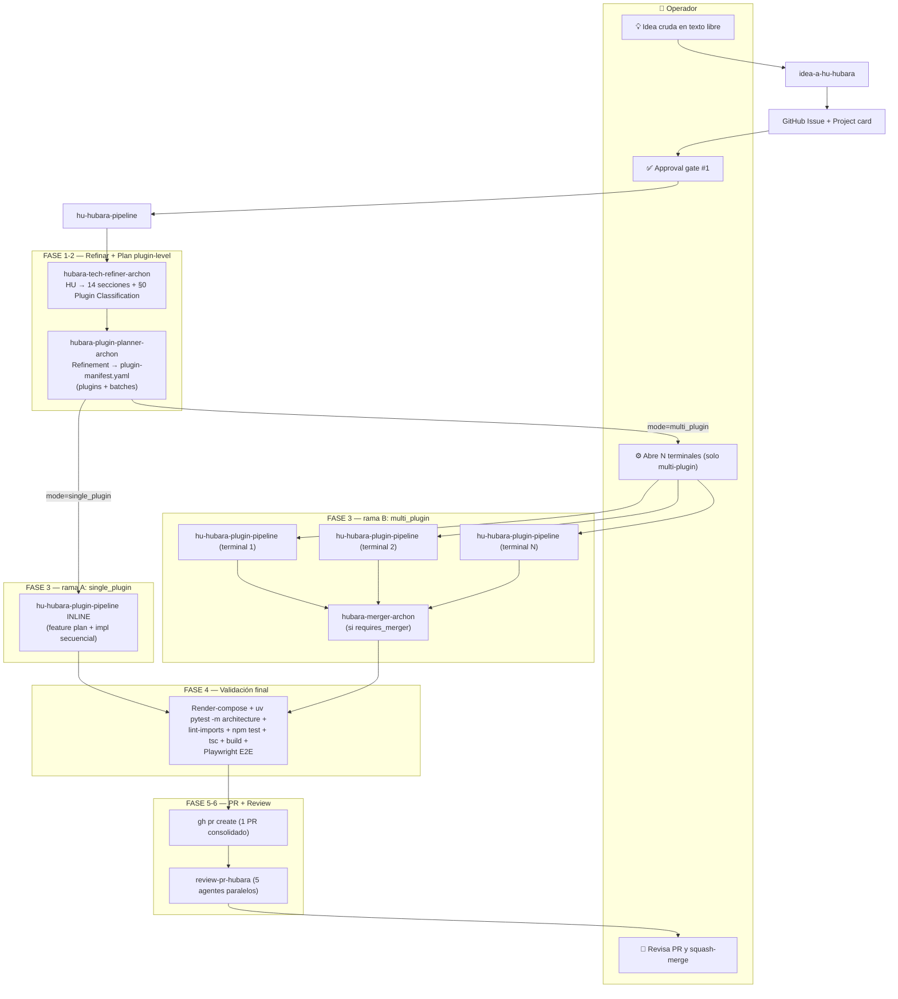

**Lectura:** desde la idea hasta el PR mergeable hay **2 approval gates
del operador** (el de "publicar issue" + el fan-out manual si es
multi_plugin), todo lo demás corre solo.

---

## §3. Los componentes del pipeline

### §3.1 Skills (6 totales)

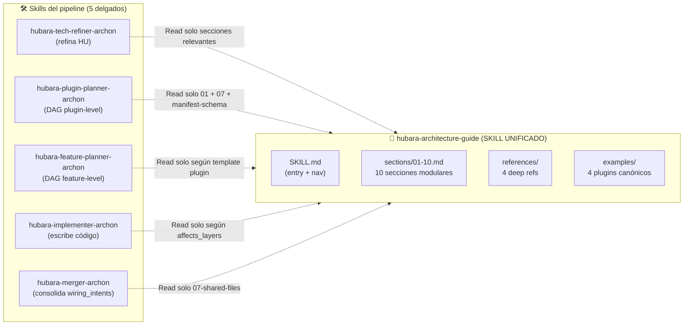

**Patrón clave (que el operador pidió):** UN solo skill grande con el
conocimiento arquitectural; los 5 skills del pipeline son delgados (~10
KB cada uno) y **leen del guide solo las secciones que necesitan** para
su tarea. Así:
- Mantenimiento en un solo lugar.
- Context window controlado por skill downstream (~30-50 KB, no 320 KB).
- Skills pueden evolucionar sin tocar el guide.

### §3.2 Workflows Archon (4 totales)

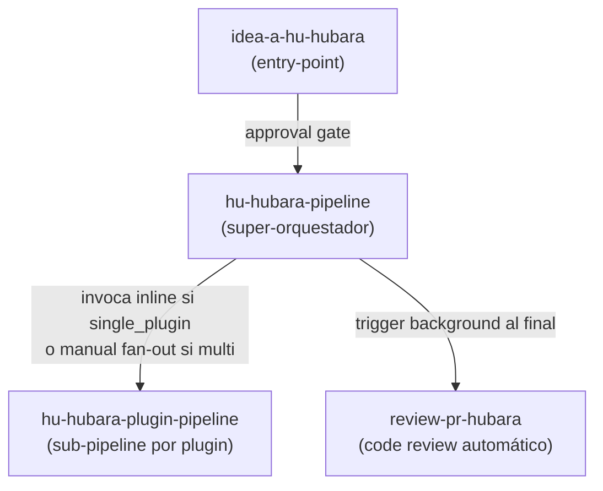

| Workflow | Nodos | Tamaño | Rol |
|---|---|---|---|
| `idea-a-hu-hubara` | 14 | 22 KB | Idea cruda → Issue + Project card |
| `hu-hubara-pipeline` | 40 | 52 KB | Orquestador E2E (FASE 0-6) |
| `hu-hubara-plugin-pipeline` | 17 | 38 KB | Sub-pipeline por plugin |
| `review-pr-hubara` | 20 | 25 KB | Review automático con 5 agentes |

### §3.3 Convenciones

Persistidas en `hubara_agency/.hubara/`:

```
hubara_agency/.hubara/
├── spinal-files.yaml             # qué files son spinal (conflict-prone) o protected
├── project-context.md            # layout + comandos + naming + reglas duras
│
├── drafts/idea-<ts>.md           # drafts de idea-a-hu-hubara
├── refinements/<HU_ID>-tech.md   # output del tech-refiner
├── refinements/<HU_ID>-original.md
├── plans/<HU_ID>/
│   ├── plugin-manifest.yaml      # output del plugin-planner
│   └── feature-plans/<plugin>/
│       ├── feature-plan-manifest.yaml   # output del feature-planner
│       └── tareas/F<NN>-*.md             # task files
└── results/<HU_ID>/
    ├── plugin-<plugin_id>-result.yaml    # output del sub-pipeline FASE 3
    └── feature-results/<plugin>/
        └── F<NN>-result.yaml             # output del implementer + gate
```

**Por qué `.hubara/` y no `.exoclaw/`:** convivencia con pipelines
legacy hasta PR19 (deprecation).

---

## §4. Modelo operacional — dos niveles

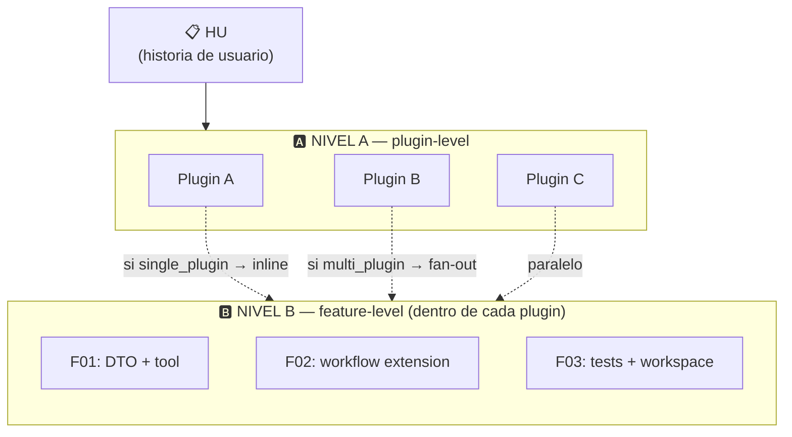

### §4.1 Nivel A — plugin-level (paralelizable)

El **plugin-planner** decompone la HU en una lista de plugins a tocar +
batches topológicos:

```yaml
# plugin-manifest.yaml
mode: multi_plugin
plugins:
  - id: chats
    layers: [agent, frontend]
    depends_on: []
    estimated_tasks: 4
  - id: catalog
    layers: [agent]
    depends_on: []
    estimated_tasks: 2
plugin_batches:
  - batch_id: B1
    plugins: [chats, catalog]   # corren en paralelo
```

**Plugins ortogonales** = batch único. Si un plugin depende de otro
(plugin B importa de plugin A), van en batches separados (topological).

### §4.2 Nivel B — feature-level (secuencial dentro del plugin)

El **feature-planner**, dentro del worktree de UN plugin, decompone el
trabajo del plugin en tasks atómicas:

```yaml
# feature-plan-manifest.yaml (dentro de plugin chats)
tasks:
  - id: F01
    title: "Crear DTO ImageMessage + tool SendImage"
    depends_on: []
    affects_layers: [contracts, tools, composition, worker]
  - id: F02
    title: "Activity send_image_via_whatsapp"
    depends_on: [F01]
parallel_batches:
  - batch_id: B1
    tasks: [F01]
  - batch_id: B2
    tasks: [F02]
```

**Default secuencial:** intra-plugin las tasks suelen compartir
`worker.py`, `composition.py`, etc. Paralelizar dentro del plugin tiene
poco beneficio. Por eso 1 task por batch.

---

## §5. Flujo E2E single_plugin (caso default)

El caso más común: HU que toca **un solo plugin** existente. Todo corre
auto sin fan-out humano.

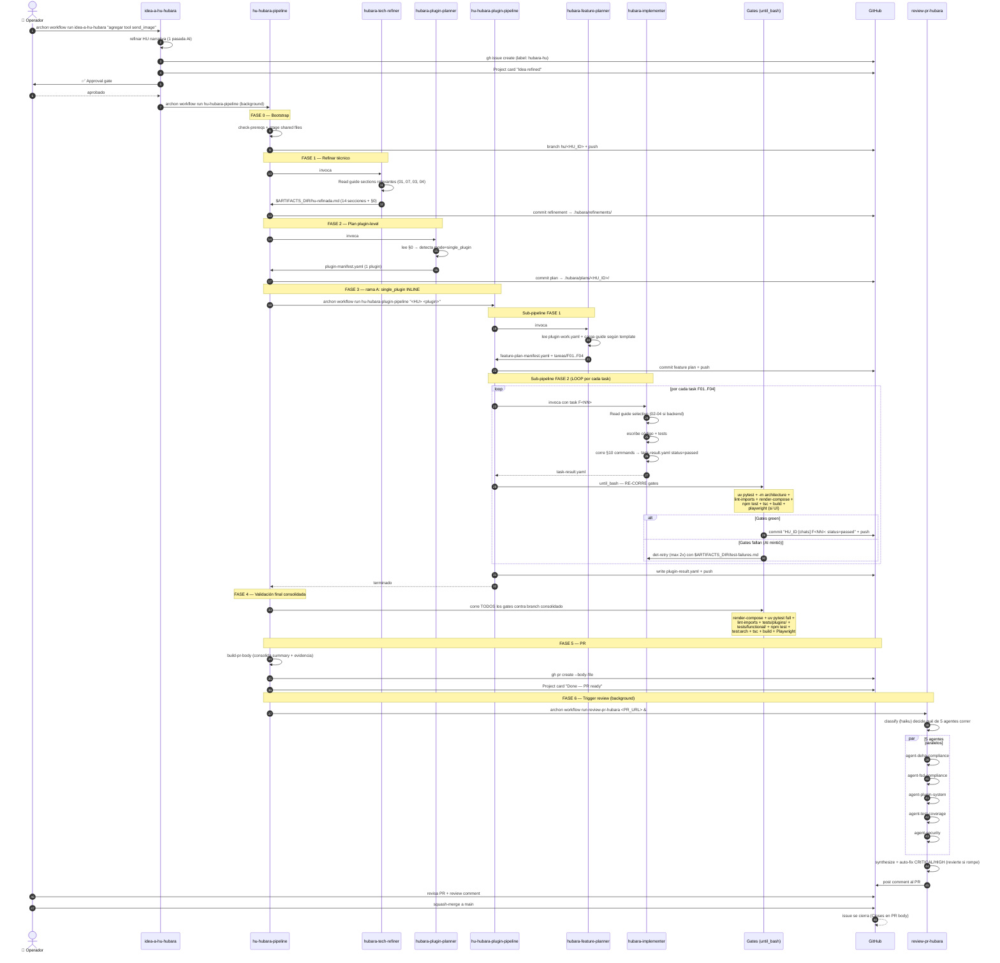

**Wall time típico:** 20–40 min desde el approval hasta el PR
mergeable + comment del review.

---

## §6. Flujo E2E multi_plugin (con fan-out + merger)

Caso más complejo: HU que toca **2+ plugins**. Operador abre N
terminales manualmente, el orquestador valida + invoca merger
(condicional) + sigue.

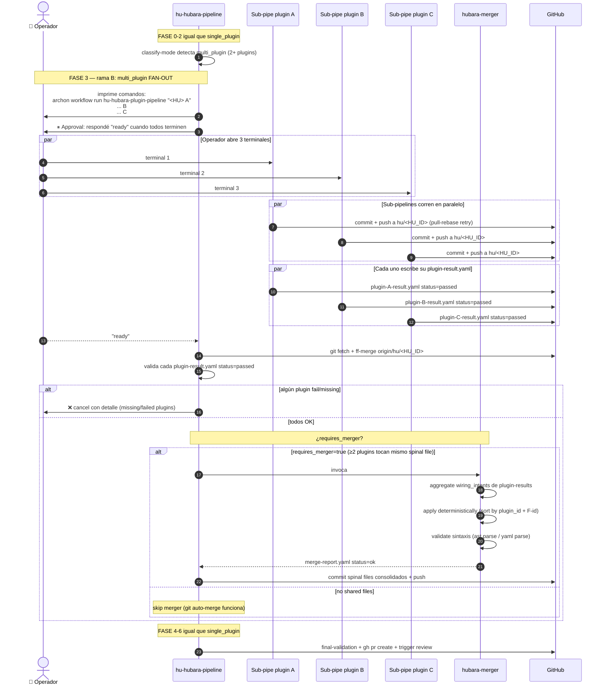

**Wall time típico:** 30–60 min con fan-out paralelo. Más rápido que
secuencial porque los plugins corren simultáneo (limitado por la HU más
larga).

---

## §7. Anatomía de un sub-pipeline (qué pasa dentro de `hu-hubara-plugin-pipeline`)

El sub-pipeline es donde el **código real se escribe**. Estructura
interna:

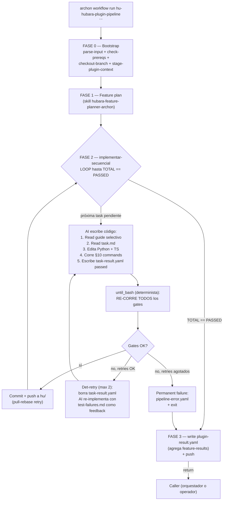

### §7.1 ¿Por qué el patrón `AI escribe → until_bash determinista`?

**Problema:** los AIs pueden mentir (decir `status: passed` cuando los
tests están rojos).

**Solución:** después de que el AI escribe `task-result.yaml passed`,
un script bash **re-corre TODOS los gates por su cuenta**. Si rompen,
el AI no se entera del problema hasta la próxima iteración (que le da
`$ARTIFACTS_DIR/test-failures.md` como feedback).

Esto es el **det-retry pattern** heredado del pipeline frontend:

```
AI: "task-result.yaml status=passed"
└── until_bash: "ah sí? veamos..."
    ├── npm test → red 🔴
    ├── npm run test:arch → red 🔴
    ├── borra task-result.yaml
    ├── escribe test-failures.md con output crudo
    └── exit 1 (loop continúa)

# Próxima iteración:
AI: lee test-failures.md, fixea el código
AI: "task-result.yaml status=passed" (otra vez)
└── until_bash: "veamos..."
    ├── npm test → green ✅
    ├── ...todos los gates pasan
    ├── git commit + push
    └── exit 0 (próxima task)
```

**3 intentos max** antes de permanent failure. El AI tiene 2 chances de
fixear con feedback.

---

## §8. Cómo los skills se invocan entre sí (el patrón del guide modular)

El skill `hubara-architecture-guide` es **el corazón del sistema** pero
**nunca se invoca directamente**. Cada skill del pipeline lee secciones
específicas via `Read` tool.

Ejemplo concreto: el implementer recibe una task que toca backend +
frontend:

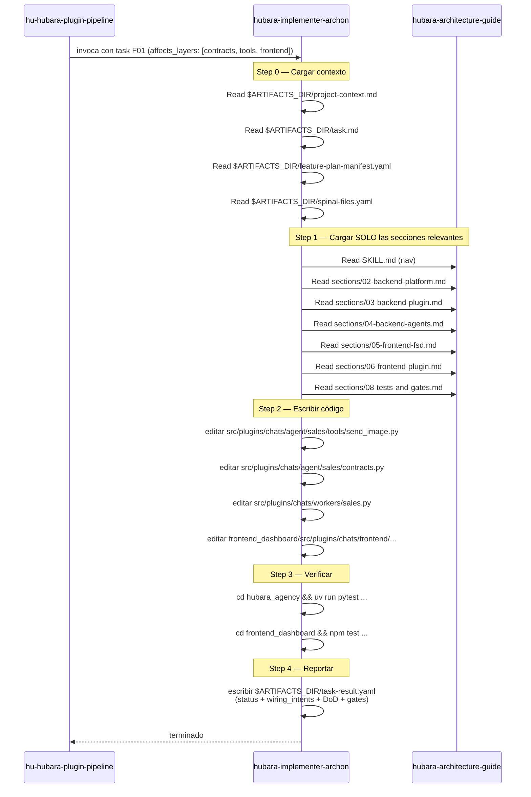

**Lo que NO carga:**
- `sections/01-general.md` (ya internalizado en el guide-aware reading inicial)
- `sections/07-shared-files.md` (solo si task toca spinal — no este caso)
- `sections/09-conventions.md` / `10-cookbook.md` (solo si necesita pattern específico)
- `references/*.md` (4 archivos de ~10 KB cada uno — solo si hay duda específica)
- `examples/*.md` (4 archivos — solo si se necesita case study)

**Context cargado en esta task:** ~60-80 KB de los 320 KB del guide.
Manejable para Sonnet.

---

## §9. Branch strategy y persistencia

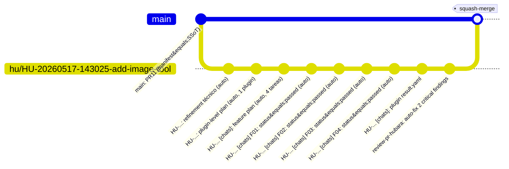

**Decisiones de diseño:**

1. **Mismo branch para todos los sub-pipelines** (incluso paralelos en
   multi-plugin). Cada uno pushea con `pull --rebase` retry. Solo conflictan
   en spinal files (raros), que el merger consolida.
2. **Commits granulares por task** durante el desarrollo. Buen audit trail.
3. **Squash-merge a main** al final → 1 commit por HU en main. Historia
   limpia.

### §9.1 Per-plugin persistencia (multi-plugin caso)

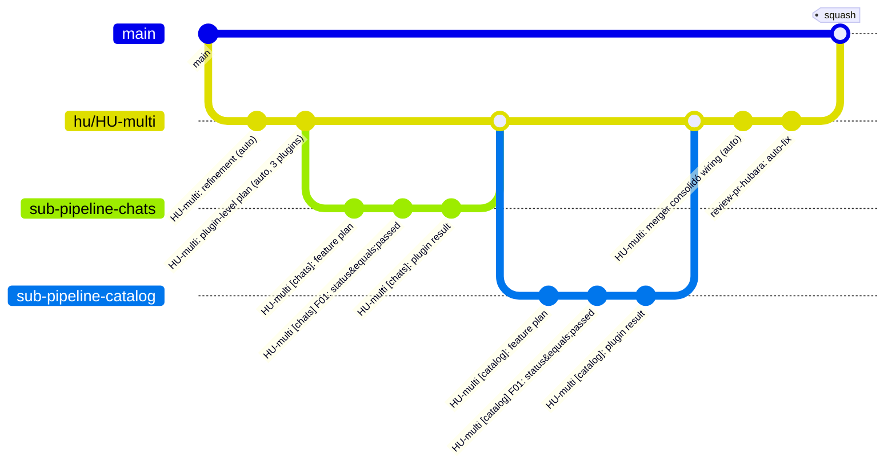

Conceptualmente los sub-pipelines son "branches paralelos" pero
**técnicamente todos pushean al mismo `hu/<HU_ID>`** con pull-rebase. El
diagrama anterior es lógico, no literal — el branch real es lineal con
los commits intercalados según orden de push.

---

## §10. Decisiones de diseño clave (FAQ)

### §10.1 ¿Por qué un solo skill arquitectural en vez de uno por dominio?

**Trade-off considerado:** podríamos haber tenido
`hubara-architecture-guide-backend`, `hubara-architecture-guide-frontend`,
`hubara-architecture-guide-plugins`, etc.

**Decisión:** UNO solo modular. Razones:
1. **Mantenimiento:** cuando cambia la arquitectura, edito 1 lugar.
2. **Cross-stack natural:** un plugin tiene backend + frontend; el
   implementer necesita ambos.
3. **Cada skill downstream carga solo las sections que necesita** vía
   `Read tool`, así que el context window por skill se mantiene chico
   (el guide grande no se carga entero).

### §10.2 ¿Por qué dos niveles (plugin + feature) y no uno?

**Trade-off:** un solo planner que decompone HU directamente en tasks
hubiera sido más simple.

**Decisión:** dos niveles. Razones:
1. **El paralelismo natural es a nivel plugin** (post-PR11 cada plugin
   es ortogonal).
2. **El feature-level necesita contexto específico del plugin** (template
   A/B/C/D, layers que toca, etc.) que solo se ve cuando ya elegiste
   el plugin.
3. **Mejor delegación:** el orquestador decide "qué plugins", los
   sub-pipelines deciden "qué features dentro de cada plugin".
4. **Mejor smart-resume:** podés re-lanzar un plugin específico sin
   re-correr el plugin-planner.

### §10.3 ¿Por qué un PR consolidado por HU y no N PRs?

**Trade-off:** N PRs (uno por plugin) sería mejor isolation y revisable
por plugin.

**Decisión:** 1 PR consolidado. Razones:
1. **Más fácil de revisar como HU completa:** el reviewer ve el cambio
   end-to-end, no piezas sueltas.
2. **Squash-merge simple:** historia limpia en main.
3. **Cross-plugin deps se ven juntas:** si chats consume entity nueva
   de catalog, está en el mismo PR.
4. **Review automático corre 1 vez:** los 5 agentes ven todo el contexto.

Trade-off aceptado: el PR puede ser grande. Mitigación: `pr-body.md`
auto-generado consolida summary + evidencia por plugin.

### §10.4 ¿Por qué fan-out manual y no automático para multi-plugin?

**Trade-off:** automatizar el fan-out (workflow lanza N sub-pipelines)
ahorraría el approval gate al operador.

**Decisión:** fan-out manual (operador abre N terminales).

**Razones:**
1. Archon NO garantiza que `archon workflow run X &` + `wait` funcione
   confiablemente desde dentro de otro workflow.
2. El operador tiene visibilidad de qué corre dónde — útil para debug.
3. Cuando un sub-pipeline falla, el operador puede iterar uno solo sin
   re-lanzar todo.
4. Es solo para multi-plugin (caso menos frecuente); single-plugin sigue
   100% auto.

### §10.5 ¿Por qué el merger es opcional?

**Decisión:** el merger se invoca **solo si ≥2 plugins paralelos tocan
el mismo spinal file**.

**Razón:** post-PR11 las HUs multi-plugin típicas NO tocan shared files
(cada plugin es ortogonal). Cuando sí lo hacen (ej. agregar icono cross-plugin),
el merger consolida `wiring_intents` deterministically.

Si solo un plugin del batch toca shared, git auto-merge alcanza.

### §10.6 ¿Por qué gates determinísticos después del AI?

**Decisión:** después de que el AI escribe `task-result.yaml passed`,
un script bash re-corre TODOS los gates.

**Razón:** los AIs **mienten** (a veces involuntariamente). Tests verdes
según el AI ≠ tests verdes en realidad. Det-gate es la verdad.

**Patrón heredado del pipeline frontend, extendido en hubara con:**
- `render-compose` drift check (post-PR11)
- `uv lint-imports` (R-DIP)
- `uv pytest -m architecture` (R-rules DEHA)
- `npm run test:arch` (FSD + 14 anti-patterns)

### §10.7 ¿Por qué `set -o pipefail` en bash?

**Bug clásico:**

```bash
npm test 2>&1 | tail -30   # exit code es de tail (siempre 0)
```

Si `npm test` rompe pero `tail` succeed, el exit code es 0 → bash piensa
que todo está OK. **Pipefail propaga el exit code del primer command que
falla:**

```bash
set -o pipefail
npm test 2>&1 | tail -30   # exit code = de npm test
```

Este detalle está en TODOS los gates del pipeline (heredado del
frontend post-mortem).

### §10.8 ¿Por qué `env -u CLAUDECODE` cuando se invocan workflows desde dentro de workflow?

**Problema:** si un workflow Archon corre dentro de Claude Code, y desde
ese workflow invocás otro `archon workflow run ...`, el inner workflow
puede colgarse silenciosamente (Archon detecta `CLAUDECODE=1` y entra a
modo "stdin pipe" esperando input que nunca llega).

**Solución:** `env -u CLAUDECODE` borra esa env var antes de invocar el
sub-workflow → arranca como si fuera terminal normal.

---

## §11. Reglas DURAS que el pipeline enforza

Todas heredan del refactor PR1-PR11 + los blueprints. El implementer las
verifica WHILE writing, los gates las verifican después.

### §11.1 DEHA backend (R-rules)

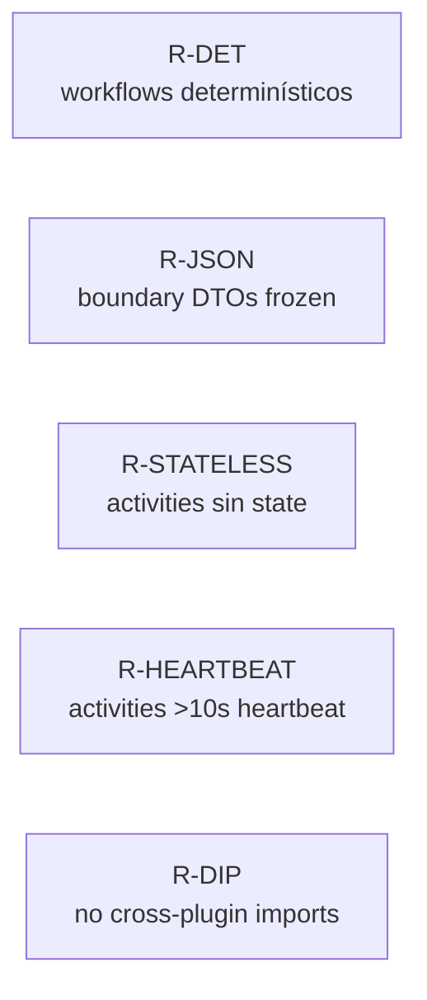

Detalle exhaustivo: `.claude/skills/hubara-architecture-guide/references/deha-rules.md`.

### §11.2 FSD frontend

- 4 import rules: `shared → entities → features → pages → app` (solo hacia abajo).
- Cross-plugin imports prohibidos (`@plugins/A ❌→ @plugins/B`).
- Zod at boundary (`apiClient.get<unknown>()` siempre + `schema.parse`).
- TanStack Query para server data.
- 14 anti-patterns adicionales en `references/fsd-rules.md`.

### §11.3 Plugin manifest = SSoT

Si una conexión del plugin con el sistema no se puede expresar en
`plugin.yaml`, **eso es bug del schema**. Agregar campo al schema antes
que hacer workaround en archivo shared.

### §11.4 Architecture-protected files (HARD STOP)

NUNCA editables sin ADR + PR `architecture-change` con human review:

- `.archon/workflows/**`
- `.claude/skills/hubara-*/**`
- `hubara_agency/tests/architecture/**`
- `hubara_agency/.importlinter`
- `frontend_dashboard/src/test/architecture/**`
- `frontend_dashboard/.dependency-cruiser.cjs`
- `frontend_dashboard/tsconfig.arch.json`

Si una task pide modificarlos → `status: blocked`,
`blocked_reason: requires_planner_update`. **NUNCA**
`ARCH_CHANGE_APPROVED=1` por cuenta del AI.

---

## §12. Cómo se "ven" los artifacts a lo largo del flujo

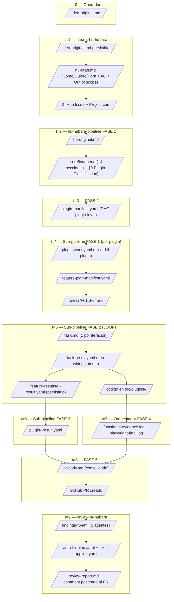

**Cada artifact se persiste a `hubara_agency/.hubara/`** (durable, en
repo) en cuanto un nodo del workflow lo "ratifica" con commit. Smart-resume
detecta artifacts ya persistidos y salta esas fases en re-lanzamientos.

---

## §13. Cómo se invocan los workflows (manual del operador, condensado)

### §13.1 Caso típico (single-plugin, end-to-end)

```bash
# Paso único — todo el resto corre solo:
archon workflow run idea-a-hu-hubara "agregar tool de envío de imágenes al agente sales"

# El AI te muestra el draft de la HU.
# El workflow publica issue + Project card "Idea refined".
# Approval gate: ¿lanzo el pipeline?
# Vos: "sí" / aprobado.

# Pipeline arranca en background (~20-40 min).
# Mirá el Project board para ver el progreso:
# Idea refined → Refining → Refined → Planning → Planned →
# Implementing → Done — PR ready → Reviewing

# Cuando llega a "Done — PR ready", el PR está creado.
# Cuando "Reviewing" se completa, el comment del review está posteado.
# Vos revisás el PR y squash-merge.
```

### §13.2 Caso multi-plugin (con fan-out)

```bash
# Igual hasta el approval.
# El pipeline detecta multi_plugin en plugin-manifest.

# En algún punto te imprime:
#   ─────────────────────────────────────────────────
#   MULTI-PLUGIN HU detectada — FAN-OUT MANUAL
#   Abrí UNA TERMINAL por cada plugin del primer batch:
#     archon workflow run hu-hubara-plugin-pipeline "HU-... chats"
#     archon workflow run hu-hubara-plugin-pipeline "HU-... catalog"
#   ─────────────────────────────────────────────────

# Abrís 2 terminales nuevas, corrés cada comando.
# Cada sub-pipeline trabaja independiente (~15-20 min cada uno).

# Cuando AMBOS terminan, volvés a la terminal original:
# Approval: respondé "ready".

# Orquestador valida + opcional merger + FASE 4-6.
```

### §13.3 Caso debug (un sub-pipeline aislado)

```bash
# Querés iterar solo el plugin chats de una HU existente:
archon workflow run hu-hubara-plugin-pipeline "HU-20260517-143025-add-image-tool chats"

# Smart-resume detecta:
# - refinement YA committeado → skip
# - plugin-manifest YA committeado → skip
# - feature-plan YA committeado → skip
# - tasks pendientes → arrancar desde la próxima sin result.yaml
```

### §13.4 Caso override manual

```bash
# El AI refinó mal. Editás a mano:
$EDITOR hubara_agency/.hubara/refinements/HU-...-tech.md
git add hubara_agency/.hubara/refinements/
git commit -m "HU-...: refinement manual override"
git push origin hu/HU-...

# Re-lanzar pipeline:
archon workflow run hu-hubara-pipeline "HU-..."
# Smart-resume: detecta refinement OK → salta FASE 1.
```

---

## §14. Anatomía de un commit del pipeline

Convención de commit messages (canónico para todos los commits autogenerados):

| Origen | Mensaje |
|---|---|
| `hu-hubara-pipeline FASE 1` | `<HU_ID>: refinement técnico (auto, hubara pipeline)` |
| `hu-hubara-pipeline FASE 2` | `<HU_ID>: plugin-level plan (auto, <N> plugins)` |
| `hu-hubara-plugin-pipeline FASE 1` | `<HU_ID> [<plugin_id>]: feature plan (auto, <N> tareas)` |
| `hu-hubara-plugin-pipeline until_bash` (por task) | `<HU_ID> [<plugin_id>] F<NN>: status=<STATUS> (auto)` |
| `hu-hubara-plugin-pipeline FASE 3` | `<HU_ID> [<plugin_id>]: plugin result.yaml` |
| `hu-hubara-pipeline FASE 3 multi-plugin merger` | `<HU_ID>: merger consolidó wiring_intents del batch (auto)` |
| `review-pr-hubara` | `review-pr-hubara: auto-fix <N> critical/high finding(s)` |

**Lectura del git log de una HU típica:**

```
$ git log --oneline hu/HU-20260517-143025-add-image-tool
abc1234 review-pr-hubara: auto-fix 2 critical/high finding(s)
def5678 HU-20260517-143025-add-image-tool [chats]: plugin result.yaml
ghi9abc HU-20260517-143025-add-image-tool [chats] F04: status=passed (auto)
jkl0def HU-20260517-143025-add-image-tool [chats] F03: status=passed (auto)
mno1ghi HU-20260517-143025-add-image-tool [chats] F02: status=passed (auto)
pqr2jkl HU-20260517-143025-add-image-tool [chats] F01: status=passed (auto)
stu3mno HU-20260517-143025-add-image-tool [chats]: feature plan (auto, 4 tareas)
vwx4pqr HU-20260517-143025-add-image-tool: plugin-level plan (auto, 1 plugins)
yz5stuv HU-20260517-143025-add-image-tool: refinement técnico (auto, hubara pipeline)
```

Después del squash-merge a main, todo esto colapsa en un solo commit.

---

## §15. Review automático — anatomía de un comment

El workflow `review-pr-hubara` corre 5 agentes en paralelo (selectivos
según `classify`), consolida findings, intenta auto-fix CRITICAL/HIGH,
y postea un comment.

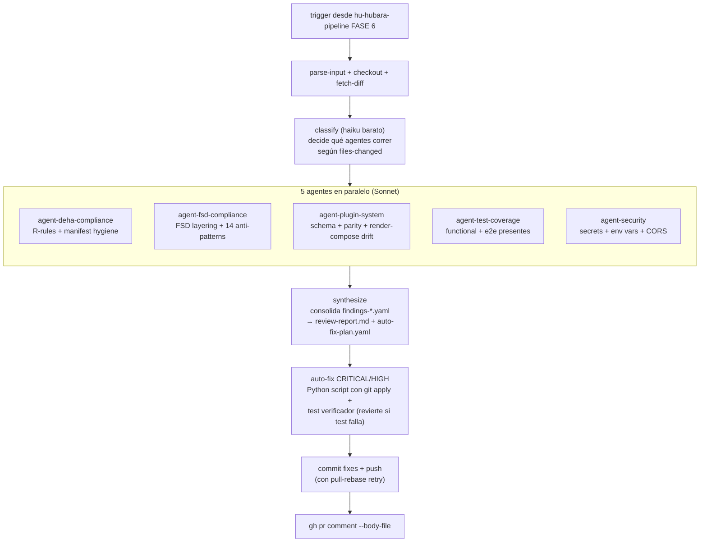

### §15.1 Ejemplo de comment (estructura)

```markdown
## 🤖 Automated Review — review-pr-hubara

# Code Review — PR 142

## Resumen
- 4 findings totales (1 critical / 2 high / 0 medium / 1 low)
- Por agente: deha 2, fsd 1, plugin-system 0, test-coverage 1, security 0

## Findings por severidad

### CRITICAL
- **src/plugins/chats/agent/sales/workflows/sales_session.py:127**
  [R-DET] `datetime.now()` usado en workflow code — viola R-DET.
  Fix suggestion: `from temporalio import workflow; ... workflow.now()`

### HIGH
- **src/plugins/chats/agent/sales/tools/send_image.py:45**
  [R-JSON] `@dataclass` sin `frozen=True` cruzando workflow boundary.
  Fix suggestion: agregar `frozen=True`.
- **frontend_dashboard/src/plugins/chats/frontend/features/...** [FSD]
  `useState` para server data — debería usar TanStack Query.

### LOW
- **frontend_dashboard/e2e/send-image/spec.ts:23**
  [test-coverage] Selector `getByText("...")` muy genérico; considerá
  `getByRole("button", { name: "..." })`.

## Auto-fix summary
- Fixes applied: 2 (R-DET + R-JSON)
- Fixes reverted (rompían tests): 0
- Pendientes (manual): FSD useState + selector genérico

---
🤖 Reviewed by review-pr-hubara — 5 agentes especializados
```

**El comment es informativo, NO bloquea el PR.** El operador decide
mergear (si los pendientes son aceptables) o iterar.

---

## §16. Cuándo el pipeline NO va a funcionar (limitaciones honestas)

| Caso | Por qué falla | Workaround |
|---|---|---|
| HU pide cambio architecture-protected | refiner lo bloquea con HARD STOP | ADR + PR `architecture-change` separado, después re-lanzar pipeline |
| HU >8 plugins afectados | plugin-planner cap conservador | Splittear en 2 HUs |
| Plugin >12 features | feature-planner cap | Splittear el plugin work |
| Multi-plugin con deps cíclicas | planner detecta cycle, refuses | Bundlear o re-decomponer |
| Manifest schema necesita campo nuevo | Cualquier change al schema requiere ADR | PR architecture-change |
| Implementer mete bug que pasa det-gates pero rompe en producción | Det-gates son tests, no observabilidad real | Review automático debería catchear; en última instancia rollback |
| Multi-plugin con shared file que el merger NO sabe consolidar (mid-file mutation) | Wiring intent vocabulary describe solo APPENDS | Operador resuelve a mano + commit |
| Operador olvida fan-out de un plugin (responde "ready" antes) | Validación detecta MISSING plugin-result, aborta | Lanzar el faltante + re-lanzar pipeline |
| Branch `hu/<HU_ID>` divergió de origin (rebase manual conflicto) | Pull-rebase retry falla | Operador resuelve manualmente con git status |

---

## §17. ¿Por qué este diseño escala?

Tres propiedades estructurales:

### §17.1 Composable

Cada componente (skill, workflow) hace UNA cosa:
- `tech-refiner` → refinement.
- `plugin-planner` → DAG plugin-level.
- `feature-planner` → DAG feature-level.
- `implementer` → código.
- `merger` → consolida intents.

**Reemplazar uno NO requiere tocar los demás.** Si querés un planner
diferente (e.g. uno que use LangGraph en vez de Sonnet), solo cambia el
`skills:` field del nodo correspondiente.

### §17.2 Modular conocimiento

El skill `hubara-architecture-guide` tiene 22 archivos. Editar
`sections/04-backend-agents.md` cuando cambia un patrón Temporal NO
requiere tocar otros skills.

Cada skill downstream carga **solo las secciones de su tarea** vía
`Read tool` — pueden bajar / subir el "consumo" del guide cambiando 1
línea del prompt.

### §17.3 Paralelizable a nivel plugin

El plugin system post-PR11 garantiza que **plugins ortogonales no
comparten files**. El pipeline lo explota:

- Plugin-planner identifica plugins ortogonales = mismo batch.
- Sub-pipelines corren en paralelo.
- Merger solo se invoca si hay shared (raro).

**Bound del paralelismo:** ~5-8 plugins simultáneos (limitado por
máquina del operador para correr N terminales + N copias de Sonnet).
Para HUs típicas de 1-3 plugins, paralelismo real.

---

## §18. Comparación con frameworks comerciales

| Framework | Modelo | Compatible con hubara? |
|---|---|---|
| **GitHub Copilot Workspace** | Single-shot E2E (idea → PR) | No es para multi-plugin paralelo + plugin system custom |
| **Devin** | Single-agent E2E con full repo access | Idem; sin gates determinísticos cross-stack |
| **AutoGen / CrewAI** | Multi-agent collaboration general | Diseñado para agentes conversando, no para pipeline lineal con gates |
| **Aider** | Interactive paired programming | No es pipeline auto |
| **Sweep** | GitHub Action → PR (parecido) | Más simple; sin plan two-level ni gates customs |

**Hubara pipeline es opinionated específicamente para este repo** (DEHA +
FSD + plugin system). No pretende ser framework general.

---

## §19. Glosario rápido

- **HU** — Historia de Usuario.
- **DEHA** — Durable Execution Hexagonal Architecture (las 5 R-rules backend).
- **FSD** — Feature-Sliced Design (5 capas frontend).
- **Plugin** — Carpeta autocontenida con `plugin.yaml` que contribuye
  frontend / API / agent.
- **Plugin manifest = SSoT** — `plugin.yaml` es el único lugar donde se
  declaran conexiones del plugin con el sistema.
- **Spinal file** — Archivo compartido cross-plugin que múltiples tasks
  paralelas podrían modificar (`platform/contracts.py`, `Icon.tsx`, etc.).
- **Wiring intent** — Declaración estructural de qué agregar a un spinal
  file. El merger los consolida deterministically.
- **Architecture-protected** — Archivos que NINGUNA feature task puede
  modificar (requieren ADR + PR separado).
- **single_plugin / multi_plugin / no_work** — Mode classification del
  refinement; determina la rama del orquestador.
- **Plugin-level DAG (Nivel A)** — Plugins ortogonales paralelizables.
- **Feature-level DAG (Nivel B)** — Tasks atómicas dentro de un plugin
  (secuencial default).
- **Det-gate / det-retry** — Script bash que re-corre tests
  determinísticamente después del AI. Si rompe, AI re-implementa con
  `test-failures.md` como feedback (2 retries max).
- **Smart resume** — Re-lanzar pipeline con HU_ID existente detecta
  fases ya completadas y las salta.
- **Worktree** — Copia aislada del repo que Archon crea por
  `archon run`. Cada sub-pipeline corre en su propio worktree.
- **Shared files** — Sinónimo de spinal files (post-PR11 son ~10).
- **Protected files** — Subset de shared files que NO se pueden modificar
  sin ADR.

---

## §20. Para leer después

| Si querés… | Leé |
|---|---|
| Plan maestro + decisiones de diseño detalladas | `HUBARA_PIPELINE_PLAN.md` |
| Specs internas del skill arquitectural | `HUBARA_SKILL_BLUEPRINT.md` |
| Pseudocódigo detallado de cada workflow | `HUBARA_WORKFLOWS_BLUEPRINT.md` |
| Manual operacional (comandos + troubleshooting) | `.archon/workflows/README-hubara.md` |
| Arquitectura del repo (DEHA + FSD + plugin system) | `ARCHITECTURE.md` |
| Cómo agregar plugin nuevo | `.claude/skills/hubara-architecture-guide/sections/03-backend-plugin.md` |
| Reglas DEHA detalladas | `.claude/skills/hubara-architecture-guide/references/deha-rules.md` |
| Reglas FSD detalladas | `.claude/skills/hubara-architecture-guide/references/fsd-rules.md` |
| Patrones Temporal | `.claude/skills/hubara-architecture-guide/references/temporal-patterns.md` |
| Ejemplos por template de plugin | `.claude/skills/hubara-architecture-guide/examples/` |

---

## §21. Estado actual (al cierre de PR18, 2026-05-17)

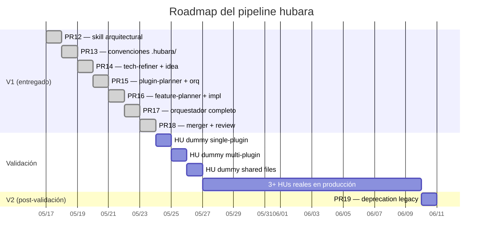

**V1 estable cuando:**
- ✅ Pipeline E2E funcional (PR12-PR18 mergeados).
- ⏳ 3+ HUs reales pasaron por el pipeline.
- ⏳ ≥1 HU multi-plugin.
- ⏳ ≥0 fallback a pipelines legacy en últimas 4 semanas.
- ⏳ Review automático en ≥3 PRs sin falsos positivos críticos.

Cuando se cumplan, **PR19** elimina los pipelines legacy (exoclaw +
frontend) — el hubara queda como único pipeline del repo.

---

**Fin guía explicativa.** Si después de leer este doc el pipeline te
sigue resultando opaco, probablemente:

1. Faltan detalles que vos esperabas — abrí issue / PR para mejorarlo.
2. O el diseño tiene un agujero — leé el premortem en
   `HUBARA_PIPELINE_PLAN.md §6.2` y el `Troubleshooting` del
   `README-hubara.md §7`.

El pipeline se diseñó para ser **honesto sobre sus limitaciones**.
Si algo no funciona como esperás, probablemente está documentado como
caso conocido — no como bug.
