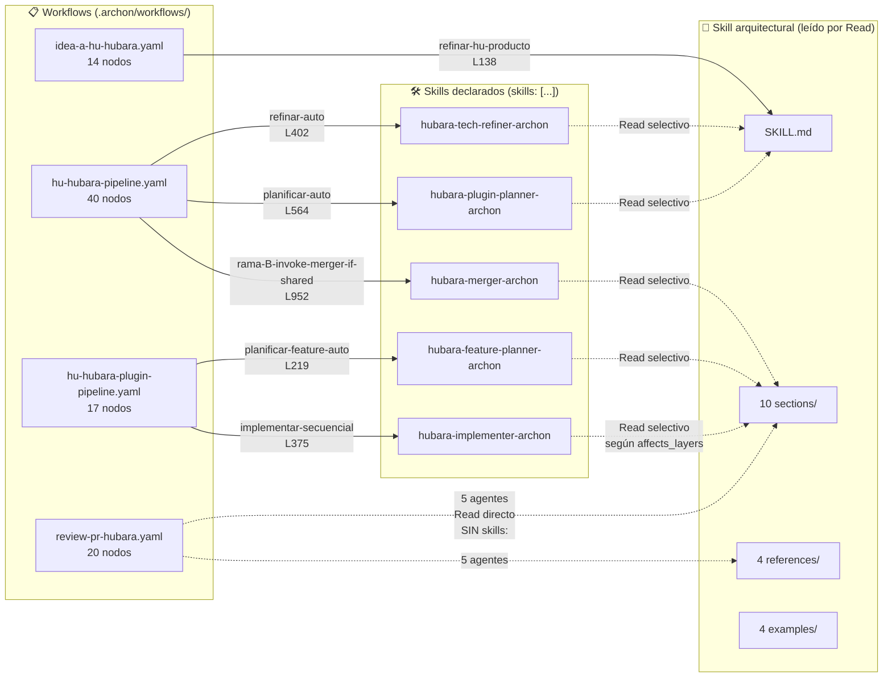

# Pipeline Hubara — Inventory de archivos y mapeo nodo→skill

> **Propósito:** documentar **exactamente** qué workflows YAML y qué
> skills SKILL.md están en uso, y qué nodo de qué workflow invoca a
> qué skill. Es la fuente de verdad estructural — si querés agregar /
> modificar un componente, este es el mapa.
>
> **Mantenimiento:** este archivo es generado por inspección (no por
> hand). Si modificás un workflow o agregás un skill, re-correr el
> chequeo de §5.

---

## §1. Workflows en uso (4 archivos)

Todos los workflows hubara viven en `.archon/workflows/`. Cada uno se
invoca con `archon workflow run <nombre>`.

| Path | Nodos | Tamaño | Rol |
|---|---|---|---|
| `.archon/workflows/idea-a-hu-hubara.yaml` | 14 | 22 KB | Entry-point. Idea cruda → HU draft → Issue + Project card → approval gate → dispatch background `hu-hubara-pipeline` |
| `.archon/workflows/hu-hubara-pipeline.yaml` | 40 | 63 KB | Orquestador E2E (FASE 0-6). Refinamiento + plan + classify + rama A/B + final validation + PR + trigger review |
| `.archon/workflows/hu-hubara-plugin-pipeline.yaml` | 17 | 38 KB | Sub-pipeline por plugin. Feature plan + implementer loop + det-gates + plugin-result.yaml |
| `.archon/workflows/review-pr-hubara.yaml` | 20 | 25 KB | Code review post-PR. classify + 5 agentes paralelos + synthesize + auto-fix + post-comment |

**Total: 91 nodos en 4 workflows ≈ 148 KB.**

---

## §2. Skills en uso (6 archivos)

Todos los skills hubara viven en `.claude/skills/hubara-*/SKILL.md`.

### §2.1 Skill arquitectural (modular, leído por Read tool)

| Path | Tamaño | Rol |
|---|---|---|
| `.claude/skills/hubara-architecture-guide/SKILL.md` | 14 KB | Entry + navegación. NUNCA se declara en `skills:` de un nodo. Lo leen otros skills + agentes vía `Read` selectivo |

Subarchivos (20 totales: 1 SKILL + 1 README + 10 sections + 4 references + 4 examples):

- `sections/01-general.md` — visión global + R-rules + invariantes
- `sections/02-backend-platform.md` — DEHA backend (Temporal + activities + workflows)
- `sections/03-backend-plugin.md` — anatomía de un plugin backend
- `sections/04-backend-agents.md` — patterns de agentes (sales, etc.)
- `sections/05-frontend-fsd.md` — FSD layering + 4 import rules
- `sections/06-frontend-plugin.md` — anatomía de un plugin frontend
- `sections/07-shared-files.md` — spinal files + wiring intents
- `sections/08-tests-and-gates.md` — pytest + vitest + playwright + det-gates
- `sections/09-conventions.md` — naming, paths, env vars, gotchas
- `sections/10-cookbook.md` — receta común por template plugin
- `references/manifest-schema.md` — schema completo de `plugin.yaml`
- `references/deha-rules.md` — R-DET, R-JSON, R-STATELESS, R-HEARTBEAT, R-DIP
- `references/fsd-rules.md` — 14 anti-patterns frontend
- `references/temporal-patterns.md` — patrones Temporal idiomatic
- `examples/plugin-frontend-only.md` — case study template A
- `examples/plugin-frontend-plus-api.md` — case study template B
- `examples/plugin-with-worker.md` — case study template C
- `examples/plugin-full-stack-agentic.md` — case study template D

### §2.2 Skills de pipeline (5 declarados via `skills:`)

| Path | Tamaño | Quién lo invoca |
|---|---|---|
| `.claude/skills/hubara-tech-refiner-archon/SKILL.md` | 16 KB | `hu-hubara-pipeline` nodo `refinar-auto` |
| `.claude/skills/hubara-plugin-planner-archon/SKILL.md` | 14 KB | `hu-hubara-pipeline` nodo `planificar-auto` |
| `.claude/skills/hubara-feature-planner-archon/SKILL.md` | 17 KB | `hu-hubara-plugin-pipeline` nodo `planificar-feature-auto` |
| `.claude/skills/hubara-implementer-archon/SKILL.md` | 20 KB | `hu-hubara-plugin-pipeline` nodo `implementar-secuencial` |
| `.claude/skills/hubara-merger-archon/SKILL.md` | 14 KB | `hu-hubara-pipeline` nodo `rama-B-invoke-merger-if-shared` |

**Total: 6 skills ≈ 95 KB (incluye el guide modular completo).**

---

## §3. Mapeo nodo → skill (exhaustivo)

Hay 2 mecanismos por los cuales un nodo "usa" un skill:

1. **`skills: [name]`** — declaración formal en el workflow YAML, Archon
   carga el skill antes de ejecutar el `prompt:` del loop.
2. **`Read .claude/skills/...`** — el prompt del nodo lee archivos del
   skill arquitectural a demanda (no requiere declarar en `skills:`).

### §3.1 `idea-a-hu-hubara.yaml` (14 nodos, 0 con `skills:` declarado)

| Nodo (línea) | `skills:` | `Read` references | Notas |
|---|---|---|---|
| `refinar-hu-producto` (L138) | — | Opcional: `hubara-architecture-guide/SKILL.md` + `sections/01-general.md` (L156-157) | Solo si la idea menciona plugin/agente/Temporal |
| (los 13 nodos restantes) | — | — | Todos son nodos `bash:` o `cancel:` (no AI) |

**Patrón:** este workflow es 99% bash + gh + project-board. Solo 1
nodo AI sin loop iterativo (single-shot draft).

### §3.2 `hu-hubara-pipeline.yaml` (40 nodos, 3 con `skills:` declarado)

| Nodo (línea) | `skills:` declarado (línea) | `Read` references |
|---|---|---|
| `refinar-auto` (L402) | `[hubara-tech-refiner-archon]` (L411) | `hubara-architecture-guide/SKILL.md` (L431), `sections/01-general.md` (L432), `sections/07-shared-files.md` (L433) |
| `planificar-auto` (L564) | `[hubara-plugin-planner-archon]` (L573) | `hubara-architecture-guide/SKILL.md` (L596), `sections/01-general.md` (L597), `sections/07-shared-files.md` (L598), `references/manifest-schema.md` (L599) |
| `rama-B-invoke-merger-if-shared` (L952) | `[hubara-merger-archon]` (L960) | — |
| (los 37 nodos restantes) | — | — |

**Patrón:** los 3 nodos AI declaran su skill principal (`hubara-*-archon`)
+ leen del guide modular selectivamente. Los 37 nodos restantes son
bash deterministas (validate, commit, classify-mode, render-compose,
gates, gh pr create, etc.).

### §3.3 `hu-hubara-plugin-pipeline.yaml` (17 nodos, 2 con `skills:` declarado)

| Nodo (línea) | `skills:` declarado (línea) | `Read` references |
|---|---|---|
| `planificar-feature-auto` (L219) | `[hubara-feature-planner-archon]` (L227) | (el skill mismo carga el guide según template del plugin) |
| `implementar-secuencial` (L375) | `[hubara-implementer-archon]` (L385) | (el skill mismo carga el guide según `affects_layers`) |
| (los 15 nodos restantes) | — | — |

**Patrón:** los 2 nodos AI declaran el skill correspondiente. Los
`Read` del guide se delegan al SKILL.md interno (no aparecen en el YAML)
para mantener el workflow chico y los skills auto-contenidos.

### §3.4 `review-pr-hubara.yaml` (20 nodos, 0 con `skills:` declarado)

5 agentes paralelos leen secciones específicas del guide vía `Read`:

| Nodo (línea) | `skills:` | `Read` references (sections del guide arquitectural) |
|---|---|---|
| `agent-deha-compliance` (L164) | — | `sections/02-backend-platform.md` (L174), `sections/03-backend-plugin.md` (L175), `sections/04-backend-agents.md` (L176), `references/deha-rules.md` (L177) |
| `agent-fsd-compliance` (L206) | — | `sections/05-frontend-fsd.md` (L216), `sections/06-frontend-plugin.md` (L217), `references/fsd-rules.md` (L218) |
| `agent-plugin-system` (L240) | — | `sections/07-shared-files.md` (L250), `sections/08-tests-and-gates.md` (L251), `references/manifest-schema.md` (L252) |
| `agent-test-coverage` (L278) | — | `sections/08-tests-and-gates.md` (L288) |
| `agent-security` (L309) | — | `sections/02-backend-platform.md` (L319), `sections/09-conventions.md` (L320) |
| (los 15 nodos restantes) | — | — |

**Patrón:** los 5 agentes son AI pero NO declaran `skills:` — solo
leen del guide modular vía `Read`. Esto es por diseño: cada agente
es un especialista que carga su subset del guide sin pasar por el
skill loader de Archon (más liviano).

---

## §4. Diagrama de invocaciones



**Lectura:** flechas sólidas = declaración formal `skills:`; flechas
punteadas = lectura on-demand vía `Read` tool.

---

## §5. Cómo regenerar este mapeo

Cuando cambia algún workflow o skill, re-correr:

```bash
# 1. Inventory de archivos
ls -la .archon/workflows/*.yaml
ls -la .claude/skills/hubara-*/SKILL.md

# 2. Nodos por workflow
for f in .archon/workflows/*hubara*.yaml; do
  echo "=== $f ==="
  grep -nE "^  - id:" "$f"
done

# 3. Declaraciones skills: por nodo
for f in .archon/workflows/*hubara*.yaml; do
  echo "=== $f ==="
  grep -B 1 -A 2 "^      skills:" "$f" | grep -v "^--$" | grep -v "skills: \[\]"
done

# 4. Read references al guide
grep -nE "Read \.claude/skills/hubara-architecture-guide" .archon/workflows/*hubara*.yaml
```

Verificar que el archivo HUBARA_PIPELINE_INVENTORY.md refleja el
output. Si difiere, regenerar.

---

## §6. Archivos NO usados (legacy + descartes)

Los siguientes existen en el repo pero NO los usa el pipeline hubara:

### §6.1 Workflows legacy (a deprecar en PR19)

```
.archon/workflows/idea-a-hu-exoclaw.yaml      ← Pipeline exoclaw (Python only)
.archon/workflows/hu-exoclaw-pipeline.yaml
.archon/workflows/review-pr-exoclaw.yaml

.archon/workflows/idea-a-hu-frontend.yaml     ← Pipeline frontend (TS only)
.archon/workflows/hu-frontend-pipeline.yaml
.archon/workflows/review-pr-frontend.yaml

.archon/workflows/implementar-hu.yaml         ← Workflows internos exoclaw
.archon/workflows/implementar-tarea.yaml
.archon/workflows/planificar-hu.yaml
.archon/workflows/refinar-hu.yaml
.archon/workflows/test-refinador.yaml         ← Smoke test
```

### §6.2 Skills legacy (a deprecar en PR19)

```
.claude/skills/archon/                              ← Genérico Archon (no hubara)
.claude/skills/exoclaw-tech-refiner-archon/         ← Pipeline exoclaw
.claude/skills/exoclaw-task-planner-archon/
.claude/skills/exoclaw-implementer-archon/
.claude/skills/exoclaw-merger-archon/
.claude/skills/frontend-tech-refiner-archon/        ← Pipeline frontend
.claude/skills/frontend-task-planner-archon/
.claude/skills/frontend-implementer-archon/
```

**Por qué siguen ahí:** PR19 (deprecation) está bloqueado por la
validación de 3+ HUs reales pasadas por el pipeline hubara. Hasta
entonces, los legacy quedan como fallback.

---

## §7. Resumen ejecutivo (tabla 1-liner)

| Workflow | Nodo AI que usa skill | Skill declarado |
|---|---|---|
| `idea-a-hu-hubara` | `refinar-hu-producto` (L138) | (ninguno declarado; Read opcional del guide) |
| `hu-hubara-pipeline` | `refinar-auto` (L402) | `hubara-tech-refiner-archon` |
| `hu-hubara-pipeline` | `planificar-auto` (L564) | `hubara-plugin-planner-archon` |
| `hu-hubara-pipeline` | `rama-B-invoke-merger-if-shared` (L952) | `hubara-merger-archon` |
| `hu-hubara-plugin-pipeline` | `planificar-feature-auto` (L219) | `hubara-feature-planner-archon` |
| `hu-hubara-plugin-pipeline` | `implementar-secuencial` (L375) | `hubara-implementer-archon` |
| `review-pr-hubara` | 5 agentes (L164, L206, L240, L278, L309) | (ninguno declarado; Read directo del guide modular) |

**Total: 9 nodos AI sobre 91 totales (10%) — el resto son bash deterministas (validate, commit, gates, gh, etc.).**

---

**Fin inventory.** Si algo no matchea con la realidad del repo, este
documento está desactualizado — regenerar siguiendo §5.
