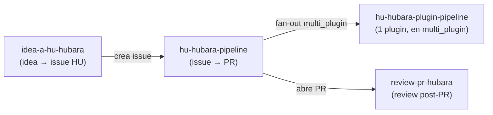

# Pipelines Archon de Hubara — documentación de referencia

Documentación **al detalle, nodo por nodo y conexión por conexión**, de los 4 workflows Archon que conforman el pipeline de Hubara. Pensada como base para **mejorar** estos pipelines y como **plantilla** para pipelines nuevos.

## Cómo usar esta carpeta

- **[`index.html`](./index.html)** — visor **interactivo** (abrí el archivo en el navegador). Grafo navegable por pipeline: zoom/pan, click en un nodo para ver su detalle completo, highlight de conexiones, búsqueda, tinte por fase, y un overview comparativo. Funciona offline (sin internet).
- **`<pipeline>.md`** — referencia **estática detallada** por pipeline: mapa de fases, tabla de nodos, cada nodo en detalle, tabla de conexiones, notas de verificación y un recorrido narrativo.
- **`data/<pipeline>.json`** — el modelo estructurado verificado (fuente de los dos anteriores).
- **`data.js`** — el mismo modelo empaquetado para el visor.

## Los 4 pipelines

| Pipeline | Rol | Nodos | Conexiones | Fases |
|----------|-----|:-----:|:----------:|:-----:|
| **[`hu-hubara-pipeline`](./hu-hubara-pipeline.md)** | Super-pipeline AUTOMATIZADO end-to-end para una HU de AgencyHubara (plugin system: DEHA backend + FSD frontend + Temporal workers). Toma un input (GitHub issue URL, ruta .md local, texto plano, o HU_ID existente para resume), lo refina técnicamente, planifica plugin-level, implementa (single-plugin inline via sub-pipeline / multi-plugin fan-out MANUAL con approval), corre validación final consolidada de ambos stacks con scope-detection, pasa 3 gates pre-PR (premortem self-review, evaluator rubric, multi-agent code-review de 5 specialists paralelos), crea 1 PR consolidado contra main (reusa si existe), archiva los artefactos + mergea spec-deltas, y dispara el review automático en background. Es el NIVEL A (plugin-level); delega el feature-level a hu-hubara-plugin-pipeline (NIVEL B). 77 nodos. NINGÚN gate aplica fixes — premortem/evaluator/review delegan al implementer vía loop; estados ambiguos cancelan visiblemente (anti-merge-silencioso). VERIFICACIÓN INDEPENDIENTE: el modelo del primer pass es estructuralmente CORRECTO (los 77 nodos, depends_on, when, trigger_rule y edges coinciden con el YAML); los únicos defectos estaban en sus verification_notes (conteos auto-contradictorios), corregidos acá. | 77 | 115 | 11 |
| **[`hu-hubara-plugin-pipeline`](./hu-hubara-plugin-pipeline.md)** | Sub-pipeline that runs inside ONE plugin's worktree. Given "<HU_ID> <plugin_id>", it does a detached-HEAD checkout of origin/hu/<HU_ID>, stages that plugin's slice of the orchestrator-committed plugin-manifest (plugin-work.yaml), runs the feature-planner skill (interactive, max 2 iter) to produce a feature-level DAG (feature-plan-manifest.yaml + tareas/F<NN>-*.md), validates it deterministically (shape, F-id format, task-file existence, cap of 12), commits+pushes the plan to HEAD:<BRANCH>, then loops the implementer skill SEQUENTIALLY (max 50 iter, fresh_context) where a large until_bash is the real controller: re-runs pytest + pytest -m architecture + lint-imports + render-compose drift + npm test/test:arch/tsc/build + Playwright (with a backgrounded FastAPI on a random free port) per task, commits+pushes each passed task to HEAD:<BRANCH>, handles det-retries (max 2) and transient retries (max 1), and on permanent failure writes pipeline-error.yaml and exits 0. Finally it computes the plugin's authoritative status with a strict completeness check (planned-vs-produced result files; passed_with_warnings counts as passing) and writes+commits+pushes plugin-<id>-result.yaml for the orchestrator to aggregate, then prints a summary box. | 17 | 20 | 4 |
| **[`review-pr-hubara`](./review-pr-hubara.md)** | POST-PR automated, NON-BLOCKING code review of PRs produced by hu-hubara-pipeline (or invoked manually on any PR URL). Bootstraps by validating the URL, checking prereqs, fetching the PR via gh, checking out its head branch (full checkout, not detached), and computing the merge-base diff vs origin/base. A haiku classifier loop decides which of 5 specialist review agents to run (deha-compliance, fsd-compliance, plugin-system, test-coverage[always], security). The 5 agents run in parallel, each as a loop node that Reads only its relevant hubara-architecture-guide sections and emits findings-<agent>.yaml. A synthesize loop node consolidates all findings into review-report.md, auto-fix-plan.yaml (CRITICAL/HIGH only), and merge-decision.yaml. An auto-fix bash node applies each fix patch, runs its verifier test, and reverts (git checkout HEAD -- file) any fix that breaks tests. Surviving fixes are committed/pushed to the PR branch. Finally it posts a consolidated informational comment to the PR and best-effort sets the GitHub Project status to 'Reviewing'. The comment does NOT block merge — the operator decides whether to merge or iterate. | 20 | 28 | 6 |
| **[`idea-a-hu-hubara`](./idea-a-hu-hubara.md)** | Entry-point del pipeline hubara. Toma una idea de negocio en texto libre (o ruta a un .md corto, o texto pegado de un issue) y, en UNA sola pasada de AI (sin loop de refinamiento), la convierte en una HU narrativa de PRODUCTO bien formada (# Título ≤80 chars + Como/Quiero/Para + ## Acceptance criteria Given/When/Then + ## Out of scope + ## Notas técnicas opcional). Valida la estructura del draft determinísticamente, lo persiste a hubara_agency/.hubara/drafts/idea-<ts>.md, publica un Issue en GitHub con label `hubara-hu`, lo agrega al GitHub Project board con status \"Idea refined\" (si existe .archon/github-project-config.yaml), y presenta UNA única approval gate explícita: ¿lanzar `hu-hubara-pipeline` ahora en background? APROBAR dispara el super-orquestador via nohup/disown fire-and-forget; RECHAZAR termina dejando el Issue + card listos para lanzar a mano. NO produce el refinement TÉCNICO (14 secciones + §0 plugin classification) — eso lo hace el pipeline real (hu-hubara-pipeline). Este workflow solo produce la HU narrativa de producto. worktree.enabled: false — no crea branch ni HU_ID; el único side-effect en el working tree es save-draft. | 14 | 19 | 7 |

### Cómo encajan

## Metodología (por qué confiar en estos datos)

Cada pipeline se modeló con un workflow multi-agente en 3 etapas por archivo:

1. **Extracción** — un agente lee el YAML completo y emite un modelo estructurado (nodos, aristas, fases, condiciones `when` verbatim).
2. **Verificación adversarial** — un segundo agente **vuelve a leer el YAML desde cero**, reconstruye su propio modelo, lo contrasta contra el de la etapa 1 y emite la versión **autoritativa corregida** + las discrepancias encontradas (ver `verification_notes` en cada doc).
3. **Narrativa** — un tercer agente escribe el recorrido fase por fase, anclado al modelo verificado.

> La fuente de verdad es siempre el YAML vivo. Si un YAML cambia, regenerá con `node gen.mjs` tras actualizar `data/<id>.json`.

## Convenciones del modelo

- **Nodo**: `id`, `type` (bash / script / command / skills / manual / sub-workflow), `depends_on`, `trigger_rule` (`all_success` por defecto · `all_done` · `one_success`), `when` (condición de guarda), `produces` (qué emite), `loop`, flags `is_gate` / `is_cancel`.
- **Arista**: un par `depends_on → nodo`. `condition` = el `when` que gobierna al destino. `kind` ∈ {sequence, gate, cancel, loop-back, fan-out, fan-in}.
- **Gate**: nodo cuyo valor de salida enruta la cadena (continuar vs cancelar).
- **Silent-hole**: estado de salida de un gate que no matchea ni un `when` de continuar ni uno de cancelar → la cadena downstream se skipea en silencio. Clase de bug recurrente; señalada en las notas.
