# hu-hubara-pipeline — MAIN end-to-end HU orchestrator (NIVEL A, plugin-level DAG)

> **`hu-hubara-pipeline.yaml`** · 77 nodos · 115 conexiones · 11 fases
> 
> Generado por extracción + **verificación adversarial** (doble lectura independiente del YAML). Fuente de verdad: el YAML. Visor interactivo: [`index.html`](./index.html).

## Propósito

Super-pipeline AUTOMATIZADO end-to-end para una HU de AgencyHubara (plugin system: DEHA backend + FSD frontend + Temporal workers). Toma un input (GitHub issue URL, ruta .md local, texto plano, o HU_ID existente para resume), lo refina técnicamente, planifica plugin-level, implementa (single-plugin inline via sub-pipeline / multi-plugin fan-out MANUAL con approval), corre validación final consolidada de ambos stacks con scope-detection, pasa 3 gates pre-PR (premortem self-review, evaluator rubric, multi-agent code-review de 5 specialists paralelos), crea 1 PR consolidado contra main (reusa si existe), archiva los artefactos + mergea spec-deltas, y dispara el review automático en background. Es el NIVEL A (plugin-level); delega el feature-level a hu-hubara-plugin-pipeline (NIVEL B). 77 nodos. NINGÚN gate aplica fixes — premortem/evaluator/review delegan al implementer vía loop; estados ambiguos cancelan visiblemente (anti-merge-silencioso). VERIFICACIÓN INDEPENDIENTE: el modelo del primer pass es estructuralmente CORRECTO (los 77 nodos, depends_on, when, trigger_rule y edges coinciden con el YAML); los únicos defectos estaban en sus verification_notes (conteos auto-contradictorios), corregidos acá.

**Trigger / invocación:** `archon workflow run hu-hubara-pipeline "<input>" donde <input> = $ARGUMENTS / $USER_MESSAGE es UNO de: URL GitHub issue (^https://github.com/<owner>/<repo>/issues/<N>$, debe estar OPEN), ruta a un .md local existente con la HU, texto plano, o un HU_ID existente (^HU-[0-9]{8}-[0-9]{4,6}-.+ para smart-resume). CRITICAL: toma SOLO 1 token lógico — pasar el formato del SUB-pipeline ("<HU_ID> <plugin>") contamina el HU_ID con un espacio; gen-hu-id lo rechaza con valid:'false' (gotcha #10, run 38d8223e). Override env vars: MAX_PLUGINS_PER_HU=N (cap plugins en validate-plan, default 8), FORCE_ALL_GATES=1 (corre todos los gates de final-validation ignorando scope detection vs origin/main), ARCH_EVAL_OVERRIDE=1 (mencionado SOLO como hint en cancel-on-eval-block; ningún nodo lo lee — el "override" real es desactivar el nodo manualmente). worktree.enabled=true; provider claude; model sonnet; interactive false (pero rama-B-wait-fan-out-done es un approval node que espera input igual).`

**Inputs:** `$ARGUMENTS / $USER_MESSAGE — input crudo (issue URL | ruta .md | texto plano | HU_ID resume)`, `$ARTIFACTS_DIR — dir de artefactos del run (substituido literal + env var real en bash nodes)`, `$WORKFLOW_ID — id del run (substitución literal)`, `Env: MAX_PLUGINS_PER_HU (default 8; leído por validate-plan)`, `Env: FORCE_ALL_GATES (default 0; leído por final-validation para forzar todos los gates)`, `Env: ARCH_EVAL_OVERRIDE (mencionado como hint en cancel-on-eval-block; ningún nodo lo lee)`, `hubara_agency/.hubara/spinal-files.yaml (convención, copiada a artifacts por stage-shared-files)`, `hubara_agency/.hubara/project-context.md (convención, copiada a artifacts)`, `.archon/github-project-config.yaml (opcional — habilita GitHub Project sync fail-soft)`, `Smart-resume reads: hubara_agency/.hubara/refinements/<HU_ID>-tech.md (detect-resume-state, load-refinement-if-resume), plans/<HU_ID>/plugin-manifest.yaml (detect-resume-state, load-plan-if-resume)`, `Per-plugin results escritos por sub-pipelines: hubara_agency/.hubara/results/<HU_ID>/plugin-<id>-result.yaml + feature-results/<plugin>/task-result.yaml`

## Lógica global, invariantes y env vars

MODE DETECTION: el plugin-planner emite mode en plugin-manifest.yaml ∈ {single_plugin, multi_plugin, no_work, blocked}. classify-mode (bash + python3 heredoc) re-lee el manifest commiteado y emite JSON {mode, plugins[], batches[{id,plugins}], requires_merger (de totals.requires_merger), single_plugin_id (plugins[0] si single)}. RAMA A (single_plugin): rama-A-single-plugin-inline invoca el sub-pipeline hu-hubara-plugin-pipeline "<HU_ID> <plugin>" INLINE (env -u CLAUDECODE, espera rc, log a file), luego git fetch + merge --ff-only origin/$BRANCH + valida plugin-<id>-result.yaml status ∈ {passed, passed_with_warnings}. RAMA B (multi_plugin): rama-B-print-fan-out-commands imprime 1 comando por plugin del PRIMER batch (solo 1 batch soportado, comentario L1347-1351) + escribe .current-batch-plugins; rama-B-wait-fan-out-done es un approval node (espera "ready"/"abort"); rama-B-merge-batch ff-mergea + valida cada plugin-result (MISSING/FAILED→FAIL_BATCH_INCOMPLETE, passed_with_warnings continuable); rama-B-invoke-merger-if-shared corre command hubara-merge-intents si requires_merger=='true'; rama-B-commit-merger commitea spinal files consolidados (pull --rebase + retry). KEY ENV/VARS: HU_ID (de gen-hu-id, validado por regex ^HU-\d{8}-\d{4,6}-[a-z0-9][a-z0-9-]*$); BRANCH=hu/<HU_ID>; ARTIFACTS_DIR; WORKFLOW_ID. BRANCH STRATEGY: setup-branch usa git checkout --detach origin/$BRANCH (HEAD detached para sobrevivir worktrees stale + multi-worktree concurrency, gotcha #9 + run 710e0eb6); branch fresh = git push origin origin/main:refs/heads/$BRANCH; TODOS los pushes posteriores usan git push origin HEAD:$BRANCH; concurrencia entre pushes vía pull --rebase + retry. SMART-RESUME: detect-resume-state chequea refinement/plan commiteados → skipea FASE 1/2 vía gate-can-plan + when conditions. INVARIANTES RUN-WIDE: (1) cada cancel- node de fallo tiene un dump-on-cancel-* gemelo que corre ANTES (cancel depends_on el dump, dump depends_on el check/gate) para capturar diagnostic-bundle.yaml — EXCEPCIÓN: cancel-on-premortem-missing y cancel-on-review-missing NO tienen dump gemelo (cancelan directo desde el check node); (2) bash gate nodes emiten stdout SINGLE-LINE canónico (diagnostics a stderr) porque downstream usa strict == (gotchas #7/#8); (3) assignments de output refs en gate bash nodes (gate-can-plan, gate-plan-verdict) van SIN dquotes en el RHS por el shellQuote single-quote wrapping (AP=$node.output, no AP="$node.output", gotcha #7, run cadd3d61); (4) NINGÚN gate aplica fixes — premortem/evaluator/review delegan al implementer vía loop con $LOOP_USER_INPUT, deferred complex → cancel visible; (5) project-set-* nodes son fail-soft (trigger_rule all_done, escriben skipped si no hay CFG; awk -F: + gsub para keys con em-dash); (6) los estados-agujero (PM_MISSING, CR_MISSING, PR_RESULT_MISSING/PR_UNKNOWN, RV_RESULT_MISSING/REVIEW_UNKNOWN, EVAL_MISSING/EVAL_UNKNOWN) ahora cancelan fuerte; SOLO el valor "happy" (PM_CLEAN/PR_RESOLVED, EVAL_PASS|WARN, REVIEW_CLEAN/REVIEW_RESOLVED) continúa.

## Mapa de fases

```mermaid
flowchart LR
  P0["FASE 0 — Bootstrap prereqs + input + branch…\n(13 nodos)"]
  P1["FASE 1 — Refinar técnico\n(8 nodos)"]
  P2["FASE 2 — Plan plugin-level\n(9 nodos)"]
  P3["FASE 3 — Implementación rama A single /…\n(11 nodos)"]
  P4["FASE 4 — Validación final consolidada\n(6 nodos)"]
  P5["FASE 4.5 — Premortem self-review gate\n(7 nodos)"]
  P6["FASE 4.6 — Pre-PR evaluation gate\n(4 nodos)"]
  P7["FASE 4.7 — Multi-agent code review gate\n(12 nodos)"]
  P8["FASE 5 — PR + Project Done\n(3 nodos)"]
  P9["FASE 5.5 — Archive + spec deltas\n(2 nodos)"]
  P10["FASE 6 — Trigger review + summary\n(2 nodos)"]
  P0 --> P1
  P1 --> P2
  P2 --> P3
  P3 --> P4
  P4 --> P5
  P5 --> P6
  P6 --> P7
  P7 --> P8
  P8 --> P9
  P9 --> P10
```




> ℹ️ El grafo completo (77 nodos) es demasiado grande para renderizar inline. Abrí [`index.html`](./index.html) para verlo navegable.

## Tabla de nodos (referencia rápida)

| # | Nodo | Tipo | Flags | depends_on | when |
|---|------|------|-------|-----------|------|
| 1 | `check-prereqs` | bash | ◆gate | — | — |
| 2 | `cancel-bad-prereqs` | manual | ✕cancel | `dump-on-cancel-bad-prereqs` | `$check-prereqs.output != 'OK'` |
| 3 | `dump-on-cancel-bad-prereqs` | bash | — | `check-prereqs` | `$check-prereqs.output != 'OK'` |
| 4 | `stage-shared-files` | bash | — | `check-prereqs` | `$check-prereqs.output == 'OK'` |
| 5 | `resolve-input` | bash | ◆gate | `stage-shared-files` | — |
| 6 | `dump-on-cancel-bad-input` | bash | — | `resolve-input` | `$resolve-input.output.type == 'error'` |
| 7 | `cancel-bad-input` | manual | ✕cancel | `dump-on-cancel-bad-input` | `$resolve-input.output.type == 'error'` |
| 8 | `gen-hu-id` | script | ◆gate | `resolve-input` | — |
| 9 | `dump-on-cancel-bad-hu-id` | bash | — | `gen-hu-id` | `$gen-hu-id.output.valid == 'false'` |
| 10 | `cancel-bad-hu-id` | manual | ✕cancel | `dump-on-cancel-bad-hu-id` | `$gen-hu-id.output.valid == 'false'` |
| 11 | `setup-branch` | bash | — | `gen-hu-id` | `$gen-hu-id.output.valid == 'true'` |
| 12 | `detect-resume-state` | bash | ◆gate | `setup-branch` | — |
| 13 | `project-set-refining` | bash | — | `setup-branch` | — |
| 14 | `load-refinement-if-resume` | bash | — | `detect-resume-state` | — |
| 15 | `refinar-auto` | skills | ↻loop | `load-refinement-if-resume`, `project-set-refining` | `$detect-resume-state.output.already_refined != 'true'` |
| 16 | `validate-refinement` | bash | ◆gate | `refinar-auto`, `load-refinement-if-resume` | — |
| 17 | `dump-on-cancel-bad-refinement` | bash | — | `validate-refinement` | `$validate-refinement.output != 'PASS' && $validate-refinement.output != 'PASS_NO_WORK'` |
| 18 | `cancel-bad-refinement` | manual | ✕cancel | `dump-on-cancel-bad-refinement` | `$validate-refinement.output != 'PASS' && $validate-refinement.output != 'PASS_NO_WORK'` |
| 19 | `commit-refinement` | bash | — | `validate-refinement` | `$validate-refinement.output == 'PASS' \|\| $validate-refinement.output == 'PASS_NO_WORK'` |
| 20 | `post-refinement-comment-to-issue` | bash | — | `commit-refinement` | `$commit-refinement.output == 'committed' \|\| $commit-refinement.output == 'no_changes'` |
| 21 | `project-set-refined` | bash | — | `commit-refinement` | — |
| 22 | `load-plan-if-resume` | bash | — | `commit-refinement` | — |
| 23 | `gate-can-plan` | bash | ◆gate | `detect-resume-state`, `validate-refinement`, `load-plan-if-resume` | — |
| 24 | `planificar-auto` | skills | ↻loop | `load-plan-if-resume`, `project-set-refined`, `gate-can-plan` | `$gate-can-plan.output == 'CAN_PLAN'` |
| 25 | `validate-plan` | bash | ◆gate | `planificar-auto`, `load-plan-if-resume` | — |
| 26 | `gate-plan-verdict` | bash | ◆gate | `validate-plan` | — |
| 27 | `dump-on-cancel-bad-plan` | bash | — | `validate-plan`, `gate-plan-verdict` | `$gate-plan-verdict.output == 'FAIL'` |
| 28 | `cancel-bad-plan` | manual | ✕cancel | `dump-on-cancel-bad-plan`, `gate-plan-verdict` | `$gate-plan-verdict.output == 'FAIL'` |
| 29 | `commit-plan` | bash | — | `validate-plan`, `gate-plan-verdict` | `$gate-plan-verdict.output == 'PASS'` |
| 30 | `project-set-planned` | bash | — | `commit-plan` | — |
| 31 | `project-set-implementing` | bash | — | `project-set-planned` | — |
| 32 | `classify-mode` | bash | ◆gate | `commit-plan` | — |
| 33 | `prewarm-uv-venv` | bash | — | `commit-plan`, `project-set-implementing` | — |
| 34 | `rama-A-single-plugin-inline` | bash | ◆gate | `classify-mode`, `prewarm-uv-venv` | `$classify-mode.output.mode == 'single_plugin'` |
| 35 | `rama-B-print-fan-out-commands` | bash | — | `classify-mode`, `prewarm-uv-venv` | `$classify-mode.output.mode == 'multi_plugin'` |
| 36 | `rama-B-wait-fan-out-done` | manual | — | `rama-B-print-fan-out-commands` | `$classify-mode.output.mode == 'multi_plugin'` |
| 37 | `rama-B-merge-batch` | bash | ◆gate | `rama-B-wait-fan-out-done` | `$classify-mode.output.mode == 'multi_plugin'` |
| 38 | `rama-B-invoke-merger-if-shared` | command | — | `rama-B-merge-batch` | `$classify-mode.output.mode == 'multi_plugin' && $classify-mode.output.requires_merger == 'true' && $rama-B-merge-batch.output == 'BATCH_OK'` |
| 39 | `rama-B-commit-merger` | bash | — | `rama-B-invoke-merger-if-shared` | `$classify-mode.output.mode == 'multi_plugin' && $rama-B-merge-batch.output == 'BATCH_OK'` |
| 40 | `dump-on-cancel-multi-plugin-failure` | bash | — | `rama-B-merge-batch` | `$classify-mode.output.mode == 'multi_plugin' && $rama-B-merge-batch.output != 'BATCH_OK'` |
| 41 | `cancel-on-multi-plugin-failure` | manual | ✕cancel | `dump-on-cancel-multi-plugin-failure` | `$classify-mode.output.mode == 'multi_plugin' && $rama-B-merge-batch.output != 'BATCH_OK'` |
| 42 | `check-pipeline-error` | bash | ◆gate | `rama-A-single-plugin-inline`, `rama-B-merge-batch`, `rama-B-commit-merger` | — |
| 43 | `dump-on-cancel-implement-error` | bash | — | `check-pipeline-error` | `$check-pipeline-error.output == 'HAS_ERROR'` |
| 44 | `cancel-on-implement-error` | manual | ✕cancel | `dump-on-cancel-implement-error` | `$check-pipeline-error.output == 'HAS_ERROR'` |
| 45 | `final-validation` | bash | ◆gate | `check-pipeline-error` | `$check-pipeline-error.output == 'OK'` |
| 46 | `dump-on-cancel-final-validation-fail` | bash | — | `final-validation` | `$final-validation.output != 'PASS'` |
| 47 | `cancel-on-final-validation-fail` | manual | ✕cancel | `dump-on-cancel-final-validation-fail` | `$final-validation.output != 'PASS'` |
| 48 | `premortem-self-review` | command | — | `final-validation` | `$final-validation.output == 'PASS'` |
| 49 | `check-premortem-clean` | bash | ◆gate | `premortem-self-review` | — |
| 50 | `cancel-on-premortem-missing` | manual | ✕cancel | `check-premortem-clean` | `$check-premortem-clean.output == 'PM_MISSING'` |
| 51 | `loop-implementer-resolves-premortem` | skills | ↻loop | `check-premortem-clean` | `$check-premortem-clean.output == 'PM_HAS_ISSUES'` |
| 52 | `check-premortem-resolved` | bash | ◆gate | `loop-implementer-resolves-premortem` | — |
| 53 | `dump-on-cancel-premortem-blocked` | bash | — | `check-premortem-resolved` | `$check-premortem-resolved.output == 'PR_BLOCKED' \|\| $check-premortem-resolved.output == 'PR_BROKEN' \|\| $check-premortem-resolved.output == 'PR_RESULT_MISSING' \|\| $check-premortem-resolved.output == 'PR_UNKNOWN'` |
| 54 | `cancel-on-premortem-blocked` | manual | ✕cancel | `dump-on-cancel-premortem-blocked` | `$check-premortem-resolved.output == 'PR_BLOCKED' \|\| $check-premortem-resolved.output == 'PR_BROKEN' \|\| $check-premortem-resolved.output == 'PR_RESULT_MISSING' \|\| $check-premortem-resolved.output == 'PR_UNKNOWN'` |
| 55 | `evaluate-pre-pr` | command | — | `check-premortem-clean`, `check-premortem-resolved` | `$check-premortem-clean.output == 'PM_CLEAN' \|\| $check-premortem-resolved.output == 'PR_RESOLVED'` |
| 56 | `gate-evaluator-verdict` | bash | ◆gate | `evaluate-pre-pr` | — |
| 57 | `dump-on-cancel-eval-block` | bash | — | `gate-evaluator-verdict` | `$gate-evaluator-verdict.output == 'EVAL_BLOCK' \|\| $gate-evaluator-verdict.output == 'EVAL_MISSING' \|\| $gate-evaluator-verdict.output == 'EVAL_UNKNOWN'` |
| 58 | `cancel-on-eval-block` | manual | ✕cancel | `dump-on-cancel-eval-block` | `$gate-evaluator-verdict.output == 'EVAL_BLOCK' \|\| $gate-evaluator-verdict.output == 'EVAL_MISSING' \|\| $gate-evaluator-verdict.output == 'EVAL_UNKNOWN'` |
| 59 | `review-deha` | command | — | `gate-evaluator-verdict` | `$gate-evaluator-verdict.output == 'EVAL_PASS' \|\| $gate-evaluator-verdict.output == 'EVAL_WARN'` |
| 60 | `review-fsd` | command | — | `gate-evaluator-verdict` | `$gate-evaluator-verdict.output == 'EVAL_PASS' \|\| $gate-evaluator-verdict.output == 'EVAL_WARN'` |
| 61 | `review-plugin-system` | command | — | `gate-evaluator-verdict` | `$gate-evaluator-verdict.output == 'EVAL_PASS' \|\| $gate-evaluator-verdict.output == 'EVAL_WARN'` |
| 62 | `review-test-coverage` | command | — | `gate-evaluator-verdict` | `$gate-evaluator-verdict.output == 'EVAL_PASS' \|\| $gate-evaluator-verdict.output == 'EVAL_WARN'` |
| 63 | `review-security` | command | — | `gate-evaluator-verdict` | `$gate-evaluator-verdict.output == 'EVAL_PASS' \|\| $gate-evaluator-verdict.output == 'EVAL_WARN'` |
| 64 | `synthesize-review` | command | — | `review-deha`, `review-fsd`, `review-plugin-system`, `review-test-coverage`, `review-security` | `$gate-evaluator-verdict.output == 'EVAL_PASS' \|\| $gate-evaluator-verdict.output == 'EVAL_WARN'` |
| 65 | `check-review-clean` | bash | ◆gate | `synthesize-review` | — |
| 66 | `cancel-on-review-missing` | manual | ✕cancel | `check-review-clean` | `$check-review-clean.output == 'CR_MISSING'` |
| 67 | `loop-implementer-resolves-review` | skills | ↻loop | `check-review-clean` | `$check-review-clean.output == 'REVIEW_HAS_BLOCKERS' \|\| $check-review-clean.output == 'REVIEW_HAS_MINOR'` |
| 68 | `check-review-resolved` | bash | ◆gate | `loop-implementer-resolves-review` | — |
| 69 | `dump-on-cancel-review-blocked` | bash | — | `check-review-resolved` | `$check-review-resolved.output == 'REVIEW_BLOCKED' \|\| $check-review-resolved.output == 'REVIEW_BROKEN' \|\| $check-review-resolved.output == 'RV_RESULT_MISSING' \|\| $check-review-resolved.output == 'REVIEW_UNKNOWN'` |
| 70 | `cancel-on-review-blocked` | manual | ✕cancel | `dump-on-cancel-review-blocked` | `$check-review-resolved.output == 'REVIEW_BLOCKED' \|\| $check-review-resolved.output == 'REVIEW_BROKEN' \|\| $check-review-resolved.output == 'RV_RESULT_MISSING' \|\| $check-review-resolved.output == 'REVIEW_UNKNOWN'` |
| 71 | `build-pr-body` | script | — | `check-review-clean`, `check-review-resolved` | `$check-review-clean.output == 'REVIEW_CLEAN' \|\| $check-review-resolved.output == 'REVIEW_RESOLVED'` |
| 72 | `create-pr` | bash | ◆gate | `build-pr-body` | `$final-validation.output == 'PASS'` |
| 73 | `project-set-done` | bash | — | `create-pr` | — |
| 74 | `archive-hu` | command | — | `create-pr` | `$create-pr.output != 'FAIL_PR_URL_NOT_PARSEABLE'` |
| 75 | `commit-archive` | bash | — | `archive-hu` | — |
| 76 | `trigger-review` | bash | — | `create-pr` | — |
| 77 | `print-final-summary` | bash | — | `trigger-review`, `project-set-done`, `commit-archive` | — |

## Nodos en detalle (por fase)

### Fase · FASE 0 — Bootstrap (prereqs + input + branch + smart-resume)

_Verifica prerequisitos (gh auth, 8 herramientas, convenciones, 4 skills + guide, 10 commands, 2 workflows, lock files, npm ci, origin, protected files limpios vs origin/main, scope project), stagea shared files, resuelve el input a tipo+title+body, genera/valida el HU_ID con regex, crea/resumea la branch hu/<HU_ID> en detached HEAD, detecta estado de resume y marca el Project en Refining._

#### `check-prereqs`  —  ◆gate

- **Tipo:** bash
- **Resumen:** Verifica todos los prerequisitos del pipeline; emite OK o FAIL_*
- **Detalle:** Chequea gh auth, 8 herramientas (node/npm/bun/jq/git/curl/uv/python3), 2 convenciones commiteadas (spinal-files.yaml, project-context.md), 4 skills hubara-*-archon (tech-refiner/plugin-planner/feature-planner/implementer) + guide skill, 10 commands hubara-* (merge-intents/premortem/evaluate/5 reviewers/synthesize-review/archive-hu), 2 workflows, lock files (uv.lock root o hubara_agency, package-lock), npm ci si falta node_modules, remote origin, y detecta protected files modificados/untracked vs origin/main. Si project config existe valida scope. Emite a stdout 'OK' o el primer 'FAIL_<code>'; SIEMPRE exit 0 (routing por el when downstream). timeout 180000.
- **depends_on:** _(raíz)_
- **trigger_rule:** `all_success`
- **produces:** output: OK | FAIL_GH_AUTH | FAIL_NO_<TOOL> | FAIL_MISSING_CONVENTION_* | FAIL_MISSING_SKILL_* | FAIL_MISSING_GUIDE_SKILL | FAIL_MISSING_COMMAND_* | FAIL_MISSING_WORKFLOW_* | FAIL_NO_UV_LOCK | FAIL_NO_NPM_LOCK | FAIL_NPM_CI | FAIL_NO_ORIGIN_OR_NETWORK | FAIL_DIRTY_PROTECTED_FILES | FAIL_GH_NO_PROJECT_SCOPE
- **lo siguen:** `dump-on-cancel-bad-prereqs`, `stage-shared-files`
- **⚠️ notas:** Único nodo con depends_on vacío (START). Exit 0 incluso en fallo (fail-closed via when). DIRTY_PROTECTED detection es load-bearing: Archon copia .archon/ al worktree y el meta-gate final falla si main local tiene cambios sin commit en protected paths.

#### `dump-on-cancel-bad-prereqs`

- **Tipo:** bash
- **Resumen:** Dump forense de diagnostics antes de cancelar por prereqs
- **Detalle:** Invoca hubara_agency/.hubara/dump-pipeline-diagnostics.sh con CANCEL_NODE=cancel-bad-prereqs, CANCEL_REASON=output de check-prereqs, PHASE=check-prereqs, HU_ID=unknown. Genera diagnostic-bundle.yaml. Corre solo cuando check-prereqs != OK.
- **depends_on:** `check-prereqs`
- **trigger_rule:** `all_success`
- **when:** `$check-prereqs.output != 'OK'`
- **produces:** diagnostic-bundle.yaml (side effect)
- **lo siguen:** `cancel-bad-prereqs`
- **⚠️ notas:** Patrón dump-before-cancel: cancel-bad-prereqs depends_on ESTE nodo.

#### `cancel-bad-prereqs`  —  ✕cancel

- **Tipo:** manual
- **Resumen:** Cancela el run con tabla de diagnóstico de prereqs
- **Detalle:** Nodo cancel: aborta imprimiendo el output de check-prereqs + tabla de decodificación (FAIL_GH_AUTH→gh auth login, etc.) + puntero al diagnostic-bundle.yaml. Solo cuando check-prereqs != OK.
- **depends_on:** `dump-on-cancel-bad-prereqs`
- **trigger_rule:** `all_success`
- **when:** `$check-prereqs.output != 'OK'`
- **produces:** run cancelado
- **⚠️ notas:** Terminal (→END). depends_on el DUMP (no check-prereqs directo) — invierte el orden para capturar diagnostics antes de abortar.

#### `stage-shared-files`

- **Tipo:** bash
- **Resumen:** Copia spinal-files.yaml + project-context.md a artifacts; detecta Project config
- **Detalle:** cp de spinal-files.yaml y project-context.md a $ARTIFACTS_DIR. Si .archon/github-project-config.yaml existe lo copia y emite PROJECT_ENABLED, si no PROJECT_DISABLED. set -e. Solo si check-prereqs==OK.
- **depends_on:** `check-prereqs`
- **trigger_rule:** `all_success`
- **when:** `$check-prereqs.output == 'OK'`
- **produces:** output: PROJECT_ENABLED | PROJECT_DISABLED; copia archivos a artifacts
- **lo siguen:** `resolve-input`
- **⚠️ notas:** PROJECT_ENABLED/DISABLED NO se consume por when downstream; los project-set-* re-chequean la existencia del CFG en artifacts.

#### `resolve-input`  —  ◆gate

- **Tipo:** bash
- **Resumen:** Clasifica el input crudo a tipo (issue/resume/file/text) + extrae title/body
- **Detalle:** Lee $ARGUMENTS. Si vacío → {type:error,error:empty_input}. Regex: issue URL → gh issue view (valida state OPEN, else issue_not_open), ^HU-[0-9]{8}-[0-9]{4,6}-.+ → hu_id_resume (hu_id_override), archivo existente → local_file (title del primer # heading), else plain_text. Emite JSON con jq: {type, title, body, issue_url, hu_id_override}.
- **depends_on:** `stage-shared-files`
- **trigger_rule:** `all_success`
- **produces:** output.type in {issue_url, hu_id_resume, local_file, plain_text, error}; output.{title, body, issue_url, hu_id_override}; error con output.error in {empty_input, cannot_fetch_issue, issue_not_open}
- **lo siguen:** `dump-on-cancel-bad-input`, `gen-hu-id`
- **⚠️ notas:** output.type enrutina cancel-bad-input. El regex de resume es más laxo que el guard de gen-hu-id (que exige slug lowercase), por eso gen-hu-id re-valida.

#### `dump-on-cancel-bad-input`

- **Tipo:** bash
- **Resumen:** Dump forense antes de cancelar por input inválido
- **Detalle:** Invoca dump-pipeline-diagnostics.sh con CANCEL_NODE=cancel-bad-input, PHASE=resolve-input, HU_ID=unknown. Corre cuando resolve-input.output.type == error.
- **depends_on:** `resolve-input`
- **trigger_rule:** `all_success`
- **when:** `$resolve-input.output.type == 'error'`
- **produces:** diagnostic-bundle.yaml
- **lo siguen:** `cancel-bad-input`
- **⚠️ notas:** Lee output.field (.type) — Archon parsea el JSON stdout de resolve-input para resolver el sub-campo.

#### `cancel-bad-input`  —  ✕cancel

- **Tipo:** manual
- **Resumen:** Cancela si el input no se pudo resolver
- **Detalle:** Nodo cancel (single-line): aborta con 'No pude resolver el input' + output de resolve-input + puntero al diagnostic-bundle. Solo cuando output.type == error.
- **depends_on:** `dump-on-cancel-bad-input`
- **trigger_rule:** `all_success`
- **when:** `$resolve-input.output.type == 'error'`
- **produces:** run cancelado
- **⚠️ notas:** Terminal (→END). depends_on el dump.

#### `gen-hu-id`  —  ◆gate

- **Tipo:** script
- **Resumen:** Genera o usa HU_ID + deriva branch/paths; valida formato con regex
- **Detalle:** Script bun (runtime: bun): si type==hu_id_resume usa el override, si no construye HU-<YYYYMMDD>-<HHMMSS>-<slug> (slug NFKD-normalizado del title, slice 40). Aplica guard regex ^HU-\d{8}-\d{4,6}-[a-z0-9][a-z0-9-]*$; si falla emite {valid:'false', error:'invalid_hu_id', hu_id, hint} (hint distingue 'tiene espacios — pasaste args del sub-pipeline' vs 'no matchea formato'). Si pasa emite {valid:'true', hu_id, branch:'hu/'+huId, title, body, issue_url, type, refinement_path, original_path, plan_dir, results_dir}.
- **depends_on:** `resolve-input`
- **trigger_rule:** `all_success`
- **produces:** output.valid in {true,false} (STRING); si true: output.{hu_id, branch, title, body, issue_url, type, refinement_path, original_path, plan_dir, results_dir}; si false: output.{error, hu_id, hint}
- **lo siguen:** `dump-on-cancel-bad-hu-id`, `setup-branch`
- **⚠️ notas:** Guard load-bearing (gotcha #10, run 38d8223e): sin el regex un input '<HU_ID> <plugin>' producía branch con espacio → refspec git inválido → 30 min de run muerto. output es la fuente de HU_ID/BRANCH para TODO el pipeline (referenciado por ~30 nodos). valid es string 'true'/'false', no boolean.

#### `dump-on-cancel-bad-hu-id`

- **Tipo:** bash
- **Resumen:** Dump forense antes de cancelar por HU_ID inválido
- **Detalle:** Invoca dump-pipeline-diagnostics.sh con CANCEL_NODE=cancel-bad-hu-id, PHASE=gen-hu-id, HU_ID=invalid. Corre cuando gen-hu-id.output.valid == 'false'.
- **depends_on:** `gen-hu-id`
- **trigger_rule:** `all_success`
- **when:** `$gen-hu-id.output.valid == 'false'`
- **produces:** diagnostic-bundle.yaml
- **lo siguen:** `cancel-bad-hu-id`
- **⚠️ notas:** valid es string 'true'/'false' (no boolean) — el script lo emite como string deliberadamente para el == .

#### `cancel-bad-hu-id`  —  ✕cancel

- **Tipo:** manual
- **Resumen:** Cancela si el HU_ID es inválido
- **Detalle:** Nodo cancel (single-line): aborta con el hu_id recibido + el hint de gen-hu-id + puntero al diagnostic-bundle. Corte en segundos (gotcha #10 fix). Solo cuando valid=='false'.
- **depends_on:** `dump-on-cancel-bad-hu-id`
- **trigger_rule:** `all_success`
- **when:** `$gen-hu-id.output.valid == 'false'`
- **produces:** run cancelado
- **⚠️ notas:** Terminal (→END). Corta ANTES de tocar git (setup-branch tiene when valid=='true').

#### `setup-branch`

- **Tipo:** bash
- **Resumen:** Crea o resumea la branch hu/<HU_ID> en detached HEAD + persiste hu-original.md
- **Detalle:** git fetch origin --prune. Si la branch existe en origin: warn anti-concurrencia si último commit <300s, luego git checkout --detach origin/$BRANCH → emite RESUMED. Si no existe: git push origin origin/main:refs/heads/$BRANCH, fetch, checkout --detach → emite FRESH. Persiste hu-original.md (del ORIGINAL_PATH si resume, si no construido desde title+body). set -e. Solo si valid=='true'.
- **depends_on:** `gen-hu-id`
- **trigger_rule:** `all_success`
- **when:** `$gen-hu-id.output.valid == 'true'`
- **produces:** output: RESUMED | FRESH; crea branch en origin; hu-original.md en artifacts
- **lo siguen:** `detect-resume-state`, `project-set-refining`
- **⚠️ notas:** DETACHED HEAD load-bearing (gotcha #9 + run 710e0eb6): evita 'branch already checked out elsewhere'. TODOS los pushes posteriores usan HEAD:$BRANCH. La guard when valid=='true' evita crear hu/null.

#### `detect-resume-state`  —  ◆gate

- **Tipo:** bash
- **Resumen:** Detecta si refinement/plan ya existen commiteados (smart-resume)
- **Detalle:** Chequea existencia de refinements/<HU_ID>-tech.md y plans/<HU_ID>/plugin-manifest.yaml. Emite JSON {already_refined, already_planned} (strings 'true'/'false' vía jq --arg).
- **depends_on:** `setup-branch`
- **trigger_rule:** `all_success`
- **produces:** output.already_refined in {true,false}; output.already_planned in {true,false}
- **lo siguen:** `load-refinement-if-resume`, `gate-can-plan`
- **⚠️ notas:** Habilita smart-resume: already_refined controla el when de refinar-auto; already_planned alimenta gate-can-plan. Strings, no booleans.

#### `project-set-refining`

- **Tipo:** bash
- **Resumen:** Marca el card del Project en Refining (fail-soft)
- **Detalle:** Si no hay CFG o no hay issue_url emite skipped. Lee project_number/owner/id/status_field_id del config, busca el option id de 'Refining' con awk -F: + gsub (keys con em-dash), encuentra el item por content.url y hace gh project item-edit. Emite 'set Refining ok' o warn. trigger_rule all_done (no aborta el pipeline si falla).
- **depends_on:** `setup-branch`
- **trigger_rule:** `all_done`
- **produces:** output: skipped | warn ... | set Refining ok
- **lo siguen:** `refinar-auto`
- **⚠️ notas:** Fail-soft por trigger_rule all_done. awk -F: + gsub deliberado: keys como 'Done — PR ready' con em-dash rompen el default whitespace FS (bug 2026-05-26).

### Fase · FASE 1 — Refinar técnico

_Skill hubara-tech-refiner-archon (loop max 2) produce hu-refinada.md con 14 secciones + §0 plugin classification; validate-refinement chequea estructura, commit-refinement persiste+pushea (stdout single-line), postea comentario al issue (fail-soft) y marca Project Refined. Salta refinar-auto si smart-resume detectó refinement existente (already_refined=='true')._

#### `load-refinement-if-resume`

- **Tipo:** bash
- **Resumen:** Copia el refinement existente a artifacts si resume
- **Detalle:** Si refinements/<HU_ID>-tech.md existe lo copia a $ARTIFACTS_DIR/hu-refinada.md y emite RESUMED_REFINEMENT, si no NO_RESUME.
- **depends_on:** `detect-resume-state`
- **trigger_rule:** `all_success`
- **produces:** output: RESUMED_REFINEMENT | NO_RESUME; copia hu-refinada.md
- **lo siguen:** `refinar-auto`, `validate-refinement`
- **⚠️ notas:** Pre-puebla el artefacto para que validate-refinement lo vea aunque refinar-auto sea skipeado (resume).

#### `refinar-auto`  —  ↻loop

- **Tipo:** skills · invoca `hubara-tech-refiner-archon`
- **Resumen:** Refina técnicamente la HU (loop, skill tech-refiner)
- **Detalle:** Loop max_iterations 2 (1 try + 1 retry), until REFINER_OK, skill hubara-tech-refiner-archon. Lee hu-original.md + project-context.md + spinal-files.yaml + secciones del architecture-guide; produce hu-refinada.md con 14 secciones + §0 plugin classification. gate_message permite feedback via $LOOP_USER_INPUT. Skipea si already_refined=='true'. idle_timeout 600000, trigger_rule all_done.
- **depends_on:** `load-refinement-if-resume`, `project-set-refining`
- **trigger_rule:** `all_done`
- **when:** `$detect-resume-state.output.already_refined != 'true'`
- **produces:** promise REFINER_OK; escribe $ARTIFACTS_DIR/hu-refinada.md
- **loop:** `max_iterations:2, until:REFINER_OK`
- **lo siguen:** `validate-refinement`
- **⚠️ notas:** trigger_rule all_done permite correr aunque project-set-refining 'falle' (fail-soft). El when usa != 'true' por lo que cualquier valor distinto de 'true' corre el refiner.

#### `validate-refinement`  —  ◆gate

- **Tipo:** bash
- **Resumen:** Valida estructura del refinement (secciones + §0 + protected files)
- **Detalle:** Chequea que hu-refinada.md exista, >1000 chars, §0 plugin classification + mode. Si mode=no_refinement_needed|blocked → PASS_NO_WORK. Verifica 14 secciones canónicas (§15 opcional). Detecta protected files como files-a-modificar en §3 (heurística awk §3..§4) → FAIL_REFINEMENT_TOUCHES_PROTECTED. Emite PASS o FAIL_*. trigger_rule all_done.
- **depends_on:** `refinar-auto`, `load-refinement-if-resume`
- **trigger_rule:** `all_done`
- **produces:** output: PASS | PASS_NO_WORK | FAIL_NOT_EXISTS | FAIL_TOO_SHORT_* | FAIL_NO_PLUGIN_CLASSIFICATION | FAIL_NO_MODE | FAIL_MISSING_SECTIONS:* | FAIL_REFINEMENT_TOUCHES_PROTECTED
- **lo siguen:** `dump-on-cancel-bad-refinement`, `commit-refinement`, `gate-can-plan`
- **⚠️ notas:** trigger_rule all_done — corre aunque refinar-auto sea skipeado (resume) o agote iteraciones. Alimenta gate-can-plan (VR) y commit-refinement.

#### `dump-on-cancel-bad-refinement`

- **Tipo:** bash
- **Resumen:** Dump forense antes de cancelar por refinement inválido
- **Detalle:** Re-deriva HU_ID/ISSUE_URL del output de gen-hu-id (con fallback a unknown), invoca dump-pipeline-diagnostics.sh con PHASE=refiner. Corre cuando validate-refinement no es PASS ni PASS_NO_WORK.
- **depends_on:** `validate-refinement`
- **trigger_rule:** `all_success`
- **when:** `$validate-refinement.output != 'PASS' && $validate-refinement.output != 'PASS_NO_WORK'`
- **produces:** diagnostic-bundle.yaml
- **lo siguen:** `cancel-bad-refinement`
- **⚠️ notas:** Condición compuesta con && — el parser de Archon la soporta (sin paréntesis).

#### `cancel-bad-refinement`  —  ✕cancel

- **Tipo:** manual
- **Resumen:** Cancela si la validación del refinement falla
- **Detalle:** Nodo cancel (multi-line): aborta con el FAIL code + branch + opciones de recovery (editar manual + commit + re-lanzar para smart-resume; o ADR si toca protected). Solo cuando validate-refinement no es PASS/PASS_NO_WORK.
- **depends_on:** `dump-on-cancel-bad-refinement`
- **trigger_rule:** `all_success`
- **when:** `$validate-refinement.output != 'PASS' && $validate-refinement.output != 'PASS_NO_WORK'`
- **produces:** run cancelado
- **⚠️ notas:** Terminal (→END). depends_on el dump.

#### `commit-refinement`

- **Tipo:** bash
- **Resumen:** Commitea + pushea el refinement; stdout SINGLE-LINE para downstream ==
- **Detalle:** cp hu-refinada.md y hu-original.md a refinements/<HU_ID>-{tech,original}.md, git add (a stderr), si hay staged commit + git push origin HEAD:$BRANCH (TODO el output git a stderr), emite 'committed' o 'no_changes'. set -e. Solo cuando validate-refinement PASS o PASS_NO_WORK.
- **depends_on:** `validate-refinement`
- **trigger_rule:** `all_success`
- **when:** `$validate-refinement.output == 'PASS' || $validate-refinement.output == 'PASS_NO_WORK'`
- **produces:** output: committed | no_changes; pushea a hu/<HU_ID>
- **lo siguen:** `post-refinement-comment-to-issue`, `project-set-refined`, `load-plan-if-resume`
- **⚠️ notas:** STDOUT LIMPIO load-bearing (gotcha #8, run cadd3d61): git commit/push escupen multi-línea → si quedan en stdout, el == de post-refinement-comment falla → skip silencioso. Por eso todo va a stderr. HEAD:$BRANCH por el detached HEAD.

#### `post-refinement-comment-to-issue`

- **Tipo:** bash
- **Resumen:** Postea comentario al issue con resumen del refinement (fail-soft)
- **Detalle:** Si no hay issue_url o no existe el refinement emite skipped. Calcula stats (líneas original vs refinement, secciones, mode, spec deltas §16), construye comment markdown con links a la branch, gh issue comment --body-file. Emite comment_posted | comment_skipped | skipped. trigger_rule all_done.
- **depends_on:** `commit-refinement`
- **trigger_rule:** `all_done`
- **when:** `$commit-refinement.output == 'committed' || $commit-refinement.output == 'no_changes'`
- **produces:** output: comment_posted | comment_skipped | skipped no_issue_url | skipped no_refinement_file; comentario en el issue
- **⚠️ notas:** Fail-soft (trigger_rule all_done + gh failure no rompe). TERMINAL (→END): ningún nodo depende de él. El body del issue NO se modifica (spec inmutable); solo UN comentario por iteración.

#### `project-set-refined`

- **Tipo:** bash
- **Resumen:** Marca el Project en Refined (fail-soft)
- **Detalle:** Mismo patrón que project-set-refining pero con option 'Refined'. trigger_rule all_done. Sin when — siempre intenta (el body skipea si no hay CFG/issue_url).
- **depends_on:** `commit-refinement`
- **trigger_rule:** `all_done`
- **produces:** output: skipped | set Refined ok
- **lo siguen:** `planificar-auto`
- **⚠️ notas:** Fail-soft. Alimenta planificar-auto como dep (para serializar el Project status).

### Fase · FASE 2 — Plan plugin-level

_gate-can-plan decide CAN_PLAN/SKIP según resume+refinement (encapsula A&&(B||C) que el parser no soporta); skill hubara-plugin-planner-archon (loop max 2) produce plugin-manifest.yaml (mode + plugins[] + plugin_batches[]); validate-plan corre python3 (mode coherente, cap plugins, batches cubren todos los ids); gate-plan-verdict colapsa a PASS/FAIL (el parser no soporta regex); commit-plan persiste+pushea y marca Project Planned._

#### `load-plan-if-resume`

- **Tipo:** bash
- **Resumen:** Copia el plugin-manifest existente a artifacts si resume
- **Detalle:** Si plans/<HU_ID>/plugin-manifest.yaml existe lo copia a $ARTIFACTS_DIR/plugin-manifest.yaml y emite RESUMED_PLAN, si no NO_RESUME.
- **depends_on:** `commit-refinement`
- **trigger_rule:** `all_success`
- **produces:** output: RESUMED_PLAN | NO_RESUME; copia plugin-manifest.yaml
- **lo siguen:** `gate-can-plan`, `planificar-auto`, `validate-plan`
- **⚠️ notas:** Pre-puebla el artefacto para que validate-plan lo vea aunque planificar-auto sea skipeado (resume).

#### `gate-can-plan`  —  ◆gate

- **Tipo:** bash
- **Resumen:** Decide CAN_PLAN vs SKIP según resume + verdict del refinement
- **Detalle:** Lee AP=already_planned y VR=validate-refinement.output (SIN dquotes en RHS por shellQuote). Si AP==true → SKIP_PLAN_ALREADY_PLANNED; elif VR==PASS|PASS_NO_WORK → CAN_PLAN; else SKIP_PLAN_BAD_REFINEMENT. Encapsula A&&(B||C) que el parser no expresa con paréntesis. trigger_rule all_done. Trace a stderr.
- **depends_on:** `detect-resume-state`, `validate-refinement`, `load-plan-if-resume`
- **trigger_rule:** `all_done`
- **produces:** output: CAN_PLAN | SKIP_PLAN_ALREADY_PLANNED | SKIP_PLAN_BAD_REFINEMENT
- **lo siguen:** `planificar-auto`
- **⚠️ notas:** shellQuote gotcha (gotcha #7, run cadd3d61): AP=$detect-resume-state.output.already_planned SIN dquotes — Archon wrappea el valor en single quotes y bash quote-removal las limpia; con dquotes quedaría el literal 'false' con comillas → CAN_PLAN nunca dispararía. Bug introducido commit 135f646.

#### `planificar-auto`  —  ↻loop

- **Tipo:** skills · invoca `hubara-plugin-planner-archon`
- **Resumen:** Planifica plugin-level (loop, skill plugin-planner)
- **Detalle:** Loop max_iterations 2, until PLANNER_OK, skill hubara-plugin-planner-archon. Lee hu-refinada.md (§0) + plugin-manifest previo + spinal-files; produce plugin-manifest.yaml con mode + plugins[] (id, layers, action, depends_on, estimated_tasks) + plugin_batches[] + shared_files_intents[] si requires_merger. gate_message permite feedback. Solo si gate-can-plan==CAN_PLAN. idle_timeout 600000, trigger_rule all_done.
- **depends_on:** `load-plan-if-resume`, `project-set-refined`, `gate-can-plan`
- **trigger_rule:** `all_done`
- **when:** `$gate-can-plan.output == 'CAN_PLAN'`
- **produces:** promise PLANNER_OK; escribe $ARTIFACTS_DIR/plugin-manifest.yaml
- **loop:** `max_iterations:2, until:PLANNER_OK`
- **lo siguen:** `validate-plan`
- **⚠️ notas:** El when sobre gate-can-plan (no sobre el compound original) es el fix del shellQuote bug — si gate-can-plan emite mal, el planner se skipea silenciosamente → validate-plan FAIL_NOT_EXISTS (mensaje engañoso).

#### `validate-plan`  —  ◆gate

- **Tipo:** bash
- **Resumen:** Valida el plugin-manifest con python3 (mode, cap, batches)
- **Detalle:** Chequea existencia + >200 chars. python3 carga el YAML: mode ∈ {single_plugin,multi_plugin,no_work,blocked}; no_work→PASS_NO_WORK, blocked→PASS_BLOCKED; plugins[] no vacío y ≤ MAX_PLUGINS_PER_HU (default 8); coherencia mode↔len(plugins); plugin_batches cubren exactamente los plugin ids declarados. Emite PASS_<MODE> o FAIL_*. trigger_rule all_done.
- **depends_on:** `planificar-auto`, `load-plan-if-resume`
- **trigger_rule:** `all_done`
- **produces:** output: PASS_SINGLE_PLUGIN | PASS_MULTI_PLUGIN | PASS_NO_WORK | PASS_BLOCKED | FAIL_NOT_EXISTS | FAIL_TOO_SHORT | FAIL_INVALID_YAML | FAIL_NOT_DICT | FAIL_BAD_MODE | FAIL_NO_PLUGINS | FAIL_TOO_MANY_PLUGINS | FAIL_SINGLE_BUT_MULTIPLE | FAIL_MULTI_BUT_SINGLE | FAIL_NO_BATCHES | FAIL_BATCH_PLUGINS_MISMATCH
- **lo siguen:** `gate-plan-verdict`, `dump-on-cancel-bad-plan`, `commit-plan`
- **⚠️ notas:** trigger_rule all_done — corre aunque planificar-auto sea skipeado (resume). MAX_PLUGINS_PER_HU overrideable por env. Su output es la verdad detallada; gate-plan-verdict lo colapsa para los when downstream.

#### `gate-plan-verdict`  —  ◆gate

- **Tipo:** bash
- **Resumen:** Colapsa validate-plan a PASS|FAIL (el parser no soporta regex)
- **Detalle:** OUT=$validate-plan.output (SIN dquotes). case PASS* → PASS, else FAIL. Trace a stderr. Reemplaza el regex =~ /^PASS/ que el parser no soporta. trigger_rule default all_success.
- **depends_on:** `validate-plan`
- **trigger_rule:** `all_success`
- **produces:** output: PASS | FAIL
- **lo siguen:** `dump-on-cancel-bad-plan`, `cancel-bad-plan`, `commit-plan`
- **⚠️ notas:** shellQuote gotcha igual que gate-can-plan — SIN dquotes en el RHS. El detalle del FAIL queda en validate-plan.output. NO tiene trigger_rule line → default all_success.

#### `dump-on-cancel-bad-plan`

- **Tipo:** bash
- **Resumen:** Dump forense antes de cancelar por plan inválido
- **Detalle:** Invoca dump-pipeline-diagnostics.sh con PHASE=planner, CANCEL_REASON=validate-plan.output. Corre cuando gate-plan-verdict==FAIL.
- **depends_on:** `validate-plan`, `gate-plan-verdict`
- **trigger_rule:** `all_success`
- **when:** `$gate-plan-verdict.output == 'FAIL'`
- **produces:** diagnostic-bundle.yaml
- **lo siguen:** `cancel-bad-plan`
- **⚠️ notas:** Depende de validate-plan Y gate-plan-verdict — necesita el detalle de validate-plan para el CANCEL_REASON (2 deps).

#### `cancel-bad-plan`  —  ✕cancel

- **Tipo:** manual
- **Resumen:** Cancela si la validación del plan falla
- **Detalle:** Nodo cancel (multi-line): aborta con el FAIL code + gate trace (gate-can-plan, validate-refinement, validate-plan, gate-plan-verdict) + decodificación detallada de cada FAIL code + recovery. Solo cuando gate-plan-verdict==FAIL.
- **depends_on:** `dump-on-cancel-bad-plan`, `gate-plan-verdict`
- **trigger_rule:** `all_success`
- **when:** `$gate-plan-verdict.output == 'FAIL'`
- **produces:** run cancelado
- **⚠️ notas:** Terminal (→END). depends_on DOS nodos (dump + gate-plan-verdict). El gate trace en el mensaje es deliberado para diagnosticar el skip silencioso del planner.

#### `commit-plan`

- **Tipo:** bash
- **Resumen:** Commitea + pushea el plugin-manifest; stdout SINGLE-LINE
- **Detalle:** cp plugin-manifest.yaml a plans/<HU_ID>/, cuenta N plugins con python3, git add (a stderr), si staged commit + push origin HEAD:$BRANCH (git output a stderr), emite committed_<N> o no_changes. set -e. Solo cuando gate-plan-verdict==PASS.
- **depends_on:** `validate-plan`, `gate-plan-verdict`
- **trigger_rule:** `all_success`
- **when:** `$gate-plan-verdict.output == 'PASS'`
- **produces:** output: committed_<N> | no_changes; pushea a hu/<HU_ID>
- **lo siguen:** `project-set-planned`, `classify-mode`, `prewarm-uv-venv`
- **⚠️ notas:** STDOUT LIMPIO (mismo patrón que commit-refinement). Es el ancla de FASE 3: classify-mode, load-plan? (no), prewarm-uv-venv, project-set-planned todos dependen de commit-plan. depends_on DOS nodos (validate-plan + gate-plan-verdict).

#### `project-set-planned`

- **Tipo:** bash
- **Resumen:** Marca el Project en Planned (fail-soft)
- **Detalle:** Mismo patrón project-set con option 'Planned'. trigger_rule all_done.
- **depends_on:** `commit-plan`
- **trigger_rule:** `all_done`
- **produces:** output: skipped | set Planned ok
- **lo siguen:** `project-set-implementing`
- **⚠️ notas:** project-set-implementing depende de ESTE (no de commit-plan) para serializar Planned→Implementing y evitar race en el GitHub API (2026-05-26).

### Fase · FASE 3 — Implementación (rama A single / rama B multi-plugin)

_classify-mode bifurca: single_plugin → rama-A invoca el sub-pipeline inline; multi_plugin → rama-B imprime fan-out manual, espera approval, ff-mergea, valida cada plugin-result, corre merger de wiring_intents si shared + commitea. prewarm-uv-venv hace uv sync (+ bootstrap .env desde .env.example). cancel-on-multi-plugin-failure aborta si el batch quedó incompleto._

#### `project-set-implementing`

- **Tipo:** bash
- **Resumen:** Marca el Project en Implementing (fail-soft)
- **Detalle:** Mismo patrón project-set con option 'Implementing'. depende de project-set-planned (no commit-plan) para evitar race. trigger_rule all_done.
- **depends_on:** `project-set-planned`
- **trigger_rule:** `all_done`
- **produces:** output: skipped | set Implementing ok
- **lo siguen:** `prewarm-uv-venv`
- **⚠️ notas:** Dep serializada deliberada (2026-05-26): ambos project-set compartían commit-plan → llegaban al GitHub API en orden no determinístico. prewarm-uv-venv depende de este.

#### `classify-mode`  —  ◆gate

- **Tipo:** bash
- **Resumen:** Re-lee el manifest y emite JSON con mode/plugins/batches/requires_merger
- **Detalle:** python3 (heredoc EOF) carga plans/<HU_ID>/plugin-manifest.yaml y emite JSON {mode, plugins:[ids], batches:[{id:batch_id,plugins}], requires_merger (bool de totals.requires_merger), single_plugin_id (plugins[0] si single)}. Es el bifurcador rama A vs rama B.
- **depends_on:** `commit-plan`
- **trigger_rule:** `all_success`
- **produces:** output.mode in {single_plugin, multi_plugin, no_work, blocked, unknown}; output.{plugins, batches, requires_merger, single_plugin_id}
- **lo siguen:** `rama-A-single-plugin-inline`, `rama-B-print-fan-out-commands`
- **⚠️ notas:** GATE de bifurcación clave. requires_merger es JSON boolean → Archon lo convierte a string 'true'/'false' para los when (quotes obligatorias). Referenciado por rama-A, rama-B-*, build-pr-body, print-final-summary.

#### `prewarm-uv-venv`

- **Tipo:** bash
- **Resumen:** Pre-calienta el venv uv (uv sync) + bootstrap .env antes del fan-out
- **Detalle:** Si existe hubara_agency: si no hay .env copia .env.example→.env (Settings pydantic validan env vars al import time, worktree sin .env), luego cd hubara_agency && uv sync. Emite ok. timeout 600000, trigger_rule all_done.
- **depends_on:** `commit-plan`, `project-set-implementing`
- **trigger_rule:** `all_done`
- **produces:** output: ok; .env bootstrapped + venv sincronizado
- **lo siguen:** `rama-A-single-plugin-inline`, `rama-B-print-fan-out-commands`
- **⚠️ notas:** Bootstrap .env load-bearing (run 940be3b9): sin .env, pytest -m architecture que importa workers crashea con 'MedusaSettings: base_url Field required'. trigger_rule all_done — uv sync warnings no bloquean. depends_on DOS nodos (commit-plan + project-set-implementing).

#### `rama-A-single-plugin-inline`  —  ◆gate

- **Tipo:** bash · invoca `hu-hubara-plugin-pipeline (sub-workflow, inline)`
- **Resumen:** RAMA A: invoca el sub-pipeline inline para el único plugin + valida result
- **Detalle:** Si mode!=single_plugin → skipped. Invoca env -u CLAUDECODE archon workflow run hu-hubara-plugin-pipeline '<HU_ID> <PLUGIN_ID>' (espera, log a file). Si rc!=0 → FAIL_SUBPIPELINE. git fetch + merge --ff-only origin/$BRANCH. Valida plugin-<id>-result.yaml: status ∈ {passed, passed_with_warnings} continuable, else FAIL_PLUGIN_NOT_PASSED. Emite PASS o FAIL_*. idle_timeout/timeout 3600000.
- **depends_on:** `classify-mode`, `prewarm-uv-venv`
- **trigger_rule:** `all_success`
- **when:** `$classify-mode.output.mode == 'single_plugin'`
- **produces:** output: PASS single-plugin completed: ... | skipped | FAIL_SUBPIPELINE | FAIL_NO_PLUGIN_RESULT | FAIL_PLUGIN_NOT_PASSED
- **lo siguen:** `check-pipeline-error`
- **⚠️ notas:** Fan-out a NIVEL B inline. env -u CLAUDECODE evita nested archon-in-claude-code hang. Su PASS/FAIL lo recoge check-pipeline-error (trigger all_done). depends_on classify-mode + prewarm-uv-venv.

#### `rama-B-print-fan-out-commands`

- **Tipo:** bash
- **Resumen:** RAMA B: imprime los comandos de fan-out para el primer batch
- **Detalle:** Si mode!=multi_plugin → skipped. Toma el primer batch (batches[0].plugins via jq join), imprime un banner con un 'archon workflow run hu-hubara-plugin-pipeline "<HU_ID> <p>"' por plugin, escribe la lista a $ARTIFACTS_DIR/.current-batch-plugins. Emite OK.
- **depends_on:** `classify-mode`, `prewarm-uv-venv`
- **trigger_rule:** `all_success`
- **when:** `$classify-mode.output.mode == 'multi_plugin'`
- **produces:** output: OK | skipped; escribe .current-batch-plugins
- **lo siguen:** `rama-B-wait-fan-out-done`
- **⚠️ notas:** Solo soporta 1 batch (comentario L1347-1351): HUs con >1 batch topológico requieren re-correr el orquestador por batch. El fan-out es MANUAL (operador abre N terminales). depends_on classify-mode + prewarm-uv-venv.

#### `rama-B-wait-fan-out-done`

- **Tipo:** manual
- **Resumen:** RAMA B: approval node — espera 'ready' cuando los sub-pipelines terminen
- **Detalle:** Nodo approval (approval: con message): espera que el operador responda 'ready' cuando todos los sub-pipelines del batch hayan terminado (o 'abort'). El mensaje lista los plugins esperados (de $rama-B-print-fan-out-commands.output) y lo que el pipeline hará después (fetch+ff-merge, validar results, merger, avanzar). Solo si mode==multi_plugin.
- **depends_on:** `rama-B-print-fan-out-commands`
- **trigger_rule:** `all_success`
- **when:** `$classify-mode.output.mode == 'multi_plugin'`
- **produces:** approval: ready | abort
- **lo siguen:** `rama-B-merge-batch`
- **⚠️ notas:** ÚNICO nodo HUMAN-GATE de tipo approval del pipeline. interactive global es false pero approval nodes esperan input igual. (Los cancel nodes también son 'manual' pero abortan, no esperan.)

#### `rama-B-merge-batch`  —  ◆gate

- **Tipo:** bash
- **Resumen:** RAMA B: ff-mergea origin/$BRANCH + valida que todos los plugins del batch passed
- **Detalle:** Si mode!=multi_plugin → skipped. git fetch + merge --ff-only origin/$BRANCH (si diverge → FAIL_FF_MERGE). Por cada plugin en .current-batch-plugins valida plugin-<p>-result.yaml: missing → MISSING; passed OK; passed_with_warnings → WARNED; otro → FAILED. Si MISSING||FAILED → FAIL_BATCH_INCOMPLETE, else BATCH_OK. Detalles a stderr.
- **depends_on:** `rama-B-wait-fan-out-done`
- **trigger_rule:** `all_success`
- **when:** `$classify-mode.output.mode == 'multi_plugin'`
- **produces:** output: BATCH_OK | skipped | FAIL_FF_MERGE | FAIL_BATCH_INCOMPLETE missing=N failed=M
- **lo siguen:** `rama-B-invoke-merger-if-shared`, `dump-on-cancel-multi-plugin-failure`, `check-pipeline-error`
- **⚠️ notas:** passed_with_warnings es continuable (SKILL.md L1164). Su output enrutina rama-B-invoke-merger, rama-B-commit-merger, dump-on-cancel-multi-plugin-failure y check-pipeline-error (fan-in).

#### `rama-B-invoke-merger-if-shared`

- **Tipo:** command · invoca `hubara-merge-intents`
- **Resumen:** RAMA B: corre el merger de wiring_intents si requires_merger
- **Detalle:** Invoca command hubara-merge-intents para consolidar los shared_files_intents de los plugins del batch en los spinal files. Solo cuando mode==multi_plugin && requires_merger=='true' && rama-B-merge-batch==BATCH_OK.
- **depends_on:** `rama-B-merge-batch`
- **trigger_rule:** `all_success`
- **when:** `$classify-mode.output.mode == 'multi_plugin' && $classify-mode.output.requires_merger == 'true' && $rama-B-merge-batch.output == 'BATCH_OK'`
- **produces:** modifica spinal files (hubara_agency/src, frontend_dashboard/src)
- **lo siguen:** `rama-B-commit-merger`
- **⚠️ notas:** requires_merger es JSON boolean convertido a string por Archon — quotes obligatorias en el when. Condición TRIPLE con &&.

#### `rama-B-commit-merger`

- **Tipo:** bash
- **Resumen:** RAMA B: commitea + pushea los spinal files que el merger modificó
- **Detalle:** Si mode!=multi_plugin o requires_merger!=true → skipped. git add hubara_agency/src frontend_dashboard/src, si staged commit + push origin HEAD:$BRANCH con pull --rebase + retry. Emite merger_committed o no_changes. trigger_rule all_done.
- **depends_on:** `rama-B-invoke-merger-if-shared`
- **trigger_rule:** `all_done`
- **when:** `$classify-mode.output.mode == 'multi_plugin' && $rama-B-merge-batch.output == 'BATCH_OK'`
- **produces:** output: merger_committed | no_changes (merger skipped...) | skipped; pushea a hu/<HU_ID>
- **lo siguen:** `check-pipeline-error`
- **⚠️ notas:** trigger_rule all_done — corre aunque el merger command 'falle'. HEAD:$BRANCH por detached HEAD. pull --rebase + retry maneja concurrencia. NOTA: el when NO incluye requires_merger=='true' (el body lo re-chequea con jq y emite skipped) — solo mode==multi_plugin && BATCH_OK.

#### `dump-on-cancel-multi-plugin-failure`

- **Tipo:** bash
- **Resumen:** Dump forense antes de cancelar por batch multi-plugin incompleto
- **Detalle:** Invoca dump-pipeline-diagnostics.sh con PHASE=multi-plugin-batch, CANCEL_REASON=rama-B-merge-batch.output. Corre cuando mode==multi_plugin && rama-B-merge-batch != BATCH_OK.
- **depends_on:** `rama-B-merge-batch`
- **trigger_rule:** `all_success`
- **when:** `$classify-mode.output.mode == 'multi_plugin' && $rama-B-merge-batch.output != 'BATCH_OK'`
- **produces:** diagnostic-bundle.yaml
- **lo siguen:** `cancel-on-multi-plugin-failure`
- **⚠️ notas:** Condición compuesta && con != — soportada por el parser.

#### `cancel-on-multi-plugin-failure`  —  ✕cancel

- **Tipo:** manual
- **Resumen:** Cancela si el batch multi-plugin quedó incompleto
- **Detalle:** Nodo cancel (multi-line): aborta con el output de rama-B-merge-batch + puntero a results dir + recovery (lanzar sub-pipelines faltantes, re-lanzar con smart-resume). Solo cuando mode==multi_plugin && rama-B-merge-batch != BATCH_OK.
- **depends_on:** `dump-on-cancel-multi-plugin-failure`
- **trigger_rule:** `all_success`
- **when:** `$classify-mode.output.mode == 'multi_plugin' && $rama-B-merge-batch.output != 'BATCH_OK'`
- **produces:** run cancelado
- **⚠️ notas:** Terminal (→END). depends_on el dump.

### Fase · FASE 4 — Validación final consolidada

_check-pipeline-error es el FAN-IN de ramas A/B (busca pipeline-error.yaml de cualquier sub-pipeline). final-validation corre los gates duros con scope-detection vs merge-base origin/main (render-compose drift, pytest -m architecture, lint-imports, tests/plugins, tests/functional bajo watchdogs file-redirect; npm plugins:sync/test/test:arch/tsc/build; playwright+uvicorn si tocó UI), emite gates-summary.md y PASS/FAIL_*._

#### `check-pipeline-error`  —  ◆gate

- **Tipo:** bash
- **Resumen:** Busca pipeline-error.yaml de cualquier sub-pipeline (fan-in de ramas A/B)
- **Detalle:** find $ARTIFACTS_DIR -name pipeline-error.yaml. Si hay alguno los cat a stderr y emite HAS_ERROR, si no OK. depends_on de rama-A + rama-B-merge-batch + rama-B-commit-merger con trigger_rule all_done — punto de fan-in donde convergen ambas ramas de implementación.
- **depends_on:** `rama-A-single-plugin-inline`, `rama-B-merge-batch`, `rama-B-commit-merger`
- **trigger_rule:** `all_done`
- **produces:** output: OK | HAS_ERROR
- **lo siguen:** `dump-on-cancel-implement-error`, `final-validation`
- **⚠️ notas:** FAN-IN crítico de rama A y rama B (trigger_rule all_done — corre cuando todas las deps terminaron sin importar status; ramas no-tomadas emiten skipped). Su output gobierna final-validation vs cancel-on-implement-error. depends_on 3 nodos.

#### `dump-on-cancel-implement-error`

- **Tipo:** bash
- **Resumen:** Dump forense antes de cancelar por error de implementación
- **Detalle:** Invoca dump-pipeline-diagnostics.sh con PHASE=implementer, CANCEL_REASON='HAS_ERROR (see pipeline-error.yaml)'. Corre cuando check-pipeline-error==HAS_ERROR.
- **depends_on:** `check-pipeline-error`
- **trigger_rule:** `all_success`
- **when:** `$check-pipeline-error.output == 'HAS_ERROR'`
- **produces:** diagnostic-bundle.yaml
- **lo siguen:** `cancel-on-implement-error`

#### `cancel-on-implement-error`  —  ✕cancel

- **Tipo:** manual
- **Resumen:** Cancela si algún sub-pipeline dejó pipeline-error.yaml
- **Detalle:** Nodo cancel (multi-line): aborta indicando FASE 3 incompleta + branch pushada con progreso + puntero a pipeline-error.yaml + recovery (fix código, commit+push, re-lanzar smart-resume). Solo cuando HAS_ERROR.
- **depends_on:** `dump-on-cancel-implement-error`
- **trigger_rule:** `all_success`
- **when:** `$check-pipeline-error.output == 'HAS_ERROR'`
- **produces:** run cancelado
- **⚠️ notas:** Terminal (→END). depends_on el dump.

#### `final-validation`  —  ◆gate

- **Tipo:** bash
- **Resumen:** Gates duros consolidados de ambos stacks con scope-detection + watchdogs
- **Detalle:** set -o pipefail. Progress log incremental (final-validation-progress.log). Scope-detection vs merge-base con origin/main: TOUCHED_BACKEND/FRONTEND/UI/MANIFEST (FORCE_ALL_GATES=1 fuerza todos). Backend (si touched): render-compose drift, pytest -m architecture (watchdog 120s), lint-imports, pytest tests/plugins (120s), pytest tests/functional -m functional (180s) — todos con I/O a file para evitar el orphan-pipe hang + pkill defensivo. Frontend (si touched): plugins:sync (genera registry), npm test, test:arch, tsc -b, build. Playwright (si touched UI): arranca uvicorn en puerto random, espera ready 60s, npx playwright test. Emite gates-summary.md + PASS o FAIL_*. timeout 1200000.
- **depends_on:** `check-pipeline-error`
- **trigger_rule:** `all_success`
- **when:** `$check-pipeline-error.output == 'OK'`
- **produces:** output: PASS | FAIL_RENDER_COMPOSE_DRIFT | FAIL_ARCH | FAIL_LINT_IMPORTS | FAIL_PREMORTEM | FAIL_FUNCTIONAL | FAIL_PLUGINS_SYNC | FAIL_NPM_TEST | FAIL_NPM_ARCH | FAIL_TSC | FAIL_BUILD | FAIL_UVICORN_NOT_READY | FAIL_PLAYWRIGHT; escribe gates-summary.md, functional-evidence.log, playwright-final.log
- **lo siguen:** `dump-on-cancel-final-validation-fail`, `premortem-self-review`
- **⚠️ notas:** El gate más pesado. Watchdog file-redirect load-bearing (runs 0538c537/710e0eb6): orphans de pytest/uv/temporal-test-server heredan el stdout pipe → Archon espera EOF hasta global timeout aunque bash ya salió. Full pytest -q removido (run ee8436ff). Su output PASS gobierna premortem, create-pr (when re-chequea PASS).

#### `dump-on-cancel-final-validation-fail`

- **Tipo:** bash
- **Resumen:** Dump forense antes de cancelar por final-validation fail
- **Detalle:** Invoca dump-pipeline-diagnostics.sh con PHASE=final-validation, CANCEL_REASON=final-validation.output. Corre cuando final-validation != PASS.
- **depends_on:** `final-validation`
- **trigger_rule:** `all_success`
- **when:** `$final-validation.output != 'PASS'`
- **produces:** diagnostic-bundle.yaml
- **lo siguen:** `cancel-on-final-validation-fail`
- **⚠️ notas:** Captura el final-validation-progress.log que dice qué gate se atascó si hubo timeout.

#### `cancel-on-final-validation-fail`  —  ✕cancel

- **Tipo:** manual
- **Resumen:** Cancela si la validación final pre-PR falla
- **Detalle:** Nodo cancel (multi-line): aborta con el FAIL code + branch + lista de comandos para diagnose manual (pytest, lint-imports, npm test, tsc, build) + recovery. Solo cuando final-validation != PASS.
- **depends_on:** `dump-on-cancel-final-validation-fail`
- **trigger_rule:** `all_success`
- **when:** `$final-validation.output != 'PASS'`
- **produces:** run cancelado
- **⚠️ notas:** Terminal (→END). depends_on el dump.

### Fase · FASE 4.5 — Premortem self-review gate

_command hubara-premortem imagina failure_modes[] en premortem.yaml; check-premortem-clean → PM_CLEAN/PM_HAS_ISSUES/PM_MISSING. PM_MISSING→cancel directo. PM_HAS_ISSUES→loop-implementer (max 2); check-premortem-resolved verifica (busca task-result en ARTIFACTS_DIR + feature-results/, precedencia broken>blocked>resolved). Solo PR_RESOLVED continúa; PR_BLOCKED/BROKEN/RESULT_MISSING/UNKNOWN cancelan._

#### `premortem-self-review`

- **Tipo:** command · invoca `hubara-premortem`
- **Resumen:** GATE 1: premortem imagina failure_modes en producción
- **Detalle:** Invoca command hubara-premortem (T6/T7 divergent forward-looking). Imagina 30-50 modos de fallo en 10 categorías (edge cases, race conditions, network, i18n, observability, performance, UI states) y emite failure_modes[] en premortem.yaml. NO aplica fixes. Solo cuando final-validation==PASS.
- **depends_on:** `final-validation`
- **trigger_rule:** `all_success`
- **when:** `$final-validation.output == 'PASS'`
- **produces:** escribe $ARTIFACTS_DIR/premortem.yaml con failure_modes[]
- **lo siguen:** `check-premortem-clean`
- **⚠️ notas:** Primer gate de los 3 pre-PR. command (no skills+loop) — patrón Archon-canonical para one-shot. Fundamenta failure modes en Requirements de capability specs.

#### `check-premortem-clean`  —  ◆gate

- **Tipo:** bash
- **Resumen:** Cuenta failure_modes del premortem → PM_CLEAN/PM_HAS_ISSUES/PM_MISSING
- **Detalle:** Si premortem.yaml no existe → PM_MISSING. Cuenta '^  - id: PM-' (failure_modes), severity critical/high (a stderr). Si FAILURE_COUNT==0 → PM_CLEAN, else PM_HAS_ISSUES.
- **depends_on:** `premortem-self-review`
- **trigger_rule:** `all_success`
- **produces:** output: PM_CLEAN | PM_HAS_ISSUES | PM_MISSING
- **lo siguen:** `cancel-on-premortem-missing`, `loop-implementer-resolves-premortem`, `evaluate-pre-pr`
- **⚠️ notas:** PM_MISSING era un agujero → ahora cancel-on-premortem-missing lo captura. Gobierna 3 ramas: loop (PM_HAS_ISSUES), evaluate-pre-pr (PM_CLEAN), cancel-missing (PM_MISSING).

#### `cancel-on-premortem-missing`  —  ✕cancel

- **Tipo:** manual
- **Resumen:** Cancela si premortem no produjo premortem.yaml
- **Detalle:** Nodo cancel (single-line): aborta indicando que hubara-premortem falló/no escribió output y la HU quedó sin auditar. Solo cuando PM_MISSING.
- **depends_on:** `check-premortem-clean`
- **trigger_rule:** `all_success`
- **when:** `$check-premortem-clean.output == 'PM_MISSING'`
- **produces:** run cancelado
- **⚠️ notas:** Terminal (→END). Hole-fix proactivo (clase gotcha #8). NO tiene dump gemelo — cancel DIRECTO desde check-premortem-clean (uno de los 2 cancels sin dump).

#### `loop-implementer-resolves-premortem`  —  ↻loop

- **Tipo:** skills · invoca `hubara-implementer-archon`
- **Resumen:** GATE 1 loop: el implementer resuelve los failure_modes del premortem
- **Detalle:** Loop max_iterations 2, until PREMORTEM_LOOP_DONE, skill hubara-implementer-archon en modo PROCESAR PREMORTEM. Lee premortem.yaml + task-result.yaml, por cada failure_mode decide según fix_complexity (trivial→aplica, medium→si no cambia signature, complex→defer), re-corre §7 verification, actualiza task-result.yaml con premortem_processing. Emite promise interna PREMORTEM_RESOLVED/BLOCKED/BROKEN. Solo si PM_HAS_ISSUES. idle_timeout 1800000.
- **depends_on:** `check-premortem-clean`
- **trigger_rule:** `all_success`
- **when:** `$check-premortem-clean.output == 'PM_HAS_ISSUES'`
- **produces:** promise PREMORTEM_LOOP_DONE; actualiza task-result.yaml con premortem_processing (fixes_applied/deferred)
- **loop:** `max_iterations:2, until:PREMORTEM_LOOP_DONE`
- **lo siguen:** `check-premortem-resolved`
- **⚠️ notas:** El implementer aplica con su contexto completo — NINGÚN gate aplica fixes (diseño anti-deuda-silenciosa). Hard rules: no cambiar signatures, no borrar tests, no type:ignore, no tocar protected, cada fix con test.

#### `check-premortem-resolved`  —  ◆gate

- **Tipo:** bash
- **Resumen:** Verifica el resultado del loop premortem (busca task-result en 2 paths)
- **Detalle:** Re-deriva HU_ID. Candidatos = $ARTIFACTS_DIR/task-result.yaml + find en feature-results/<plugin>/task-result.yaml. Por cada uno grepea PREMORTEM_BROKEN/BLOCKED/RESOLVED (o premortem_status: / ^premortem_processing:). Precedencia broken>blocked>resolved. Emite PR_RESULT_MISSING/BROKEN/BLOCKED/RESOLVED/UNKNOWN. Stdout single-line.
- **depends_on:** `loop-implementer-resolves-premortem`
- **trigger_rule:** `all_success`
- **produces:** output: PR_RESOLVED | PR_BLOCKED | PR_BROKEN | PR_RESULT_MISSING | PR_UNKNOWN
- **lo siguen:** `dump-on-cancel-premortem-blocked`, `evaluate-pre-pr`
- **⚠️ notas:** Path-fix load-bearing (gotcha #11, run 894495e1): el implementer multi-plugin actualiza task-result en feature-results/, NO en ARTIFACTS_DIR → buscar en AMBOS evita PR_RESULT_MISSING falso → cancel engañoso. Solo PR_RESOLVED continúa.

#### `dump-on-cancel-premortem-blocked`

- **Tipo:** bash
- **Resumen:** Dump forense antes de cancelar por premortem no-resoluble
- **Detalle:** Invoca dump-pipeline-diagnostics.sh con PHASE=premortem. Corre cuando check-premortem-resolved ∈ {PR_BLOCKED, PR_BROKEN, PR_RESULT_MISSING, PR_UNKNOWN}.
- **depends_on:** `check-premortem-resolved`
- **trigger_rule:** `all_success`
- **when:** `$check-premortem-resolved.output == 'PR_BLOCKED' || $check-premortem-resolved.output == 'PR_BROKEN' || $check-premortem-resolved.output == 'PR_RESULT_MISSING' || $check-premortem-resolved.output == 'PR_UNKNOWN'`
- **produces:** diagnostic-bundle.yaml
- **lo siguen:** `cancel-on-premortem-blocked`
- **⚠️ notas:** Hole-fix (run b9b95fc5): PR_RESULT_MISSING/PR_UNKNOWN incluidos — antes caían en agujero (evaluate skipeaba con when PR_RESOLVED, cancel solo con BLOCKED/BROKEN) → todo downstream skip silencioso. Condición OR de 4 términos.

#### `cancel-on-premortem-blocked`  —  ✕cancel

- **Tipo:** manual
- **Resumen:** Cancela si el premortem chain no produjo estado resoluble
- **Detalle:** Nodo cancel (multi-line): aborta con decodificación de cada estado (BLOCKED/BROKEN=fixes complex deferred o tests rotos; RESULT_MISSING=loop no escribió, HU posiblemente incompleta; UNKNOWN=status no reconocible) + recovery (re-correr sub-pipeline si HU incompleta, ADR si complex). Solo cuando estado ∈ {PR_BLOCKED,PR_BROKEN,PR_RESULT_MISSING,PR_UNKNOWN}.
- **depends_on:** `dump-on-cancel-premortem-blocked`
- **trigger_rule:** `all_success`
- **when:** `$check-premortem-resolved.output == 'PR_BLOCKED' || $check-premortem-resolved.output == 'PR_BROKEN' || $check-premortem-resolved.output == 'PR_RESULT_MISSING' || $check-premortem-resolved.output == 'PR_UNKNOWN'`
- **produces:** run cancelado
- **⚠️ notas:** Terminal (→END). El ÚNICO estado que continúa es PR_RESOLVED; cualquier otro cancela visiblemente (política anti-merge-silencioso). depends_on el dump. Condición OR de 4 términos.

### Fase · FASE 4.6 — Pre-PR evaluation gate

_command hubara-evaluate puntúa contra rúbrica calibrada → evaluation.yaml (verdict + weighted_average); gate-evaluator-verdict colapsa a EVAL_PASS/WARN/BLOCK/MISSING/UNKNOWN. PASS|WARN continúan a los 5 reviewers; BLOCK/MISSING/UNKNOWN cancelan. evaluate-pre-pr es FAN-IN de las 2 rutas del premortem (PM_CLEAN O PR_RESOLVED)._

#### `evaluate-pre-pr`

- **Tipo:** command · invoca `hubara-evaluate`
- **Resumen:** GATE 2: evaluador escéptico puntúa contra rúbrica calibrada
- **Detalle:** Invoca command hubara-evaluate (T7 convergent rubric). Puntúa 5 criterios (architectural, test coverage real, visual, code quality, scope) contra la rúbrica YAML y emite evaluation.yaml con verdict pass/warn/block_merge + weighted_average + recommended_actions[]. Corre tras el premortem chain (PM_CLEAN path O PR_RESOLVED path).
- **depends_on:** `check-premortem-clean`, `check-premortem-resolved`
- **trigger_rule:** `all_success`
- **when:** `$check-premortem-clean.output == 'PM_CLEAN' || $check-premortem-resolved.output == 'PR_RESOLVED'`
- **produces:** escribe $ARTIFACTS_DIR/evaluation.yaml con verdict + weighted_average + recommended_actions[]
- **lo siguen:** `gate-evaluator-verdict`
- **⚠️ notas:** Segundo gate. FAN-IN de las 2 rutas del premortem (PM_CLEAN sin issues O PR_RESOLVED tras loop). depends_on DOS nodos; el OR del when resuelve cuál ruta se tomó. trigger_rule default all_success.

#### `gate-evaluator-verdict`  —  ◆gate

- **Tipo:** bash
- **Resumen:** Colapsa el verdict del evaluator a EVAL_PASS/WARN/BLOCK/MISSING/UNKNOWN
- **Detalle:** Si evaluation.yaml no existe → EVAL_MISSING. Grepea ^verdict: + ^weighted_average:. case pass→EVAL_PASS, warn→EVAL_WARN, block_merge→EVAL_BLOCK, *→EVAL_UNKNOWN. Stdout single-line, trace a stderr.
- **depends_on:** `evaluate-pre-pr`
- **trigger_rule:** `all_success`
- **produces:** output: EVAL_PASS | EVAL_WARN | EVAL_BLOCK | EVAL_MISSING | EVAL_UNKNOWN
- **lo siguen:** `dump-on-cancel-eval-block`, `review-deha`, `review-fsd`, `review-plugin-system`, `review-test-coverage`, `review-security`
- **⚠️ notas:** STDOUT single-line (gotcha #8). PASS|WARN continúan a los 5 reviewers; BLOCK/MISSING/UNKNOWN → cancel. Gobierna las 5 ramas review-* + synthesize-review via when.

#### `dump-on-cancel-eval-block`

- **Tipo:** bash
- **Resumen:** Dump forense antes de cancelar por evaluator block
- **Detalle:** Invoca dump-pipeline-diagnostics.sh con PHASE=evaluator. Corre cuando gate-evaluator-verdict ∈ {EVAL_BLOCK, EVAL_MISSING, EVAL_UNKNOWN}.
- **depends_on:** `gate-evaluator-verdict`
- **trigger_rule:** `all_success`
- **when:** `$gate-evaluator-verdict.output == 'EVAL_BLOCK' || $gate-evaluator-verdict.output == 'EVAL_MISSING' || $gate-evaluator-verdict.output == 'EVAL_UNKNOWN'`
- **produces:** diagnostic-bundle.yaml
- **lo siguen:** `cancel-on-eval-block`
- **⚠️ notas:** EVAL_MISSING/UNKNOWN incluidos para no caer en agujero (mismo patrón que premortem). Condición OR de 3 términos.

#### `cancel-on-eval-block`  —  ✕cancel

- **Tipo:** manual
- **Resumen:** Cancela si el evaluator bloqueó el merge
- **Detalle:** Nodo cancel (multi-line): aborta con verdict block_merge (criterio bajo hard_threshold o weighted_average <5.5) + punteros a evaluation.yaml findings/recommended_actions + opciones (fix manual, override ARCH_EVAL_OVERRIDE=1, devolver al implementer, abort). Solo cuando estado ∈ {EVAL_BLOCK,EVAL_MISSING,EVAL_UNKNOWN}.
- **depends_on:** `dump-on-cancel-eval-block`
- **trigger_rule:** `all_success`
- **when:** `$gate-evaluator-verdict.output == 'EVAL_BLOCK' || $gate-evaluator-verdict.output == 'EVAL_MISSING' || $gate-evaluator-verdict.output == 'EVAL_UNKNOWN'`
- **produces:** run cancelado
- **⚠️ notas:** Terminal (→END). Menciona override ARCH_EVAL_OVERRIDE=1 pero el nodo NO lo lee (override = desactivar nodo manualmente). depends_on el dump. Condición OR de 3 términos.

### Fase · FASE 4.7 — Multi-agent code review gate

_5 commands reviewer-* corren EN PARALELO (DEHA/FSD/plugin-system/test-coverage/security); synthesize-review (trigger one_success) consolida a code-review-findings.yaml + cross-ref con premortem; check-review-clean → REVIEW_CLEAN/HAS_BLOCKERS/HAS_MINOR/CR_MISSING. CR_MISSING→cancel directo. HAS_BLOCKERS||HAS_MINOR→loop-implementer (max 2). Solo REVIEW_CLEAN o REVIEW_RESOLVED continúan al PR._

#### `review-deha`

- **Tipo:** command · invoca `hubara-reviewer-deha`
- **Resumen:** GATE 3 specialist: review DEHA (R-rules) — paralelo
- **Detalle:** Invoca command hubara-reviewer-deha. Audita su área vertical (DEHA R-rules) y escribe review-findings-deha.yaml. Corre EN PARALELO con los otros 4 reviewers (todos dependen solo de gate-evaluator-verdict). Solo si EVAL_PASS|EVAL_WARN.
- **depends_on:** `gate-evaluator-verdict`
- **trigger_rule:** `all_success`
- **when:** `$gate-evaluator-verdict.output == 'EVAL_PASS' || $gate-evaluator-verdict.output == 'EVAL_WARN'`
- **produces:** escribe review-findings-deha.yaml
- **lo siguen:** `synthesize-review`
- **⚠️ notas:** 1 de 5 specialists paralelos (paralelismo DAG-level de Archon). Cross-ref con premortem.yaml para no duplicar.

#### `review-fsd`

- **Tipo:** command · invoca `hubara-reviewer-fsd`
- **Resumen:** GATE 3 specialist: review FSD (anti-patterns) — paralelo
- **Detalle:** Invoca command hubara-reviewer-fsd. Audita FSD anti-patterns y escribe review-findings-fsd.yaml. Paralelo. Solo si EVAL_PASS|EVAL_WARN.
- **depends_on:** `gate-evaluator-verdict`
- **trigger_rule:** `all_success`
- **when:** `$gate-evaluator-verdict.output == 'EVAL_PASS' || $gate-evaluator-verdict.output == 'EVAL_WARN'`
- **produces:** escribe review-findings-fsd.yaml
- **lo siguen:** `synthesize-review`
- **⚠️ notas:** 2 de 5 specialists paralelos.

#### `review-plugin-system`

- **Tipo:** command · invoca `hubara-reviewer-plugin-system`
- **Resumen:** GATE 3 specialist: review plugin-system (schema) — paralelo
- **Detalle:** Invoca command hubara-reviewer-plugin-system. Audita el plugin schema/manifest y escribe review-findings-plugin-system.yaml. Paralelo. Solo si EVAL_PASS|EVAL_WARN.
- **depends_on:** `gate-evaluator-verdict`
- **trigger_rule:** `all_success`
- **when:** `$gate-evaluator-verdict.output == 'EVAL_PASS' || $gate-evaluator-verdict.output == 'EVAL_WARN'`
- **produces:** escribe review-findings-plugin-system.yaml
- **lo siguen:** `synthesize-review`
- **⚠️ notas:** 3 de 5 specialists paralelos.

#### `review-test-coverage`

- **Tipo:** command · invoca `hubara-reviewer-test-coverage`
- **Resumen:** GATE 3 specialist: review test-coverage (behavior tests) — paralelo
- **Detalle:** Invoca command hubara-reviewer-test-coverage. Audita cobertura de tests de comportamiento real y escribe review-findings-test-coverage.yaml. Paralelo. Solo si EVAL_PASS|EVAL_WARN.
- **depends_on:** `gate-evaluator-verdict`
- **trigger_rule:** `all_success`
- **when:** `$gate-evaluator-verdict.output == 'EVAL_PASS' || $gate-evaluator-verdict.output == 'EVAL_WARN'`
- **produces:** escribe review-findings-test-coverage.yaml
- **lo siguen:** `synthesize-review`
- **⚠️ notas:** 4 de 5 specialists paralelos.

#### `review-security`

- **Tipo:** command · invoca `hubara-reviewer-security`
- **Resumen:** GATE 3 specialist: review security — paralelo
- **Detalle:** Invoca command hubara-reviewer-security. Audita vulnerabilidades de seguridad y escribe review-findings-security.yaml. Paralelo. Solo si EVAL_PASS|EVAL_WARN.
- **depends_on:** `gate-evaluator-verdict`
- **trigger_rule:** `all_success`
- **when:** `$gate-evaluator-verdict.output == 'EVAL_PASS' || $gate-evaluator-verdict.output == 'EVAL_WARN'`
- **produces:** escribe review-findings-security.yaml
- **lo siguen:** `synthesize-review`
- **⚠️ notas:** 5 de 5 specialists paralelos. security critical NUNCA se mergea sin fix (política en cancel-on-review-blocked).

#### `synthesize-review`

- **Tipo:** command · invoca `hubara-synthesize-review`
- **Resumen:** GATE 3: consolida los 5 reviews en code-review-findings.yaml
- **Detalle:** Invoca command hubara-synthesize-review. Consolida los 5 review-findings-<area>.yaml en code-review-findings.yaml + cross-ref con premortem.yaml (also_in_premortem). trigger_rule one_success — corre aunque algún specialist haya fallado. Solo si EVAL_PASS|EVAL_WARN.
- **depends_on:** `review-deha`, `review-fsd`, `review-plugin-system`, `review-test-coverage`, `review-security`
- **trigger_rule:** `one_success`
- **when:** `$gate-evaluator-verdict.output == 'EVAL_PASS' || $gate-evaluator-verdict.output == 'EVAL_WARN'`
- **produces:** escribe $ARTIFACTS_DIR/code-review-findings.yaml (findings con also_in_premortem cross-ref)
- **lo siguen:** `check-review-clean`
- **⚠️ notas:** FAN-IN de los 5 specialists. trigger_rule one_success deliberado — robusto a fallo de un specialist. ÚNICO nodo con one_success en TODO el pipeline. depends_on 5 nodos.

#### `check-review-clean`  —  ◆gate

- **Tipo:** bash
- **Resumen:** Cuenta findings del code-review → REVIEW_CLEAN/HAS_BLOCKERS/HAS_MINOR/CR_MISSING
- **Detalle:** Si code-review-findings.yaml no existe → CR_MISSING. Cuenta '^  - id: CR-' (total), severity critical/high. Si TOTAL==0 → REVIEW_CLEAN; elif critical||high>0 → REVIEW_HAS_BLOCKERS; else REVIEW_HAS_MINOR.
- **depends_on:** `synthesize-review`
- **trigger_rule:** `all_success`
- **produces:** output: REVIEW_CLEAN | REVIEW_HAS_BLOCKERS | REVIEW_HAS_MINOR | CR_MISSING
- **lo siguen:** `cancel-on-review-missing`, `loop-implementer-resolves-review`, `build-pr-body`
- **⚠️ notas:** CR_MISSING era agujero → ahora cancel-on-review-missing. Gobierna 3 ramas: loop (HAS_BLOCKERS||HAS_MINOR), build-pr-body (REVIEW_CLEAN), cancel-missing. HAS_MINOR también va al loop (no directo a PR).

#### `cancel-on-review-missing`  —  ✕cancel

- **Tipo:** manual
- **Resumen:** Cancela si synthesize-review no produjo code-review-findings.yaml
- **Detalle:** Nodo cancel (single-line): aborta indicando que synthesize-review falló/no escribió output y la HU quedó sin revisar. Solo cuando CR_MISSING.
- **depends_on:** `check-review-clean`
- **trigger_rule:** `all_success`
- **when:** `$check-review-clean.output == 'CR_MISSING'`
- **produces:** run cancelado
- **⚠️ notas:** Terminal (→END). Hole-fix proactivo. NO tiene dump gemelo — cancel DIRECTO desde check-review-clean (el otro de los 2 cancels sin dump).

#### `loop-implementer-resolves-review`  —  ↻loop

- **Tipo:** skills · invoca `hubara-implementer-archon`
- **Resumen:** GATE 3 loop: el implementer resuelve los code-review findings
- **Detalle:** Loop max_iterations 2, until CODE_REVIEW_LOOP_DONE, skill hubara-implementer-archon en modo PROCESAR CODE REVIEW. Lee code-review-findings.yaml + premortem.yaml (skip findings con also_in_premortem), aplica según severity×fix_complexity (critical/high trivial/medium→aplica, complex→defer, low→defer), re-corre §7, actualiza task-result.yaml.code_review_processing. Emite promise CODE_REVIEW_RESOLVED/BLOCKED/BROKEN. Solo si REVIEW_HAS_BLOCKERS||REVIEW_HAS_MINOR. idle_timeout 1800000.
- **depends_on:** `check-review-clean`
- **trigger_rule:** `all_success`
- **when:** `$check-review-clean.output == 'REVIEW_HAS_BLOCKERS' || $check-review-clean.output == 'REVIEW_HAS_MINOR'`
- **produces:** promise CODE_REVIEW_LOOP_DONE; actualiza task-result.yaml con code_review_processing
- **loop:** `max_iterations:2, until:CODE_REVIEW_LOOP_DONE`
- **lo siguen:** `check-review-resolved`
- **⚠️ notas:** Mismas hard rules que el loop premortem. Skip de findings ya cubiertos por premortem (also_in_premortem) para no re-trabajar.

#### `check-review-resolved`  —  ◆gate

- **Tipo:** bash
- **Resumen:** Verifica el resultado del loop review (busca task-result en 2 paths)
- **Detalle:** Mismo path-fix que check-premortem-resolved: candidatos = ARTIFACTS_DIR/task-result.yaml + feature-results/. Grepea CODE_REVIEW_BROKEN/BLOCKED/RESOLVED (o code_review_status: / ^code_review_processing:). Precedencia broken>blocked>resolved. Emite RV_RESULT_MISSING/REVIEW_BROKEN/BLOCKED/RESOLVED/UNKNOWN. Stdout single-line.
- **depends_on:** `loop-implementer-resolves-review`
- **trigger_rule:** `all_success`
- **produces:** output: REVIEW_RESOLVED | REVIEW_BLOCKED | REVIEW_BROKEN | RV_RESULT_MISSING | REVIEW_UNKNOWN
- **lo siguen:** `dump-on-cancel-review-blocked`, `build-pr-body`
- **⚠️ notas:** Path-fix load-bearing (gotcha #11). Solo REVIEW_RESOLVED continúa al PR. El estado missing acá se llama RV_RESULT_MISSING (no REVIEW_RESULT_MISSING — asimetría deliberada vs premortem que usa PR_RESULT_MISSING).

#### `dump-on-cancel-review-blocked`

- **Tipo:** bash
- **Resumen:** Dump forense antes de cancelar por review no-resoluble
- **Detalle:** Invoca dump-pipeline-diagnostics.sh con PHASE=code-review. Corre cuando check-review-resolved ∈ {REVIEW_BLOCKED, REVIEW_BROKEN, RV_RESULT_MISSING, REVIEW_UNKNOWN}.
- **depends_on:** `check-review-resolved`
- **trigger_rule:** `all_success`
- **when:** `$check-review-resolved.output == 'REVIEW_BLOCKED' || $check-review-resolved.output == 'REVIEW_BROKEN' || $check-review-resolved.output == 'RV_RESULT_MISSING' || $check-review-resolved.output == 'REVIEW_UNKNOWN'`
- **produces:** diagnostic-bundle.yaml
- **lo siguen:** `cancel-on-review-blocked`
- **⚠️ notas:** RV_RESULT_MISSING/REVIEW_UNKNOWN incluidos para no caer en agujero (silent skip de build-pr-body + create-pr). Condición OR de 4 términos.

#### `cancel-on-review-blocked`  —  ✕cancel

- **Tipo:** manual
- **Resumen:** Cancela si el code-review chain no produjo estado resoluble
- **Detalle:** Nodo cancel (multi-line): aborta con punteros a code-review-findings.yaml + fixes_deferred + recovery por tipo de finding (security critical=ADR+hotfix, DEHA/FSD=ADR+nueva HU, test-coverage=agregar test) + nota sobre RESULT_MISSING/UNKNOWN. Solo cuando estado ∈ {REVIEW_BLOCKED,REVIEW_BROKEN,RV_RESULT_MISSING,REVIEW_UNKNOWN}.
- **depends_on:** `dump-on-cancel-review-blocked`
- **trigger_rule:** `all_success`
- **when:** `$check-review-resolved.output == 'REVIEW_BLOCKED' || $check-review-resolved.output == 'REVIEW_BROKEN' || $check-review-resolved.output == 'RV_RESULT_MISSING' || $check-review-resolved.output == 'REVIEW_UNKNOWN'`
- **produces:** run cancelado
- **⚠️ notas:** Terminal (→END). Solo REVIEW_RESOLVED continúa (política anti-merge-silencioso). depends_on el dump. Condición OR de 4 términos.

### Fase · FASE 5 — PR + Project Done

_build-pr-body (bun script) ensambla pr-body.md desde refinement/plan/results/evidencia (strip ANSI); es FAN-IN de las 2 rutas del review. create-pr commitea visual-evidence (non-fatal), hace gh pr create --base main (reusa PR existente si ya hay), escribe .pr-url, marca Project Done (fail-soft)._

#### `build-pr-body`

- **Tipo:** script
- **Resumen:** Ensambla pr-body.md desde refinement/plan/results/evidencia
- **Detalle:** Script bun (runtime: bun): lee refinement original (summary 20 líneas), parsea plugin-manifest (lista de plugins), per-plugin results (status + feature_tasks), functional-evidence.log + playwright logs (strip ANSI), gates-summary.md (o fallback hardcodeado), metadata (HU id, branch, mode de classify-mode.output, Closes <issue>). Construye pr-body.md línea por línea. Solo si REVIEW_CLEAN o REVIEW_RESOLVED.
- **depends_on:** `check-review-clean`, `check-review-resolved`
- **trigger_rule:** `all_success`
- **when:** `$check-review-clean.output == 'REVIEW_CLEAN' || $check-review-resolved.output == 'REVIEW_RESOLVED'`
- **produces:** escribe $ARTIFACTS_DIR/pr-body.md
- **lo siguen:** `create-pr`
- **⚠️ notas:** FAN-IN de las 2 rutas del review (REVIEW_CLEAN sin findings O REVIEW_RESOLVED tras loop). stripAnsi load-bearing (run 5d99ee6b — operador vio basura ANSI ^[[2m en el PR). depends_on DOS nodos.

#### `create-pr`  —  ◆gate

- **Tipo:** bash
- **Resumen:** Commitea visual-evidence + crea el PR contra main (reusa si existe)
- **Detalle:** Si hay screenshots en visual-evidence/ los commitea+pushea (retry 3x con pull --rebase) y embebe como imágenes raw.githubusercontent por SHA (non-fatal). gh pr create --title '<HU_ID>: <title>' --body-file pr-body.md --base main --head $BRANCH. Si rc!=0 busca PR existente (reusa) o emite FAIL_PR_CREATE. Parsea la URL → FAIL_PR_URL_NOT_PARSEABLE si no. Escribe .pr-url. Solo si final-validation==PASS.
- **depends_on:** `build-pr-body`
- **trigger_rule:** `all_success`
- **when:** `$final-validation.output == 'PASS'`
- **produces:** output: <PR_URL> | FAIL_PR_CREATE | FAIL_PR_URL_NOT_PARSEABLE; escribe .pr-url
- **lo siguen:** `project-set-done`, `archive-hu`, `trigger-review`
- **⚠️ notas:** when re-chequea $final-validation.output=='PASS' (NO el review state) — redundante pero defensivo. Ancla de FASE 5.5/6: project-set-done, archive-hu, trigger-review dependen de create-pr. No cancela en FAIL_PR_CREATE (exit 0); archive-hu/print-final-summary corren con all_done.

#### `project-set-done`

- **Tipo:** bash
- **Resumen:** Marca el Project en Done — PR ready (fail-soft)
- **Detalle:** Mismo patrón project-set, busca option 'Done — PR ready' (con em-dash, awk -F:) o fallback 'Done'. trigger_rule all_done.
- **depends_on:** `create-pr`
- **trigger_rule:** `all_done`
- **produces:** output: skipped | warn no Done option | set Done ok
- **lo siguen:** `print-final-summary`
- **⚠️ notas:** Fail-soft. awk -F: + gsub para el em-dash en la key (2026-05-26). print-final-summary depende de este.

### Fase · FASE 5.5 — Archive + spec deltas

_command hubara-archive-hu snapshot de artefactos a hubara_agency/.hubara/archive/<fecha>-<HU_ID>/ + merge de spec-deltas a specs/; commit-archive commitea+pushea (no aborta el pipeline si falla — side effect benigno, trigger_rule all_done)._

#### `archive-hu`

- **Tipo:** command · invoca `hubara-archive-hu`
- **Resumen:** FASE 5.5: snapshot de artefactos + merge de spec-deltas
- **Detalle:** Invoca command hubara-archive-hu (Fase 12 OpenSpec). Snapshot de TODOS los artefactos a hubara_agency/.hubara/archive/<fecha>-<HU_ID>/ + merge de spec-deltas/<capability> a specs/. Emite archive-result.yaml. Solo si create-pr no fue FAIL_PR_URL_NOT_PARSEABLE.
- **depends_on:** `create-pr`
- **trigger_rule:** `all_success`
- **when:** `$create-pr.output != 'FAIL_PR_URL_NOT_PARSEABLE'`
- **produces:** escribe archive-result.yaml; snapshot en archive/ + specs/ mergeadas
- **lo siguen:** `commit-archive`
- **⚠️ notas:** El when excluye SOLO FAIL_PR_URL_NOT_PARSEABLE — corre incluso si create-pr emitió FAIL_PR_CREATE (que igual exit 0). El command NO commitea (lo hace commit-archive).

#### `commit-archive`

- **Tipo:** bash
- **Resumen:** Commitea + pushea el archive + specs mergeadas
- **Detalle:** cd al PROJECT_DIR (fallback CLAUDE_PROJECT_DIR → git toplevel → pwd). Si no hay archive-result.yaml → ARCHIVE_SKIPPED. Si status=skipped → ARCHIVE_SKIPPED=<reason>. Stagea ARCHIVE_DIR + specs/, si nada staged → NOTHING_TO_COMMIT, si no commit con PR link (via file) + push si hay upstream. Emite ARCHIVE_COMMITTED=<hash> o ARCHIVE_COMMIT_FAILED (no aborta). trigger_rule all_done.
- **depends_on:** `archive-hu`
- **trigger_rule:** `all_done`
- **produces:** output: ARCHIVE_COMMITTED=<hash> | ARCHIVE_SKIPPED | ARCHIVE_SKIPPED=<reason> | NOTHING_TO_COMMIT | ARCHIVE_RESULT_MALFORMED | ARCHIVE_COMMIT_FAILED | ARCHIVE_CD_FAILED
- **lo siguen:** `print-final-summary`
- **⚠️ notas:** No aborta el pipeline si falla (archive es side effect benigno, exit 0). print-final-summary depende de este. Fixes F-OS-3/5/17 anotados en comentarios.

### Fase · FASE 6 — Trigger review + summary

_trigger-review lanza el workflow review-pr-hubara en background (nohup+disown, condicional a que el file del workflow exista); print-final-summary es el FAN-IN final (trigger-review + project-set-done + commit-archive) e imprime el resumen con HU_ID/mode/branch/PR/review status._

#### `trigger-review`

- **Tipo:** bash · invoca `review-pr-hubara (background, condicional a existencia del file)`
- **Resumen:** FASE 6: dispara el workflow review-pr-hubara en background
- **Detalle:** Lee .pr-url. Si no hay → skipped. Si .archon/workflows/review-pr-hubara.yaml no existe → skip (PR18 lo agrega). Si no, nohup archon workflow run review-pr-hubara <PR_URL> en background (disown, env -u CLAUDECODE). Emite review_triggered_log=<file> | skipped | review_trigger_failed_run_manually. trigger_rule all_done.
- **depends_on:** `create-pr`
- **trigger_rule:** `all_done`
- **produces:** output: review_triggered_log=<file> | skipped (no PR URL) | review-pr-hubara workflow no existe... | review_trigger_failed_run_manually
- **lo siguen:** `print-final-summary`
- **⚠️ notas:** Background fire-and-forget (nohup + disown). El workflow review-pr-hubara puede no existir aún (gated por existencia del file). print-final-summary depende de este.

#### `print-final-summary`

- **Tipo:** bash
- **Resumen:** Imprime el resumen final del pipeline (HU/mode/branch/PR/review)
- **Detalle:** Lee HU_ID/branch/mode/.pr-url/trigger-review.output e imprime un banner final con HU id, mode, branch, PR URL, review status, próximos pasos. trigger_rule all_done, timeout 5000.
- **depends_on:** `trigger-review`, `project-set-done`, `commit-archive`
- **trigger_rule:** `all_done`
- **produces:** output: banner de resumen final
- **⚠️ notas:** Nodo TERMINAL de la rama feliz (→END). FAN-IN final de trigger-review + project-set-done + commit-archive (trigger_rule all_done — corre aunque alguno haya fallado). timeout 5000ms. depends_on 3 nodos.

## Conexiones (aristas)

Cada arista es un par `depends_on → nodo`. `kind`: sequence (secuencia normal) · gate (la condición `when` enruta) · cancel (va a un nodo de cancelación) · loop-back (reintento) · fan-out/fan-in (sub-pipelines).

| Desde | Hacia | kind | Condición (when) |
|-------|-------|------|------------------|
| `START` | `check-prereqs` | sequence | — |
| `check-prereqs` | `dump-on-cancel-bad-prereqs` | gate | `$check-prereqs.output != 'OK'` |
| `dump-on-cancel-bad-prereqs` | `cancel-bad-prereqs` | cancel | `$check-prereqs.output != 'OK'` |
| `check-prereqs` | `stage-shared-files` | gate | `$check-prereqs.output == 'OK'` |
| `stage-shared-files` | `resolve-input` | sequence | — |
| `resolve-input` | `dump-on-cancel-bad-input` | gate | `$resolve-input.output.type == 'error'` |
| `dump-on-cancel-bad-input` | `cancel-bad-input` | cancel | `$resolve-input.output.type == 'error'` |
| `resolve-input` | `gen-hu-id` | sequence | — |
| `gen-hu-id` | `dump-on-cancel-bad-hu-id` | gate | `$gen-hu-id.output.valid == 'false'` |
| `dump-on-cancel-bad-hu-id` | `cancel-bad-hu-id` | cancel | `$gen-hu-id.output.valid == 'false'` |
| `gen-hu-id` | `setup-branch` | gate | `$gen-hu-id.output.valid == 'true'` |
| `setup-branch` | `detect-resume-state` | sequence | — |
| `setup-branch` | `project-set-refining` | sequence | — |
| `detect-resume-state` | `load-refinement-if-resume` | sequence | — |
| `load-refinement-if-resume` | `refinar-auto` | gate | `$detect-resume-state.output.already_refined != 'true'` |
| `project-set-refining` | `refinar-auto` | gate | `$detect-resume-state.output.already_refined != 'true'` |
| `refinar-auto` | `validate-refinement` | sequence | — |
| `load-refinement-if-resume` | `validate-refinement` | sequence | — |
| `validate-refinement` | `dump-on-cancel-bad-refinement` | gate | `$validate-refinement.output != 'PASS' && $validate-refinement.output != 'PASS_NO_WORK'` |
| `dump-on-cancel-bad-refinement` | `cancel-bad-refinement` | cancel | `$validate-refinement.output != 'PASS' && $validate-refinement.output != 'PASS_NO_WORK'` |
| `validate-refinement` | `commit-refinement` | gate | `$validate-refinement.output == 'PASS' \|\| $validate-refinement.output == 'PASS_NO_WORK'` |
| `commit-refinement` | `post-refinement-comment-to-issue` | gate | `$commit-refinement.output == 'committed' \|\| $commit-refinement.output == 'no_changes'` |
| `commit-refinement` | `project-set-refined` | sequence | — |
| `commit-refinement` | `load-plan-if-resume` | sequence | — |
| `detect-resume-state` | `gate-can-plan` | sequence | — |
| `validate-refinement` | `gate-can-plan` | sequence | — |
| `load-plan-if-resume` | `gate-can-plan` | sequence | — |
| `load-plan-if-resume` | `planificar-auto` | gate | `$gate-can-plan.output == 'CAN_PLAN'` |
| `project-set-refined` | `planificar-auto` | gate | `$gate-can-plan.output == 'CAN_PLAN'` |
| `gate-can-plan` | `planificar-auto` | gate | `$gate-can-plan.output == 'CAN_PLAN'` |
| `planificar-auto` | `validate-plan` | sequence | — |
| `load-plan-if-resume` | `validate-plan` | sequence | — |
| `validate-plan` | `gate-plan-verdict` | sequence | — |
| `validate-plan` | `dump-on-cancel-bad-plan` | gate | `$gate-plan-verdict.output == 'FAIL'` |
| `gate-plan-verdict` | `dump-on-cancel-bad-plan` | gate | `$gate-plan-verdict.output == 'FAIL'` |
| `dump-on-cancel-bad-plan` | `cancel-bad-plan` | cancel | `$gate-plan-verdict.output == 'FAIL'` |
| `gate-plan-verdict` | `cancel-bad-plan` | cancel | `$gate-plan-verdict.output == 'FAIL'` |
| `validate-plan` | `commit-plan` | gate | `$gate-plan-verdict.output == 'PASS'` |
| `gate-plan-verdict` | `commit-plan` | gate | `$gate-plan-verdict.output == 'PASS'` |
| `commit-plan` | `project-set-planned` | sequence | — |
| `project-set-planned` | `project-set-implementing` | sequence | — |
| `commit-plan` | `classify-mode` | sequence | — |
| `commit-plan` | `prewarm-uv-venv` | sequence | — |
| `project-set-implementing` | `prewarm-uv-venv` | sequence | — |
| `classify-mode` | `rama-A-single-plugin-inline` | fan-out | `$classify-mode.output.mode == 'single_plugin'` |
| `prewarm-uv-venv` | `rama-A-single-plugin-inline` | fan-out | `$classify-mode.output.mode == 'single_plugin'` |
| `classify-mode` | `rama-B-print-fan-out-commands` | fan-out | `$classify-mode.output.mode == 'multi_plugin'` |
| `prewarm-uv-venv` | `rama-B-print-fan-out-commands` | fan-out | `$classify-mode.output.mode == 'multi_plugin'` |
| `rama-B-print-fan-out-commands` | `rama-B-wait-fan-out-done` | gate | `$classify-mode.output.mode == 'multi_plugin'` |
| `rama-B-wait-fan-out-done` | `rama-B-merge-batch` | gate | `$classify-mode.output.mode == 'multi_plugin'` |
| `rama-B-merge-batch` | `rama-B-invoke-merger-if-shared` | gate | `$classify-mode.output.mode == 'multi_plugin' && $classify-mode.output.requires_merger == 'true' && $rama-B-merge-batch.output == 'BATCH_OK'` |
| `rama-B-invoke-merger-if-shared` | `rama-B-commit-merger` | gate | `$classify-mode.output.mode == 'multi_plugin' && $rama-B-merge-batch.output == 'BATCH_OK'` |
| `rama-B-merge-batch` | `dump-on-cancel-multi-plugin-failure` | gate | `$classify-mode.output.mode == 'multi_plugin' && $rama-B-merge-batch.output != 'BATCH_OK'` |
| `dump-on-cancel-multi-plugin-failure` | `cancel-on-multi-plugin-failure` | cancel | `$classify-mode.output.mode == 'multi_plugin' && $rama-B-merge-batch.output != 'BATCH_OK'` |
| `rama-A-single-plugin-inline` | `check-pipeline-error` | fan-in | — |
| `rama-B-merge-batch` | `check-pipeline-error` | fan-in | — |
| `rama-B-commit-merger` | `check-pipeline-error` | fan-in | — |
| `check-pipeline-error` | `dump-on-cancel-implement-error` | gate | `$check-pipeline-error.output == 'HAS_ERROR'` |
| `dump-on-cancel-implement-error` | `cancel-on-implement-error` | cancel | `$check-pipeline-error.output == 'HAS_ERROR'` |
| `check-pipeline-error` | `final-validation` | gate | `$check-pipeline-error.output == 'OK'` |
| `final-validation` | `dump-on-cancel-final-validation-fail` | gate | `$final-validation.output != 'PASS'` |
| `dump-on-cancel-final-validation-fail` | `cancel-on-final-validation-fail` | cancel | `$final-validation.output != 'PASS'` |
| `final-validation` | `premortem-self-review` | gate | `$final-validation.output == 'PASS'` |
| `premortem-self-review` | `check-premortem-clean` | sequence | — |
| `check-premortem-clean` | `cancel-on-premortem-missing` | cancel | `$check-premortem-clean.output == 'PM_MISSING'` |
| `check-premortem-clean` | `loop-implementer-resolves-premortem` | gate | `$check-premortem-clean.output == 'PM_HAS_ISSUES'` |
| `loop-implementer-resolves-premortem` | `check-premortem-resolved` | sequence | — |
| `check-premortem-resolved` | `dump-on-cancel-premortem-blocked` | gate | `$check-premortem-resolved.output == 'PR_BLOCKED' \|\| $check-premortem-resolved.output == 'PR_BROKEN' \|\| $check-premortem-resolved.output == 'PR_RESULT_MISSING' \|\| $check-premortem-resolved.output == 'PR_UNKNOWN'` |
| `dump-on-cancel-premortem-blocked` | `cancel-on-premortem-blocked` | cancel | `$check-premortem-resolved.output == 'PR_BLOCKED' \|\| $check-premortem-resolved.output == 'PR_BROKEN' \|\| $check-premortem-resolved.output == 'PR_RESULT_MISSING' \|\| $check-premortem-resolved.output == 'PR_UNKNOWN'` |
| `check-premortem-clean` | `evaluate-pre-pr` | fan-in | `$check-premortem-clean.output == 'PM_CLEAN' \|\| $check-premortem-resolved.output == 'PR_RESOLVED'` |
| `check-premortem-resolved` | `evaluate-pre-pr` | fan-in | `$check-premortem-clean.output == 'PM_CLEAN' \|\| $check-premortem-resolved.output == 'PR_RESOLVED'` |
| `evaluate-pre-pr` | `gate-evaluator-verdict` | sequence | — |
| `gate-evaluator-verdict` | `dump-on-cancel-eval-block` | gate | `$gate-evaluator-verdict.output == 'EVAL_BLOCK' \|\| $gate-evaluator-verdict.output == 'EVAL_MISSING' \|\| $gate-evaluator-verdict.output == 'EVAL_UNKNOWN'` |
| `dump-on-cancel-eval-block` | `cancel-on-eval-block` | cancel | `$gate-evaluator-verdict.output == 'EVAL_BLOCK' \|\| $gate-evaluator-verdict.output == 'EVAL_MISSING' \|\| $gate-evaluator-verdict.output == 'EVAL_UNKNOWN'` |
| `gate-evaluator-verdict` | `review-deha` | fan-out | `$gate-evaluator-verdict.output == 'EVAL_PASS' \|\| $gate-evaluator-verdict.output == 'EVAL_WARN'` |
| `gate-evaluator-verdict` | `review-fsd` | fan-out | `$gate-evaluator-verdict.output == 'EVAL_PASS' \|\| $gate-evaluator-verdict.output == 'EVAL_WARN'` |
| `gate-evaluator-verdict` | `review-plugin-system` | fan-out | `$gate-evaluator-verdict.output == 'EVAL_PASS' \|\| $gate-evaluator-verdict.output == 'EVAL_WARN'` |
| `gate-evaluator-verdict` | `review-test-coverage` | fan-out | `$gate-evaluator-verdict.output == 'EVAL_PASS' \|\| $gate-evaluator-verdict.output == 'EVAL_WARN'` |
| `gate-evaluator-verdict` | `review-security` | fan-out | `$gate-evaluator-verdict.output == 'EVAL_PASS' \|\| $gate-evaluator-verdict.output == 'EVAL_WARN'` |
| `review-deha` | `synthesize-review` | fan-in | `$gate-evaluator-verdict.output == 'EVAL_PASS' \|\| $gate-evaluator-verdict.output == 'EVAL_WARN'` |
| `review-fsd` | `synthesize-review` | fan-in | `$gate-evaluator-verdict.output == 'EVAL_PASS' \|\| $gate-evaluator-verdict.output == 'EVAL_WARN'` |
| `review-plugin-system` | `synthesize-review` | fan-in | `$gate-evaluator-verdict.output == 'EVAL_PASS' \|\| $gate-evaluator-verdict.output == 'EVAL_WARN'` |
| `review-test-coverage` | `synthesize-review` | fan-in | `$gate-evaluator-verdict.output == 'EVAL_PASS' \|\| $gate-evaluator-verdict.output == 'EVAL_WARN'` |
| `review-security` | `synthesize-review` | fan-in | `$gate-evaluator-verdict.output == 'EVAL_PASS' \|\| $gate-evaluator-verdict.output == 'EVAL_WARN'` |
| `synthesize-review` | `check-review-clean` | sequence | — |
| `check-review-clean` | `cancel-on-review-missing` | cancel | `$check-review-clean.output == 'CR_MISSING'` |
| `check-review-clean` | `loop-implementer-resolves-review` | gate | `$check-review-clean.output == 'REVIEW_HAS_BLOCKERS' \|\| $check-review-clean.output == 'REVIEW_HAS_MINOR'` |
| `loop-implementer-resolves-review` | `check-review-resolved` | sequence | — |
| `check-review-resolved` | `dump-on-cancel-review-blocked` | gate | `$check-review-resolved.output == 'REVIEW_BLOCKED' \|\| $check-review-resolved.output == 'REVIEW_BROKEN' \|\| $check-review-resolved.output == 'RV_RESULT_MISSING' \|\| $check-review-resolved.output == 'REVIEW_UNKNOWN'` |
| `dump-on-cancel-review-blocked` | `cancel-on-review-blocked` | cancel | `$check-review-resolved.output == 'REVIEW_BLOCKED' \|\| $check-review-resolved.output == 'REVIEW_BROKEN' \|\| $check-review-resolved.output == 'RV_RESULT_MISSING' \|\| $check-review-resolved.output == 'REVIEW_UNKNOWN'` |
| `check-review-clean` | `build-pr-body` | fan-in | `$check-review-clean.output == 'REVIEW_CLEAN' \|\| $check-review-resolved.output == 'REVIEW_RESOLVED'` |
| `check-review-resolved` | `build-pr-body` | fan-in | `$check-review-clean.output == 'REVIEW_CLEAN' \|\| $check-review-resolved.output == 'REVIEW_RESOLVED'` |
| `build-pr-body` | `create-pr` | gate | `$final-validation.output == 'PASS'` |
| `create-pr` | `project-set-done` | sequence | — |
| `create-pr` | `archive-hu` | gate | `$create-pr.output != 'FAIL_PR_URL_NOT_PARSEABLE'` |
| `archive-hu` | `commit-archive` | sequence | — |
| `create-pr` | `trigger-review` | sequence | — |
| `trigger-review` | `print-final-summary` | fan-in | — |
| `project-set-done` | `print-final-summary` | fan-in | — |
| `commit-archive` | `print-final-summary` | fan-in | — |
| `cancel-bad-prereqs` | `END` | sequence | — |
| `cancel-bad-input` | `END` | sequence | — |
| `cancel-bad-hu-id` | `END` | sequence | — |
| `cancel-bad-refinement` | `END` | sequence | — |
| `post-refinement-comment-to-issue` | `END` | sequence | — |
| `cancel-bad-plan` | `END` | sequence | — |
| `cancel-on-multi-plugin-failure` | `END` | sequence | — |
| `cancel-on-implement-error` | `END` | sequence | — |
| `cancel-on-final-validation-fail` | `END` | sequence | — |
| `cancel-on-premortem-missing` | `END` | sequence | — |
| `cancel-on-premortem-blocked` | `END` | sequence | — |
| `cancel-on-eval-block` | `END` | sequence | — |
| `cancel-on-review-missing` | `END` | sequence | — |
| `cancel-on-review-blocked` | `END` | sequence | — |
| `print-final-summary` | `END` | sequence | — |

## Notas de verificación (segunda lectura independiente)

- AUTHORITATIVE re-count from scratch: `grep -c '^  - id: '` = exactly 77 nodes. The first pass's node_count=77 is CORRECT. All 77 nodes read across the full 2704-line file (4 Read passes: 1-700, 700-1400, 1400-2099, 2099-2704). No node missed, none invented.
- FIRST PASS NODES[] AND EDGES[]: structurally CORRECT. Independently rebuilt the entire node+edge model and it matches the first pass on every node's id, type, depends_on, when, trigger_rule, is_gate, is_cancel, and on the full edge set (1 START edge + 1 edge per dependency→node pair + 15 terminal→END edges). No substantive structural correction was needed.
- DISCREPANCY 1 (first pass verification_notes self-contradiction — CORRECTED): the first pass prose said both '14 total' and '13 cancel nodes' for is_cancel. GROUND TRUTH: `grep -c '^    cancel:'` = 13 cancel nodes (is_cancel=true): cancel-bad-prereqs, cancel-bad-input, cancel-bad-hu-id, cancel-bad-refinement, cancel-bad-plan, cancel-on-multi-plugin-failure, cancel-on-implement-error, cancel-on-final-validation-fail, cancel-on-premortem-missing, cancel-on-premortem-blocked, cancel-on-eval-block, cancel-on-review-missing, cancel-on-review-blocked. The first pass's nodes[] correctly marked exactly these 13 as is_cancel=true.
- DISCREPANCY 2 (first pass verification_notes self-contradiction — CORRECTED): the first pass prose said both '10 of them' and 'actually 11 dump nodes'. GROUND TRUTH: `grep -c '^  - id: dump-on-'` = 11 dump-on-* bash nodes: dump-on-cancel-bad-prereqs, -bad-input, -bad-hu-id, -bad-refinement, -bad-plan, -multi-plugin-failure, -implement-error, -final-validation-fail, -premortem-blocked, -eval-block, -review-blocked. The first pass's nodes[] correctly included all 11 as distinct bash nodes.
- DISCREPANCY 3 (first pass verification_notes loop count typo — CORRECTED): the first pass loop bullet header said '3 total' then listed 4. GROUND TRUTH: `grep -c '^    loop:'` = 4 loop (skills) nodes, all max_iterations:2: refinar-auto (REFINER_OK), planificar-auto (PLANNER_OK), loop-implementer-resolves-premortem (PREMORTEM_LOOP_DONE), loop-implementer-resolves-review (CODE_REVIEW_LOOP_DONE). The first pass's nodes[] correctly modeled all 4.
- AUTHORITATIVE TYPE TALLY (verified by grep): 47 bash nodes total (`grep -c '^    bash:'`) = 36 plain bash + 11 dump bash; 10 command nodes (`grep -c '^    command:'`: hubara-merge-intents, hubara-premortem, hubara-evaluate, 5 reviewers, hubara-synthesize-review, hubara-archive-hu); 4 loop/skills nodes; 2 script nodes (`grep -c '^    script:'`: gen-hu-id, build-pr-body, both runtime: bun); 1 approval node (`grep -c '^    approval:'`: rama-B-wait-fan-out-done). The 13 cancel nodes use the `cancel:` key (type=manual in this model). 47+10+4+2+1+13 = 77. Note: dump nodes are a subset of the 47 bash; cancel nodes are NOT bash (they use cancel:). Cross-check: 36 plain-bash + 11 dump-bash + 10 cmd + 4 loop + 2 script + 1 approval + 13 cancel = 77. CONFIRMED.
- GATES (is_gate=true, output value routes the chain), 19 total — matches first pass exactly: check-prereqs, resolve-input, gen-hu-id, detect-resume-state, validate-refinement, gate-can-plan, validate-plan, gate-plan-verdict, classify-mode, rama-A-single-plugin-inline, rama-B-merge-batch, check-pipeline-error, final-validation, check-premortem-clean, check-premortem-resolved, gate-evaluator-verdict, check-review-clean, check-review-resolved, create-pr.
- trigger_rule audit (verified by grep of '^    trigger_rule:'): one_success appears on EXACTLY ONE node — synthesize-review (confirmed). all_done appears on these nodes: project-set-refining, refinar-auto, validate-refinement, post-refinement-comment-to-issue, project-set-refined, gate-can-plan, planificar-auto, validate-plan, project-set-planned, project-set-implementing, prewarm-uv-venv, rama-B-commit-merger, check-pipeline-error, project-set-done, commit-archive, trigger-review, print-final-summary (= 17 nodes with all_done). All other nodes default to all_success (no trigger_rule line). The first pass's trigger_rule assignments were correct.
- when-condition audit (verified by grep of '^    when:'): 51 nodes have a when, 26 have none (must be when:''). The 26 without when: check-prereqs, resolve-input, gen-hu-id, detect-resume-state, project-set-refining, load-refinement-if-resume, validate-refinement, project-set-refined, load-plan-if-resume, gate-can-plan, validate-plan, gate-plan-verdict, project-set-planned, project-set-implementing, classify-mode, prewarm-uv-venv, check-pipeline-error, check-premortem-clean, check-premortem-resolved, gate-evaluator-verdict, check-review-clean, check-review-resolved, project-set-done, commit-archive, trigger-review, print-final-summary. Matches first pass.
- depends_on audit (verified by grep): 76 nodes have a depends_on line; check-prereqs is the ONLY node with empty depends_on (START). Multi-dep nodes verified verbatim: refinar-auto[load-refinement-if-resume,project-set-refining]; validate-refinement[refinar-auto,load-refinement-if-resume]; gate-can-plan[detect-resume-state,validate-refinement,load-plan-if-resume]; planificar-auto[load-plan-if-resume,project-set-refined,gate-can-plan]; validate-plan[planificar-auto,load-plan-if-resume]; dump-on-cancel-bad-plan[validate-plan,gate-plan-verdict]; cancel-bad-plan[dump-on-cancel-bad-plan,gate-plan-verdict]; commit-plan[validate-plan,gate-plan-verdict]; prewarm-uv-venv[commit-plan,project-set-implementing]; rama-A & rama-B-print[classify-mode,prewarm-uv-venv]; check-pipeline-error[rama-A-single-plugin-inline,rama-B-merge-batch,rama-B-commit-merger]; evaluate-pre-pr[check-premortem-clean,check-premortem-resolved]; synthesize-review[5 reviewers]; build-pr-body[check-review-clean,check-review-resolved]; print-final-summary[trigger-review,project-set-done,commit-archive]. All match first pass.
- CANCEL-without-DUMP (verified): exactly 2 cancel nodes depend DIRECTLY on a check node (no dump twin): cancel-on-premortem-missing (depends_on check-premortem-clean, when PM_MISSING) and cancel-on-review-missing (depends_on check-review-clean, when CR_MISSING). The other 11 cancel nodes each depend on their dump-on-* twin. First pass noted this correctly.
- TERMINAL→END edges, 15 total (verified by set-difference all_ids minus all-depended-upon ids): the 13 cancel nodes + post-refinement-comment-to-issue (fail-soft leaf, nothing depends on it) + print-final-summary (happy-path leaf). Matches first pass's END edge set exactly.
- shellQuote gotcha (gate-can-plan, gate-plan-verdict): RHS assignments are intentionally WITHOUT double-quotes (AP=$node.output, lines 783-795 and 909-910). Do NOT 'fix' to AP="$node.output". stdout-single-line invariant on commit-refinement/commit-plan/all gate-* and check-* nodes confirmed (diagnostics → stderr, gotcha #8).
- ASYMMETRY confirmed (easy-to-confuse, both modeled correctly): premortem missing state = PR_RESULT_MISSING (check-premortem-resolved), review missing state = RV_RESULT_MISSING (check-review-resolved). Different prefixes by design.
- RISK/AMBIGUITY (carried over, all real): (1) create-pr.when re-checks $final-validation.output=='PASS' NOT the review state (line 2534) — defensive redundancy. (2) build-pr-body depends on BOTH check-review-clean and check-review-resolved with an OR when; if neither emits the happy value it is skipped and create-pr (all_success on build-pr-body) is also silently skipped — but the cancel nodes (CR_MISSING / REVIEW_BLOCKED/BROKEN/RESULT_MISSING/UNKNOWN) cover those states first. (3) Only 1 multi-plugin batch supported (no rama-B-batch-2/3 nodes exist; comment L1347-1351). (4) rama-B-commit-merger.when (line 1312) is ONLY 'mode==multi_plugin && rama-B-merge-batch==BATCH_OK' — does NOT gate on requires_merger (the body re-checks via jq and emits skipped); the first pass's edge condition matched the YAML verbatim. CONCLUSION: first pass model was accurate; corrections are confined to the prose count tallies.

---

# Recorrido narrativo

## Propósito y trigger

`hu-hubara-pipeline` es el orquestador end-to-end de **NIVEL A (plugin-level)** para implementar una HU completa de AgencyHubara: backend DEHA (Python/Temporal) + frontend FSD (React/TS) + plugin system. Es un super-pipeline **automatizado** de **77 nodos** que toma un input crudo, lo refina técnicamente, lo planifica a nivel de plugins, lo implementa (delegando el feature-level a `hu-hubara-plugin-pipeline`, NIVEL B), corre validación final consolidada de ambos stacks, pasa **3 gates pre-PR** (premortem self-review, evaluator rubric, multi-agent code-review de 5 specialists paralelos), crea **1 PR consolidado** contra `main`, archiva los artefactos + mergea spec-deltas, y dispara el review automático en background.

**Principio de diseño central:** ningún gate aplica fixes. Premortem, evaluator y code-review emiten findings y delegan al implementer vía loop; los estados ambiguos cancelan visiblemente (política anti-merge-silencioso).

### Trigger

```bash
archon workflow run hu-hubara-pipeline "<input>"
```

`<input>` (= `$ARGUMENTS` / `$USER_MESSAGE`) es **UN solo token lógico**, uno de:

- **URL de GitHub issue** — `^https://github.com/<owner>/<repo>/issues/<N>$`, debe estar **OPEN**.
- **Ruta a un `.md` local** existente con la HU.
- **Texto plano** describiendo la HU.
- **Un HU_ID existente** — `^HU-[0-9]{8}-[0-9]{4,6}-.+` para smart-resume.

**CRITICAL:** toma SOLO 1 token lógico. Pasar el formato del SUB-pipeline (`"<HU_ID> <plugin>"`) contamina el HU_ID con un espacio; `gen-hu-id` lo rechaza con `valid:'false'` (gotcha #10, run 38d8223e).

### Override env vars

- `MAX_PLUGINS_PER_HU=N` — cap de plugins en `validate-plan` (default 8).
- `FORCE_ALL_GATES=1` — `final-validation` corre todos los gates ignorando la scope-detection vs `origin/main`.
- `ARCH_EVAL_OVERRIDE=1` — mencionado SOLO como hint en `cancel-on-eval-block`; **ningún nodo lo lee**. El "override" real es desactivar el nodo manualmente.

Config global del run: `worktree.enabled=true`, `provider=claude`, `model=sonnet`, `interactive=false` (pero `rama-B-wait-fan-out-done` es un approval node que espera input igual).

### Inputs

- `$ARGUMENTS` / `$USER_MESSAGE` — input crudo.
- `$ARTIFACTS_DIR` — dir de artefactos del run (substituido literal + env var real en bash nodes).
- `$WORKFLOW_ID` — id del run.
- Env: `MAX_PLUGINS_PER_HU`, `FORCE_ALL_GATES`, `ARCH_EVAL_OVERRIDE`.
- `hubara_agency/.hubara/spinal-files.yaml` y `project-context.md` (convenciones, copiadas a artifacts por `stage-shared-files`).
- `.archon/github-project-config.yaml` (opcional — habilita GitHub Project sync fail-soft).
- Smart-resume reads: `refinements/<HU_ID>-tech.md`, `plans/<HU_ID>/plugin-manifest.yaml`.
- Per-plugin results escritos por sub-pipelines: `results/<HU_ID>/plugin-<id>-result.yaml` + `feature-results/<plugin>/task-result.yaml`.

---

## Recorrido fase por fase de una corrida

### FASE 0 — Bootstrap (prereqs + input + branch + smart-resume)

**Nodos:** `check-prereqs` → `stage-shared-files` → `resolve-input` → `gen-hu-id` → `setup-branch` → `detect-resume-state` → `project-set-refining` (+ los dump/cancel asociados).

1. **`check-prereqs`** (único nodo con `depends_on` vacío — el START): verifica `gh auth`, 8 herramientas (node/npm/bun/jq/git/curl/uv/python3), 2 convenciones commiteadas, 4 skills `hubara-*-archon` + guide, 10 commands `hubara-*`, 2 workflows, lock files, `npm ci` si falta `node_modules`, remote origin, y **protected files modificados/untracked vs `origin/main`**. Emite a stdout `OK` o el primer `FAIL_<code>`; **SIEMPRE exit 0** (el routing es por el `when` downstream, fail-closed).
   - `when == 'OK'` → `stage-shared-files`.
   - `when != 'OK'` → `dump-on-cancel-bad-prereqs` → `cancel-bad-prereqs` (END).
2. **`stage-shared-files`**: copia `spinal-files.yaml` + `project-context.md` a `$ARTIFACTS_DIR`; emite `PROJECT_ENABLED`/`PROJECT_DISABLED` (este valor **NO** se consume por ningún `when` — los `project-set-*` re-chequean la existencia del CFG). → `resolve-input`.
3. **`resolve-input`**: clasifica el input a `{issue_url, hu_id_resume, local_file, plain_text, error}` y extrae `title/body/issue_url/hu_id_override`. Issue URL → valida state OPEN; vacío → `error:empty_input`.
   - `output.type == 'error'` → `dump-on-cancel-bad-input` → `cancel-bad-input` (END).
   - else → `gen-hu-id`.
4. **`gen-hu-id`** (script bun): si `hu_id_resume` usa el override; si no construye `HU-<YYYYMMDD>-<HHMMSS>-<slug>`. Aplica el guard regex `^HU-\d{8}-\d{4,6}-[a-z0-9][a-z0-9-]*$`. Emite `valid` como **string** `'true'`/`'false'`. Es la **fuente de HU_ID/BRANCH para ~30 nodos**.
   - `output.valid == 'false'` → `dump-on-cancel-bad-hu-id` → `cancel-bad-hu-id` (END, corta en segundos ANTES de tocar git).
   - `output.valid == 'true'` → `setup-branch`.
5. **`setup-branch`**: `git fetch origin --prune`. Si la branch existe en origin → `git checkout --detach origin/$BRANCH` → emite `RESUMED`. Si no → `git push origin origin/main:refs/heads/$BRANCH` + checkout detached → `FRESH`. Persiste `hu-original.md`. La guard `when valid=='true'` evita crear `hu/null`. → bifurca a `detect-resume-state` Y `project-set-refining`.
6. **`detect-resume-state`**: chequea si `refinements/<HU_ID>-tech.md` y `plans/<HU_ID>/plugin-manifest.yaml` ya existen → JSON `{already_refined, already_planned}` (strings). Habilita el smart-resume. → `load-refinement-if-resume`, `gate-can-plan`.
7. **`project-set-refining`** (fail-soft, `trigger_rule all_done`): marca el card del Project en "Refining" si hay CFG + issue_url.

### FASE 1 — Refinar técnico

**Nodos:** `load-refinement-if-resume` → `refinar-auto` → `validate-refinement` → `commit-refinement` → `post-refinement-comment-to-issue` + `project-set-refined`.

1. **`load-refinement-if-resume`**: si existe el refinement commiteado lo copia a artifacts (`RESUMED_REFINEMENT`) para que `validate-refinement` lo vea aunque `refinar-auto` se skipee.
2. **`refinar-auto`** (skills loop, `trigger_rule all_done`, deps `load-refinement-if-resume` + `project-set-refining`): skill `hubara-tech-refiner-archon`, `loop max_iterations:2 until REFINER_OK`. Produce `hu-refinada.md` (14 secciones + §0 plugin classification). **Skipea** si `detect-resume-state.already_refined != 'true'` no se cumple (es decir, corre cuando `!= 'true'`).
3. **`validate-refinement`** (`trigger_rule all_done` — corre aunque `refinar-auto` se skipee o agote iteraciones): chequea existencia, >1000 chars, §0 + mode, 14 secciones canónicas, y protected files en §3 (`FAIL_REFINEMENT_TOUCHES_PROTECTED`). `mode=no_refinement_needed|blocked` → `PASS_NO_WORK`.
   - `!= 'PASS' && != 'PASS_NO_WORK'` → `dump-on-cancel-bad-refinement` → `cancel-bad-refinement` (END).
   - `== 'PASS' || == 'PASS_NO_WORK'` → `commit-refinement`.
4. **`commit-refinement`**: copia a `refinements/<HU_ID>-{tech,original}.md`, commit + `git push origin HEAD:$BRANCH`. **TODO el output git va a stderr** (stdout single-line `committed`/`no_changes`). → bifurca a `post-refinement-comment-to-issue`, `project-set-refined`, `load-plan-if-resume`, `gate-can-plan`.
5. **`post-refinement-comment-to-issue`** (fail-soft, `all_done`): postea UN comentario al issue con stats. **TERMINAL (→END)** — ningún nodo depende de él.
6. **`project-set-refined`** (fail-soft): marca Project "Refined"; alimenta `planificar-auto` como dep para serializar el status.

### FASE 2 — Plan plugin-level

**Nodos:** `load-plan-if-resume` → `gate-can-plan` → `planificar-auto` → `validate-plan` → `gate-plan-verdict` → `commit-plan` → `project-set-planned`.

1. **`load-plan-if-resume`**: pre-puebla `plugin-manifest.yaml` en artifacts si resume.
2. **`gate-can-plan`** (`trigger_rule all_done`, deps `detect-resume-state` + `validate-refinement` + `load-plan-if-resume`): encapsula `A&&(B||C)` que el parser no expresa con paréntesis. Lee `AP=already_planned` y `VR=validate-refinement.output` **SIN dquotes en el RHS** (shellQuote gotcha #7). 
   - `AP==true` → `SKIP_PLAN_ALREADY_PLANNED`.
   - elif `VR==PASS|PASS_NO_WORK` → `CAN_PLAN`.
   - else → `SKIP_PLAN_BAD_REFINEMENT`.
3. **`planificar-auto`** (skills loop, `all_done`): skill `hubara-plugin-planner-archon`, `loop max_iterations:2 until PLANNER_OK`. Solo si `gate-can-plan.output == 'CAN_PLAN'`. Produce `plugin-manifest.yaml` con `mode` + `plugins[]` + `plugin_batches[]` + `shared_files_intents[]`.
4. **`validate-plan`** (`all_done`, python3): valida `mode ∈ {single_plugin,multi_plugin,no_work,blocked}`, cap `≤ MAX_PLUGINS_PER_HU`, coherencia mode↔len(plugins), batches cubren exactamente los ids. Emite `PASS_<MODE>` o `FAIL_*` (su output es la verdad detallada).
5. **`gate-plan-verdict`** (default `all_success`): colapsa `validate-plan` a `PASS|FAIL` (`case PASS* → PASS`, también SIN dquotes en el RHS). Reemplaza el regex que el parser no soporta.
   - `== 'FAIL'` → `dump-on-cancel-bad-plan` (deps `validate-plan` + `gate-plan-verdict`) → `cancel-bad-plan` (END, con gate trace completo).
   - `== 'PASS'` → `commit-plan`.
6. **`commit-plan`** (deps `validate-plan` + `gate-plan-verdict`): copia a `plans/<HU_ID>/`, commit + `push HEAD:$BRANCH` (stdout single-line `committed_<N>`/`no_changes`). Es el **ancla de FASE 3**: `classify-mode`, `prewarm-uv-venv`, `project-set-planned` dependen de él.
7. **`project-set-planned`** (fail-soft) → `project-set-implementing` depende de ESTE (no de `commit-plan`) para serializar Planned→Implementing y evitar race en el GitHub API.

### FASE 3 — Implementación (rama A single / rama B multi-plugin)

**Nodos:** `project-set-implementing` → `classify-mode` → `prewarm-uv-venv` → (rama A) `rama-A-single-plugin-inline` | (rama B) `rama-B-print-fan-out-commands` → `rama-B-wait-fan-out-done` → `rama-B-merge-batch` → `rama-B-invoke-merger-if-shared` → `rama-B-commit-merger`.

1. **`prewarm-uv-venv`** (deps `commit-plan` + `project-set-implementing`, `all_done`, timeout 600000): `uv sync` + bootstrap `.env` desde `.env.example` (load-bearing — sin `.env` pytest que importa workers crashea con `MedusaSettings: base_url Field required`).
2. **`classify-mode`** (GATE de bifurcación, dep `commit-plan`): python3 re-lee el manifest commiteado → JSON `{mode, plugins[], batches[], requires_merger, single_plugin_id}`. `requires_merger` es JSON boolean → Archon lo convierte a string para los `when` (quotes obligatorias).

**RAMA A — `single_plugin`** (`when classify-mode.output.mode == 'single_plugin'`, deps `classify-mode` + `prewarm-uv-venv`):
- **`rama-A-single-plugin-inline`** (timeout 3600000): invoca `env -u CLAUDECODE archon workflow run hu-hubara-plugin-pipeline '<HU_ID> <PLUGIN_ID>'` INLINE (espera rc, log a file). `git fetch + merge --ff-only origin/$BRANCH`. Valida `plugin-<id>-result.yaml` status ∈ `{passed, passed_with_warnings}`. Emite `PASS`/`skipped`/`FAIL_SUBPIPELINE`/`FAIL_NO_PLUGIN_RESULT`/`FAIL_PLUGIN_NOT_PASSED`.

**RAMA B — `multi_plugin`** (`when ... mode == 'multi_plugin'`):
- **`rama-B-print-fan-out-commands`**: imprime 1 comando `archon workflow run hu-hubara-plugin-pipeline "<HU_ID> <p>"` por plugin del **PRIMER batch** (solo 1 batch soportado), escribe `.current-batch-plugins`. El fan-out es **MANUAL** (operador abre N terminales).
- **`rama-B-wait-fan-out-done`** (**ÚNICO nodo HUMAN-GATE de tipo approval**): espera `ready`/`abort` cuando los sub-pipelines del batch terminaron.
- **`rama-B-merge-batch`**: `merge --ff-only` (diverge → `FAIL_FF_MERGE`); por cada plugin valida result (missing → `MISSING`, `passed_with_warnings` → `WARNED` continuable, otro → `FAILED`). Si `MISSING||FAILED` → `FAIL_BATCH_INCOMPLETE`, else `BATCH_OK`.
  - `mode==multi_plugin && requires_merger=='true' && BATCH_OK` → **`rama-B-invoke-merger-if-shared`** (command `hubara-merge-intents`, condición TRIPLE) → **`rama-B-commit-merger`** (`when` SOLO `mode==multi_plugin && BATCH_OK`; el body re-chequea `requires_merger` con jq).
  - `mode==multi_plugin && != 'BATCH_OK'` → `dump-on-cancel-multi-plugin-failure` → `cancel-on-multi-plugin-failure` (END).

### FASE 4 — Validación final consolidada

**Nodos:** `check-pipeline-error` → `final-validation` (+ dump/cancel).

1. **`check-pipeline-error`** (**FAN-IN crítico de ramas A y B**, deps `rama-A-single-plugin-inline` + `rama-B-merge-batch` + `rama-B-commit-merger`, `trigger_rule all_done` — las ramas no-tomadas emiten skipped): `find $ARTIFACTS_DIR -name pipeline-error.yaml` → `OK`/`HAS_ERROR`.
   - `HAS_ERROR` → `dump-on-cancel-implement-error` → `cancel-on-implement-error` (END).
   - `OK` → `final-validation`.
2. **`final-validation`** (el gate más pesado, timeout 1200000): scope-detection vs merge-base con `origin/main` (`FORCE_ALL_GATES=1` fuerza todos). Backend (si touched): render-compose drift, `pytest -m architecture` (watchdog 120s), `lint-imports`, `pytest tests/plugins` (120s), `pytest tests/functional` (180s) — todos con I/O a file para evitar el orphan-pipe hang + pkill defensivo. Frontend (si touched): `plugins:sync`, `npm test`, `test:arch`, `tsc -b`, `build`. Playwright (si touched UI): arranca uvicorn en puerto random, `npx playwright test`. Emite `gates-summary.md` + `PASS`/`FAIL_*`.
   - `!= 'PASS'` → `dump-on-cancel-final-validation-fail` → `cancel-on-final-validation-fail` (END).
   - `== 'PASS'` → `premortem-self-review`.

### FASE 4.5 — Premortem self-review gate (GATE 1)

**Nodos:** `premortem-self-review` → `check-premortem-clean` → (loop) `loop-implementer-resolves-premortem` → `check-premortem-resolved`.

1. **`premortem-self-review`** (command `hubara-premortem`, solo si `final-validation==PASS`): imagina 30-50 failure_modes en 10 categorías → `premortem.yaml`. NO aplica fixes.
2. **`check-premortem-clean`**: cuenta `failure_modes`. → `PM_CLEAN` (0) / `PM_HAS_ISSUES` / `PM_MISSING`.
   - `PM_MISSING` → `cancel-on-premortem-missing` (**cancel DIRECTO, sin dump gemelo**, END).
   - `PM_HAS_ISSUES` → `loop-implementer-resolves-premortem`.
   - `PM_CLEAN` → (fan-in) `evaluate-pre-pr`.
3. **`loop-implementer-resolves-premortem`** (skills loop, `until PREMORTEM_LOOP_DONE`): skill `hubara-implementer-archon` en modo PROCESAR PREMORTEM. Por cada failure_mode decide según `fix_complexity` (trivial→aplica, medium→si no cambia signature, complex→defer). Actualiza `task-result.yaml`.
4. **`check-premortem-resolved`**: busca `task-result.yaml` en **AMBOS paths** (`$ARTIFACTS_DIR` + `feature-results/<plugin>/`), precedencia `broken>blocked>resolved`. → `PR_RESOLVED`/`PR_BLOCKED`/`PR_BROKEN`/`PR_RESULT_MISSING`/`PR_UNKNOWN`.
   - `PR_RESOLVED` → (fan-in) `evaluate-pre-pr`.
   - `PR_BLOCKED || PR_BROKEN || PR_RESULT_MISSING || PR_UNKNOWN` → `dump-on-cancel-premortem-blocked` → `cancel-on-premortem-blocked` (END).

### FASE 4.6 — Pre-PR evaluation gate (GATE 2)

**Nodos:** `evaluate-pre-pr` → `gate-evaluator-verdict`.

1. **`evaluate-pre-pr`** (command `hubara-evaluate`, **FAN-IN de las 2 rutas del premortem**, deps `check-premortem-clean` + `check-premortem-resolved`, `when PM_CLEAN || PR_RESOLVED`): puntúa 5 criterios contra la rúbrica → `evaluation.yaml` con `verdict` + `weighted_average` + `recommended_actions[]`.
2. **`gate-evaluator-verdict`**: colapsa a `EVAL_PASS`/`EVAL_WARN`/`EVAL_BLOCK`/`EVAL_MISSING`/`EVAL_UNKNOWN`.
   - `EVAL_PASS || EVAL_WARN` → fan-out a los 5 reviewers.
   - `EVAL_BLOCK || EVAL_MISSING || EVAL_UNKNOWN` → `dump-on-cancel-eval-block` → `cancel-on-eval-block` (END).

### FASE 4.7 — Multi-agent code review gate (GATE 3)

**Nodos:** `review-deha` ‖ `review-fsd` ‖ `review-plugin-system` ‖ `review-test-coverage` ‖ `review-security` → `synthesize-review` → `check-review-clean` → (loop) `loop-implementer-resolves-review` → `check-review-resolved`.

1. **5 reviewers `review-*`** (commands, **EN PARALELO** — todos dependen solo de `gate-evaluator-verdict`, `when EVAL_PASS || EVAL_WARN`): DEHA / FSD / plugin-system / test-coverage / security, cada uno escribe `review-findings-<area>.yaml`. Cross-ref con `premortem.yaml` para no duplicar.
2. **`synthesize-review`** (command `hubara-synthesize-review`, **FAN-IN de los 5**, `trigger_rule one_success` — **ÚNICO nodo con `one_success`** del pipeline, robusto a fallo de un specialist): consolida en `code-review-findings.yaml` + cross-ref `also_in_premortem`.
3. **`check-review-clean`**: cuenta findings. → `REVIEW_CLEAN` (0) / `REVIEW_HAS_BLOCKERS` (critical||high) / `REVIEW_HAS_MINOR` / `CR_MISSING`.
   - `CR_MISSING` → `cancel-on-review-missing` (**cancel DIRECTO, sin dump gemelo**, END).
   - `REVIEW_HAS_BLOCKERS || REVIEW_HAS_MINOR` → `loop-implementer-resolves-review` (HAS_MINOR **también** va al loop, no directo al PR).
   - `REVIEW_CLEAN` → (fan-in) `build-pr-body`.
4. **`loop-implementer-resolves-review`** (skills loop, `until CODE_REVIEW_LOOP_DONE`): aplica según `severity×fix_complexity` (critical/high trivial/medium→aplica, complex→defer, low→defer); skip de findings `also_in_premortem`.
5. **`check-review-resolved`** (mismo path-fix de 2 paths): → `REVIEW_RESOLVED`/`REVIEW_BLOCKED`/`REVIEW_BROKEN`/`RV_RESULT_MISSING`/`REVIEW_UNKNOWN`.
   - `REVIEW_RESOLVED` → (fan-in) `build-pr-body`.
   - `REVIEW_BLOCKED || REVIEW_BROKEN || RV_RESULT_MISSING || REVIEW_UNKNOWN` → `dump-on-cancel-review-blocked` → `cancel-on-review-blocked` (END).

### FASE 5 — PR + Project Done

**Nodos:** `build-pr-body` → `create-pr` → `project-set-done`.

1. **`build-pr-body`** (script bun, **FAN-IN de las 2 rutas del review**, deps `check-review-clean` + `check-review-resolved`, `when REVIEW_CLEAN || REVIEW_RESOLVED`): ensambla `pr-body.md` desde refinement/plan/results/evidencia (strip ANSI, load-bearing).
2. **`create-pr`** (`when $final-validation.output == 'PASS'` — **re-chequea final-validation, NO el review state**, defensivo): commitea visual-evidence (non-fatal), `gh pr create --base main` (reusa PR existente si hay), escribe `.pr-url`. **NO cancela** en `FAIL_PR_CREATE` (exit 0). Es el ancla de FASE 5.5/6.
3. **`project-set-done`** (fail-soft): marca "Done — PR ready".

### FASE 5.5 — Archive + spec deltas

**Nodos:** `archive-hu` → `commit-archive`.

1. **`archive-hu`** (command `hubara-archive-hu`, `when create-pr.output != 'FAIL_PR_URL_NOT_PARSEABLE'` — corre incluso si `create-pr` emitió `FAIL_PR_CREATE`): snapshot a `archive/<fecha>-<HU_ID>/` + merge de spec-deltas a `specs/`. El command NO commitea.
2. **`commit-archive`** (`trigger_rule all_done`): stagea archive + specs, commit + push. **No aborta el pipeline si falla** (side effect benigno, exit 0).

### FASE 6 — Trigger review + summary

**Nodos:** `trigger-review` → `print-final-summary`.

1. **`trigger-review`** (`all_done`): si hay `.pr-url` y existe `review-pr-hubara.yaml`, lanza `archon workflow run review-pr-hubara <PR_URL>` en background (`nohup + disown`, fire-and-forget).
2. **`print-final-summary`** (**FAN-IN final**, deps `trigger-review` + `project-set-done` + `commit-archive`, `all_done`, **nodo TERMINAL de la rama feliz → END**): imprime el banner con HU_ID/mode/branch/PR/review status.

---

## Loops y reintentos

Hay exactamente **4 nodos loop** (todos `skills` con `max_iterations:2`, es decir 1 try + 1 retry):

| Nodo | Skill | Señal de cierre (`until`) | Cuándo corre |
|---|---|---|---|
| `refinar-auto` | `hubara-tech-refiner-archon` | `REFINER_OK` | `detect-resume-state.already_refined != 'true'` |
| `planificar-auto` | `hubara-plugin-planner-archon` | `PLANNER_OK` | `gate-can-plan.output == 'CAN_PLAN'` |
| `loop-implementer-resolves-premortem` | `hubara-implementer-archon` | `PREMORTEM_LOOP_DONE` | `check-premortem-clean.output == 'PM_HAS_ISSUES'` |
| `loop-implementer-resolves-review` | `hubara-implementer-archon` | `CODE_REVIEW_LOOP_DONE` | `check-review-clean.output ∈ {REVIEW_HAS_BLOCKERS, REVIEW_HAS_MINOR}` |

**Qué cierra cada loop:** la emisión de la señal de completion (`promise`) por el agente, o el agotamiento de las 2 iteraciones. `refinar-auto` y `planificar-auto` soportan `gate_message` (feedback humano vía `$LOOP_USER_INPUT`); ambos tienen `idle_timeout 600000`. Los dos loops del implementer tienen `idle_timeout 1800000`.

**Qué pasa si el agente NO emite la señal:** el comportamiento está gobernado por el `trigger_rule` y por el nodo de verificación downstream, **no por el loop en sí**:

- **`refinar-auto`** (`trigger_rule all_done`): agotar iteraciones sin `REFINER_OK` NO bloquea — `validate-refinement` (también `all_done`) corre igual y juzga el artefacto. Si el refinement quedó incompleto/inexistente, `validate-refinement` emite `FAIL_*` → cancel visible. La señal NO es el gate; **el artefacto validado lo es**.
- **`planificar-auto`** (`all_done`): idéntico — `validate-plan` (`all_done`) juzga el `plugin-manifest.yaml` independientemente de `PLANNER_OK`. Plan ausente → `FAIL_NOT_EXISTS`.
- **`loop-implementer-resolves-premortem`**: `check-premortem-resolved` busca el `task-result.yaml` actualizado. Si el implementer no resolvió/escribió, cae en `PR_RESULT_MISSING`/`PR_UNKNOWN`/`PR_BLOCKED`/`PR_BROKEN` → cancel visible. SOLO `PR_RESOLVED` continúa.
- **`loop-implementer-resolves-review`**: simétrico — `check-review-resolved`; SOLO `REVIEW_RESOLVED` continúa, el resto cancela.

El diseño deliberado: **la señal del loop no es load-bearing; el nodo de validación/verificación que sigue es el que decide**, lo que evita que un loop que "se quedó callado" pase silenciosamente.

---

## Caminos de cancelación

El pipeline tiene **13 nodos cancel** (`type=manual`, `is_cancel=true`, todos terminales →END) y **11 nodos dump** (`dump-on-*`, bash forense que corre ANTES del cancel para capturar `diagnostic-bundle.yaml`). El patrón general: `check/gate` → `dump-on-cancel-*` → `cancel-*`, donde el `cancel` `depends_on` el `dump` (invierte el orden para capturar diagnostics antes de abortar).

**Excepción:** exactamente **2 cancels NO tienen dump gemelo** y cancelan DIRECTO desde el check node: `cancel-on-premortem-missing` y `cancel-on-review-missing`.

| Cancel node | Dump gemelo | Condición exacta (`when`) |
|---|---|---|
| `cancel-bad-prereqs` | `dump-on-cancel-bad-prereqs` | `$check-prereqs.output != 'OK'` |
| `cancel-bad-input` | `dump-on-cancel-bad-input` | `$resolve-input.output.type == 'error'` |
| `cancel-bad-hu-id` | `dump-on-cancel-bad-hu-id` | `$gen-hu-id.output.valid == 'false'` |
| `cancel-bad-refinement` | `dump-on-cancel-bad-refinement` | `$validate-refinement.output != 'PASS' && != 'PASS_NO_WORK'` |
| `cancel-bad-plan` | `dump-on-cancel-bad-plan` | `$gate-plan-verdict.output == 'FAIL'` |
| `cancel-on-multi-plugin-failure` | `dump-on-cancel-multi-plugin-failure` | `mode == 'multi_plugin' && $rama-B-merge-batch.output != 'BATCH_OK'` |
| `cancel-on-implement-error` | `dump-on-cancel-implement-error` | `$check-pipeline-error.output == 'HAS_ERROR'` |
| `cancel-on-final-validation-fail` | `dump-on-cancel-final-validation-fail` | `$final-validation.output != 'PASS'` |
| `cancel-on-premortem-missing` | **(ninguno)** | `$check-premortem-clean.output == 'PM_MISSING'` |
| `cancel-on-premortem-blocked` | `dump-on-cancel-premortem-blocked` | `$check-premortem-resolved.output ∈ {PR_BLOCKED, PR_BROKEN, PR_RESULT_MISSING, PR_UNKNOWN}` |
| `cancel-on-eval-block` | `dump-on-cancel-eval-block` | `$gate-evaluator-verdict.output ∈ {EVAL_BLOCK, EVAL_MISSING, EVAL_UNKNOWN}` |
| `cancel-on-review-missing` | **(ninguno)** | `$check-review-clean.output == 'CR_MISSING'` |
| `cancel-on-review-blocked` | `dump-on-cancel-review-blocked` | `$check-review-resolved.output ∈ {REVIEW_BLOCKED, REVIEW_BROKEN, RV_RESULT_MISSING, REVIEW_UNKNOWN}` |

### Cobertura de estados (análisis de silent-holes)

El invariante run-wide es: **solo el valor "happy" continúa; cualquier otro cancela**. La verificación por gate:

- **`check-premortem-clean`** {`PM_CLEAN`, `PM_HAS_ISSUES`, `PM_MISSING`}: `PM_CLEAN`→continúa, `PM_HAS_ISSUES`→loop, `PM_MISSING`→cancel. **Cubierto completo.**
- **`check-premortem-resolved`** {`PR_RESOLVED`, `PR_BLOCKED`, `PR_BROKEN`, `PR_RESULT_MISSING`, `PR_UNKNOWN`}: `PR_RESOLVED`→continúa; los otros 4→cancel. **Cubierto completo** (el `PR_RESULT_MISSING`/`PR_UNKNOWN` fueron incluidos explícitamente — hole-fix run b9b95fc5).
- **`gate-evaluator-verdict`** {`EVAL_PASS`, `EVAL_WARN`, `EVAL_BLOCK`, `EVAL_MISSING`, `EVAL_UNKNOWN`}: PASS|WARN→continúan; BLOCK/MISSING/UNKNOWN→cancel. **Cubierto completo.**
- **`check-review-clean`** {`REVIEW_CLEAN`, `REVIEW_HAS_BLOCKERS`, `REVIEW_HAS_MINOR`, `CR_MISSING`}: CLEAN→PR, HAS_BLOCKERS||HAS_MINOR→loop, CR_MISSING→cancel. **Cubierto completo.**
- **`check-review-resolved`** {`REVIEW_RESOLVED`, `REVIEW_BLOCKED`, `REVIEW_BROKEN`, `RV_RESULT_MISSING`, `REVIEW_UNKNOWN`}: RESOLVED→continúa; los otros 4→cancel. **Cubierto completo.**

**Riesgo residual de silent-hole (señalado en el modelo, no eliminado):** `build-pr-body` `depends_on` AMBOS `check-review-clean` y `check-review-resolved` con un `when` OR (`REVIEW_CLEAN || REVIEW_RESOLVED`). Si ninguno emitiera el valor happy, `build-pr-body` se skipearía y `create-pr` (`all_success` sobre `build-pr-body`) también se skipearía silenciosamente. En la práctica los cancel nodes (`CR_MISSING` y los 4 estados de `check-review-resolved`) cubren esos estados PRIMERO, así que el hole no se materializa — pero la cobertura depende de que esos cancels disparen, no de un default explícito en `build-pr-body`. La misma estructura aplica a `evaluate-pre-pr` (fan-in OR de las 2 rutas del premortem), protegida igual por los cancels upstream.

Además, **`create-pr` no cancela en `FAIL_PR_CREATE`** (exit 0): el run no aborta; `archive-hu`/`print-final-summary` corren con `all_done`. Y `cancel-on-eval-block` menciona `ARCH_EVAL_OVERRIDE=1` como hint pero **ningún nodo lee esa env var** — el override real es desactivar el nodo manualmente.

---

## Invariantes y env vars

- **`HU_ID`** — generado/validado por `gen-hu-id` con regex `^HU-\d{8}-\d{4,6}-[a-z0-9][a-z0-9-]*$`. Inmutable, fuente para ~30 nodos. `valid` es **string** `'true'`/`'false'`, no boolean.
- **`BRANCH`** = `hu/<HU_ID>`.
- **`ARTIFACTS_DIR`** — dir de artefactos (literal + env var real en bash nodes).
- **`WORKFLOW_ID`** — id del run (substitución literal).
- **`mode`** ∈ `{single_plugin, multi_plugin, no_work, blocked}` — emitido por el planner en `plugin-manifest.yaml`, re-leído y expuesto por `classify-mode` como JSON. Bifurca rama A (inline) vs rama B (fan-out manual). `requires_merger` es JSON boolean convertido a string por Archon (quotes obligatorias en los `when`).
- **`MAX_PLUGINS_PER_HU`** (default 8) — leído por `validate-plan`.
- **`FORCE_ALL_GATES`** (default 0) — leído por `final-validation`.
- **`ARCH_EVAL_OVERRIDE`** — solo hint en un mensaje de cancel; no leído por ningún nodo.

**Estrategia de branch (load-bearing):**
- `setup-branch` usa **`git checkout --detach origin/$BRANCH`** (HEAD detached) para sobrevivir worktrees stale + concurrencia multi-worktree (gotcha #9 + run 710e0eb6) — evita el error `branch already checked out elsewhere`.
- Branch fresh: `git push origin origin/main:refs/heads/$BRANCH`.
- **TODOS los pushes posteriores**: `git push origin HEAD:$BRANCH` (porque el HEAD está detached).
- Concurrencia entre pushes: `pull --rebase + retry`.

**Smart-resume:** `detect-resume-state` chequea refinement/plan commiteados → skipea FASE 1/2 vía `gate-can-plan` + los `when` de `refinar-auto`/`planificar-auto`. Los nodos `load-*-if-resume` pre-pueblan los artefactos para que los validadores los vean aunque el skill se skipee.

**Invariantes adicionales:**
1. Cada cancel de fallo tiene su dump gemelo que corre ANTES (excepto `cancel-on-premortem-missing` y `cancel-on-review-missing`).
2. Los bash gate nodes emiten **stdout single-line canónico** (diagnostics a stderr) porque downstream usa strict `==` (gotchas #7/#8).
3. Assignments de output refs en gate bash nodes van **SIN dquotes en el RHS** (`AP=$node.output`, gotcha #7).
4. **Ningún gate aplica fixes** — premortem/evaluator/review delegan al implementer; deferred complex → cancel visible.
5. `project-set-*` son **fail-soft** (`trigger_rule all_done`, escriben `skipped` si no hay CFG; `awk -F:` + `gsub` para keys con em-dash).
6. Los estados-agujero (`PM_MISSING`, `CR_MISSING`, `PR_RESULT_MISSING`/`PR_UNKNOWN`, `RV_RESULT_MISSING`/`REVIEW_UNKNOWN`, `EVAL_MISSING`/`EVAL_UNKNOWN`) **cancelan fuerte**; solo el valor happy continúa.

---

## Gotchas y modos de fallo conocidos

- **HU_ID contaminado por args del sub-pipeline (gotcha #10, run 38d8223e):** pasar `"<HU_ID> <plugin>"` (formato del sub-pipeline) al pipeline principal mete un espacio en el HU_ID → branch con espacio → refspec git inválido → 30 min de run muerto. El guard regex de `gen-hu-id` lo corta en segundos con `valid:'false'` + hint que distingue "tiene espacios" vs "no matchea formato". `setup-branch` tiene `when valid=='true'` para no crear `hu/null`.

- **shellQuote single-quote wrapping (gotcha #7, run cadd3d61):** Archon envuelve `$node.output` en single quotes. En `gate-can-plan` y `gate-plan-verdict` los assignments del RHS van **SIN dquotes** (`AP=$node.output`) — con dquotes quedaría el literal `'false'` con comillas y el `==` fallaría silenciosamente. **No "arreglar" a `AP="$node.output"`.** Bug introducido en commit 135f646; si el planner se skipea por esto, `validate-plan` emite `FAIL_NOT_EXISTS` (mensaje engañoso).

- **stdout multi-línea rompe el `==` (gotcha #8, run cadd3d61):** `git commit`/`push` escupen multi-línea; en `commit-refinement`/`commit-plan`/todos los gates y checks, TODO el output diagnostic va a stderr y stdout queda single-line canónico. Si no, downstream hace silent skip.

- **task-result.yaml en path equivocado (gotcha #11, run 894495e1):** el implementer multi-plugin actualiza `task-result.yaml` en `feature-results/<plugin>/`, NO en `$ARTIFACTS_DIR`. `check-premortem-resolved` y `check-review-resolved` buscan en **AMBOS paths** (precedencia broken>blocked>resolved); si no, `PR_RESULT_MISSING` falso → cancel engañoso "blocked" con el trabajo stranded.

- **Detached HEAD multi-worktree (gotcha #9 + run 710e0eb6):** N worktrees compartiendo `hu/<HU_ID>` hacían que git rechazara el checkout. `setup-branch` usa `--detach` y todos los pushes usan `HEAD:$BRANCH`.

- **Orphan-pipe hang en final-validation (runs 0538c537/710e0eb6/ee8436ff):** orphans de pytest/uv/temporal-test-server heredan el stdout pipe → Archon espera EOF hasta el global timeout aunque bash ya salió. Fix: watchdog file-redirect (I/O a file) + pkill defensivo. El full `pytest -q` fue removido (run ee8436ff).

- **Bootstrap `.env` antes del fan-out (run 940be3b9):** sin `.env`, `pytest -m architecture` que importa workers crashea con `MedusaSettings: base_url Field required`. `prewarm-uv-venv` copia `.env.example`→`.env`.

- **Race en GitHub Project API (2026-05-26):** `project-set-implementing` `depends_on` `project-set-planned` (no `commit-plan`) para serializar Planned→Implementing; los `project-set-*` usan `awk -F:` + `gsub` porque keys como `Done — PR ready` con em-dash rompen el FS default de awk.

- **ANSI garbage en el PR body (run 5d99ee6b):** el operador vio basura ANSI `^[[2m` en el PR; `build-pr-body` aplica `stripAnsi`.

- **nested archon-in-claude-code hang:** `rama-A-single-plugin-inline` y `trigger-review` usan `env -u CLAUDECODE` para evitar el hang al invocar archon dentro de claude-code.

- **DIRTY protected files load-bearing:** Archon copia `.archon/` al worktree; si `main` local tiene cambios sin commit en protected paths, el meta-gate final falla. `check-prereqs` lo detecta vs `origin/main` (`FAIL_DIRTY_PROTECTED_FILES`).

- **Solo 1 batch multi-plugin soportado (comentario L1347-1351):** no existen nodos `rama-B-batch-2/3`. HUs con >1 batch topológico requieren re-correr el orquestador por batch. El fan-out de la rama B es **manual** (operador abre N terminales y luego responde `ready` en el approval node).

- **Asimetría deliberada de estados missing:** premortem usa `PR_RESULT_MISSING`, review usa `RV_RESULT_MISSING` (prefijos distintos a propósito — fácil de confundir).

- **`create-pr.when` re-chequea `final-validation`, no el review state** (redundancia defensiva); reusa PR existente si ya hay uno.
