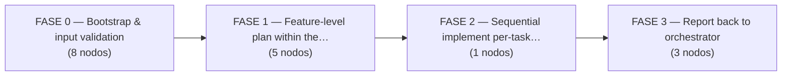
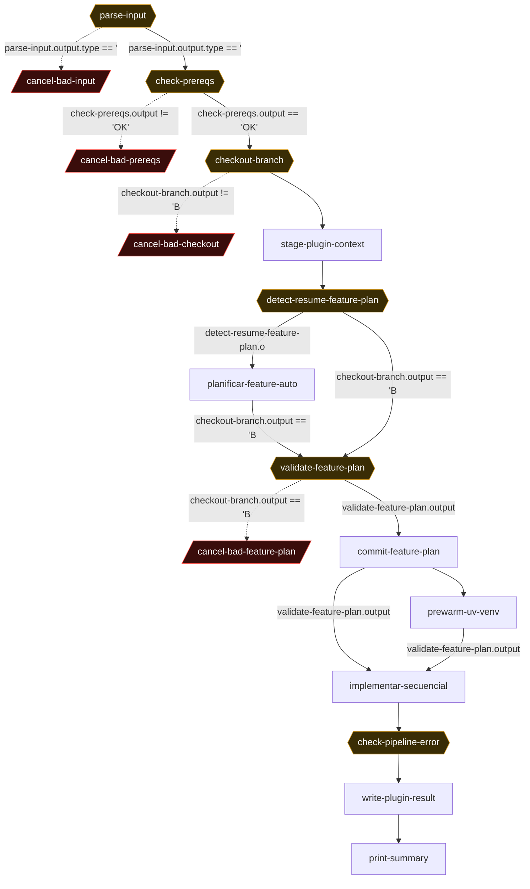

# Hubara Plugin Sub-Pipeline (per-plugin feature plan + sequential implement, detached-HEAD worktree)

> **`hu-hubara-plugin-pipeline.yaml`** · 17 nodos · 20 conexiones · 4 fases
> 
> Generado por extracción + **verificación adversarial** (doble lectura independiente del YAML). Fuente de verdad: el YAML. Visor interactivo: [`index.html`](./index.html).

## Propósito

Sub-pipeline that runs inside ONE plugin's worktree. Given "<HU_ID> <plugin_id>", it does a detached-HEAD checkout of origin/hu/<HU_ID>, stages that plugin's slice of the orchestrator-committed plugin-manifest (plugin-work.yaml), runs the feature-planner skill (interactive, max 2 iter) to produce a feature-level DAG (feature-plan-manifest.yaml + tareas/F<NN>-*.md), validates it deterministically (shape, F-id format, task-file existence, cap of 12), commits+pushes the plan to HEAD:<BRANCH>, then loops the implementer skill SEQUENTIALLY (max 50 iter, fresh_context) where a large until_bash is the real controller: re-runs pytest + pytest -m architecture + lint-imports + render-compose drift + npm test/test:arch/tsc/build + Playwright (with a backgrounded FastAPI on a random free port) per task, commits+pushes each passed task to HEAD:<BRANCH>, handles det-retries (max 2) and transient retries (max 1), and on permanent failure writes pipeline-error.yaml and exits 0. Finally it computes the plugin's authoritative status with a strict completeness check (planned-vs-produced result files; passed_with_warnings counts as passing) and writes+commits+pushes plugin-<id>-result.yaml for the orchestrator to aggregate, then prints a summary box.

**Trigger / invocación:** `archon workflow run hu-hubara-plugin-pipeline "<HU_ID> <plugin_id>" — EXACTLY 2 whitespace-separated tokens. $ARGUMENTS is split with awk '{print $1}' (HU_ID) and awk '{print $2}' (PLUGIN_ID). Example: "HU-20260517-143025-add-image-tool chats". Optional env override: MAX_FEATURES_PER_PLUGIN (default 12). worktree.enabled: true (runs in a dedicated worktree). interactive: false at file level, but the feature-planner loop carries a gate_message. Invoked (a) inline by hu-hubara-pipeline when mode=single_plugin, (b) manually fanned-out N times by the operator when mode=multi_plugin (one terminal per plugin), (c) standalone for plugin debug. It does NOT itself detect single vs multi — each invocation handles exactly one plugin_id.`

**Inputs:** `$ARGUMENTS = "<HU_ID> <plugin_id>" (exactly 2 whitespace tokens; e.g. "HU-20260517-143025-add-image-tool chats")`, `HU_ID must match ^HU-[0-9]{8}-[0-9]{4,6}- (validated in parse-input; looser than main pipeline)`, `plugin_id must match ^[a-z][a-z0-9_]*$ (validated in parse-input)`, `Pre-existing origin branch hu/<HU_ID> (created by hu-hubara-pipeline)`, `Pre-committed hubara_agency/.hubara/plans/<HU_ID>/plugin-manifest.yaml (orchestrator FASE 2)`, `Pre-committed hubara_agency/.hubara/refinements/<HU_ID>-tech.md (orchestrator FASE 1)`, `Pre-committed hubara_agency/.hubara/spinal-files.yaml and project-context.md`, `Skills present: hubara-feature-planner-archon, hubara-implementer-archon, hubara-architecture-guide`, `Tooling on PATH: gh (authenticated), uv, npm, jq, python3 (curl/npx used inside gates)`, `Optional env: MAX_FEATURES_PER_PLUGIN (default 12)`

## Lógica global, invariantes y env vars

MODE / ROLE: This is the SUB-pipeline, invoked once per plugin. It does NOT itself detect single vs multi_plugin — that classification lives upstream in hu-hubara-tech-refiner / the orchestrator (hu-hubara-pipeline). The orchestrator either invokes this inline once (single_plugin) or has the operator fan it out N times (multi_plugin), each invocation handling exactly ONE plugin_id. Input contract is strictly 2 whitespace tokens: HU_ID (awk $1) + plugin_id (awk $2); a 1-token input (the main-pipeline shape) would leave plugin_id empty → cancel-bad-input. File-level: provider claude, model sonnet, interactive:false, worktree.enabled:true.

KEY ENV / VARS: $ARGUMENTS (raw input). $parse-input.output is the run-wide source of truth — a JSON object carrying hu_id, plugin_id, branch=hu/<HU_ID>, and all derived hubara_agency/.hubara/ paths; almost every bash node re-derives HU_ID/PLUGIN_ID/BRANCH from it via jq. $ARTIFACTS_DIR is the ephemeral per-run workspace (skills read/write canonical filenames here; also a real env var in bash nodes). $WORKFLOW_ID is not referenced in this file. Tunable: MAX_FEATURES_PER_PLUGIN (default 12) caps feature tasks per plugin. fresh_context:true on the implement loop means NO context carries across iterations — all cross-iteration state is on disk (task-result.yaml, det-retries-<TASK>.count, retries-<TASK>.count, test-failures.md, RESULTS_DIR/*-result.yaml, pipeline-error.yaml).

BRANCH STRATEGY (the load-bearing invariant): checkout-branch does `git checkout --detach origin/$BRANCH` (DETACHED HEAD, never claims the branch) precisely so N concurrent sub-pipeline worktrees can all target the same hu/<HU_ID>. Consequently EVERY push in the file is `git push origin HEAD:$BRANCH` (never `git push origin $BRANCH`). Inter-pipeline push concurrency is resolved by `git pull --rebase origin $BRANCH` + a single retry, with a 'commit local, no en origin' warning if it fails twice. The branch must already exist on origin (created by the orchestrator); else FAIL_BRANCH_NOT_FOUND. Smart-resume: re-launching with an existing HU_ID+plugin skips FASE 1 when feature-plan-manifest is already committed (detect-resume) and skips already-passed tasks (the implement loop scans RESULTS_DIR).

RUN-WIDE INVARIANTS / DISCIPLINE: (1) status-on-stdout-single-line — every gate/bash node sends git and diagnostic output to >&2 and reserves stdout for a single canonical token, because Archon's condition evaluator does strict equality (repo gotcha #8). (2) all_done on the cancel/report nodes that follow steps which can exit non-zero (cancel-bad-checkout, validate-feature-plan, prewarm-uv-venv, implementar-secuencial, check-pipeline-error, write-plugin-result — exactly 6 nodes carry trigger_rule:all_done; the other 11 use the default all_success) — the default all_success would skip them on a crash and hide the real error (repo gotcha #9, run 52fa70e0). (3) The deterministic gate in until_bash NEVER trusts the AI's reported status — it re-runs the real gates even on passed/passed_with_warnings, and only commits code that passes; on gate-failure exhaustion it reverts src/ and marks blocked. (4) No silent 'passed' on incomplete work — write-plugin-result reports failed if any planned task lacks a result file. (5) passed_with_warnings is a first-class passing status everywhere (gate, retry decision, aggregation) per implementer SKILL.md L1164. RISK: check-pipeline-error emits HAS_ERROR but no node gates on it; the failed verdict is recomputed by write-plugin-result, and a permanent-failure (pipeline-error.yaml) exits the implement loop with 0 rather than crashing — so failure surfaces via the plugin-result.yaml status, never via a cancel node inside this sub-pipeline.

## Mapa de fases




## Grafo completo

<sub>◆ = gate · borde rojo / `-.->` = cancelación · `-.->` punteado = loop-back. Para el grafo navegable usá [`index.html`](./index.html).</sub>




## Tabla de nodos (referencia rápida)

| # | Nodo | Tipo | Flags | depends_on | when |
|---|------|------|-------|-----------|------|
| 1 | `parse-input` | bash | ◆gate | — | — |
| 2 | `cancel-bad-input` | manual | ✕cancel | `parse-input` | `$parse-input.output.type == 'error'` |
| 3 | `check-prereqs` | bash | ◆gate | `parse-input` | `$parse-input.output.type == 'ok'` |
| 4 | `cancel-bad-prereqs` | manual | ✕cancel | `check-prereqs` | `$check-prereqs.output != 'OK'` |
| 5 | `checkout-branch` | bash | ◆gate | `check-prereqs` | `$check-prereqs.output == 'OK'` |
| 6 | `cancel-bad-checkout` | manual | ✕cancel | `checkout-branch` | `$checkout-branch.output != 'BRANCH_READY'` |
| 7 | `stage-plugin-context` | bash | — | `checkout-branch` | — |
| 8 | `detect-resume-feature-plan` | bash | ◆gate | `stage-plugin-context` | — |
| 9 | `planificar-feature-auto` | skills | ↻loop | `detect-resume-feature-plan` | `$detect-resume-feature-plan.output != 'RESUMED_FEATURE_PLAN'` |
| 10 | `validate-feature-plan` | bash | ◆gate | `planificar-feature-auto`, `detect-resume-feature-plan` | `$checkout-branch.output == 'BRANCH_READY'` |
| 11 | `cancel-bad-feature-plan` | manual | ✕cancel | `validate-feature-plan` | `$checkout-branch.output == 'BRANCH_READY' && $validate-feature-plan.output != 'PASS'` |
| 12 | `commit-feature-plan` | bash | — | `validate-feature-plan` | `$validate-feature-plan.output == 'PASS'` |
| 13 | `prewarm-uv-venv` | bash | — | `commit-feature-plan` | — |
| 14 | `implementar-secuencial` | skills | ↻loop | `commit-feature-plan`, `prewarm-uv-venv` | `$validate-feature-plan.output == 'PASS'` |
| 15 | `check-pipeline-error` | bash | ◆gate | `implementar-secuencial` | — |
| 16 | `write-plugin-result` | bash | — | `check-pipeline-error` | — |
| 17 | `print-summary` | bash | — | `write-plugin-result` | — |

## Nodos en detalle (por fase)

### Fase · FASE 0 — Bootstrap & input validation

_Parse and validate the '<HU_ID> <plugin_id>' input, verify runtime prerequisites and required files/skills, detached-HEAD-checkout origin/hu/<HU_ID>, verify the orchestrator-persisted plugin-manifest + refinement, stage shared context and extract the per-plugin plugin-work.yaml, and probe for a resumable feature plan. Three cancel nodes (input, prereqs, checkout) guard this phase; cancel-bad-checkout uses all_done to survive checkout's non-zero exits. stage-plugin-context can crash (FAIL_PLUGIN_NOT_IN_MANIFEST) with NO dedicated cancel._

#### `parse-input`  —  ◆gate

- **Tipo:** bash
- **Resumen:** Parse '<HU_ID> <plugin_id>' from $ARGUMENTS into a structured JSON object with all derived paths (always exit 0).
- **Detalle:** Splits $ARGUMENTS with awk into HU_ID ($1) and PLUGIN_ID ($2). Emits a jq error object {type:error,...} (exit 0) if either token is empty, if HU_ID fails grep -qE '^HU-[0-9]{8}-[0-9]{4,6}-', or if PLUGIN_ID fails grep -qE '^[a-z][a-z0-9_]*$'. On success emits a jq object {type:ok, hu_id, plugin_id, branch:('hu/'+h), plan_dir, plugin_manifest, feature_plan_dir, results_dir, plugin_result_file, feature_results_dir} — all computed paths under hubara_agency/.hubara/. ALWAYS exits 0 so routing is by output.type, not exit code.
- **depends_on:** _(raíz)_
- **trigger_rule:** `all_success`
- **produces:** output.type in {ok,error}; on ok: hu_id, plugin_id, branch, plan_dir, plugin_manifest, feature_plan_dir, results_dir, plugin_result_file, feature_results_dir; on error: error (+ optional got)
- **lo siguen:** `cancel-bad-input`, `check-prereqs`
- **⚠️ notas:** Root node (no depends_on; START attaches here). The whole $parse-input.output JSON is the run-wide source of truth — nearly every downstream bash node re-derives HU_ID/PLUGIN_ID/BRANCH via `echo $parse-input.output | jq -r '.field'`. HU_ID regex (^HU-[0-9]{8}-[0-9]{4,6}-) is LOOSER than the main pipeline's (only a trailing hyphen, no slug-char class). exit 0 on all paths is deliberate.

#### `cancel-bad-input`  —  ✕cancel

- **Tipo:** manual
- **Resumen:** Cancel node: aborts the run when parse-input reported an input error.
- **Detalle:** Single-line cancel: message echoes $parse-input.output and prints the usage string (archon workflow run hu-hubara-plugin-pipeline '<HU_ID> <plugin_id>'). Fires only when parse-input emitted type:error (bad/missing tokens or failed regex). Terminates the workflow.
- **depends_on:** `parse-input`
- **trigger_rule:** `all_success`
- **when:** `$parse-input.output.type == 'error'`
- **produces:** cancel (terminates run)
- **⚠️ notas:** Default trigger_rule all_success: only fires if parse-input SUCCEEDED (exit 0) AND its when matches. parse-input always exits 0, so this is reliable. Mutually exclusive branch vs check-prereqs (which has when type=='ok').

#### `check-prereqs`  —  ◆gate

- **Tipo:** bash
- **Resumen:** Verify runtime prerequisites: gh auth, uv/npm/jq/python3 on PATH, required spinal/context files, the 3 hubara skills, and origin reachability.
- **Detalle:** `set -e` then a sequence of guarded checks, each `|| { echo FAIL_*; exit 0; }`: gh auth status (FAIL_GH_AUTH; stdout redirected >&2 2>&1), command -v uv/npm/jq/python3 (FAIL_NO_UV/NPM/JQ/PYTHON3), test -f hubara_agency/.hubara/spinal-files.yaml (FAIL_MISSING_SPINAL_FILES) and project-context.md (FAIL_MISSING_PROJECT_CONTEXT), test -f the SKILL.md of hubara-feature-planner-archon / hubara-implementer-archon / hubara-architecture-guide (FAIL_MISSING_FEATURE_PLANNER / FAIL_MISSING_IMPLEMENTER / FAIL_MISSING_GUIDE), git ls-remote origin HEAD (FAIL_NO_ORIGIN). Echoes 'OK' only if all pass. timeout 60000.
- **depends_on:** `parse-input`
- **trigger_rule:** `all_success`
- **when:** `$parse-input.output.type == 'ok'`
- **produces:** output == 'OK' | FAIL_GH_AUTH | FAIL_NO_UV | FAIL_NO_NPM | FAIL_NO_JQ | FAIL_NO_PYTHON3 | FAIL_MISSING_SPINAL_FILES | FAIL_MISSING_PROJECT_CONTEXT | FAIL_MISSING_FEATURE_PLANNER | FAIL_MISSING_IMPLEMENTER | FAIL_MISSING_GUIDE | FAIL_NO_ORIGIN
- **lo siguen:** `cancel-bad-prereqs`, `checkout-branch`
- **⚠️ notas:** Despite `set -e`, every check uses `|| { echo FAIL...; exit 0; }`, so it always exits 0 with a single-line status — routing is by output value. This sub-pipeline does NOT check gh project scope (no FAIL_GH_NO_PROJECT_SCOPE token here, unlike the main pipeline). gh auth status output redirected so stdout stays clean.

#### `cancel-bad-prereqs`  —  ✕cancel

- **Tipo:** manual
- **Resumen:** Cancel node: aborts when check-prereqs did not return exactly 'OK'.
- **Detalle:** Single-line cancel: message echoes $check-prereqs.output and points to the same diagnostics as hu-hubara-pipeline.cancel-bad-prereqs. Fires whenever the prereq check produced any FAIL_* token instead of OK.
- **depends_on:** `check-prereqs`
- **trigger_rule:** `all_success`
- **when:** `$check-prereqs.output != 'OK'`
- **produces:** cancel (terminates run)
- **⚠️ notas:** Default trigger_rule all_success. check-prereqs always exits 0, so all_success holds and the when decides. Silent-hole risk low because check-prereqs cannot crash (always exit 0).

#### `checkout-branch`  —  ◆gate

- **Tipo:** bash
- **Resumen:** Detached-HEAD checkout of origin/hu/<HU_ID>, then verify the orchestrator-persisted plugin-manifest and refinement files exist.
- **Detalle:** `set -e`. Reads BRANCH and HU_ID from $parse-input.output via jq. Runs `git fetch origin --prune`. If `git ls-remote --exit-code --heads origin $BRANCH` fails → echoes FAIL_BRANCH_NOT_FOUND and exit 1. Else `git checkout --detach origin/$BRANCH` (stderr tee'd via tail -3 >&2). Then checks PLAN=hubara_agency/.hubara/plans/$HU_ID/plugin-manifest.yaml exists (else FAIL_NO_PLUGIN_MANIFEST, exit 1) and REFINEMENT=hubara_agency/.hubara/refinements/$HU_ID-tech.md exists (else FAIL_NO_REFINEMENT, exit 1). Echoes BRANCH_READY on full success.
- **depends_on:** `check-prereqs`
- **trigger_rule:** `all_success`
- **when:** `$check-prereqs.output == 'OK'`
- **produces:** output == 'BRANCH_READY' (exit 0) | FAIL_BRANCH_NOT_FOUND (exit 1) | FAIL_NO_PLUGIN_MANIFEST (exit 1) | FAIL_NO_REFINEMENT (exit 1)
- **lo siguen:** `cancel-bad-checkout`, `stage-plugin-context`
- **⚠️ notas:** Architectural fix (run 52fa70e0, 2026-05-27): detached HEAD (`git checkout --detach origin/$BRANCH`) instead of `git checkout $BRANCH`, so N concurrent sub-pipeline worktrees can target the same hu/<HU_ID> without git's 'already checked out' refusal. Consequently EVERY push in the file uses `git push origin HEAD:$BRANCH`. Unlike parse-input/check-prereqs, the FAIL_* paths here exit 1 (NON-ZERO) — so the cancel that follows MUST use trigger_rule all_done. The BRANCH_READY value is reused as a cross-node guard by validate-feature-plan and cancel-bad-feature-plan.

#### `cancel-bad-checkout`  —  ✕cancel

- **Tipo:** manual
- **Resumen:** Cancel node: aborts when checkout-branch did not reach BRANCH_READY (with worktree-cleanup guidance).
- **Detalle:** Multi-line cancel: echoes $checkout-branch.output, explains the most frequent cause (branch already checked out in another worktree — suggests `git worktree list` and `git worktree remove --force <path>`), plus decode of FAIL_BRANCH_NOT_FOUND (run hu-hubara-pipeline first), FAIL_NO_PLUGIN_MANIFEST (orchestrator didn't finish FASE 2), FAIL_NO_REFINEMENT (didn't finish FASE 1).
- **depends_on:** `checkout-branch`
- **trigger_rule:** `all_done`
- **when:** `$checkout-branch.output != 'BRANCH_READY'`
- **produces:** cancel (terminates run)
- **⚠️ notas:** CRITICAL (YAML comment L181-185): trigger_rule MUST be all_done (NOT default all_success) because checkout-branch FAIL paths exit 1. With default all_success this cancel would be SKIPPED on a non-zero exit and the real error would be masked by the misleading cancel-bad-feature-plan FAIL_NOT_EXISTS (cascading-skip). Lesson from run 52fa70e0.

#### `stage-plugin-context`

- **Tipo:** bash
- **Resumen:** Copy shared context files into $ARTIFACTS_DIR and extract this plugin's slice (plugin-work.yaml) from the plugin-manifest.
- **Detalle:** `set -e`. Reads HU_ID, PLUGIN_ID via jq. Copies spinal-files.yaml, project-context.md, plans/$HU_ID/plugin-manifest.yaml (→ plugin-manifest.yaml), and refinements/$HU_ID-tech.md (→ hu-refinada.md) into $ARTIFACTS_DIR. Then runs a python3 heredoc that loads plugin-manifest.yaml, finds plugins[] entry with id==PLUGIN_ID; if not found raises SystemExit('FAIL_PLUGIN_NOT_IN_MANIFEST...') listing declared ids. If found, builds a `work` dict (hu_id, plugin_id, work_summary, layers, template default 'A', affects_layers_detail, affects_shared_files, estimated_tasks default 1, risk default 'low', depends_on_plugins) and yaml.safe_dumps it to $ARTIFACTS_DIR/plugin-work.yaml, then prints OK.
- **depends_on:** `checkout-branch`
- **trigger_rule:** `all_success`
- **produces:** output: OK (stdout) | crashes (set -e + python SystemExit) on FAIL_PLUGIN_NOT_IN_MANIFEST; side-effect: $ARTIFACTS_DIR/{spinal-files.yaml, project-context.md, plugin-manifest.yaml, hu-refinada.md, plugin-work.yaml}
- **lo siguen:** `detect-resume-feature-plan`
- **⚠️ notas:** No `when` clause + default trigger_rule all_success: runs only if checkout-branch SUCCEEDED (exit 0 = BRANCH_READY), so the checkout-failure cascade naturally skips it. SILENT-HOLE RISK (confirmed): FAIL_PLUGIN_NOT_IN_MANIFEST raises SystemExit (non-zero) under `set -e`, but there is NO dedicated cancel node guarding stage-plugin-context. A crash here surfaces only as cascading skips / all_done re-evaluation downstream, not as a clear cancel message.

#### `detect-resume-feature-plan`  —  ◆gate

- **Tipo:** bash
- **Resumen:** Smart-resume probe: if a committed feature-plan-manifest already exists for this plugin, copy it (+ tareas) into $ARTIFACTS_DIR and signal resume.
- **Detalle:** Reads HU_ID, PLUGIN_ID via jq. Checks F=hubara_agency/.hubara/plans/$HU_ID/feature-plans/$PLUGIN_ID/feature-plan-manifest.yaml. If it exists: copies it to $ARTIFACTS_DIR/feature-plan-manifest.yaml, and if the sibling tareas/ dir exists, mkdir $ARTIFACTS_DIR/tareas and `cp $TAREAS_DIR/F*.md` into it (errors ignored with || true), then echoes RESUMED_FEATURE_PLAN. Otherwise echoes NO_RESUME.
- **depends_on:** `stage-plugin-context`
- **trigger_rule:** `all_success`
- **produces:** output == 'RESUMED_FEATURE_PLAN' | 'NO_RESUME'
- **lo siguen:** `planificar-feature-auto`, `validate-feature-plan`
- **⚠️ notas:** Gate that routes the planner: planificar-feature-auto runs only when output != RESUMED_FEATURE_PLAN. Default all_success → depends on stage-plugin-context succeeding. Its output is consumed by planificar-feature-auto (when) AND it is also a dep of validate-feature-plan (so validate runs via all_done on both the auto path and the smart-resume path).

### Fase · FASE 1 — Feature-level plan (within the plugin)

_Run the hubara-feature-planner-archon skill (interactive, max 2 iter, gate_message) to decompose the plugin's work into feature-plan-manifest.yaml + tareas/F<NN>-*.md, unless smart-resume already staged them. Deterministically validate the plan (shape, blocked-mode, task cap 12, F-ids, task files) — validate is a fan-in of planner+detect-resume with all_done. Cancel on failure (PASS_BLOCKED also trips the cancel), commit+push the plan to HEAD:<BRANCH>, and pre-warm the uv venv for the implement phase._

#### `planificar-feature-auto`  —  ↻loop

- **Tipo:** skills · invoca `hubara-feature-planner-archon`
- **Resumen:** Feature-planner loop: invoke hubara-feature-planner-archon (max 2 iter) to decompose the plugin's work into a feature-level DAG, with operator gate feedback.
- **Detalle:** skills node carrying a loop {max_iterations:2, until:FEATURE_PLANNER_OK, skills:[hubara-feature-planner-archon], gate_message, prompt}. Prompt: decompose plugin '$parse-input.output.plugin_id' into a feature-level DAG, reading $ARTIFACTS_DIR/{plugin-work.yaml, plugin-manifest.yaml, hu-refinada.md, spinal-files.yaml, project-context.md} and writing $ARTIFACTS_DIR/feature-plan-manifest.yaml + tareas/F<NN>-<slug>.md (one per task), loading only guide sections matching the plugin template (A/B/C/D from plugin-work.yaml). Feedback via $LOOP_USER_INPUT. Completion signal <promise>FEATURE_PLANNER_OK</promise>. gate_message asks operator to review manifest + task files and say 'ok'/'aprobado' or request adjustments. node-level idle_timeout 600000.
- **depends_on:** `detect-resume-feature-plan`
- **trigger_rule:** `all_success`
- **when:** `$detect-resume-feature-plan.output != 'RESUMED_FEATURE_PLAN'`
- **produces:** side-effect: $ARTIFACTS_DIR/feature-plan-manifest.yaml + $ARTIFACTS_DIR/tareas/F*.md; completion signal <promise>FEATURE_PLANNER_OK</promise>
- **loop:** `max_iterations:2, until:FEATURE_PLANNER_OK`
- **lo siguen:** `validate-feature-plan`
- **⚠️ notas:** Interactive loop (gate_message + max_iterations:2) — uses skills+loop rather than command: because operator feedback iteration is needed. SKIPPED entirely on smart-resume (when guard). Writes only to $ARTIFACTS_DIR (ephemeral); the durable commit happens later in commit-feature-plan. idle_timeout 600000ms is the interactive idle gate.

#### `validate-feature-plan`  —  ◆gate

- **Tipo:** bash
- **Resumen:** Deterministic validation of the feature-plan-manifest: existence, dict shape, blocked-mode, task-count cap, F<NN> ids, and a matching task file per task.
- **Detalle:** Guarded by `when` checkout==BRANCH_READY. Checks $ARTIFACTS_DIR/feature-plan-manifest.yaml exists (else FAIL_NOT_EXISTS, exit 0). Exports MAX_FEATURES_PER_PLUGIN (default 12). python3 heredoc: loads yaml; if not a dict → FAIL_NOT_DICT; if mode=='blocked' → PASS_BLOCKED; if tasks not a non-empty list → FAIL_NO_TASKS; if len(tasks) > MAX → FAIL_TOO_MANY_TASKS: <n> > cap=<MAX>...; per task: missing id → FAIL_TASK_NO_ID, id not F+digits → FAIL_BAD_TASK_ID: <id>, no file in $ARTIFACTS_DIR/tareas starting with '<id>-' → FAIL_MISSING_TASK_FILE_<id>; else PASS. All paths exit 0.
- **depends_on:** `planificar-feature-auto`, `detect-resume-feature-plan`
- **trigger_rule:** `all_done`
- **when:** `$checkout-branch.output == 'BRANCH_READY'`
- **produces:** output: PASS | PASS_BLOCKED | FAIL_NOT_EXISTS | FAIL_NOT_DICT | FAIL_NO_TASKS | FAIL_TOO_MANY_TASKS:... | FAIL_TASK_NO_ID | FAIL_BAD_TASK_ID:... | FAIL_MISSING_TASK_FILE_<id>
- **lo siguen:** `cancel-bad-feature-plan`, `commit-feature-plan`
- **⚠️ notas:** CONVERGENCE/FAN-IN node: two deps (planificar-feature-auto, detect-resume-feature-plan) with trigger_rule all_done, so it runs whether the planner ran (auto path) OR was skipped (smart-resume path, where detect-resume staged the manifest). The `when` guard (checkout==BRANCH_READY) is the documented fix (run 52fa70e0): without it, on a checkout failure this node would run via all_done and emit the misleading FAIL_NOT_EXISTS instead of letting cancel-bad-checkout surface the real error. AMBIGUITY: emits both 'PASS' and 'PASS_BLOCKED', but every downstream consumer keys on =='PASS' (commit/implement) or !='PASS' (cancel) — so a legitimately blocked plan (mode:blocked → PASS_BLOCKED) routes to cancel-bad-feature-plan (treated as a validation failure), with no distinct blocked-handler.

#### `cancel-bad-feature-plan`  —  ✕cancel

- **Tipo:** manual
- **Resumen:** Cancel node: aborts when the feature plan failed validation AND checkout had succeeded, with FAIL-code decode + recovery options.
- **Detalle:** Multi-line cancel: echoes $validate-feature-plan.output and the plugin id, then decodes FAIL_TOO_MANY_TASKS (split HU or bump MAX_FEATURES_PER_PLUGIN), FAIL_MISSING_TASK_FILE_F<NN> (re-run planner), FAIL_BAD_TASK_ID, plus generic recovery (edit plugin-manifest work_summary and re-run, or hand-edit feature-plan + tareas and re-run via smart-resume). Fires only when checkout reached BRANCH_READY AND validation != PASS.
- **depends_on:** `validate-feature-plan`
- **trigger_rule:** `all_success`
- **when:** `$checkout-branch.output == 'BRANCH_READY' && $validate-feature-plan.output != 'PASS'`
- **produces:** cancel (terminates run)
- **⚠️ notas:** Compound when (YAML comment L369-374): the extra `checkout==BRANCH_READY` guard prevents a confusing fire when checkout failed → validate skipped → its output '' which is != 'PASS'. Archon has NO regex, so `!= 'PASS'` substitutes for the original PASS-only regex. CAVEAT: because the guard is `!= 'PASS'`, a legitimate PASS_BLOCKED also trips this cancel — no separate blocked path. Default trigger_rule all_success: validate-feature-plan always exits 0, so this holds.

#### `commit-feature-plan`

- **Tipo:** bash
- **Resumen:** Persist the validated feature plan into the repo (plans/.../feature-plans/<plugin>/) and commit+push HEAD:<BRANCH>.
- **Detalle:** `set -e`. Reads HU_ID, PLUGIN_ID, BRANCH via jq. DIR=hubara_agency/.hubara/plans/$HU_ID/feature-plans/$PLUGIN_ID; mkdir DIR/tareas; copies $ARTIFACTS_DIR/feature-plan-manifest.yaml and tareas/F*.md into it. N=files in DIR/tareas. `git add DIR` (>&2). If staged diff non-empty: `git commit -m '<HU_ID> [<PLUGIN_ID>]: feature plan (auto, <N> tareas)'` (>&2), then `git push origin HEAD:$BRANCH` (tail -3 >&2). If PIPESTATUS[0] != 0 → `git pull --rebase origin $BRANCH` then retry push; if it fails twice, warns 'commit local, no en origin'. Echoes committed_<N>. Else echoes no_changes.
- **depends_on:** `validate-feature-plan`
- **trigger_rule:** `all_success`
- **when:** `$validate-feature-plan.output == 'PASS'`
- **produces:** output: committed_<N> | no_changes; side-effect: commit + push HEAD:$BRANCH of the feature plan
- **lo siguen:** `prewarm-uv-venv`, `implementar-secuencial`
- **⚠️ notas:** STDOUT-POLLUTION DISCIPLINE: all git output (add/commit/push) redirected to >&2 so stdout is single-line (committed_<N> | no_changes), per repo gotcha #8. Push uses HEAD:$BRANCH because checkout-branch left detached HEAD. Concurrency with parallel sub-pipelines handled via pull --rebase + single retry. `when ==PASS` excludes PASS_BLOCKED (a blocked plan never commits — it's already cancelled by cancel-bad-feature-plan).

#### `prewarm-uv-venv`

- **Tipo:** bash
- **Resumen:** Pre-warm the uv virtualenv (cd hubara_agency && uv sync) before the implementer loop, to avoid cold-sync stalls in the gates.
- **Detalle:** If a hubara_agency dir exists, cd into it and run `uv sync` (tail -10; on warnings echoes 'uv sync warnings — gate retry'). Always echoes 'ok' at the end. timeout 600000 (10 min) to tolerate a cold full sync.
- **depends_on:** `commit-feature-plan`
- **trigger_rule:** `all_done`
- **produces:** output: ok (always)
- **lo siguen:** `implementar-secuencial`
- **⚠️ notas:** trigger_rule all_done so it runs even if commit-feature-plan emitted no_changes or had warnings (no `when`, doesn't gate on a value). Best-effort warm-up — never fails the run (always echoes ok). Mirrors hu-frontend-pipeline's prewarm. One of the two deps of implementar-secuencial.

### Fase · FASE 2 — Sequential implement (per-task gated loop)

_Loop the hubara-implementer-archon skill (max 50 iter, fresh_context, fan-in of commit-feature-plan+prewarm) over each pending task. The implementer only writes code; a large until_bash re-runs all deterministic gates (pytest, arch, lint-imports, render-compose drift, npm/tsc/build, Playwright with a backgrounded FastAPI on a random free port), handles det-retries (max 2) and transient retries (max 1), commits+pushes each passed task to HEAD:<BRANCH>, and terminates via exit code when all tasks pass OR a permanent failure is recorded (pipeline-error.yaml, exit 0)._

#### `implementar-secuencial`  —  ↻loop

- **Tipo:** skills · invoca `hubara-implementer-archon`
- **Resumen:** Sequential implementer loop: hubara-implementer-archon writes code per task; a large until_bash runs deterministic gates, commits/pushes, handles retries, and decides loop termination via exit code.
- **Detalle:** skills node with loop {max_iterations:50, until:NEVER_AI_SIGNAL, fresh_context:true, skills:[hubara-implementer-archon], until_bash, prompt}; node-level idle_timeout 1800000. The AI prompt restricts the implementer to ONLY writing code for the next pending task (iterate parallel_batches[] then tasks[] by ascending F-id; first task whose F<id>-result.yaml is missing/not status:passed in RESULTS_DIR), reading task.md + selective guide sections, running §10 verification, writing $ARTIFACTS_DIR/task-result.yaml with status + wiring_intents — NO git ops; if $ARTIFACTS_DIR/test-failures.md exists (gate feedback) it must fix the SAME task. The until_bash is the real controller: cleans stale result.yaml without a matching commit; if task-result.yaml status is passed|passed_with_warnings it RE-RUNS deterministic gates by FILES_TOUCHED (backend: pytest -q, pytest -m architecture, lint-imports; render-compose drift if a *plugin.yaml manifest touched; frontend: npm test --run, npm run test:arch, npx tsc -b, npm run build; Playwright E2E with a backgrounded FastAPI on a random free port if UI touched), logging to test-failures.md. On gate failure → det-retry up to MAX_DET_RETRIES=2 (rm task-result.yaml+task.md, exit 1 to re-loop); on exhaustion → rewrites status→blocked, reverts src/, SHOULD_COMMIT_BROKEN_CODE=0. On gate success → copies result.yaml to RESULTS_DIR, git add src/k8s/compose/.hubara/plugins + result, resets node_modules/dist/.vite/coverage/lock/.venv, commits '<HU_ID> [<PLUGIN_ID>] <TASK_ID>: status=<STATUS> (auto)' and pushes HEAD:$BRANCH (pull --rebase + retry). For non-passed status it classifies transient (blocked_reason in {command_timeout,regression}) → 1 auto-retry, else writes pipeline-error.yaml and exit 0. Finally TOTAL=grep -cE '^  - id: F[0-9]+' feature-plan-manifest vs PASSED=find F*-result.yaml with '^status: passed'; exit 0 when PASSED>=TOTAL>0, else exit 1 to continue.
- **depends_on:** `commit-feature-plan`, `prewarm-uv-venv`
- **trigger_rule:** `all_done`
- **when:** `$validate-feature-plan.output == 'PASS'`
- **produces:** side-effects: per-task commits+pushes to HEAD:$BRANCH; $ARTIFACTS_DIR/{task-result.yaml(transient), test-failures.md, det-retries-<TASK>.count, retries-<TASK>.count, playwright-evidence-<TASK>.log, .uvicorn-<TASK>.log}; RESULTS_DIR/F<NN>-result.yaml (durable); on permanent failure $ARTIFACTS_DIR/pipeline-error.yaml. Loop exits 0 when all tasks passed OR a permanent failure occurred.
- **loop:** `max_iterations:50, until:NEVER_AI_SIGNAL (until_bash exit code controls termination)`
- **lo siguen:** `check-pipeline-error`
- **⚠️ notas:** CONVERGENCE/FAN-IN node: two deps (commit-feature-plan, prewarm-uv-venv); trigger_rule all_done lets it run even though prewarm is best-effort. until:NEVER_AI_SIGNAL is a sentinel the AI never emits — the loop is driven ENTIRELY by until_bash exit codes (0=stop, 1=continue), capped at max_iterations:50. fresh_context:true wipes AI context each iteration; cross-iteration state lives ONLY in files. `when ==PASS` excludes PASS_BLOCKED. CRITICAL silent-hole nuance: a PERMANENT task failure exits 0 (NOT a crash), writing pipeline-error.yaml — so the loop 'completes successfully' and the failed verdict is recomputed downstream by write-plugin-result, NOT by an in-pipeline cancel. The det gate re-runs even on passed_with_warnings (SKILL.md L1164) because the AI can lie/silence. Playwright path traps EXIT to kill uvicorn; 180s liveness probe. All pushes use HEAD:$BRANCH (detached HEAD).

### Fase · FASE 3 — Report back to orchestrator

_Detect any permanent-failure marker (informational only — nothing gates on HAS_ERROR), then compute the plugin's authoritative status with a strict completeness check (planned vs produced result files; passed_with_warnings counts as passing), write+commit+push plugin-<id>-result.yaml to HEAD:<BRANCH>, and print a human-readable summary box with operator next-steps. write-plugin-result always runs (all_done, no when) so the orchestrator always gets a result._

#### `check-pipeline-error`  —  ◆gate

- **Tipo:** bash
- **Resumen:** Detect whether the implementer loop left a permanent-failure marker (pipeline-error.yaml).
- **Detalle:** If $ARTIFACTS_DIR/pipeline-error.yaml exists, cats it to >&2 and echoes HAS_ERROR; otherwise echoes OK. Runs with trigger_rule all_done so it executes regardless of how implementar-secuencial finished.
- **depends_on:** `implementar-secuencial`
- **trigger_rule:** `all_done`
- **produces:** output == 'HAS_ERROR' | 'OK'
- **lo siguen:** `write-plugin-result`
- **⚠️ notas:** SILENT-HOLE / DESIGN FLAG (confirmed): emits HAS_ERROR but NOTHING downstream gates on it — write-plugin-result depends on it with trigger_rule all_done and NO `when`, so HAS_ERROR does NOT cancel the run. The permanent-failure signal is effectively informational; the actual 'failed' verdict is recomputed independently by write-plugin-result via missing-tasks / non-passed result.yaml scanning. A pipeline-error.yaml alone (with all result files somehow present-and-passed) would not by itself force failed status.

#### `write-plugin-result`

- **Tipo:** bash
- **Resumen:** Compute the plugin's overall status (with a strict completeness check) and write+commit+push plugin-<id>-result.yaml.
- **Detalle:** `set -e`. Reads HU_ID, PLUGIN_ID, BRANCH via jq. COMPLETENESS: parses feature-plan-manifest (grep -oE '^  - id: F[0-9]+') to get PLANNED ids; for each, if FEATURE_RDIR/<tid>-result.yaml is missing, adds to MISSING_TASKS. STATUS AGGREGATION: scans FEATURE_RDIR/F*-result.yaml; 'passed' → PASSED++, 'passed_with_warnings' → PASSED++ & WARNED++ & WARNED_TASKS, anything else → ALL_PASSED=false & FAILED_TASKS. Plugin status: if MISSING_TASKS non-empty → failed (NEVER passed); elif ALL_PASSED and TOTAL>0 → passed_with_warnings if WARNED>0 else passed; else failed. Writes PLUGIN_RFILE (results/<HU_ID>/plugin-<PLUGIN_ID>-result.yaml) with version, hu_id, plugin_id, pipeline, date, status, feature_tasks_planned/total/passed/with_warnings, and missing_tasks/failed_tasks/warned_tasks lists. git add results/, and if staged diff non-empty commit '<HU_ID> [<PLUGIN_ID>]: plugin result.yaml' + push HEAD:$BRANCH (pull --rebase + retry fallback). Echoes plugin_result_committed status=<...> tasks=<PASSED>/<TOTAL> warnings=<WARNED>.
- **depends_on:** `check-pipeline-error`
- **trigger_rule:** `all_done`
- **produces:** output: plugin_result_committed status=<PLUGIN_STATUS> tasks=<P>/<T> warnings=<W>; side-effect: results/<HU_ID>/plugin-<plugin_id>-result.yaml committed+pushed; PLUGIN_STATUS in {passed, passed_with_warnings, failed}
- **lo siguen:** `print-summary`
- **⚠️ notas:** trigger_rule all_done + NO `when` → ALWAYS runs; this is the report-back step the orchestrator reads, and the CANONICAL source of the plugin's verdict (independent of check-pipeline-error's HAS_ERROR). Two CRITICAL fixes encoded: (1) completeness check (run b9b95fc5, 2026-05-29) — counts PLANNED vs result files so a loop that completed only F01 of F01/F02/F03 reports failed with explicit missing_tasks, not passed; (2) passed_with_warnings counts as passing (run 25512e9, 2026-05-27) so the orchestrator's rama-B-merge-batch is not wrongly cancelled.

#### `print-summary`

- **Tipo:** bash
- **Resumen:** Print a human-readable box summarizing HU id, plugin, final status, branch, and operator next-steps.
- **Detalle:** Reads HU_ID, PLUGIN_ID via jq. Reads RESULT_STATUS from grep '^status:' of plugin-<id>-result.yaml (default 'unknown' if file missing). Cats an ASCII box with HU id, plugin, status, branch hu/<HU_ID>, and conditional guidance: if Status=passed the orchestrator collects the result, advances to FASE 4, and invokes the merger if shared files were touched (operator returns to orchestrator terminal and says 'ready'); if Status=failed it points to the feature-results dir and lists options (re-launch sub-pipeline for smart-resume, hand-edit the plan, or abandon the plugin). timeout 5000.
- **depends_on:** `write-plugin-result`
- **trigger_rule:** `all_success`
- **produces:** output: human-readable summary box (RESULT_STATUS read from plugin-result.yaml)
- **⚠️ notas:** Terminal node (nothing depends on it; END attaches here). Default trigger_rule all_success → only prints if write-plugin-result succeeded (it has set -e but always reaches an echo, so normally exits 0). Purely informational; no push/mutate. Short timeout (5000ms).

## Conexiones (aristas)

Cada arista es un par `depends_on → nodo`. `kind`: sequence (secuencia normal) · gate (la condición `when` enruta) · cancel (va a un nodo de cancelación) · loop-back (reintento) · fan-out/fan-in (sub-pipelines).

| Desde | Hacia | kind | Condición (when) |
|-------|-------|------|------------------|
| `START` | `parse-input` | sequence | — |
| `parse-input` | `cancel-bad-input` | cancel | `$parse-input.output.type == 'error'` |
| `parse-input` | `check-prereqs` | gate | `$parse-input.output.type == 'ok'` |
| `check-prereqs` | `cancel-bad-prereqs` | cancel | `$check-prereqs.output != 'OK'` |
| `check-prereqs` | `checkout-branch` | gate | `$check-prereqs.output == 'OK'` |
| `checkout-branch` | `cancel-bad-checkout` | cancel | `$checkout-branch.output != 'BRANCH_READY'` |
| `checkout-branch` | `stage-plugin-context` | sequence | — |
| `stage-plugin-context` | `detect-resume-feature-plan` | sequence | — |
| `detect-resume-feature-plan` | `planificar-feature-auto` | gate | `$detect-resume-feature-plan.output != 'RESUMED_FEATURE_PLAN'` |
| `planificar-feature-auto` | `validate-feature-plan` | fan-in | `$checkout-branch.output == 'BRANCH_READY'` |
| `detect-resume-feature-plan` | `validate-feature-plan` | fan-in | `$checkout-branch.output == 'BRANCH_READY'` |
| `validate-feature-plan` | `cancel-bad-feature-plan` | cancel | `$checkout-branch.output == 'BRANCH_READY' && $validate-feature-plan.output != 'PASS'` |
| `validate-feature-plan` | `commit-feature-plan` | gate | `$validate-feature-plan.output == 'PASS'` |
| `commit-feature-plan` | `prewarm-uv-venv` | sequence | — |
| `commit-feature-plan` | `implementar-secuencial` | fan-in | `$validate-feature-plan.output == 'PASS'` |
| `prewarm-uv-venv` | `implementar-secuencial` | fan-in | `$validate-feature-plan.output == 'PASS'` |
| `implementar-secuencial` | `check-pipeline-error` | sequence | — |
| `check-pipeline-error` | `write-plugin-result` | sequence | — |
| `write-plugin-result` | `print-summary` | sequence | — |
| `print-summary` | `END` | sequence | — |

## Notas de verificación (segunda lectura independiente)

- INDEPENDENT RE-READ: full file read in one Read call (978 lines — file ends at line 978, not 979 as the first pass stated; minor metadata error, no node impact). Node ids enumerated directly from the YAML by grepping top-level `- id:` lines plus inner loop markers to exclude `until:`/`max_iterations:` false positives.
- NODE COUNT CONFIRMED = 17 (independently counted). First pass node_count=17 is CORRECT. The 17 ids verbatim: parse-input, cancel-bad-input, check-prereqs, cancel-bad-prereqs, checkout-branch, cancel-bad-checkout, stage-plugin-context, detect-resume-feature-plan, planificar-feature-auto, validate-feature-plan, cancel-bad-feature-plan, commit-feature-plan, prewarm-uv-venv, implementar-secuencial, check-pipeline-error, write-plugin-result, print-summary. NO nodes missed, NO nodes invented by the first pass.
- depends_on for ALL 17 nodes verified against the YAML line-by-line (L84,102,108,161,187,233,252,259,344,376,410,420,430,804,938,977): every first-pass depends_on is CORRECT. Two multi-dep nodes confirmed: validate-feature-plan=[planificar-feature-auto, detect-resume-feature-plan]; implementar-secuencial=[commit-feature-plan, prewarm-uv-venv].
- ALL `when` conditions verified verbatim against the YAML, including the two compound conditions: cancel-bad-feature-plan `$checkout-branch.output == 'BRANCH_READY' && $validate-feature-plan.output != 'PASS'` (L375) and the cross-node guard on validate-feature-plan `$checkout-branch.output == 'BRANCH_READY'` (L306). All match first pass. Nodes with NO `when` (correctly): parse-input, stage-plugin-context, detect-resume-feature-plan, prewarm-uv-venv, check-pipeline-error, write-plugin-result, print-summary.
- trigger_rule verified by grepping every `trigger_rule:` line: exactly SIX nodes carry all_done — cancel-bad-checkout (L186), validate-feature-plan (L345), prewarm-uv-venv (L421), implementar-secuencial (L432), check-pipeline-error (L805), write-plugin-result (L939). The other 11 nodes have NO trigger_rule line → default all_success. This matches the first pass EXACTLY.
- is_gate / is_cancel verified: 4 cancel nodes (cancel-bad-input, cancel-bad-prereqs, cancel-bad-checkout, cancel-bad-feature-plan) all use the `cancel:` key (L82,106,165,348) and are manual/cancel type — matches first pass. Gate (output-routing) nodes: parse-input, check-prereqs, checkout-branch, detect-resume-feature-plan, validate-feature-plan, check-pipeline-error — matches first pass.
- Loop specs verified: planificar-feature-auto loop {max_iterations:2 (L263), until:FEATURE_PLANNER_OK (L264), skills:[hubara-feature-planner-archon], gate_message present (L267) → interactive}. implementar-secuencial loop {max_iterations:50 (L435), until:NEVER_AI_SIGNAL (L436) — sentinel, termination via until_bash exit code; fresh_context:true (L437); has until_bash, no gate_message}. Both match the first pass.
- ONLY SUBSTANTIVE CORRECTION (edge KIND): the first pass labeled the two convergence edges into multi-dep nodes as kind:gate. I re-classified them as kind:fan-in to surface the DAG's only two convergence points: (validate-feature-plan ← planificar-feature-auto, validate-feature-plan ← detect-resume-feature-plan) and (implementar-secuencial ← commit-feature-plan, implementar-secuencial ← prewarm-uv-venv). The edge CONDITIONS are unchanged and preserved (validate's incoming carry checkout=='BRANCH_READY'; implementar's incoming carry validate=='PASS'). This is a modeling-precision refinement, not a correctness fix in the first pass's topology.
- Edge TOPOLOGY otherwise identical to the first pass: 19 dependency edges + START→parse-input + print-summary→END = 21 edges total. Every (dep→node) pair independently re-derived and matches. Single root = parse-input (empty depends_on); single terminal = print-summary (no dependents).
- CONFIRMED FLAGS (not transcription errors, re-verified): (a) check-pipeline-error emits HAS_ERROR but write-plugin-result (all_done, no when) does NOT gate on it — failure verdict recomputed by write-plugin-result; (b) a permanent task failure in implementar-secuencial exits the loop with code 0 (L727), writing pipeline-error.yaml — failure surfaces via plugin-result.yaml status, never via an in-sub-pipeline cancel; (c) validate-feature-plan can emit PASS_BLOCKED (L323) but all consumers key on =='PASS'/!='PASS' so PASS_BLOCKED routes to cancel-bad-feature-plan (no distinct blocked-handler); (d) stage-plugin-context can crash (set -e + python SystemExit FAIL_PLUGIN_NOT_IN_MANIFEST, L213) with NO dedicated cancel node. All four first-pass design flags are accurate.
- Branch/push invariant re-confirmed across all 3 push sites: commit-feature-plan (L398,402), implementar-secuencial until_bash (L675,681), write-plugin-result (L932,934) — all use `git push origin HEAD:$BRANCH` with pull --rebase + retry, consistent with the detached-HEAD checkout (L146).
- VERDICT: the first pass was almost entirely correct — node count, all node ids, all depends_on, all when (incl. both compounds), all trigger_rules, all is_gate/is_cancel, both loop specs, and the full 21-edge topology were accurate. Corrections made: (1) edge kind gate→fan-in on the 4 convergence edges (precision); (2) noted the file is 978 lines (first pass said 979). No node was missed or invented; no when/trigger_rule/depends_on was wrong.

---

# Recorrido narrativo

## Propósito y trigger

Este es el **sub-pipeline por plugin** (`hu-hubara-plugin-pipeline`). Resuelve un problema acotado: dado UN plugin de una HU ya refinada y ya planificada a nivel de plugins por el orquestador, produce el **DAG feature-level** dentro de ese plugin, lo implementa task por task con gates deterministas, y reporta de vuelta al orquestador un veredicto autoritativo del plugin (`plugin-<id>-result.yaml`). Corre dentro de un worktree dedicado (`worktree.enabled: true`).

Lo que NO hace: NO decide single vs multi_plugin. Esa clasificación vive aguas arriba (en `hu-hubara-tech-refiner` / el orquestador `hu-hubara-pipeline`). Cada invocación maneja **exactamente un** `plugin_id`.

**Invocación exacta:**

```
archon workflow run hu-hubara-plugin-pipeline "<HU_ID> <plugin_id>"
```

El contrato de input es estricto: **exactamente 2 tokens separados por whitespace**. `$ARGUMENTS` se parte con `awk '{print $1}'` (HU_ID) y `awk '{print $2}'` (PLUGIN_ID). Ejemplo: `"HU-20260517-143025-add-image-tool chats"`.

Se invoca de tres formas:
- **(a)** inline por `hu-hubara-pipeline` cuando `mode=single_plugin` (una vez),
- **(b)** fan-out manual N veces por el operador cuando `mode=multi_plugin` (una terminal por plugin),
- **(c)** standalone para debug de un plugin.

**Inputs requeridos:**
- `$ARGUMENTS` = `"<HU_ID> <plugin_id>"` (2 tokens). Un input de 1 token — la forma del pipeline principal — dejaría `plugin_id` vacío y dispararía `cancel-bad-input`.
- `HU_ID` debe matchear `^HU-[0-9]{8}-[0-9]{4,6}-` (validado en `parse-input`; **más laxo** que el regex del pipeline principal — solo exige guion final, sin clase de chars de slug).
- `plugin_id` debe matchear `^[a-z][a-z0-9_]*$`.
- Branch `hu/<HU_ID>` ya existente en origin (creada por `hu-hubara-pipeline`).
- Pre-commiteados: `plans/<HU_ID>/plugin-manifest.yaml` (FASE 2 del orquestador), `refinements/<HU_ID>-tech.md` (FASE 1), `spinal-files.yaml`, `project-context.md`.
- Skills presentes: `hubara-feature-planner-archon`, `hubara-implementer-archon`, `hubara-architecture-guide`.
- Tooling en PATH: `gh` (autenticado), `uv`, `npm`, `jq`, `python3`.
- Env opcional: `MAX_FEATURES_PER_PLUGIN` (default 12).

El nivel de archivo declara `interactive: false`, pero el loop del feature-planner lleva un `gate_message` (es interactivo dentro de su loop).

## Recorrido fase por fase (una corrida)

### FASE 0 — Bootstrap & input validation

Nodos: `parse-input`, `cancel-bad-input`, `check-prereqs`, `cancel-bad-prereqs`, `checkout-branch`, `cancel-bad-checkout`, `stage-plugin-context`, `detect-resume-feature-plan`.

1. **`parse-input`** (root, START se engancha acá). Parte `$ARGUMENTS` con awk en HU_ID/PLUGIN_ID. Emite un objeto jq `{type:error,...}` (saliendo 0) si cualquier token está vacío, si HU_ID falla `grep -qE '^HU-[0-9]{8}-[0-9]{4,6}-'`, o si PLUGIN_ID falla `^[a-z][a-z0-9_]*$`. En éxito emite `{type:ok, hu_id, plugin_id, branch:('hu/'+h), plan_dir, plugin_manifest, feature_plan_dir, results_dir, plugin_result_file, feature_results_dir}`. **SIEMPRE sale 0** — el ruteo es por `output.type`, no por exit code. Este JSON completo es la **fuente de verdad de toda la corrida**: casi todo nodo bash downstream re-deriva HU_ID/PLUGIN_ID/BRANCH con `echo $parse-input.output | jq -r '.field'`.
   - Camino cancel: `when $parse-input.output.type == 'error'` → **`cancel-bad-input`** (manual). Echo del output + el usage string. Como `parse-input` siempre sale 0, el `trigger_rule: all_success` por defecto se cumple y el ruteo lo decide el `when`.
   - Camino OK: `when $parse-input.output.type == 'ok'` → `check-prereqs`. Ramas mutuamente excluyentes.

2. **`check-prereqs`**. Secuencia de chequeos guardados, cada uno `|| { echo FAIL_*; exit 0; }`: `gh auth status` (FAIL_GH_AUTH), `command -v uv/npm/jq/python3` (FAIL_NO_UV/NPM/JQ/PYTHON3), `spinal-files.yaml` y `project-context.md` (FAIL_MISSING_SPINAL_FILES / FAIL_MISSING_PROJECT_CONTEXT), los SKILL.md de los 3 skills (FAIL_MISSING_FEATURE_PLANNER / FAIL_MISSING_IMPLEMENTER / FAIL_MISSING_GUIDE), `git ls-remote origin HEAD` (FAIL_NO_ORIGIN). Echo `OK` solo si todos pasan. `timeout 60000`. A pesar de `set -e`, siempre sale 0 con un status de una sola línea. (No chequea scope de gh project — no hay token FAIL_GH_NO_PROJECT_SCOPE acá, a diferencia del pipeline principal.)
   - Camino cancel: `when $check-prereqs.output != 'OK'` → **`cancel-bad-prereqs`**.
   - Camino OK: `when $check-prereqs.output == 'OK'` → `checkout-branch`.

3. **`checkout-branch`**. `set -e`. Lee BRANCH/HU_ID vía jq. `git fetch origin --prune`. Si `git ls-remote --exit-code --heads origin $BRANCH` falla → `FAIL_BRANCH_NOT_FOUND` y **exit 1**. Si no, `git checkout --detach origin/$BRANCH` (HEAD detached). Luego verifica que `plans/$HU_ID/plugin-manifest.yaml` exista (si no, `FAIL_NO_PLUGIN_MANIFEST`, exit 1) y `refinements/$HU_ID-tech.md` exista (si no, `FAIL_NO_REFINEMENT`, exit 1). Echo `BRANCH_READY` en éxito total.
   - **Diferencia crítica con FASE 0 previa**: los caminos FAIL acá salen **1 (no-cero)**.
   - Camino cancel: `when $checkout-branch.output != 'BRANCH_READY'` → **`cancel-bad-checkout`** con `trigger_rule: all_done` (multi-línea: decodifica las 3 causas + guía de `git worktree list` / `git worktree remove --force`). El `all_done` es **obligatorio** acá porque los FAIL salen 1; con el `all_success` por defecto este cancel se SKIPEARÍA en exit no-cero y el error real quedaría enmascarado por el `FAIL_NOT_EXISTS` engañoso de `cancel-bad-feature-plan` (cascading-skip; lección del run 52fa70e0).
   - Camino OK: `BRANCH_READY` → `stage-plugin-context` (edge `sequence`, sin condición).

4. **`stage-plugin-context`**. `set -e`. Copia a `$ARTIFACTS_DIR`: `spinal-files.yaml`, `project-context.md`, `plugin-manifest.yaml`, `refinements/$HU_ID-tech.md` (→ `hu-refinada.md`). Luego un heredoc python3 carga `plugin-manifest.yaml`, busca la entry `plugins[]` con `id==PLUGIN_ID`; si no la encuentra **levanta `SystemExit('FAIL_PLUGIN_NOT_IN_MANIFEST...')`** listando los ids declarados. Si la encuentra, arma el dict `work` (hu_id, plugin_id, work_summary, layers, template default 'A', affects_layers_detail, affects_shared_files, estimated_tasks default 1, risk default 'low', depends_on_plugins) y lo dumpea a `$ARTIFACTS_DIR/plugin-work.yaml`, luego `OK`.
   - Sin `when` + `all_success` por defecto: corre solo si `checkout-branch` tuvo éxito (BRANCH_READY), así la cascada de fallo de checkout lo skipea naturalmente.
   - **RIESGO SILENT-HOLE (confirmado)**: `FAIL_PLUGIN_NOT_IN_MANIFEST` levanta `SystemExit` (no-cero) bajo `set -e`, pero **NO hay nodo cancel dedicado** que guarde `stage-plugin-context`. Un crash acá solo se manifiesta como skips en cascada / re-evaluación `all_done` downstream, NO como un mensaje de cancel claro.

5. **`detect-resume-feature-plan`** (smart-resume probe). Lee HU_ID/PLUGIN_ID. Chequea `plans/$HU_ID/feature-plans/$PLUGIN_ID/feature-plan-manifest.yaml`. Si existe: lo copia a `$ARTIFACTS_DIR`, y si existe `tareas/` copia `F*.md` (errores ignorados con `|| true`), echo `RESUMED_FEATURE_PLAN`. Si no, echo `NO_RESUME`. Es gate que rutea al planner; también es dep de `validate-feature-plan`.

### FASE 1 — Feature-level plan (dentro del plugin)

Nodos: `planificar-feature-auto`, `validate-feature-plan`, `cancel-bad-feature-plan`, `commit-feature-plan`, `prewarm-uv-venv`.

6. **`planificar-feature-auto`** (skills + loop). `when $detect-resume-feature-plan.output != 'RESUMED_FEATURE_PLAN'` → o sea **se SKIPEA entero en smart-resume**. Loop `{max_iterations:2, until:FEATURE_PLANNER_OK, skills:[hubara-feature-planner-archon], gate_message, prompt}`. El prompt: descompone el plugin en un DAG feature-level leyendo `$ARTIFACTS_DIR/{plugin-work.yaml, plugin-manifest.yaml, hu-refinada.md, spinal-files.yaml, project-context.md}` y escribiendo `feature-plan-manifest.yaml` + `tareas/F<NN>-<slug>.md` (uno por task), cargando solo las secciones del guide que matchean el template del plugin (A/B/C/D de `plugin-work.yaml`). Feedback vía `$LOOP_USER_INPUT`. Señal de completion `<promise>FEATURE_PLANNER_OK</promise>`. `gate_message` pide al operador revisar manifest + task files y decir 'ok'/'aprobado' o pedir ajustes. `idle_timeout 600000`. Escribe SOLO en `$ARTIFACTS_DIR` (efímero) — el commit durable es después.

7. **`validate-feature-plan`** (gate, **FAN-IN**). `depends_on: [planificar-feature-auto, detect-resume-feature-plan]` con `trigger_rule: all_done` → corre **tanto si el planner corrió (camino auto) como si fue skipeado (camino smart-resume, donde detect-resume ya stageó el manifest)**. Guardado por `when $checkout-branch.output == 'BRANCH_READY'`. Chequea que `$ARTIFACTS_DIR/feature-plan-manifest.yaml` exista (si no, `FAIL_NOT_EXISTS`). Heredoc python3: carga yaml; si no es dict → `FAIL_NOT_DICT`; si `mode=='blocked'` → `PASS_BLOCKED`; si tasks no es lista no-vacía → `FAIL_NO_TASKS`; si `len(tasks) > MAX` (default 12) → `FAIL_TOO_MANY_TASKS`; por task: sin id → `FAIL_TASK_NO_ID`, id no `F`+dígitos → `FAIL_BAD_TASK_ID`, sin archivo en `tareas/` empezando con `<id>-` → `FAIL_MISSING_TASK_FILE_<id>`; si todo bien → `PASS`. Todos los caminos salen 0.
   - El `when checkout==BRANCH_READY` es el **fix documentado del run 52fa70e0**: sin él, en un fallo de checkout este nodo correría vía `all_done` y emitiría el engañoso `FAIL_NOT_EXISTS` en vez de dejar que `cancel-bad-checkout` aflore el error real.
   - **AMBIGÜEDAD**: emite tanto `PASS` como `PASS_BLOCKED`, pero todo consumidor downstream keya en `=='PASS'` (commit/implement) o `!='PASS'` (cancel) — así un plan legítimamente bloqueado (`mode:blocked` → `PASS_BLOCKED`) rutea a `cancel-bad-feature-plan` (tratado como fallo de validación), **sin handler distinto de blocked**.

8. Bifurcación de `validate-feature-plan`:
   - Camino cancel: `when $checkout-branch.output == 'BRANCH_READY' && $validate-feature-plan.output != 'PASS'` → **`cancel-bad-feature-plan`** (multi-línea: decodifica FAIL_TOO_MANY_TASKS, FAIL_MISSING_TASK_FILE_F<NN>, FAIL_BAD_TASK_ID + recovery genérico). El guard compuesto `checkout==BRANCH_READY` previene un fire confuso cuando checkout falló → validate skipeado → output '' (que es `!= 'PASS'`). **CAVEAT**: por ser `!= 'PASS'`, un `PASS_BLOCKED` legítimo también dispara este cancel. `all_success` por defecto vale porque `validate-feature-plan` siempre sale 0.
   - Camino OK: `when $validate-feature-plan.output == 'PASS'` → `commit-feature-plan`.

9. **`commit-feature-plan`**. `set -e`. `DIR=plans/$HU_ID/feature-plans/$PLUGIN_ID`; copia `feature-plan-manifest.yaml` + `tareas/F*.md` ahí. `git add DIR` (>&2). Si el diff staged es no-vacío: `git commit` (>&2) + `git push origin HEAD:$BRANCH` (tail -3 >&2). Si `PIPESTATUS[0] != 0` → `git pull --rebase origin $BRANCH` + retry push; si falla dos veces, warn 'commit local, no en origin'. Echo `committed_<N>`. Si no, `no_changes`. **Disciplina stdout**: todo output git va a >&2; stdout es una sola línea (gotcha #8). El push usa `HEAD:$BRANCH` por el detached HEAD. `when ==PASS` excluye `PASS_BLOCKED` (un plan bloqueado nunca commitea — ya fue cancelado por `cancel-bad-feature-plan`).

10. **`prewarm-uv-venv`**. `depends_on: [commit-feature-plan]`, `trigger_rule: all_done`, sin `when` → corre aun si `commit-feature-plan` emitió `no_changes` o tuvo warnings. Si existe `hubara_agency`, cd ahí y `uv sync` (tail -10). **Siempre echo `ok`** — best-effort, nunca falla la corrida. `timeout 600000` (10 min) para tolerar cold sync. Es una de las dos deps de `implementar-secuencial`.

### FASE 2 — Sequential implement (loop por-task gateado)

Nodo: `implementar-secuencial`.

11. **`implementar-secuencial`** (skills + loop, **FAN-IN**). `depends_on: [commit-feature-plan, prewarm-uv-venv]`, `trigger_rule: all_done` (corre aunque prewarm sea best-effort), `when $validate-feature-plan.output == 'PASS'` (excluye `PASS_BLOCKED`). Loop `{max_iterations:50, until:NEVER_AI_SIGNAL, fresh_context:true, skills:[hubara-implementer-archon], until_bash, prompt}`. `idle_timeout 1800000`.
   - **El AI prompt restringe al implementer a SOLO escribir código de la próxima task pendiente** (itera `parallel_batches[]` luego `tasks[]` por F-id ascendente; primera task cuyo `F<id>-result.yaml` falte o no esté `status:passed` en RESULTS_DIR), leyendo task.md + secciones selectivas del guide, corriendo verificación §10, escribiendo `$ARTIFACTS_DIR/task-result.yaml` con status + wiring_intents — **NO git ops**; si existe `$ARTIFACTS_DIR/test-failures.md` (feedback de gate) debe arreglar la MISMA task.
   - **El `until_bash` es el controlador real** (la señal AI `NEVER_AI_SIGNAL` es un centinela que el AI nunca emite → la terminación la deciden los exit codes del `until_bash`, capeada a 50 iteraciones): limpia result.yaml stale sin commit matcheante; si el status es `passed|passed_with_warnings` **RE-CORRE los gates deterministas** según FILES_TOUCHED (backend: `pytest -q`, `pytest -m architecture`, `lint-imports`; render-compose drift si tocó un manifest `*plugin.yaml`; frontend: `npm test --run`, `npm run test:arch`, `npx tsc -b`, `npm run build`; Playwright E2E con un FastAPI en background en un puerto libre random si tocó UI), logueando a `test-failures.md`. En fallo de gate → **det-retry hasta MAX_DET_RETRIES=2** (rm task-result.yaml + task.md, exit 1 para re-loop); en agotamiento → reescribe `status→blocked`, revierte `src/`, `SHOULD_COMMIT_BROKEN_CODE=0`. En éxito de gate → copia result.yaml a RESULTS_DIR, `git add src/k8s/compose/.hubara/plugins + result`, resetea node_modules/dist/.vite/coverage/lock/.venv, commitea y pushea `HEAD:$BRANCH` (pull --rebase + retry). Para status no-passed clasifica transient (`blocked_reason in {command_timeout,regression}`) → **1 auto-retry**, si no escribe `pipeline-error.yaml` y **exit 0**. Finalmente `TOTAL=grep -cE '^  - id: F[0-9]+'` del manifest vs `PASSED=find F*-result.yaml con '^status: passed'`; **exit 0 cuando PASSED>=TOTAL>0, si no exit 1 para continuar**.
   - `fresh_context:true` borra el contexto AI cada iteración → todo el estado cross-iteración vive SOLO en archivos (`task-result.yaml`, `det-retries-<TASK>.count`, `retries-<TASK>.count`, `test-failures.md`, RESULTS_DIR/*-result.yaml, `pipeline-error.yaml`).
   - **MATIZ SILENT-HOLE CRÍTICO**: un fallo de task PERMANENTE **sale 0 (NO crashea)**, escribiendo `pipeline-error.yaml` — así el loop "completa exitosamente" y el veredicto fallido se recomputa downstream por `write-plugin-result`, NO por un cancel in-pipeline.

### FASE 3 — Report back to orchestrator

Nodos: `check-pipeline-error`, `write-plugin-result`, `print-summary`.

12. **`check-pipeline-error`** (gate). `depends_on: [implementar-secuencial]`, `trigger_rule: all_done`, sin `when` → corre sin importar cómo terminó el loop. Si existe `$ARTIFACTS_DIR/pipeline-error.yaml`, lo catea a >&2 y echo `HAS_ERROR`; si no, `OK`.
   - **SILENT-HOLE / DESIGN FLAG (confirmado)**: emite `HAS_ERROR` pero **NADA downstream gatea en él**. `write-plugin-result` depende de él con `all_done` y SIN `when` → `HAS_ERROR` **NO cancela la corrida**. La señal de fallo permanente es efectivamente informativa; el veredicto 'failed' real lo recomputa `write-plugin-result` independientemente vía scanning de missing-tasks / result.yaml no-passed.

13. **`write-plugin-result`**. `set -e`. `depends_on: [check-pipeline-error]`, `trigger_rule: all_done`, **sin `when` → SIEMPRE corre**. Es el paso de report-back que lee el orquestador y la **fuente canónica del veredicto del plugin** (independiente del HAS_ERROR de check-pipeline-error).
   - **COMPLETENESS**: parsea `feature-plan-manifest` (`grep -oE '^  - id: F[0-9]+'`) para los ids PLANNED; por cada uno, si `FEATURE_RDIR/<tid>-result.yaml` falta → lo agrega a MISSING_TASKS.
   - **STATUS AGGREGATION**: escanea `FEATURE_RDIR/F*-result.yaml`; `passed` → PASSED++; `passed_with_warnings` → PASSED++ & WARNED++ & WARNED_TASKS; cualquier otra cosa → ALL_PASSED=false & FAILED_TASKS.
   - **Status del plugin**: si MISSING_TASKS no-vacío → `failed` (**NUNCA passed**); elif ALL_PASSED y TOTAL>0 → `passed_with_warnings` si WARNED>0 si no `passed`; else `failed`.
   - Escribe `results/<HU_ID>/plugin-<PLUGIN_ID>-result.yaml` (version, hu_id, plugin_id, pipeline, date, status, feature_tasks_planned/total/passed/with_warnings, missing_tasks/failed_tasks/warned_tasks). `git add results/`, y si el diff staged es no-vacío commit + push `HEAD:$BRANCH` (pull --rebase + retry). Echo `plugin_result_committed status=<...> tasks=<PASSED>/<TOTAL> warnings=<WARNED>`.
   - Dos fixes encodeados: **(1) completeness check** (run b9b95fc5) — cuenta PLANNED vs result files, así un loop que completó solo F01 de F01/F02/F03 reporta `failed` con `missing_tasks` explícito, no `passed`; **(2) `passed_with_warnings` cuenta como passing** (run 25512e9) para que el `rama-B-merge-batch` del orquestador no se cancele mal.

14. **`print-summary`** (terminal, END se engancha acá). `depends_on: [write-plugin-result]`, `all_success` por defecto. Lee HU_ID/PLUGIN_ID, lee RESULT_STATUS de `grep '^status:'` del result.yaml (default 'unknown' si falta). Catea una caja ASCII con HU id, plugin, status, branch `hu/<HU_ID>`, y guía condicional: si `passed`, el orquestador colecta el result, avanza a FASE 4 e invoca el merger si se tocaron shared files (el operador vuelve a su terminal y dice 'ready'); si `failed`, apunta al feature-results dir y lista opciones (re-lanzar el sub-pipeline para smart-resume, hand-editar el plan, o abandonar el plugin). `timeout 5000`. Solo informativo; no pushea ni muta.

## Loops y reintentos

Hay **dos** loops, con semánticas opuestas de terminación:

1. **`planificar-feature-auto`** — `max_iterations:2`, `until:FEATURE_PLANNER_OK`, **interactivo** (`gate_message` + `$LOOP_USER_INPUT`). Lo cierra la señal AI `<promise>FEATURE_PLANNER_OK</promise>` que el feature-planner emite cuando el operador aprueba ('ok'/'aprobado'). `idle_timeout 600000`. Si el agente NO emite la señal: el loop se agota a las 2 iteraciones. El modelo no especifica un manejo dedicado post-agotamiento aquí; lo que sigue es `validate-feature-plan` (fan-in `all_done`), que validará lo que haya en `$ARTIFACTS_DIR` — si el manifest no existe o está mal, emite `FAIL_*` y rutea a `cancel-bad-feature-plan`.

2. **`implementar-secuencial`** — `max_iterations:50`, `until:NEVER_AI_SIGNAL`, `fresh_context:true`. **No hay señal AI real**: `NEVER_AI_SIGNAL` es un centinela que el AI **nunca** emite. La terminación la conduce **enteramente el `until_bash` por exit code**: `exit 0 = stop`, `exit 1 = continue`, capeado a 50 iteraciones. Sale 0 (stop) en dos casos:
   - **todas las tasks pasaron** (`PASSED >= TOTAL > 0`), o
   - **un fallo permanente** ocurrió (escribió `pipeline-error.yaml` y sale 0 — NO crashea).
   
   Reintentos internos del `until_bash` (estado en disco por `fresh_context`):
   - **det-retries** (`MAX_DET_RETRIES=2`): en fallo de gate determinista, borra task-result.yaml+task.md y sale 1 para re-loopear; al agotarse, reescribe `status→blocked` y revierte `src/`.
   - **transient retries** (`max 1`): para status no-passed con `blocked_reason in {command_timeout, regression}`, 1 auto-retry; si no, `pipeline-error.yaml` + exit 0.
   
   Como el AI nunca emite la señal, el riesgo de "el agente no completa" no aplica de la forma usual: el `until_bash` siempre decide. El borde real es agotar las **50 iteraciones** sin que `PASSED >= TOTAL` ni se escriba `pipeline-error.yaml` — en ese caso el loop para por cap y el veredicto lo recomputa `write-plugin-result` (que reportará `failed` por `missing_tasks`).

## Caminos de cancelación

Hay **4 nodos cancel** (todos `manual`, usan la key `cancel:`):

| Nodo cancel | Condición `when` exacta | `trigger_rule` |
|---|---|---|
| `cancel-bad-input` | `$parse-input.output.type == 'error'` | `all_success` (default) |
| `cancel-bad-prereqs` | `$check-prereqs.output != 'OK'` | `all_success` (default) |
| `cancel-bad-checkout` | `$checkout-branch.output != 'BRANCH_READY'` | **`all_done`** |
| `cancel-bad-feature-plan` | `$checkout-branch.output == 'BRANCH_READY' && $validate-feature-plan.output != 'PASS'` | `all_success` (default) |

Notas de fiabilidad:
- `cancel-bad-input`, `cancel-bad-prereqs`, `cancel-bad-feature-plan` usan `all_success` por defecto y son fiables **porque sus nodos guardia (`parse-input`, `check-prereqs`, `validate-feature-plan`) siempre salen 0** → `all_success` se cumple y el `when` decide.
- `cancel-bad-checkout` usa `all_done` **a propósito**: los caminos FAIL de `checkout-branch` salen 1, y con `all_success` este cancel se skipearía en exit no-cero, enmascarando el error real.

**Cobertura de estados (riesgo de silent-hole):** el conjunto de gates **NO cubre todos los estados posibles**. Hay tres agujeros confirmados:

1. **`stage-plugin-context` no tiene cancel dedicado.** Puede crashear con `FAIL_PLUGIN_NOT_IN_MANIFEST` (`set -e` + `SystemExit`, exit no-cero). No hay nodo cancel que lo guarde — el crash solo se manifiesta como skips en cascada / re-evaluación `all_done` downstream, no como un mensaje claro.

2. **`PASS_BLOCKED` no tiene handler distinto.** `validate-feature-plan` puede emitir `PASS_BLOCKED` (cuando el plan tiene `mode:blocked`), pero todos los consumidores keyan en `=='PASS'` / `!='PASS'`. Un plan legítimamente bloqueado rutea a `cancel-bad-feature-plan` — tratado como fallo de validación, sin path de blocked separado.

3. **`check-pipeline-error` emite `HAS_ERROR` pero ningún nodo gatea en él.** `write-plugin-result` depende de él con `all_done` y SIN `when`, así que `HAS_ERROR` **no cancela la corrida**. Además, un fallo de task permanente en `implementar-secuencial` **sale 0** (escribe `pipeline-error.yaml`, no crashea). Consecuencia de diseño: **el fallo nunca aflora por un cancel dentro de este sub-pipeline** — solo aflora vía el `status` de `plugin-<id>-result.yaml` que recomputa `write-plugin-result` (que reporta `failed` por `missing_tasks` o por result.yaml no-passed). Un `pipeline-error.yaml` solo, con todos los result files presentes-y-passed, NO forzaría por sí mismo el status `failed`.

## Invariantes y env vars

- **`$parse-input.output`** — fuente de verdad de toda la corrida: objeto JSON con `hu_id`, `plugin_id`, `branch=hu/<HU_ID>`, y todos los paths derivados bajo `hubara_agency/.hubara/`. Casi todo nodo bash re-deriva HU_ID/PLUGIN_ID/BRANCH desde acá vía `jq`.
- **HU_ID** — debe matchear `^HU-[0-9]{8}-[0-9]{4,6}-` (validado en `parse-input`; **más laxo** que el del pipeline principal). Inmutable durante la corrida.
- **BRANCH** — siempre `hu/<HU_ID>`. Debe existir en origin (creada por el orquestador), si no `FAIL_BRANCH_NOT_FOUND`.
- **`$ARTIFACTS_DIR`** — workspace efímero por-corrida; los skills leen/escriben filenames canónicos acá (también es env var real en los bash nodes). Todo lo que escribe el planner y el `task-result.yaml` transient del implementer vive acá hasta que un commit lo haga durable.
- **`$WORKFLOW_ID`** — **no se referencia** en este archivo.
- **`mode` (single/multi_plugin)** — NO se detecta acá. La clasificación vive aguas arriba (tech-refiner / orquestador). Cada invocación maneja exactamente UN `plugin_id`.
- **`MAX_FEATURES_PER_PLUGIN`** — env opcional, default 12. Capea las tasks feature del plugin (chequeado en `validate-feature-plan`).
- **`fresh_context:true`** (loop implementer) — NO se carga contexto entre iteraciones; todo el estado cross-iteración vive SOLO en disco (`task-result.yaml`, `det-retries-<TASK>.count`, `retries-<TASK>.count`, `test-failures.md`, RESULTS_DIR/*-result.yaml, `pipeline-error.yaml`).

**Estrategia de branch (la invariante load-bearing):** `checkout-branch` hace `git checkout --detach origin/$BRANCH` (**HEAD detached, nunca reclama la branch**) precisamente para que N worktrees de sub-pipelines concurrentes puedan apuntar todos a la misma `hu/<HU_ID>` sin la negativa de git 'already checked out'. En consecuencia, **TODO push del archivo es `git push origin HEAD:$BRANCH`** (nunca `git push origin $BRANCH`), en los 3 sitios de push: `commit-feature-plan`, el `until_bash` de `implementar-secuencial`, y `write-plugin-result`. La concurrencia de push inter-pipeline se resuelve con `git pull --rebase origin $BRANCH` + un retry, con warn 'commit local, no en origin' si falla dos veces.

**Smart-resume:** re-lanzar con un HU_ID+plugin existente skipea FASE 1 cuando `feature-plan-manifest` ya está commiteado (vía `detect-resume-feature-plan`) y skipea tasks ya passed (el loop implementer escanea RESULTS_DIR).

## Gotchas y modos de fallo conocidos

- **Detached HEAD + `HEAD:$BRANCH` (fix run 52fa70e0, 2026-05-27).** El checkout detached y los pushes a `HEAD:$BRANCH` existen para soportar N worktrees concurrentes sobre la misma branch. No revertir a `git checkout $BRANCH` / `git push origin $BRANCH`.

- **`all_done` obligatorio en 6 nodos.** Exactamente 6 nodos llevan `trigger_rule: all_done`: `cancel-bad-checkout`, `validate-feature-plan`, `prewarm-uv-venv`, `implementar-secuencial`, `check-pipeline-error`, `write-plugin-result`. Los otros 11 usan `all_success` por defecto. El `all_done` se usa donde un nodo previo puede salir no-cero (o ser best-effort) — con `all_success` el default los skipearía en crash y ocultaría el error real (gotcha #9, run 52fa70e0).

- **Cascading-skip enmascara el error real (lección run 52fa70e0).** Si `checkout-branch` falla y `cancel-bad-checkout` usara `all_success`, se skipearía; entonces `validate-feature-plan` (fan-in `all_done`) correría y emitiría el engañoso `FAIL_NOT_EXISTS`, ruteando a `cancel-bad-feature-plan` — un mensaje de fallo equivocado. El fix dual: `all_done` en el cancel + el guard `when checkout==BRANCH_READY` en `validate-feature-plan` y en `cancel-bad-feature-plan`.

- **Disciplina stdout-single-line (gotcha #8).** Todo nodo gate/bash manda output git y diagnóstico a >&2 y reserva stdout para un único token canónico, porque el condition-evaluator de Archon hace equality estricta. Visible en `commit-feature-plan`, `implementar-secuencial`, `write-plugin-result`.

- **El gate determinista NUNCA confía en el status reportado por el AI.** El `until_bash` re-corre los gates reales **incluso en `passed`/`passed_with_warnings`** (SKILL.md L1164) porque el AI puede mentir o silenciar. Solo commitea código que pasa; en agotamiento de det-retries revierte `src/` y marca `blocked`.

- **No hay 'passed' silencioso sobre trabajo incompleto (fix run b9b95fc5, 2026-05-29).** `write-plugin-result` reporta `failed` si cualquier task planificada carece de result file (completeness check: PLANNED vs produced). Un loop que completó solo F01 de F01/F02/F03 reporta `failed` con `missing_tasks` explícito.

- **`passed_with_warnings` es passing de primera clase (fix run 25512e9, 2026-05-27).** En todos lados (gate, decisión de retry, agregación) `passed_with_warnings` cuenta como passing, para que el `rama-B-merge-batch` del orquestador no se cancele mal.

- **El fallo permanente del implementer sale 0, no crashea.** Escribe `pipeline-error.yaml` y el loop "completa exitosamente". El veredicto fallido se recomputa downstream por `write-plugin-result` — **nunca por un cancel dentro de este sub-pipeline**. `check-pipeline-error` emite `HAS_ERROR` pero es puramente informativo (nada gatea en él).

- **`stage-plugin-context` puede crashear sin cancel dedicado.** `FAIL_PLUGIN_NOT_IN_MANIFEST` levanta `SystemExit` bajo `set -e`; sin nodo cancel guardia, solo se ve como skips en cascada downstream.

- **`PASS_BLOCKED` rutea a cancel.** Un plan con `mode:blocked` produce `PASS_BLOCKED`, pero como todo consumidor keya en `=='PASS'`/`!='PASS'`, cae en `cancel-bad-feature-plan` sin handler distinto de blocked.

- **HU_ID regex más laxo que el pipeline principal.** Acá es `^HU-[0-9]{8}-[0-9]{4,6}-` (solo guion final, sin clase de chars de slug). Un HU_ID que el principal rechazaría podría pasar acá.

- **Contrato de input estricto de 2 tokens.** Pasar 1 token (la forma del pipeline principal) deja `plugin_id` vacío → `cancel-bad-input`. El split es `awk '{print $1}'` / `awk '{print $2}'`.
