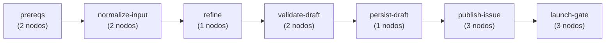
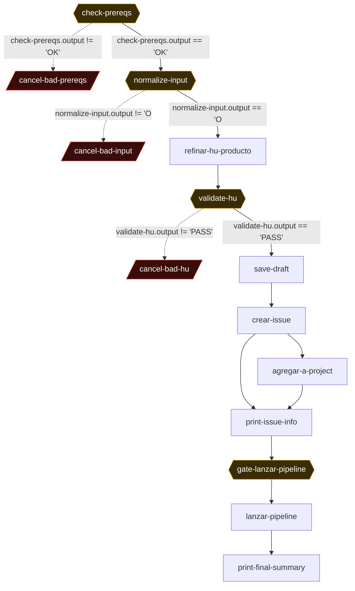

# idea-a-hu-hubara — IDEA-to-HU front-end (raw idea → GitHub Issue + Project card → optional pipeline launch)

> **`idea-a-hu-hubara.yaml`** · 14 nodos · 19 conexiones · 7 fases
> 
> Generado por extracción + **verificación adversarial** (doble lectura independiente del YAML). Fuente de verdad: el YAML. Visor interactivo: [`index.html`](./index.html).

## Propósito

Entry-point del pipeline hubara. Toma una idea de negocio en texto libre (o ruta a un .md corto, o texto pegado de un issue) y, en UNA sola pasada de AI (sin loop de refinamiento), la convierte en una HU narrativa de PRODUCTO bien formada (# Título ≤80 chars + Como/Quiero/Para + ## Acceptance criteria Given/When/Then + ## Out of scope + ## Notas técnicas opcional). Valida la estructura del draft determinísticamente, lo persiste a hubara_agency/.hubara/drafts/idea-<ts>.md, publica un Issue en GitHub con label `hubara-hu`, lo agrega al GitHub Project board con status \"Idea refined\" (si existe .archon/github-project-config.yaml), y presenta UNA única approval gate explícita: ¿lanzar `hu-hubara-pipeline` ahora en background? APROBAR dispara el super-orquestador via nohup/disown fire-and-forget; RECHAZAR termina dejando el Issue + card listos para lanzar a mano. NO produce el refinement TÉCNICO (14 secciones + §0 plugin classification) — eso lo hace el pipeline real (hu-hubara-pipeline). Este workflow solo produce la HU narrativa de producto. worktree.enabled: false — no crea branch ni HU_ID; el único side-effect en el working tree es save-draft.

**Trigger / invocación:** `archon workflow run idea-a-hu-hubara \"<idea>\"  — donde <idea> ($ARGUMENTS / $USER_MESSAGE) es: (a) texto libre de una idea de feature, (b) ruta a un .md con notas más extensas (detectado con `[ -f \"$RAW\" ]` y copiado), o (c) texto pegado de un issue existente (tratado como text plain). Sin flags. provider: claude, model: sonnet, interactive: true (tiene approval gate), worktree.enabled: false.`

**Inputs:** `$ARGUMENTS / $USER_MESSAGE — la idea cruda (texto libre, ruta a .md corto, o texto de issue pegado)`, `$ARTIFACTS_DIR — workspace efímero del run (env var real para bash + substituido como literal text)`, `.archon/github-project-config.yaml — OPCIONAL; si existe habilita Project sync (project_number, project_owner, project_id, status_field_id, status_options con 'Idea refined'). Leído por check-prereqs (smoke test) y agregar-a-project`, `gh CLI autenticado con scope project + read:project (validado por check-prereqs via gh project item-list smoke test)`, `jq disponible en PATH (validado por check-prereqs con command -v jq)`, `$ARTIFACTS_DIR/idea-original.md — escrito por normalize-input, leído por refinar-hu-producto`, `$ARTIFACTS_DIR/hu-draft.md — escrito por refinar-hu-producto (Write), leído por validate-hu/save-draft/crear-issue`, `$ARTIFACTS_DIR/.issue-url — escrito por crear-issue, leído por agregar-a-project/print-issue-info/lanzar-pipeline/print-final-summary (RESUME-SAFE: $create-issue.output se pierde tras la approval)`

## Lógica global, invariantes y env vars

MODE DETECTION: este workflow NO clasifica single vs multi_plugin (eso ocurre downstream en hubara-tech-refiner-archon §0 dentro de hu-hubara-pipeline). Su único \"modo\" interno es input-type detection en normalize-input: si `[ -f \"$RAW\" ]` copia el archivo, si no hace echo del texto a idea-original.md. KEY ENV VARS / REFS: $ARGUMENTS (la idea), $ARTIFACTS_DIR (workspace efímero; env var real en bash Y literal substituido), $create-issue.output (la URL del issue — usada en el approval message y como fallback), $<node>.output refs en los 6 when conditions. NO usa HU_ID, BRANCH ni WORKFLOW_ID — worktree.enabled: false; el HU_ID/branch los crea el pipeline downstream. BRANCH STRATEGY: ninguna — no hace checkout/detach/push; el único write al tree es save-draft (hubara_agency/.hubara/drafts/, NO commitea). RUN-WIDE INVARIANTS: (1) RESUME-SAFETY — la URL del issue se persiste a $ARTIFACTS_DIR/.issue-url porque $create-issue.output se PIERDE cuando Archon reanuda tras la approval gate (bug documentado en líneas 289-291: prior_success skipea el nodo pero no preserva stdout). Los 4 nodos post-crear-issue leen el archivo con fallback a $create-issue.output. (2) FAIL-SOFT en Project sync — agregar-a-project y print-issue-info casi nunca tumban el run (mayoría exit 0); ÚNICA excepción exit 1 = FAIL_GH_SCOPE en agregar-a-project. (3) UNA ÚNICA approval explícita (gate-lanzar-pipeline); el resto es auto. (4) 3 cancel nodes usan when negativo (output != valor-OK) y abortan con diagnóstico. (5) idempotencia GitHub — gh label create silenciado con `|| true`, item-add tolera 'already/exists/duplicate', item-list con loop de 3 reintentos para el race con auto-add. (6) PATRÓN DE EXIT CODES MIXTO: los validadores (check-prereqs, normalize-input, validate-hu) usan exit 0 + código-en-stdout → routing por VALOR de output (cancel nodes disparan por when); pero crear-issue (FATAL), agregar-a-project (solo FAIL_GH_SCOPE) y lanzar-pipeline (FAIL_NO_ISSUE_URL/FAIL_INVALID_URL) usan exit 1 → propagan como node_error y, al NO tener cancel node dedicado, cortan la cadena downstream por all_success.

## Mapa de fases




## Grafo completo

<sub>◆ = gate · borde rojo / `-.->` = cancelación · `-.->` punteado = loop-back. Para el grafo navegable usá [`index.html`](./index.html).</sub>




## Tabla de nodos (referencia rápida)

| # | Nodo | Tipo | Flags | depends_on | when |
|---|------|------|-------|-----------|------|
| 1 | `check-prereqs` | bash | ◆gate | — | — |
| 2 | `cancel-bad-prereqs` | manual | ✕cancel | `check-prereqs` | `$check-prereqs.output != 'OK'` |
| 3 | `normalize-input` | bash | ◆gate | `check-prereqs` | `$check-prereqs.output == 'OK'` |
| 4 | `cancel-bad-input` | manual | ✕cancel | `normalize-input` | `$normalize-input.output != 'OK'` |
| 5 | `refinar-hu-producto` | command | — | `normalize-input` | `$normalize-input.output == 'OK'` |
| 6 | `validate-hu` | bash | ◆gate | `refinar-hu-producto` | — |
| 7 | `cancel-bad-hu` | manual | ✕cancel | `validate-hu` | `$validate-hu.output != 'PASS'` |
| 8 | `save-draft` | bash | — | `validate-hu` | `$validate-hu.output == 'PASS'` |
| 9 | `crear-issue` | bash | — | `save-draft` | — |
| 10 | `agregar-a-project` | bash | — | `crear-issue` | — |
| 11 | `print-issue-info` | bash | — | `crear-issue`, `agregar-a-project` | — |
| 12 | `gate-lanzar-pipeline` | manual | ◆gate | `print-issue-info` | — |
| 13 | `lanzar-pipeline` | bash | — | `gate-lanzar-pipeline` | — |
| 14 | `print-final-summary` | bash | — | `lanzar-pipeline` | — |

## Nodos en detalle (por fase)

### Fase · prereqs

_FASE 0 del YAML — Pre-requisitos básicos. check-prereqs valida gh auth, jq, y (si hay config) el scope project del GitHub Project mediante un smoke test real contra el API. Es un gate de valor: cancel-bad-prereqs aborta con diagnóstico si output != OK._

#### `check-prereqs`  —  ◆gate

- **Tipo:** bash
- **Resumen:** Valida pre-requisitos de runtime: gh auth, jq, y scope project del GitHub Project (smoke test).
- **Detalle:** `set -e`. Corre `gh auth status` (redirigido) y si falla emite `FAIL_GH_AUTH` + exit 0. Verifica `command -v jq`, si no emite `FAIL_NO_JQ` + exit 0. Si existe `.archon/github-project-config.yaml`, parsea project_number (PN) y project_owner (PO) con grep+awk y hace un SMOKE TEST real: `gh project item-list $PN --owner $PO --format json --limit 1`; si falla emite `FAIL_GH_NO_PROJECT_SCOPE` + exit 0 (comentario: smoke test > parsear gh auth status que cachea scopes). Si todo pasa emite `OK`. timeout 30000.
- **depends_on:** _(raíz)_
- **trigger_rule:** `all_success`
- **produces:** output in {OK, FAIL_GH_AUTH, FAIL_NO_JQ, FAIL_GH_NO_PROJECT_SCOPE}
- **lo siguen:** `cancel-bad-prereqs`, `normalize-input`
- **⚠️ notas:** GATE de valor: su output (OK vs FAIL_*) rutea normalize-input (continue) vs cancel-bad-prereqs (cancel). Todos los paths de fallo usan exit 0 — routing por VALOR, no por exit code. El smoke-test de project scope SOLO corre si el config existe Y tiene PN y PO no vacíos; si no, el scope project NUNCA se valida (silent hole leve: un repo sin config no chequea scope, pero agregar-a-project skipea limpio si no hay config). README §7 menciona FAIL_MISSING_*/FAIL_DIRTY_PROTECTED_FILES para check-prereqs, pero esos NO existen en este YAML (son de hu-hubara-pipeline; doc-vs-YAML mismatch). Nodo de entrada (depends_on vacío).

#### `cancel-bad-prereqs`  —  ✕cancel

- **Tipo:** manual
- **Resumen:** Cancela el run con diagnóstico si check-prereqs no emitió OK.
- **Detalle:** Nodo `cancel:` (aborta el run). El mensaje incluye `$check-prereqs.output` y una tabla de diagnóstico: FAIL_GH_AUTH → `gh auth login`; FAIL_NO_JQ → `brew install jq`; FAIL_GH_NO_PROJECT_SCOPE → `gh auth refresh -s project,read:project`. Solo dispara cuando el when es true.
- **depends_on:** `check-prereqs`
- **trigger_rule:** `all_success`
- **when:** `$check-prereqs.output != 'OK'`
- **produces:** cancela el run (sin output downstream)
- **⚠️ notas:** trigger_rule default all_success — check-prereqs siempre termina con exit 0 (success) en todos sus paths de fallo, así que el cancel dispara correctamente vía el when. Fail-closed: solo aborta si output != 'OK'. Terminal → edge a END.

### Fase · normalize-input

_FASE 1 del YAML — Normalizar input. normalize-input convierte la idea cruda ($ARGUMENTS, texto o ruta a .md) en $ARTIFACTS_DIR/idea-original.md con guards de vacío y tamaño mínimo (≥20 chars). Gate de valor: cancel-bad-input aborta si output != OK._

#### `normalize-input`  —  ◆gate

- **Tipo:** bash
- **Resumen:** Normaliza la idea cruda ($ARGUMENTS) a $ARTIFACTS_DIR/idea-original.md con guards de vacío y tamaño mínimo (≥20 chars).
- **Detalle:** Lee `RAW="$ARGUMENTS"`. Guard 1: trimea whitespace (`tr -d '[:space:]'`); si queda vacío emite `FAIL_EMPTY_INPUT` + exit 0. Si `[ -f "$RAW" ]` copia ese archivo a idea-original.md; si no, hace `echo "$RAW" >` idea-original.md. Guard 2: mide `SIZE=$(wc -c < idea-original.md)`; si SIZE < 20 emite `FAIL_TOO_SHORT_${SIZE}` + exit 0. Si todo pasa emite `OK`. timeout 30000.
- **depends_on:** `check-prereqs`
- **trigger_rule:** `all_success`
- **when:** `$check-prereqs.output == 'OK'`
- **produces:** output in {OK, FAIL_EMPTY_INPUT, FAIL_TOO_SHORT_<N>}
- **lo siguen:** `cancel-bad-input`, `refinar-hu-producto`
- **⚠️ notas:** GATE de valor: su output (OK vs FAIL_*) rutea refinar-hu-producto (continue) vs cancel-bad-input (cancel). Gated además por when sobre check-prereqs.output == 'OK' (redundante con dependencia + cancel-bad-prereqs, pero fail-closed). NO tiene `set -e` (a diferencia de otros bash nodes), pero usa exit 0 explícito en cada guard. El umbral de 20 chars aquí es distinto del de >200 bytes que aplica validate-hu al draft.

#### `cancel-bad-input`  —  ✕cancel

- **Tipo:** manual
- **Resumen:** Cancela el run si la idea normalizada fue inválida (vacía o <20 chars).
- **Detalle:** Nodo `cancel:` (aborta). Mensaje: 'Input inválido: $normalize-input.output. Pasame una idea no vacía (mínimo 20 chars): archon workflow run idea-a-hu-hubara ...'. Dispara solo si when true.
- **depends_on:** `normalize-input`
- **trigger_rule:** `all_success`
- **when:** `$normalize-input.output != 'OK'`
- **produces:** cancela el run
- **⚠️ notas:** normalize-input siempre exit 0 → success → all_success satisface → el when discrimina. Fail-closed. Terminal → edge a END.

### Fase · refine

_FASE 2 del YAML — Refinar la idea a HU narrativa en UNA sola pasada de AI (prompt LLM con allowed_tools [Read, Write], sin loop, sin gate_message). Produce $ARTIFACTS_DIR/hu-draft.md. Explícitamente NO usa el skill hubara-tech-refiner-archon (no es el refinement técnico de 14 secciones)._

#### `refinar-hu-producto`

- **Tipo:** command · invoca `(prompt inline — NO invoca el skill hubara-tech-refiner-archon; ver notes)`
- **Resumen:** Nodo AI (prompt LLM) que genera la HU narrativa en UNA sola pasada y la escribe a $ARTIFACTS_DIR/hu-draft.md.
- **Detalle:** Nodo de prompt LLM (NO bash, NO skill): tiene `prompt:`, `allowed_tools: [Read, Write]`, `idle_timeout: 600000` (10 min). El prompt instruye actuar como product owner de AgencyHubara: Paso 1 lee idea-original.md (opcionalmente hubara-architecture-guide SKILL.md + sections/01-general.md si la idea menciona plugin/agente/Temporal); Paso 2 escribe hu-draft.md con estructura EXACTA (# Título ≤80 chars sin punto; Como/Quiero/Para; ## Acceptance criteria 3-5 bullets Given/When/Then; ## Out of scope ≥2 items; ## Notas técnicas opcional); Paso 3 reglas de calidad: título accionable, narrativa completa, AC empiezan con Given, out-of-scope ≥2, doc >200 bytes, INFERIR lo que falte (NO preguntar al humano, NO usar placeholders <TBD>). Termina al escribir el archivo — NO emite promise.
- **depends_on:** `normalize-input`
- **trigger_rule:** `all_success`
- **when:** `$normalize-input.output == 'OK'`
- **produces:** $ARTIFACTS_DIR/hu-draft.md (efecto secundario vía Write); NO emite output estructurado ni promise
- **lo siguen:** `validate-hu`
- **⚠️ notas:** GOTCHA explícito en el YAML (líneas 132-136): este nodo NO usa el skill hubara-tech-refiner-archon — ese skill produce el refinement TÉCNICO (14 secciones + §0 plugin classification). Este nodo solo produce la HU narrativa de producto. UNA pasada, SIN loop (no hay loop: block, ni max_iterations, ni gate_message — explícito en línea 207 'no necesitás emitir promise'). Diseño deliberado: si el draft queda mal el operador (a) rechaza gate-lanzar-pipeline, (b) edita el issue en GitHub, o (c) borra el issue y re-corre. Tipado 'command' por falta de mejor encaje (es un nodo prompt/AI puro con allowed_tools, NO un .archon/commands/<name>.md ni un .claude/skills). Su output NO se valida por valor — la validación es validate-hu sobre el archivo escrito. RIESGO SILENT-HOLE: si el AI no escribe el archivo / hace timeout / escribe basura, no hay promise ni signal que lo detecte aquí; recae 100% en validate-hu — pero validate-hu depende con all_success, así que si este nodo termina en node_error/timeout, validate-hu NO corre y NO hay cancel con all_done que capture ese caso (run colgado/fallado sin diagnóstico).

### Fase · validate-draft

_FASE 3 del YAML — Validar estructura del HU draft. validate-hu es un gate determinístico (existencia, >200 bytes, título, narrativa 'como', ≥2 AC Given, sección scope). cancel-bad-hu aborta si output != PASS (la única red de seguridad para un draft AI defectuoso, pero solo si refinar-hu-producto terminó success)._

#### `validate-hu`  —  ◆gate

- **Tipo:** bash
- **Resumen:** Valida estructuralmente $ARTIFACTS_DIR/hu-draft.md (existe, >200 bytes, título, narrativa, ≥2 AC Given, sección scope).
- **Detalle:** Early-exit emitiendo un código por cada fallo: `test -f` → FAIL_NOT_EXISTS; `wc -c > 200` → FAIL_TOO_SHORT; `grep -qE '^#\s+\S'` → FAIL_NO_TITLE; `grep -qiE 'como\s+'` → FAIL_NO_NARRATIVE; cuenta bullets Given (`grep -cE '^[[:space:]-]*\*?\*?Given'`, default 0); si <2 → FAIL_FEW_AC_$ac_count; `grep -qiE '^##.*scope'` → FAIL_NO_SCOPE_SECTION. Si todo pasa emite `PASS`. timeout 10000. NO tiene when (corre siempre que refinar-hu-producto haya tenido success).
- **depends_on:** `refinar-hu-producto`
- **trigger_rule:** `all_success`
- **produces:** output in {PASS, FAIL_NOT_EXISTS, FAIL_TOO_SHORT, FAIL_NO_TITLE, FAIL_NO_NARRATIVE, FAIL_FEW_AC_<N>, FAIL_NO_SCOPE_SECTION}
- **lo siguen:** `cancel-bad-hu`, `save-draft`
- **⚠️ notas:** GATE estructural cuyo VALOR (PASS vs FAIL_*) rutea save-draft (continue) vs cancel-bad-hu (cancel). Todos los fallos hacen exit 0 → siempre success → routing por valor. La validación de narrativa busca literal 'como' case-insensitive en cualquier parte (no ancla a la línea narrativa) — un 'como' en otro contexto la satisface (silent hole leve). El conteo de AC busca Given con prefijo opcional de espacios/guion/asteriscos — alineado con el formato `- **Given**` del prompt. NO tiene when (confirmado líneas 213-227): es la única red de seguridad para un draft AI defectuoso, pero solo corre si refinar-hu-producto terminó success (all_success).

#### `cancel-bad-hu`  —  ✕cancel

- **Tipo:** manual
- **Resumen:** Cancela el run si la validación estructural del draft no dio PASS.
- **Detalle:** Nodo `cancel:` (aborta). Mensaje: 'HU draft validation FAILED: $validate-hu.output. Re-lanzá: archon workflow run idea-a-hu-hubara ...'. Dispara solo si when true.
- **depends_on:** `validate-hu`
- **trigger_rule:** `all_success`
- **when:** `$validate-hu.output != 'PASS'`
- **produces:** cancela el run
- **⚠️ notas:** validate-hu siempre exit 0 → success → el when discrimina PASS vs FAIL. Fail-closed. Terminal → edge a END.

### Fase · persist-draft

_FASE 4 del YAML — Persistir el draft validado a hubara_agency/.hubara/drafts/idea-<ts>.md (siempre, antes de publicar). Único side-effect del workflow en el working tree; no commitea._

#### `save-draft`

- **Tipo:** bash
- **Resumen:** Persiste el draft validado a hubara_agency/.hubara/drafts/idea-<timestamp>.md (siempre, antes de publicar).
- **Detalle:** `set -e`. Crea el dir `hubara_agency/.hubara/drafts` con mkdir -p. Construye `DRAFT_PATH=hubara_agency/.hubara/drafts/idea-$(date -u +%Y%m%d-%H%M%S).md` y copia hu-draft.md ahí. Emite la ruta del draft (DRAFT_PATH) a stdout.
- **depends_on:** `validate-hu`
- **trigger_rule:** `all_success`
- **when:** `$validate-hu.output == 'PASS'`
- **produces:** output = ruta del draft persistido (hubara_agency/.hubara/drafts/idea-<ts>.md)
- **lo siguen:** `crear-issue`
- **⚠️ notas:** Escribe en el working tree directamente (worktree.enabled: false). El draft NO se commitea por este workflow (solo lo deja en el tree). when redundante con la dependencia + cancel-bad-hu pero fail-closed. Comparte dependencia (validate-hu) con cancel-bad-hu — son ramas mutuamente excluyentes por when (PASS vs !=PASS). ÚNICO side-effect del workflow en el tree.

### Fase · publish-issue

_FASE 5 del YAML — Publicar Issue + agregar al Project (auto, sin gate). crear-issue publica el Issue con label hubara-hu y persiste la URL a .issue-url (resume-safe, con retry); fan-out a agregar-a-project (lo agrega al board con status 'Idea refined', fail-soft) y print-issue-info (fan-in de ambos con trigger_rule none_failed_min_one_success, muestra el banner pre-gate)._

#### `crear-issue`

- **Tipo:** bash
- **Resumen:** Crea el Issue en GitHub con label hubara-hu, parsea la URL y la persiste a $ARTIFACTS_DIR/.issue-url.
- **Detalle:** `set -e`. Extrae TITLE de la primera línea `# ` del draft (`grep -m1 '^# ' | sed 's/^# //' | head -c 120`); si vacío → `FATAL: no extrajo título` + exit 1. Crea la label `hubara-hu` (color 0E8A16) de forma idempotente (`gh label create ... || true`, log a .gh-label.log). Corre `gh issue create --title --body-file hu-draft.md --label hubara-hu` (log a .gh-create.log); si RC != 0 → FATAL + tail log + exit 1. Parsea ISSUE_URL del log con `grep -oE 'https://github\.com/[^ ]+/issues/[0-9]+'`; si vacío → FATAL + exit 1. CRÍTICO: persiste la URL a $ARTIFACTS_DIR/.issue-url (sobrevive al resume tras approval) y la emite a stdout. retry: max_attempts 2, delay_ms 5000, on_error transient. timeout 60000.
- **depends_on:** `save-draft`
- **trigger_rule:** `all_success`
- **produces:** output = ISSUE_URL (https://github.com/.../issues/N); side-effects: $ARTIFACTS_DIR/.issue-url, Issue en GitHub con label hubara-hu
- **lo siguen:** `agregar-a-project`, `print-issue-info`
- **⚠️ notas:** ÚNICO nodo con retry block (transient, 2 intentos). Los fallos aquí SÍ usan exit 1 (FATAL) — distinto del patrón exit-0-con-código de los validadores; un FATAL propaga como node_error y (sin cancel node propio) cortaría la cadena downstream por all_success dejando el run fallado aquí sin diagnóstico de cancel. GOTCHA documentado (líneas 289-291): $create-issue.output se PIERDE en el resume post-approval (prior_success skipea el nodo pero no preserva stdout) — por eso la URL se persiste a archivo y todos los downstream leen el archivo con fallback a $create-issue.output. La label create silenciada con `|| true`. El --label hubara-hu puede disparar un auto-add workflow del Project (race con agregar-a-project, manejado con el loop de 3 reintentos allí). FAN-OUT: tiene 2 dependientes (agregar-a-project + print-issue-info).

#### `agregar-a-project`

- **Tipo:** bash
- **Resumen:** Agrega el issue al GitHub Project board y le setea status 'Idea refined' (fail-soft, skip si no hay config).
- **Detalle:** Si NO existe .archon/github-project-config.yaml → `echo skipped no_config` + exit 0. Lee ISSUE_URL de $ARTIFACTS_DIR/.issue-url (fallback a $create-issue.output); si vacío → WARN + exit 0. Parsea PN/PO/PID/FID del config. Step 1: `gh project item-add` (log .add.log); si RC!=0 y log matchea 'missing required scopes|read:project|gh auth refresh' → FAIL_GH_SCOPE + exit 1; si matchea 'already|exists|duplicate' → 'item ya estaba'; else WARN. Step 2: encuentra ITEM_ID con loop de 3 intentos (`gh project item-list ... | jq` filtrando por content.url, sleep attempt*2, race con auto-add); si no lo encuentra → WARN + exit 0. Step 3: extrae OID (option_id de 'Idea refined') del config con awk; si vacío → WARN + exit 0. Step 4: `gh project item-edit --single-select-option-id $OID` (log .edit.log); si RC!=0 → FAIL item-edit + tail + exit 0 (fail-soft). Si OK emite '✅ status Idea refined set'. timeout 90000.
- **depends_on:** `crear-issue`
- **trigger_rule:** `all_success`
- **produces:** output in {skipped no_config, WARN ..., item-add OK, item ya estaba en project, FAIL_GH_SCOPE: ..., item_id=..., option_id=..., ✅ status 'Idea refined' set ...} (informativo)
- **lo siguen:** `print-issue-info`
- **⚠️ notas:** FAIL-SOFT por diseño: casi todos los paths hacen exit 0 (no rompen el run). ÚNICA excepción: FAIL_GH_SCOPE hace exit 1 — propagaría como node_error y cortaría la cadena por all_success (no hay cancel node que lo capture; el run quedaría fallado aquí Y print-issue-info NO correría porque su trigger_rule none_failed_min_one_success exige ningún dep fallido). El output se referencia en print-issue-info (PROJECT_STATUS=$agregar-a-project.output) pero NO sobrevive al resume post-approval igual que crear-issue.output (no se persiste a archivo) — seguro solo porque print-issue-info corre PRE-approval. El loop interno de 3 intentos maneja el race con el auto-add del Project disparado por la label.

#### `print-issue-info`

- **Tipo:** bash
- **Resumen:** Imprime un banner con la URL del issue y el status del Project antes de la approval gate.
- **Detalle:** Lee ISSUE_URL de $ARTIFACTS_DIR/.issue-url (fallback a $create-issue.output). Toma PROJECT_STATUS=$agregar-a-project.output. Imprime un banner ASCII (heredoc) con '✅ Issue creado', la URL, el Project status, y la lista de fases que recorrerá hu-hubara-pipeline (Refining → Refined → Planning → Planned → Implementing → Reviewing → Done). timeout 5000.
- **depends_on:** `crear-issue`, `agregar-a-project`
- **trigger_rule:** `none_failed_min_one_success`
- **produces:** banner informativo a stdout (no estructurado)
- **lo siguen:** `gate-lanzar-pipeline`
- **⚠️ notas:** ÚNICO nodo con trigger_rule explícito y NO estándar: `none_failed_min_one_success` (línea 404 — NO pertenece al set base all_success/all_done/one_success del modelo; variante Archon: ningún dep falló Y al menos uno tuvo éxito). Le permite correr aunque agregar-a-project haya hecho exit 0 con WARN/skip, pero NO si crear-issue o agregar-a-project fallaron (exit!=0). FAN-IN de 2 deps (crear-issue + agregar-a-project). PROJECT_STATUS puede venir vacío en resume post-approval (no persistido) — pero este nodo corre PRE-approval así que normalmente está poblado. Si agregar-a-project hizo FAIL_GH_SCOPE (exit 1), none_failed es false → print-issue-info NO corre → cadena cortada antes del gate.

### Fase · launch-gate

_FASE 6 del YAML — Gate ÚNICO + lanzamiento. gate-lanzar-pipeline es la única approval explícita; si se aprueba, lanzar-pipeline dispara hu-hubara-pipeline en background (nohup/disown, env -u CLAUDECODE, fire-and-forget) leyendo la URL desde .issue-url; print-final-summary imprime el banner final. Si se rechaza, el run termina dejando Issue + card listos._

#### `gate-lanzar-pipeline`  —  ◆gate

- **Tipo:** manual
- **Resumen:** ÚNICA approval gate del workflow: ¿lanzar hu-hubara-pipeline ahora en background?
- **Detalle:** Nodo `approval:` con `message:` largo (líneas 413-437). Muestra: Issue publicado ($create-issue.output), Card en 'Idea refined', y la decisión. APROBAR → arranca hu-hubara-pipeline en background (~$0.50-1.00, 20-40 min) describiendo los 7 pasos (refinar técnico → plan plugin-level → single inline / multi fan-out → implementar con gates determinísticos → validación final + PR único → review 5 agentes → Project sync). RECHAZAR → termina; el comando manual queda impreso: `archon workflow run hu-hubara-pipeline "$create-issue.output"`.
- **depends_on:** `print-issue-info`
- **trigger_rule:** `all_success`
- **produces:** decisión humana approve/reject que rutea lanzar-pipeline (approve → corre; reject → run termina sin banner final)
- **lo siguen:** `lanzar-pipeline`
- **⚠️ notas:** is_gate=true (nodo approval). El message referencia $create-issue.output (la URL) — se preserva en el message porque se renderiza ANTES del resume; pero el RESUME del nodo lanzar-pipeline ya NO puede confiar en $create-issue.output (de ahí la lectura desde .issue-url). Esta es la única approval; todo lo anterior es auto. Si el operador rechaza, lanzar-pipeline (su único downstream) NO corre por all_success y el run termina. Gate de routing humano: el VALOR (approve/reject) decide continue vs stop. No tiene when.

#### `lanzar-pipeline`

- **Tipo:** bash · invoca `archon workflow run hu-hubara-pipeline (sub-workflow fire-and-forget en background via nohup/disown — NO es una sub-pipeline invocation gestionada por Archon; es un proceso detached que NO se espera ni se mergea)`
- **Resumen:** Dispara hu-hubara-pipeline en background vía nohup/disown con la URL del issue (resume-safe, fire-and-forget).
- **Detalle:** Lee ISSUE_URL de $ARTIFACTS_DIR/.issue-url (fallback a $create-issue.output, comentario: sobrevive al resume tras approval). Si vacío → FAIL_NO_ISSUE_URL + exit 1. Valida la URL con `grep -qE '^https://github\.com/.+/issues/[0-9]+'`; si no matchea → FAIL_INVALID_URL + exit 1. Crea LOG_FILE=$HOME/.archon/logs/hubara-pipeline-<epoch>.log (mkdir -p). Lanza en background: `(env -u CLAUDECODE ARCHON_SUPPRESS_NESTED_CLAUDE_WARNING=1 nohup archon workflow run hu-hubara-pipeline "$ISSUE_URL" > LOG_FILE 2>&1 & disown) 2>/dev/null` y emite `pipeline_triggered_log=$LOG_FILE` (&&) o `pipeline_trigger_failed_run_manually` (||). timeout 10000.
- **depends_on:** `gate-lanzar-pipeline`
- **trigger_rule:** `all_success`
- **produces:** output in {pipeline_triggered_log=<path>, pipeline_trigger_failed_run_manually, FAIL_NO_ISSUE_URL ..., FAIL_INVALID_URL: ...}
- **lo siguen:** `print-final-summary`
- **⚠️ notas:** `env -u CLAUDECODE` + ARCHON_SUPPRESS_NESTED_CLAUDE_WARNING=1 evita el 'may hang silently' del nested archon-in-claude-code. Fire-and-forget: NO espera ni mergea resultado del pipeline lanzado (a diferencia de la rama-A inline del pipeline real). Los FAIL_* aquí usan exit 1 (FATAL) → si la URL falta/es inválida, propaga node_error y print-final-summary (all_success) NO corre. El éxito del background nunca es exit!=0 por el `&& ... || echo ...` (captura el resultado del subshell). Smart-resume del propio idea-a-hu-hubara: si se re-corre, este nodo ya estaría en prior_success y se skipearía (de ahí la dependencia en .issue-url y no en $create-issue.output). No tiene when.

#### `print-final-summary`

- **Tipo:** bash
- **Resumen:** Imprime el banner final del workflow con la URL del issue y el estado del lanzamiento del pipeline.
- **Detalle:** Lee ISSUE_URL de $ARTIFACTS_DIR/.issue-url (fallback a $create-issue.output). Toma PIPELINE=$lanzar-pipeline.output. Imprime banner ASCII (heredoc) '🎉 idea-a-hu-hubara completo' con Issue, Pipeline status, y próximos pasos (mirar Project board, esperar status auto, ver PR+comment del review, y el comando manual de fallback si fue pipeline_trigger_failed_run_manually). timeout 5000.
- **depends_on:** `lanzar-pipeline`
- **trigger_rule:** `all_success`
- **produces:** banner final informativo a stdout
- **⚠️ notas:** Nodo TERMINAL (ningún nodo depende de él) → edge a END. Solo corre si lanzar-pipeline tuvo éxito (all_success); si lanzar-pipeline emitió FAIL_* con exit 1, este nodo NO corre. Si el operador rechazó la approval, este nodo NO corre (lanzar-pipeline no corrió). Banner cosmético sin efectos. No tiene when.

## Conexiones (aristas)

Cada arista es un par `depends_on → nodo`. `kind`: sequence (secuencia normal) · gate (la condición `when` enruta) · cancel (va a un nodo de cancelación) · loop-back (reintento) · fan-out/fan-in (sub-pipelines).

| Desde | Hacia | kind | Condición (when) |
|-------|-------|------|------------------|
| `START` | `check-prereqs` | sequence | — |
| `check-prereqs` | `cancel-bad-prereqs` | cancel | `$check-prereqs.output != 'OK'` |
| `check-prereqs` | `normalize-input` | gate | `$check-prereqs.output == 'OK'` |
| `normalize-input` | `cancel-bad-input` | cancel | `$normalize-input.output != 'OK'` |
| `normalize-input` | `refinar-hu-producto` | gate | `$normalize-input.output == 'OK'` |
| `refinar-hu-producto` | `validate-hu` | sequence | — |
| `validate-hu` | `cancel-bad-hu` | cancel | `$validate-hu.output != 'PASS'` |
| `validate-hu` | `save-draft` | gate | `$validate-hu.output == 'PASS'` |
| `save-draft` | `crear-issue` | sequence | — |
| `crear-issue` | `agregar-a-project` | fan-out | — |
| `crear-issue` | `print-issue-info` | fan-out | — |
| `agregar-a-project` | `print-issue-info` | fan-in | — |
| `print-issue-info` | `gate-lanzar-pipeline` | sequence | — |
| `gate-lanzar-pipeline` | `lanzar-pipeline` | gate | — |
| `lanzar-pipeline` | `print-final-summary` | sequence | — |
| `print-final-summary` | `END` | sequence | — |
| `cancel-bad-prereqs` | `END` | sequence | — |
| `cancel-bad-input` | `END` | sequence | — |
| `cancel-bad-hu` | `END` | sequence | — |

## Notas de verificación (segunda lectura independiente)

- AUTHORITATIVE COUNT (independiente, desde cero): leí el archivo COMPLETO (496 líneas, single Read) + dos greps de cross-check de keys estructurales. El YAML define EXACTAMENTE 14 nodos (un `- id:` cada uno): check-prereqs(53), cancel-bad-prereqs(76), normalize-input(92), cancel-bad-input(118), refinar-hu-producto(138), validate-hu(213), cancel-bad-hu(229), save-draft(238), crear-issue(252), agregar-a-project(301), print-issue-info(381), gate-lanzar-pipeline(411), lanzar-pipeline(439), print-final-summary(469). node_count=14, nodes[]=14. CONFIRMADO: el first pass acertó node_count=14, NO inventó nodos, NO faltó ninguno.
- Tipos de nodo (independiente): 9 bash (check-prereqs, normalize-input, validate-hu, save-draft, crear-issue, agregar-a-project, print-issue-info, lanzar-pipeline, print-final-summary), 3 cancel (cancel-bad-prereqs/input/hu → mapeados a type 'manual' is_cancel=true), 1 approval (gate-lanzar-pipeline → 'manual' is_gate=true), 1 prompt/AI (refinar-hu-producto, con `prompt:` + `allowed_tools:[Read,Write]` + `idle_timeout:600000` → mapeado a 'command' por ser nodo prompt puro, NO un .archon/commands/ ni un skill). 9+3+1+1=14. CORRIJO una incoherencia interna de la verification del first pass: dijo '8 bash' en una nota y '9 bash' en otra — el conteo CORRECTO es 9 bash.
- DISCREPANCIA CORREGIDA #1 (is_gate): el first pass marcó SOLO validate-hu como is_gate=true. Pero check-prereqs y normalize-input son ESTRUCTURALMENTE el mismo gate de valor — su output (OK vs FAIL_*) rutea continue (downstream) vs cancel (cancel-bad-prereqs / cancel-bad-input), exactamente la definición del modelo ('GATE node: its output VALUE routes the downstream chain continue vs cancel'). CORREGIDO: marqué los TRES (check-prereqs, normalize-input, validate-hu) como is_gate=true para coherencia. El first pass era inconsistente al flaggear solo uno de los tres gates idénticos.
- DISCREPANCIA CORREGIDA #2 (edge kinds en el fan-out/fan-in de crear-issue→print-issue-info): el first pass marcó crear-issue→agregar-a-project como 'sequence' y crear-issue→print-issue-info como 'sequence', con solo agregar-a-project→print-issue-info como 'fan-in'. CORREGIDO: crear-issue tiene 2 dependientes (fan-out), así que crear-issue→agregar-a-project y crear-issue→print-issue-info son ambos kind 'fan-out'; print-issue-info tiene 2 deps (fan-in), así que crear-issue→print-issue-info y agregar-a-project→print-issue-info convergen — marqué agregar-a-project→print-issue-info como 'fan-in'. El conteo total de edges NO cambia.
- when conditions VERBATIM verificados línea por línea (vía grep): SOLO 6 nodos tienen when — cancel-bad-prereqs(85) '$check-prereqs.output != \'OK\''; normalize-input(115) '$check-prereqs.output == \'OK\''; cancel-bad-input(120) '$normalize-input.output != \'OK\''; refinar-hu-producto(140) '$normalize-input.output == \'OK\''; cancel-bad-hu(231) '$validate-hu.output != \'PASS\''; save-draft(245) '$validate-hu.output == \'PASS\''. Los otros 8 nodos (check-prereqs, validate-hu, crear-issue, agregar-a-project, print-issue-info, gate-lanzar-pipeline, lanzar-pipeline, print-final-summary) NO tienen when. CONFIRMADO: el first pass acertó TODOS los when, incluyendo el sutil — validate-hu NO tiene when (correctamente vacío).
- trigger_rule verificado (vía grep): SOLO print-issue-info tiene trigger_rule explícito = 'none_failed_min_one_success' (línea 404, variante Archon fuera del set base all_success/all_done/one_success). Los otros 13 nodos lo omiten → default all_success. CONFIRMADO: el first pass acertó esto exactamente, reportando el valor verbatim del YAML en vez de forzarlo al enum base.
- depends_on verificado (vía grep, línea por línea): check-prereqs []; cancel-bad-prereqs/normalize-input/refinar-hu-producto [check-prereqs|normalize-input]; cancel-bad-input [normalize-input]; validate-hu [refinar-hu-producto]; cancel-bad-hu/save-draft [validate-hu]; crear-issue [save-draft]; agregar-a-project [crear-issue]; print-issue-info [crear-issue, agregar-a-project]; gate-lanzar-pipeline [print-issue-info]; lanzar-pipeline [gate-lanzar-pipeline]; print-final-summary [lanzar-pipeline]. CONFIRMADO: TODOS los depends_on del first pass son correctos, incluyendo el único multi-dep (print-issue-info con 2).
- is_cancel verificado: 3 nodos con `cancel:` key = cancel-bad-prereqs(77), cancel-bad-input(119), cancel-bad-hu(230). CONFIRMADO: first pass correcto. is_gate: gate-lanzar-pipeline (approval, 413) correcto; + las 3 correcciones de gate de valor arriba (#1).
- Edges: 19 totales (14 dependency edges + 1 START→check-prereqs + 4 →END: print-final-summary terminal + los 3 cancel nodes terminales). CONFIRMADO: el first pass tenía 19 edges con el mismo grafo exacto. Las ÚNICAS diferencias son las 2 re-etiquetas de kind del fan-out de crear-issue (discrepancia #2); ningún edge faltante ni inventado, ningún from/to incorrecto, ninguna condition incorrecta.
- Branch/HU_ID: CONFIRMADO worktree.enabled:false (línea 46) — el workflow NO usa HU_ID/BRANCH/WORKFLOW_ID, NO hace checkout/detach/push. Único write al tree: save-draft → hubara_agency/.hubara/drafts/. El HU_ID y branch hu/<HU_ID> los crea el pipeline downstream. First pass correcto.
- Loops: CONFIRMADO ningún nodo tiene `loop:` block. refinar-hu-producto es one-shot (línea 207: 'no necesitás emitir promise'; sin max_iterations/until/gate_message). First pass correcto.
- GOTCHAS confirmados del YAML (relevantes para entender el grafo, ambos capturados correctamente por el first pass): (a) resume-safety líneas 289-291 — $create-issue.output se pierde tras la approval, por eso .issue-url se persiste a archivo y 4 downstream leen con fallback; (b) líneas 132-136 — refinar-hu-producto explícitamente NO es el skill hubara-tech-refiner-archon (solo HU narrativa, no refinement técnico).
- RIESGOS SILENT-HOLE confirmados (ambos ya notados por el first pass, los mantengo): (1) si refinar-hu-producto (AI) termina en node_error/timeout, validate-hu (all_success) NO corre y NO hay cancel con all_done → run colgado sin diagnóstico. (2) FAIL_GH_SCOPE en agregar-a-project (exit 1) propaga como node_error sin cancel dedicado → corta la cadena (y none_failed_min_one_success de print-issue-info pasa a false). (3) check-prereqs solo valida project scope si el config existe con PN+PO no vacíos.
- VEREDICTO: el first pass estaba SUSTANCIALMENTE CORRECTO en la espina dorsal (14 nodos, todos los depends_on, todos los when verbatim incl. el sutil validate-hu sin when, el trigger_rule no estándar, is_cancel, los 19 edges con el grafo correcto). Las ÚNICAS correcciones aplicadas: (#1) marqué check-prereqs y normalize-input también como is_gate=true para coherencia con validate-hu (los tres son gates de valor idénticos); (#2) re-etiqueté los 2 edges salientes de crear-issue como fan-out (tiene 2 dependientes). Ninguna corrección afecta node_count (14), el conteo de edges (19), ni la topología.

---

# Recorrido narrativo

## idea-a-hu-hubara — Recorrido narrativo para rediseño

Este es el **entry-point** del pipeline hubara: un front-end "IDEA-to-HU" que toma una idea de negocio cruda y la convierte, en una sola pasada, en un GitHub Issue + tarjeta de Project listos para alimentar al super-orquestador `hu-hubara-pipeline`. Lo que sigue describe una corrida completa, su topología, sus gates, sus caminos de cancelación y los huecos conocidos — todo derivado exclusivamente del modelo verificado.

### 1. Propósito y trigger

**Qué problema resuelve.** Convierte una idea en texto libre (o ruta a un `.md` corto, o texto pegado de un issue existente) en una **HU narrativa de PRODUCTO** bien formada, con estructura exacta:

- `# Título` (≤80 chars, sin punto final)
- bloque `Como / Quiero / Para`
- `## Acceptance criteria` con 3-5 bullets `Given/When/Then`
- `## Out of scope` (≥2 items)
- `## Notas técnicas` (opcional)

El workflow valida la estructura determinísticamente, persiste el draft a `hubara_agency/.hubara/drafts/idea-<ts>.md`, publica un Issue en GitHub con label `hubara-hu`, lo agrega al Project board con status `"Idea refined"` (si hay config), y presenta **una única approval gate**: ¿lanzar `hu-hubara-pipeline` ahora en background?

**Límite de alcance explícito.** Este workflow **NO** produce el refinement TÉCNICO (las 14 secciones + §0 plugin classification) — eso lo hace el pipeline real downstream vía `hubara-tech-refiner-archon`. Acá solo se genera la HU narrativa de producto. Tampoco clasifica `single` vs `multi_plugin`.

**Cómo se invoca.**
```
archon workflow run idea-a-hu-hubara "<idea>"
```
Donde `<idea>` (`$ARGUMENTS` / `$USER_MESSAGE`) es una de tres formas, **sin flags**:
- (a) texto libre de una idea de feature,
- (b) ruta a un `.md` con notas más extensas (detectado con `[ -f "$RAW" ]` y copiado),
- (c) texto pegado de un issue existente (tratado como texto plano).

Config del workflow: `provider: claude`, `model: sonnet`, `interactive: true` (por la approval gate), `worktree.enabled: false`.

**Inputs.**
- `$ARGUMENTS` / `$USER_MESSAGE` — la idea cruda.
- `$ARTIFACTS_DIR` — workspace efímero del run (env var real en bash, y substituido como literal en otros contextos).
- `.archon/github-project-config.yaml` — **OPCIONAL**; si existe habilita el Project sync (`project_number`, `project_owner`, `project_id`, `status_field_id`, `status_options` con `Idea refined`). Lo leen `check-prereqs` (smoke test) y `agregar-a-project`.
- `gh` CLI autenticado con scope `project` + `read:project` (validado por el smoke test de `check-prereqs`).
- `jq` en PATH (validado con `command -v jq`).
- Artefactos intermedios: `$ARTIFACTS_DIR/idea-original.md` (escrito por `normalize-input`), `$ARTIFACTS_DIR/hu-draft.md` (escrito por `refinar-hu-producto`), `$ARTIFACTS_DIR/.issue-url` (escrito por `crear-issue`, leído por los 4 nodos post-issue — **resume-safe**).

El grafo es **lineal con un único fan-out/fan-in** (en la fase de publicación) y **una sola approval gate** al final. 14 nodos, 19 edges.

### 2. Recorrido fase por fase

#### FASE 0 — `prereqs` (`check-prereqs`, `cancel-bad-prereqs`)

`START → check-prereqs`. Corre con `set -e` y valida pre-requisitos de runtime emitiendo un código en stdout (todos los fallos con **exit 0** → routing por VALOR, no por exit code):

1. `gh auth status` → si falla emite `FAIL_GH_AUTH`.
2. `command -v jq` → si no está emite `FAIL_NO_JQ`.
3. Si existe `.archon/github-project-config.yaml`, parsea `project_number` (PN) y `project_owner` (PO) y hace un **SMOKE TEST real** contra el API: `gh project item-list $PN --owner $PO --format json --limit 1`; si falla emite `FAIL_GH_NO_PROJECT_SCOPE`. (El comentario del nodo justifica el smoke test como mejor que parsear `gh auth status`, que cachea scopes.)
4. Si todo pasa emite `OK`. `timeout 30000`.

Es un **gate de valor**. Su salida enruta dos caminos mutuamente excluyentes:
- **Camino OK** → `check-prereqs.output == 'OK'` habilita `normalize-input` (edge `gate`).
- **Camino cancel** → `cancel-bad-prereqs` con `when: $check-prereqs.output != 'OK'`. Es un nodo `cancel:` que aborta el run con tabla de diagnóstico (`FAIL_GH_AUTH → gh auth login`; `FAIL_NO_JQ → brew install jq`; `FAIL_GH_NO_PROJECT_SCOPE → gh auth refresh -s project,read:project`). Como `check-prereqs` siempre termina con exit 0 (success), el `trigger_rule: all_success` se satisface y el `when` discrimina correctamente. Terminal → `END`.

Nota de cobertura: el smoke test de project scope **solo** corre si el config existe Y tiene PN+PO no vacíos; si no, el scope `project` nunca se valida (hueco leve, pero benigno porque `agregar-a-project` skipea limpio cuando no hay config).

#### FASE 1 — `normalize-input` (`normalize-input`, `cancel-bad-input`)

`normalize-input` (gated por `when: $check-prereqs.output == 'OK'`) convierte `$ARGUMENTS` en `$ARTIFACTS_DIR/idea-original.md` con dos guards:

- **Guard 1 (vacío):** trimea whitespace con `tr -d '[:space:]'`; si queda vacío emite `FAIL_EMPTY_INPUT` + exit 0.
- **Detección de tipo de input:** si `[ -f "$RAW" ]` copia ese archivo; si no, hace `echo "$RAW" >` a `idea-original.md`. (Este es el único "modo" interno del workflow — input-type detection, NO clasificación de plugins.)
- **Guard 2 (tamaño mínimo):** `SIZE=$(wc -c < idea-original.md)`; si `SIZE < 20` emite `FAIL_TOO_SHORT_${SIZE}` + exit 0.
- Si todo pasa emite `OK`. `timeout 30000`. (Este nodo **no** tiene `set -e`, pero usa exit 0 explícito en cada guard.)

Gate de valor con dos caminos:
- **Camino OK** → `normalize-input.output == 'OK'` habilita `refinar-hu-producto`.
- **Camino cancel** → `cancel-bad-input` con `when: $normalize-input.output != 'OK'`: nodo `cancel:` que aborta pidiendo una idea no vacía de mínimo 20 chars. Terminal → `END`.

(El `when` sobre `check-prereqs.output == 'OK'` en `normalize-input` es redundante con la dependencia + `cancel-bad-prereqs`, pero está por fail-closed. El umbral de 20 chars acá es distinto del umbral `>200 bytes` que `validate-hu` aplica al draft más adelante.)

#### FASE 2 — `refine` (`refinar-hu-producto`)

`refinar-hu-producto` (gated por `when: $normalize-input.output == 'OK'`) es el **único nodo AI** del workflow: un nodo de prompt LLM (NO bash, NO skill) con `prompt:`, `allowed_tools: [Read, Write]`, `idle_timeout: 600000` (10 min). El prompt instruye actuar como product owner de AgencyHubara:

- **Paso 1:** lee `idea-original.md` (opcionalmente `hubara-architecture-guide` SKILL.md + `sections/01-general.md` si la idea menciona plugin/agente/Temporal).
- **Paso 2:** escribe `hu-draft.md` con la estructura EXACTA (título ≤80 chars sin punto; Como/Quiero/Para; 3-5 AC Given/When/Then; ≥2 out-of-scope; notas técnicas opcionales).
- **Paso 3 (reglas de calidad):** título accionable, narrativa completa, AC empiezan con `Given`, out-of-scope ≥2, doc >200 bytes, **INFERIR lo que falte** (NO preguntar al humano, NO usar placeholders `<TBD>`).

Termina al escribir el archivo — **NO emite output estructurado ni promise**. Es **one-shot**: sin `loop:`, sin `max_iterations`, sin `gate_message`.

**Gotcha de diseño (explícito en el YAML).** Este nodo **NO** usa el skill `hubara-tech-refiner-archon` — produce solo la HU narrativa, no el refinement técnico de 14 secciones. Está tipado como `command` por falta de mejor encaje (es un nodo prompt/AI puro con `allowed_tools`, NO un `.archon/commands/<name>.md` ni un `.claude/skills`).

`refinar-hu-producto → validate-hu` es un edge `sequence` simple (sin `when`).

#### FASE 3 — `validate-draft` (`validate-hu`, `cancel-bad-hu`)

`validate-hu` (sin `when`; corre siempre que `refinar-hu-producto` haya tenido success) valida estructuralmente el draft con early-exit, emitiendo un código por cada fallo (todos exit 0 → routing por valor):

- `test -f` → `FAIL_NOT_EXISTS`
- `wc -c > 200` → `FAIL_TOO_SHORT`
- `grep -qE '^#\s+\S'` → `FAIL_NO_TITLE`
- `grep -qiE 'como\s+'` → `FAIL_NO_NARRATIVE`
- conteo de bullets Given (`grep -cE '^[[:space:]-]*\*?\*?Given'`, default 0); si `<2` → `FAIL_FEW_AC_$ac_count`
- `grep -qiE '^##.*scope'` → `FAIL_NO_SCOPE_SECTION`
- si todo pasa → `PASS`. `timeout 10000`.

Gate estructural con dos caminos:
- **Camino OK** → `validate-hu.output == 'PASS'` habilita `save-draft`.
- **Camino cancel** → `cancel-bad-hu` con `when: $validate-hu.output != 'PASS'`: nodo `cancel:` que aborta con `HU draft validation FAILED: $validate-hu.output` y pide re-lanzar. Terminal → `END`.

Este es **la única red de seguridad** para un draft AI defectuoso. Dos huecos leves: (a) la validación de narrativa busca el literal `como` case-insensitive en cualquier parte del doc, no anclado a la línea narrativa, así que un `como` en otro contexto la satisface; (b) — crítico para el rediseño — `validate-hu` depende con `all_success`, así que **solo corre si `refinar-hu-producto` terminó success** (ver §6).

#### FASE 4 — `persist-draft` (`save-draft`)

`save-draft` (gated por `when: $validate-hu.output == 'PASS'`, `set -e`) persiste el draft validado: `mkdir -p hubara_agency/.hubara/drafts`, construye `DRAFT_PATH=hubara_agency/.hubara/drafts/idea-$(date -u +%Y%m%d-%H%M%S).md`, copia `hu-draft.md` ahí, y emite `DRAFT_PATH` a stdout.

Es el **ÚNICO side-effect del workflow en el working tree** (`worktree.enabled: false`). El draft **NO se commitea** — solo queda en el tree. Comparte dependencia (`validate-hu`) con `cancel-bad-hu`: son ramas mutuamente excluyentes por `when` (`PASS` vs `!=PASS`).

#### FASE 5 — `publish-issue` (`crear-issue`, `agregar-a-project`, `print-issue-info`)

`save-draft → crear-issue` (sequence). **`crear-issue`** (`set -e`) es el nodo más cargado:

- Extrae `TITLE` de la primera línea `# ` del draft (`grep -m1 '^# ' | sed 's/^# //' | head -c 120`); si vacío → `FATAL: no extrajo título` + **exit 1**.
- Crea la label `hubara-hu` (color `0E8A16`) idempotentemente (`gh label create ... || true`).
- `gh issue create --title --body-file hu-draft.md --label hubara-hu`; si RC≠0 → FATAL + tail log + exit 1.
- Parsea `ISSUE_URL` del log (`grep -oE 'https://github\.com/[^ ]+/issues/[0-9]+'`); si vacío → FATAL + exit 1.
- **CRÍTICO:** persiste la URL a `$ARTIFACTS_DIR/.issue-url` (sobrevive al resume post-approval) y la emite a stdout.
- **ÚNICO nodo con `retry`:** `max_attempts 2, delay_ms 5000, on_error transient`. `timeout 60000`.

`crear-issue` hace **fan-out** a dos dependientes:

**`agregar-a-project`** (fail-soft por diseño) — agrega el issue al Project board y le setea status `Idea refined`:
- Si NO existe el config → `echo skipped no_config` + exit 0.
- Lee `ISSUE_URL` de `.issue-url` (fallback a `$create-issue.output`); si vacío → WARN + exit 0.
- Step 1: `gh project item-add`; si RC≠0 y log matchea `missing required scopes|read:project|gh auth refresh` → **`FAIL_GH_SCOPE` + exit 1**; si matchea `already|exists|duplicate` → "item ya estaba"; else WARN.
- Step 2: encuentra `ITEM_ID` con **loop interno de 3 intentos** (`gh project item-list ... | jq` filtrando por `content.url`, `sleep attempt*2`) para el **race con el auto-add** del Project disparado por la label; si no lo encuentra → WARN + exit 0.
- Step 3: extrae `OID` (option_id de `Idea refined`) del config; si vacío → WARN + exit 0.
- Step 4: `gh project item-edit --single-select-option-id $OID`; si RC≠0 → FAIL item-edit + tail + exit 0 (fail-soft). Si OK emite `✅ status 'Idea refined' set`. `timeout 90000`.

La **única excepción a fail-soft** es `FAIL_GH_SCOPE` (exit 1) — ver §4/§6.

**`print-issue-info`** — banner pre-gate. Lee `ISSUE_URL` de `.issue-url` (fallback a output), toma `PROJECT_STATUS=$agregar-a-project.output`, e imprime un banner ASCII (heredoc) con la URL, el Project status y la lista de fases que recorrerá `hu-hubara-pipeline` (Refining → Refined → Planning → Planned → Implementing → Reviewing → Done). `timeout 5000`.

Es **fan-in de 2 deps** (`crear-issue` + `agregar-a-project`) y el **ÚNICO nodo con `trigger_rule` no estándar: `none_failed_min_one_success`** — ningún dep falló Y al menos uno tuvo éxito. Esto le permite correr aunque `agregar-a-project` haya hecho exit 0 con WARN/skip, pero **NO si `agregar-a-project` hizo `FAIL_GH_SCOPE` (exit 1)** → en ese caso `none_failed` es false y `print-issue-info` no corre, cortando la cadena antes del gate.

#### FASE 6 — `launch-gate` (`gate-lanzar-pipeline`, `lanzar-pipeline`, `print-final-summary`)

**`gate-lanzar-pipeline`** es la **ÚNICA approval gate** del workflow (nodo `approval:`, sin `when`). Su `message` muestra: Issue publicado (`$create-issue.output`), Card en `Idea refined`, y la decisión. Describe que APROBAR arranca `hu-hubara-pipeline` en background (~$0.50-1.00, 20-40 min, 7 pasos: refinar técnico → plan plugin-level → single inline / multi fan-out → implementar con gates determinísticos → validación final + PR único → review 5 agentes → Project sync); RECHAZAR termina dejando impreso el comando manual `archon workflow run hu-hubara-pipeline "$create-issue.output"`.

Gate de routing **humano**: el VALOR (approve/reject) decide continue vs stop.
- **Camino approve** → `lanzar-pipeline` corre.
- **Camino reject** → como `lanzar-pipeline` depende con `all_success` y la gate no aprobó, `lanzar-pipeline` no corre, y por cascada `print-final-summary` tampoco → el run termina **sin banner final**, con Issue + card listos para lanzar a mano.

**`lanzar-pipeline`** (sin `when`) dispara el sub-workflow fire-and-forget:
- Lee `ISSUE_URL` de `.issue-url` (fallback a `$create-issue.output`); si vacío → `FAIL_NO_ISSUE_URL` + **exit 1**.
- Valida la URL con `grep -qE '^https://github\.com/.+/issues/[0-9]+'`; si no matchea → `FAIL_INVALID_URL` + **exit 1**.
- Crea `LOG_FILE=$HOME/.archon/logs/hubara-pipeline-<epoch>.log`.
- Lanza en background: `(env -u CLAUDECODE ARCHON_SUPPRESS_NESTED_CLAUDE_WARNING=1 nohup archon workflow run hu-hubara-pipeline "$ISSUE_URL" > LOG_FILE 2>&1 & disown) 2>/dev/null` y emite `pipeline_triggered_log=$LOG_FILE` (vía `&&`) o `pipeline_trigger_failed_run_manually` (vía `||`). `timeout 10000`.

Es **fire-and-forget**: NO espera ni mergea el resultado del pipeline lanzado (a diferencia de la rama-A inline del pipeline real). NO es una sub-pipeline gestionada por Archon — es un proceso detached. El `env -u CLAUDECODE` + `ARCHON_SUPPRESS_NESTED_CLAUDE_WARNING=1` evita el "may hang silently" del nested archon-in-claude-code.

**`print-final-summary`** (TERMINAL, sin `when`) lee `ISSUE_URL` de `.issue-url`, toma `PIPELINE=$lanzar-pipeline.output`, e imprime el banner final `🎉 idea-a-hu-hubara completo` con Issue, Pipeline status, y próximos pasos (mirar Project board, esperar status auto, ver PR+comment del review, y el comando manual de fallback si fue `pipeline_trigger_failed_run_manually`). `timeout 5000`. Edge a `END`. Solo corre si `lanzar-pipeline` tuvo success (`all_success`).

### 3. Loops y reintentos

**Loops de iteración: NINGUNO.** Ningún nodo tiene `loop:` block. En particular, `refinar-hu-producto` es **one-shot** — sin `loop:`, sin `max_iterations`, sin `until SIGNAL`, sin `gate_message`. El YAML lo dice explícitamente ("no necesitás emitir promise"). Esta es una diferencia de diseño deliberada respecto del pipeline downstream: el refiner narrativo NO itera con feedback humano. Si el draft queda mal, la recuperación es manual y ocurre **fuera del loop** (ver §6):
1. el operador rechaza `gate-lanzar-pipeline`,
2. edita el Issue directamente en GitHub, o
3. borra el Issue y re-corre el workflow.

**Loop interno (no de workflow):** `agregar-a-project` tiene un **loop bash de 3 intentos** (con `sleep attempt*2`) para encontrar el `ITEM_ID` del Project. Esto NO es un loop de Archon — es lógica interna del bash node para manejar el **race con el auto-add** del Project board que dispara la label `hubara-hu`. Si tras 3 intentos no encuentra el item → WARN + exit 0 (fail-soft, no rompe el run).

**Reintentos (`retry`):** un solo nodo tiene `retry` block — **`crear-issue`**: `max_attempts 2, delay_ms 5000, on_error transient`. Cubre fallos transitorios de red al crear el Issue en GitHub. Ningún otro nodo tiene `retry`.

**Idempotencia GitHub** (no es retry pero mitiga re-corridas): `gh label create ... || true` silencia la label ya existente; `item-add` tolera `already/exists/duplicate`; `item-list` usa el loop de 3 reintentos para el race.

### 4. Caminos de cancelación

Hay **3 nodos `cancel:` dedicados**, todos disparados por `when` negativo (output ≠ valor-OK) y todos con `trigger_rule: all_success` (que se satisface porque el gate upstream siempre termina con exit 0):

| Nodo cancel | `when` exacto | Lo dispara |
|---|---|---|
| `cancel-bad-prereqs` | `$check-prereqs.output != 'OK'` | `FAIL_GH_AUTH`, `FAIL_NO_JQ`, `FAIL_GH_NO_PROJECT_SCOPE` |
| `cancel-bad-input` | `$normalize-input.output != 'OK'` | `FAIL_EMPTY_INPUT`, `FAIL_TOO_SHORT_<N>` |
| `cancel-bad-hu` | `$validate-hu.output != 'PASS'` | `FAIL_NOT_EXISTS`, `FAIL_TOO_SHORT`, `FAIL_NO_TITLE`, `FAIL_NO_NARRATIVE`, `FAIL_FEW_AC_<N>`, `FAIL_NO_SCOPE_SECTION` |

Los tres son terminales → `END`. Son **fail-closed**: cada uno usa `!=` contra el valor OK, así que cualquier salida que no sea exactamente `OK`/`PASS` aborta con diagnóstico. Para los **tres gates de valor** (`check-prereqs`, `normalize-input`, `validate-hu`) la cobertura es **completa por construcción**: el camino continue usa `== 'OK'`/`== 'PASS'` y el camino cancel usa `!= 'OK'`/`!= 'PASS'`, que son mutuamente exclusivos y exhaustivos. No hay silent-hole en estos tres puntos: todo estado de salida matchea exactamente una de las dos ramas.

**Cancelación por `node_error` (sin cancel node dedicado) — patrón de exit code 1.** Tres nodos rompen el patrón "exit 0 + código en stdout" y usan **exit 1 (FATAL)**, que propaga como `node_error` y, al **NO tener cancel node propio**, corta la cadena downstream por `all_success` dejando el run fallado **sin diagnóstico de cancel**:

- **`crear-issue`** — FATAL en: título no extraíble, `gh issue create` RC≠0 (tras el retry), o URL no parseable. Si falla, sus dos dependientes (`agregar-a-project`, `print-issue-info`) no corren.
- **`agregar-a-project`** — exit 1 **solo** en `FAIL_GH_SCOPE`. Esto vuelve `none_failed_min_one_success` de `print-issue-info` en false → `print-issue-info` no corre → la cadena se corta **antes del gate**, sin banner ni approval.
- **`lanzar-pipeline`** — exit 1 en `FAIL_NO_ISSUE_URL` o `FAIL_INVALID_URL`. Si falla, `print-final-summary` (all_success) no corre.

**Silent-holes identificados (riesgos de rediseño):**

1. **`refinar-hu-producto` (AI) que termina en `node_error`/timeout.** `validate-hu` depende con `all_success`, así que si el nodo AI crashea o hace timeout (`idle_timeout: 600000`), `validate-hu` **NO corre** — y no hay ningún cancel node con `trigger_rule: all_done` que capture ese estado. Resultado: **run colgado/fallado sin diagnóstico**. La red de seguridad estructural solo cubre el caso "el AI escribió un archivo malo", NO el caso "el AI no produjo nada". Este es el hueco más serio del grafo.
2. **`crear-issue` FATAL sin cancel dedicado** — corta la cadena por `all_success` sin mensaje de cancel (run fallado en seco).
3. **`agregar-a-project` con `FAIL_GH_SCOPE`** — exit 1 sin cancel dedicado, corta antes del gate. Asimétrico con `check-prereqs`, que SÍ tiene `cancel-bad-prereqs` para el mismo problema de scope detectado upstream.
4. **`check-prereqs` no valida project scope si no hay config** (o si PN/PO están vacíos) — hueco leve, mitigado porque `agregar-a-project` skipea limpio sin config.

### 5. Invariantes y env vars

- **`worktree.enabled: false`** — el workflow **NO** crea branch, **NO** usa `HU_ID`, **NO** usa `BRANCH` ni `WORKFLOW_ID`. El `HU_ID` y la branch `hu/<HU_ID>` los crea el **pipeline downstream** (`hu-hubara-pipeline`). No hay `checkout`/`detach`/`push` en ningún nodo.
- **Estrategia de branch: NINGUNA.** El único write al working tree es `save-draft` → `hubara_agency/.hubara/drafts/idea-<ts>.md`, que **NO se commitea**.
- **`mode` (single/multi_plugin): NO aplica.** Este workflow no clasifica plugins; la clasificación ocurre downstream en `hubara-tech-refiner-archon §0` dentro de `hu-hubara-pipeline`. El único "modo" interno es **input-type detection** en `normalize-input` (`[ -f "$RAW" ]`: archivo vs texto).
- **`$ARTIFACTS_DIR`** — workspace efímero del run; es env var real en bash Y se substituye como literal en otros contextos. Aloja `idea-original.md`, `hu-draft.md` y `.issue-url`.
- **`$create-issue.output`** — la URL del issue; usada en el `message` de la approval gate y como **fallback** de lectura. **NO es confiable post-resume** (ver §6).

**Invariantes run-wide:**
1. **RESUME-SAFETY.** La URL del issue se persiste a `$ARTIFACTS_DIR/.issue-url` porque `$create-issue.output` **se pierde** cuando Archon reanuda tras la approval gate (al reanudar, `prior_success` skipea el nodo pero no preserva stdout). Los **4 nodos post-`crear-issue`** (`agregar-a-project`, `print-issue-info`, `lanzar-pipeline`, `print-final-summary`) leen el archivo con fallback al output.
2. **FAIL-SOFT en Project sync.** `agregar-a-project` y `print-issue-info` casi nunca tumban el run (mayoría exit 0); la única excepción exit 1 es `FAIL_GH_SCOPE` en `agregar-a-project`.
3. **UNA ÚNICA approval explícita** (`gate-lanzar-pipeline`); todo lo demás es automático.
4. **3 cancel nodes con `when` negativo** (output ≠ valor-OK) que abortan con diagnóstico.
5. **Idempotencia GitHub** — `gh label create ... || true`, `item-add` tolera `already/exists/duplicate`, `item-list` con loop de 3 reintentos.
6. **PATRÓN DE EXIT CODES MIXTO** — los validadores (`check-prereqs`, `normalize-input`, `validate-hu`) usan exit 0 + código-en-stdout → routing por VALOR (los cancel nodes disparan por `when`); pero `crear-issue` (FATAL), `agregar-a-project` (solo `FAIL_GH_SCOPE`) y `lanzar-pipeline` (`FAIL_NO_ISSUE_URL`/`FAIL_INVALID_URL`) usan exit 1 → propagan como `node_error` y, sin cancel node dedicado, cortan la cadena por `all_success`. **Esta inconsistencia es un eje central para el rediseño.**

### 6. Gotchas y modos de fallo conocidos

- **`$create-issue.output` se pierde tras la approval gate.** Es el gotcha estructural más importante: cuando Archon reanuda el run después de la decisión humana, el nodo `crear-issue` queda en `prior_success` y se skipea, pero su stdout **no se preserva**. Por eso la URL se materializa a `$ARTIFACTS_DIR/.issue-url` y los 4 downstream leen el archivo con fallback al output. El `message` de la approval gate SÍ puede usar `$create-issue.output` (se renderiza ANTES del resume), pero `lanzar-pipeline` NO puede confiar en él (de ahí la lectura desde `.issue-url`). El **smart-resume del propio `idea-a-hu-hubara`** también depende de esto: si se re-corre, `lanzar-pipeline` ya estaría en `prior_success` y se skipearía — por eso depende del archivo, no del output.

- **`refinar-hu-producto` NO es el skill `hubara-tech-refiner-archon`.** Gotcha de alcance explícito en el YAML: este nodo solo produce la HU narrativa de producto (título + Como/Quiero/Para + AC + out-of-scope). El refinement TÉCNICO (14 secciones + §0 plugin classification) lo hace el pipeline downstream. No confundir los dos al rediseñar.

- **El nodo AI no tiene red de seguridad para "no produjo nada".** `validate-hu` valida el archivo escrito, pero depende con `all_success` — solo corre si `refinar-hu-producto` terminó success. Si el AI hace timeout o crashea (`node_error`), `validate-hu` no corre y **no hay cancel con `all_done`** que diagnostique. El recovery del draft defectuoso es **manual y deliberado** (rechazar gate / editar issue / borrar y re-correr), pero el caso "AI mudo" queda sin captura. **Para el rediseño:** considerar un cancel node con `trigger_rule: all_done` colgando de `refinar-hu-producto`, o validar el output del nodo AI además del archivo.

- **`validate-hu` — narrativa por literal `como`.** La validación de narrativa busca `como` case-insensitive en cualquier parte del documento, sin anclar a la línea `Como ...`. Un `como` incidental en otro contexto satisface el check (hueco leve). Igual, el conteo de AC (`grep -cE '^[[:space:]-]*\*?\*?Given'`) está alineado con el formato `- **Given**` del prompt.

- **Doble umbral de tamaño.** `normalize-input` exige `≥20 chars` al **input crudo**; `validate-hu` exige `>200 bytes` al **draft generado**. Son dos guards distintos en dos puntos distintos — no confundirlos.

- **`agregar-a-project` fail-soft con UNA excepción.** Casi todos sus paths hacen exit 0 (skip sin config, WARN sin URL, item ya existente, item-edit fallido). La **única** salida que rompe el run es `FAIL_GH_SCOPE` (exit 1), que además tiene un efecto en cascada: vuelve `none_failed_min_one_success` de `print-issue-info` en false → la cadena se corta antes del gate. Asimetría notable: el mismo problema de scope detectado upstream por `check-prereqs` SÍ tiene cancel dedicado (`cancel-bad-prereqs`), pero detectado acá no.

- **`print-issue-info` con `trigger_rule: none_failed_min_one_success`** — único `trigger_rule` no estándar del workflow (fuera del set base `all_success`/`all_done`/`one_success`; variante Archon). Permite correr con WARN/skip de `agregar-a-project` (exit 0) pero NO con su exit 1. `PROJECT_STATUS=$agregar-a-project.output` no se persiste a archivo, así que NO sobreviviría a un resume — pero es seguro porque `print-issue-info` corre **PRE-approval** (siempre poblado).

- **Race del auto-add del Project con la label.** El `--label hubara-hu` en `crear-issue` puede disparar un auto-add workflow del Project board; el `item-add` de `agregar-a-project` corre en paralelo a ese auto-add → de ahí el loop de 3 reintentos (`sleep attempt*2`) para resolver el race al buscar el `ITEM_ID`, y la tolerancia a `already/exists/duplicate` en el `item-add`.

- **Fire-and-forget del pipeline lanzado.** `lanzar-pipeline` usa `nohup ... & disown` y NO espera ni mergea el resultado del `hu-hubara-pipeline` lanzado. El éxito del background **nunca** se reporta como exit≠0 (el `&& ... || echo ...` captura el resultado del subshell, no del pipeline). El `env -u CLAUDECODE` + `ARCHON_SUPPRESS_NESTED_CLAUDE_WARNING=1` es obligatorio para evitar el "may hang silently" del nested archon-in-claude-code.

- **Doc-vs-YAML mismatch en `check-prereqs`.** El README §7 menciona `FAIL_MISSING_*`/`FAIL_DIRTY_PROTECTED_FILES` para `check-prereqs`, pero esos códigos **NO existen** en este YAML (son de `hu-hubara-pipeline`). Al rediseñar, no asumir esos códigos: los únicos reales acá son `OK`/`FAIL_GH_AUTH`/`FAIL_NO_JQ`/`FAIL_GH_NO_PROJECT_SCOPE`.
