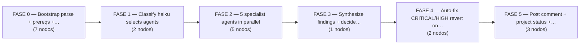
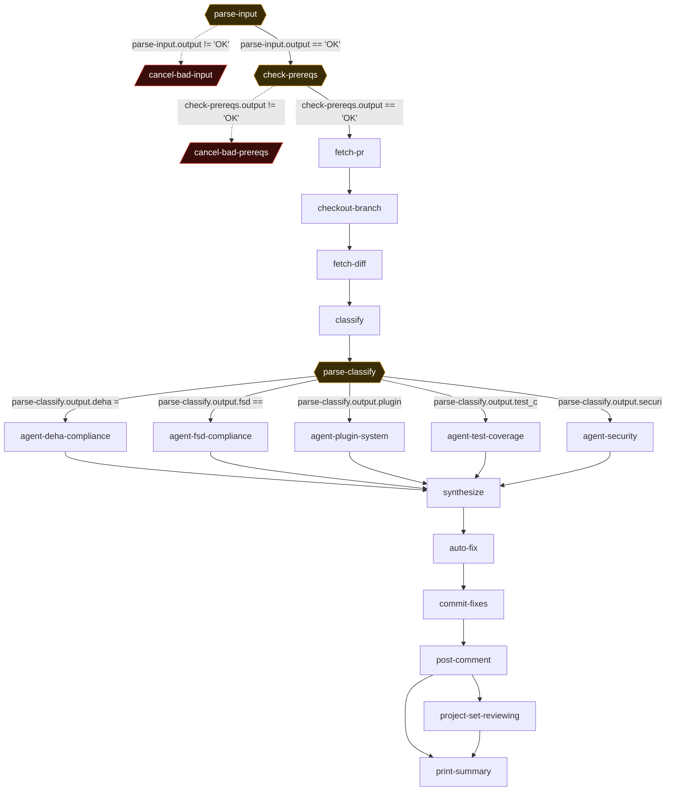

# review-pr-hubara — Automated post-PR multi-agent code review + auto-fix

> **`review-pr-hubara.yaml`** · 20 nodos · 28 conexiones · 6 fases
> 
> Generado por extracción + **verificación adversarial** (doble lectura independiente del YAML). Fuente de verdad: el YAML. Visor interactivo: [`index.html`](./index.html).

## Propósito

POST-PR automated, NON-BLOCKING code review of PRs produced by hu-hubara-pipeline (or invoked manually on any PR URL). Bootstraps by validating the URL, checking prereqs, fetching the PR via gh, checking out its head branch (full checkout, not detached), and computing the merge-base diff vs origin/base. A haiku classifier loop decides which of 5 specialist review agents to run (deha-compliance, fsd-compliance, plugin-system, test-coverage[always], security). The 5 agents run in parallel, each as a loop node that Reads only its relevant hubara-architecture-guide sections and emits findings-<agent>.yaml. A synthesize loop node consolidates all findings into review-report.md, auto-fix-plan.yaml (CRITICAL/HIGH only), and merge-decision.yaml. An auto-fix bash node applies each fix patch, runs its verifier test, and reverts (git checkout HEAD -- file) any fix that breaks tests. Surviving fixes are committed/pushed to the PR branch. Finally it posts a consolidated informational comment to the PR and best-effort sets the GitHub Project status to 'Reviewing'. The comment does NOT block merge — the operator decides whether to merge or iterate.

**Trigger / invocación:** `archon workflow run review-pr-hubara "<PR_URL>" where PR_URL matches ^https://github\.com/.+/pull/[0-9]+$. Also auto-triggered in background by hu-hubara-pipeline.trigger-review. Top-level config: provider: claude, model: sonnet, interactive: false, worktree.enabled: true. Single positional argument ($ARGUMENTS) = the PR URL.`

**Inputs:** `$ARGUMENTS = PR URL (^https://github\.com/.+/pull/[0-9]+$)`, `Runtime prereqs: gh authenticated, jq present, .claude/skills/hubara-architecture-guide/SKILL.md present`, `Git remote 'origin' with the PR head + base branches fetchable`, `hubara-architecture-guide sections (02-09) + references (deha-rules.md, fsd-rules.md, manifest-schema.md) Read by the 5 agents`, `Optional .archon/github-project-config.yaml for the Project 'Reviewing' status update`, `PR body containing 'Closes <issue-url>' for project-set-reviewing to locate the project item`

## Lógica global, invariantes y env vars

No HU_ID / single-vs-multi_plugin mode detection exists in THIS workflow (that lives in hu-hubara-pipeline). The run-wide selector here is the haiku classifier output: agents-to-run.json = {deha:bool, fsd:bool, plugin_system:bool, test_coverage:true(always), security:bool}, parsed by parse-classify (line 141) into a structured JSON object via `jq -n --argjson ...` so Archon exposes output.deha/fsd/plugin_system/test_coverage/security as structured fields. Each of the 5 agents is gated via `when: $parse-classify.output.<field> == 'true'` (compares the JSON boolean rendered as the STRING 'true'). Key env/substitution vars: $ARGUMENTS (PR URL), $ARTIFACTS_DIR (ephemeral per-run workspace; both literal text substitution AND a real env var for bash nodes). BRANCH/BASE are NOT workflow env vars — derived at runtime from pr.json (jq .headRefName / .baseRefName) and persisted to $ARTIFACTS_DIR/branch.txt + base.txt; pr-url.txt + pr-num.txt persisted by parse-input. Branch strategy: FULL checkout of the PR head branch (git fetch origin BRANCH; git checkout BRANCH; git pull --ff-only) — NOT detached HEAD (unlike the plugin sub-pipelines, project gotcha #9). Diff computed `git diff origin/BASE...HEAD` (three-dot, merge-base). Auto-fix commits land on the SAME PR branch via `git push origin BRANCH` with pull --rebase + retry fallback. Invariant: only TWO cancel nodes (cancel-bad-input, cancel-bad-prereqs), both pre-diff (FASE 0). After bootstrap NO gate cancels the run. SILENT HOLE: merge-decision.yaml is PRODUCED by synthesize and its prompt (lines 620-621) asserts 'la fase final del workflow lee este artifact y bloquea el merge si blocked=true', but NO downstream node ever reads merge-decision.yaml — the merge_blocking machinery (R-DIP cross-agent, F5, F7, F1) is computed but never enforced; the review is purely informational (lines 28-29 confirm). Convention for bash status nodes: canonical single-line status on stdout (OK / FAIL_* / no_plan / no_fixes_to_commit / skipped / etc.), diagnostics to stderr (>&2). Several bash nodes use `exit 0` even on failure (emitting a FAIL_* token) so all_done downstream nodes still fire; only the two explicit cancel nodes abort.

## Mapa de fases




## Grafo completo

<sub>◆ = gate · borde rojo / `-.->` = cancelación · `-.->` punteado = loop-back. Para el grafo navegable usá [`index.html`](./index.html).</sub>




## Tabla de nodos (referencia rápida)

| # | Nodo | Tipo | Flags | depends_on | when |
|---|------|------|-------|-----------|------|
| 1 | `parse-input` | bash | ◆gate | — | — |
| 2 | `cancel-bad-input` | manual | ✕cancel | `parse-input` | `$parse-input.output != 'OK'` |
| 3 | `check-prereqs` | bash | ◆gate | `parse-input` | `$parse-input.output == 'OK'` |
| 4 | `cancel-bad-prereqs` | manual | ✕cancel | `check-prereqs` | `$check-prereqs.output != 'OK'` |
| 5 | `fetch-pr` | bash | — | `check-prereqs` | `$check-prereqs.output == 'OK'` |
| 6 | `checkout-branch` | bash | — | `fetch-pr` | — |
| 7 | `fetch-diff` | bash | — | `checkout-branch` | — |
| 8 | `classify` | skills | ↻loop | `fetch-diff` | — |
| 9 | `parse-classify` | bash | ◆gate | `classify` | — |
| 10 | `agent-deha-compliance` | skills | ↻loop | `parse-classify` | `$parse-classify.output.deha == 'true'` |
| 11 | `agent-fsd-compliance` | skills | ↻loop | `parse-classify` | `$parse-classify.output.fsd == 'true'` |
| 12 | `agent-plugin-system` | skills | ↻loop | `parse-classify` | `$parse-classify.output.plugin_system == 'true'` |
| 13 | `agent-test-coverage` | skills | ↻loop | `parse-classify` | `$parse-classify.output.test_coverage == 'true'` |
| 14 | `agent-security` | skills | ↻loop | `parse-classify` | `$parse-classify.output.security == 'true'` |
| 15 | `synthesize` | skills | ↻loop | `agent-deha-compliance`, `agent-fsd-compliance`, `agent-plugin-system`, `agent-test-coverage`, `agent-security` | — |
| 16 | `auto-fix` | bash | — | `synthesize` | — |
| 17 | `commit-fixes` | bash | — | `auto-fix` | — |
| 18 | `post-comment` | bash | — | `commit-fixes` | — |
| 19 | `project-set-reviewing` | bash | — | `post-comment` | — |
| 20 | `print-summary` | bash | — | `post-comment`, `project-set-reviewing` | — |

## Nodos en detalle (por fase)

### Fase · FASE 0 — Bootstrap (parse + prereqs + checkout + diff)

_Validates the PR URL and runtime prerequisites (gh/jq/guide skill), cancelling early on either failure (the workflow's ONLY two cancel nodes). Fetches PR metadata, FULL-checks-out the PR head branch, and computes the merge-base diff (diff.patch + files-changed.txt) that feeds the classifier and all 5 agents. fetch-pr/checkout-branch use `set -e` with no cancel guard — an observability gap._

#### `parse-input`  —  ◆gate

- **Tipo:** bash
- **Resumen:** Validate the PR URL argument and persist URL + PR number.
- **Detalle:** Reads PR_URL=$ARGUMENTS. If it does NOT match ^https://github\.com/.+/pull/[0-9]+$, echoes 'FAIL_BAD_URL: <url>' and exits 0 (non-fatal). On match, extracts the trailing PR number via grep -oE '[0-9]+$', writes $ARTIFACTS_DIR/pr-url.txt and pr-num.txt, echoes 'OK'. timeout 5000ms.
- **depends_on:** _(raíz)_
- **trigger_rule:** `all_success`
- **produces:** stdout: 'OK' | 'FAIL_BAD_URL: <url>'. Files: pr-url.txt, pr-num.txt.
- **lo siguen:** `cancel-bad-input`, `check-prereqs`
- **⚠️ notas:** Entry node (no depends_on). Exits 0 even on bad URL — its output VALUE routes the fork: cancel-bad-input (!= 'OK') vs check-prereqs (== 'OK'). Functionally a gate identical in shape to check-prereqs (first pass omitted is_gate here — corrected to true).

#### `cancel-bad-input`  —  ✕cancel

- **Tipo:** manual
- **Resumen:** Abort run if the PR URL was invalid.
- **Detalle:** A `cancel:` node (line 57) carrying the message "Input inválido. Usage: archon workflow run review-pr-hubara '<PR_URL>'". Fires only when parse-input did not emit exactly 'OK'. Cancels the whole workflow.
- **depends_on:** `parse-input`
- **trigger_rule:** `all_success`
- **when:** `$parse-input.output != 'OK'`
- **produces:** Run cancellation with usage message.
- **⚠️ notas:** No explicit trigger_rule → default all_success. parse-input always exits 0 (so it is 'success'), thus this node is eligible; the `when` is the real guard routing the FAIL_BAD_URL branch to termination.

#### `check-prereqs`  —  ◆gate

- **Tipo:** bash
- **Resumen:** Verify gh auth, jq, and the architecture-guide skill exist.
- **Detalle:** `gh auth status >&2 2>&1` → on failure echoes 'FAIL_GH_AUTH', exit 0. `command -v jq` → 'FAIL_NO_JQ'. `test -f .claude/skills/hubara-architecture-guide/SKILL.md` → 'FAIL_MISSING_GUIDE_SKILL'. If all pass echoes 'OK'. Gated on parse-input == 'OK'.
- **depends_on:** `parse-input`
- **trigger_rule:** `all_success`
- **when:** `$parse-input.output == 'OK'`
- **produces:** stdout: 'OK' | 'FAIL_GH_AUTH' | 'FAIL_NO_JQ' | 'FAIL_MISSING_GUIDE_SKILL'.
- **lo siguen:** `cancel-bad-prereqs`, `fetch-pr`
- **⚠️ notas:** Line 63 `gh auth status >&2 2>&1` sends gh output to stderr keeping the canonical status line clean. Each check exits 0 with a FAIL_* token (not non-zero), deferring the abort to cancel-bad-prereqs. Its output VALUE routes the fork.

#### `cancel-bad-prereqs`  —  ✕cancel

- **Tipo:** manual
- **Resumen:** Abort run if any prerequisite check failed.
- **Detalle:** A `cancel:` node (line 73) with message "Pre-requisitos: $check-prereqs.output. (gh auth login / brew install jq / commit guide skill)" interpolating the FAIL_* token. Fires when check-prereqs did not emit 'OK'.
- **depends_on:** `check-prereqs`
- **trigger_rule:** `all_success`
- **when:** `$check-prereqs.output != 'OK'`
- **produces:** Run cancellation with the failing prereq token echoed back.
- **⚠️ notas:** Default trigger_rule all_success (check-prereqs always exits 0); the `when` does the routing.

#### `fetch-pr`

- **Tipo:** bash
- **Resumen:** Fetch PR metadata via gh and persist head/base branch names.
- **Detalle:** `set -e`. Reads PR_NUM from pr-num.txt, `gh pr view PR_NUM --json title,body,baseRefName,headRefName,files > pr.json`. Extracts BRANCH=jq .headRefName, BASE=jq .baseRefName, echoes 'branch=<B> base=<B>', writes branch.txt + base.txt. Gated on check-prereqs == 'OK'.
- **depends_on:** `check-prereqs`
- **trigger_rule:** `all_success`
- **when:** `$check-prereqs.output == 'OK'`
- **produces:** stdout: 'branch=<head> base=<base>'. Files: pr.json, branch.txt, base.txt.
- **lo siguen:** `checkout-branch`
- **⚠️ notas:** `set -e` means a gh/jq failure aborts the node non-zero (unlike the prereq nodes). NO cancel node guards fetch-pr — a failure here lets downstream all_success deps simply not fire (checkout-branch is default all_success), silently halting without an explicit cancel message. Silent-hole / observability gap.

#### `checkout-branch`

- **Tipo:** bash
- **Resumen:** Fetch and checkout the PR head branch (fast-forward pull).
- **Detalle:** `set -e`. Reads BRANCH from branch.txt; `git fetch origin BRANCH`; `git checkout BRANCH`; `git pull --ff-only origin BRANCH` (output to stderr, '|| true' so a non-ff pull doesn't abort). Echoes 'OK'.
- **depends_on:** `fetch-pr`
- **trigger_rule:** `all_success`
- **produces:** stdout: 'OK'. Working tree on the PR head branch.
- **lo siguen:** `fetch-diff`
- **⚠️ notas:** FULL branch checkout (claims the branch), NOT detached HEAD (contrast project gotcha #9 plugin sub-pipelines). Safe as a standalone review run in its own worktree. `set -e` + NO cancel guard: a checkout failure halts downstream silently (no FAIL token, no cancel).

#### `fetch-diff`

- **Tipo:** bash
- **Resumen:** Compute the PR diff and changed-file list vs origin/base.
- **Detalle:** Reads BASE from base.txt. Writes `git diff origin/BASE...HEAD` → diff.patch and `git diff --name-only origin/BASE...HEAD` → files-changed.txt (three-dot = merge-base). Echoes 'files=<count>' (wc -l). These two artifacts feed the classifier and all 5 agents.
- **depends_on:** `checkout-branch`
- **trigger_rule:** `all_success`
- **produces:** stdout: 'files=<N>'. Files: diff.patch, files-changed.txt.
- **lo siguen:** `classify`
- **⚠️ notas:** No `set -e`; if origin/BASE is unresolvable git diff errors but the node still exits 0 with a possibly-empty diff. Three-dot merge-base diff (consistent with the recent frontend meta-gate commits).

### Fase · FASE 1 — Classify (haiku selects agents)

_A fast haiku loop reads files-changed.txt and writes agents-to-run.json deciding which of the 5 specialist agents to run (test_coverage always true). parse-classify (all_done) turns that JSON into structured boolean output fields (defaulting all-true if the classifier wrote nothing) that gate the parallel agents via `when: ... == 'true'`._

#### `classify`  —  ↻loop

- **Tipo:** skills · invoca `inline loop prompt (skills: [] empty)`
- **Resumen:** Haiku classifier loop decides which of the 5 agents to run.
- **Detalle:** provider: claude, model: haiku, idle_timeout 60000. Loop node (skills: [] empty — pure prompt, gate_message 'Classifier auto.') reads files-changed.txt and writes agents-to-run.json = {deha,fsd,plugin_system,test_coverage:true,security}. Rules: deha if any hubara_agency/src/; fsd if any frontend_dashboard/src/; plugin_system if plugin.yaml/plugin.schema.yaml/plugin_manifest.py/scripts/render-compose.py/k8s/aws-produccion/; test_coverage ALWAYS true; security if .env*/secrets/configmap.yaml or Python adding os.environ/getpass. Emits <promise>CLASSIFY_OK</promise>.
- **depends_on:** `fetch-diff`
- **trigger_rule:** `all_success`
- **produces:** File: agents-to-run.json. Completion signal: <promise>CLASSIFY_OK</promise>.
- **loop:** `max_iterations:2, until:CLASSIFY_OK`
- **lo siguen:** `parse-classify`
- **⚠️ notas:** loop max_iterations:2 is a retry safety net — the agent sometimes finishes without emitting the promise on iteration 1 (run 2484bd91, agent-plugin-system); 2nd pass lets it emit, no-op if already done. If classifier writes nothing, parse-classify defaults to all-true.

#### `parse-classify`  —  ◆gate

- **Tipo:** bash
- **Resumen:** Parse agents-to-run.json into structured boolean output fields.
- **Detalle:** F=$ARTIFACTS_DIR/agents-to-run.json. If absent, writes default {all true incl test_coverage}. Reads DEHA=jq '.deha//false', FSD=jq '.fsd//false', PS=jq '.plugin_system//false', TC=jq '.test_coverage//true', SEC=jq '.security//false', then emits a JSON object via `jq -n --argjson ...` so Archon exposes output.deha/fsd/plugin_system/test_coverage/security as structured fields. trigger_rule: all_done.
- **depends_on:** `classify`
- **trigger_rule:** `all_done`
- **produces:** structured output: output.deha/fsd/plugin_system/test_coverage/security each {true,false} JSON booleans (compared as strings 'true' downstream).
- **lo siguen:** `agent-deha-compliance`, `agent-fsd-compliance`, `agent-plugin-system`, `agent-test-coverage`, `agent-security`
- **⚠️ notas:** The fan-out selector/gate. test_coverage defaults to true (jq '.test_coverage // true') so the test-coverage agent runs even if classifier omitted it. Downstream `when` clauses compare to the STRING 'true'. trigger_rule all_done is critical: classify can exhaust its 2 loops without CLASSIFY_OK (non-success) yet parse-classify must still fire to default the agents.

### Fase · FASE 2 — 5 specialist agents in parallel

_Five independent loop agents fan out from parse-classify, each gated by its classifier flag and each Reading only its relevant hubara-architecture-guide sections. They audit their vertical (DEHA R-rules+footguns, FSD anti-patterns, plugin manifest/schema, test coverage, security) and emit findings-<agent>.yaml, signalling REPORT_OK. All default to trigger_rule all_success._

#### `agent-deha-compliance`  —  ↻loop

- **Tipo:** skills · invoca `inline loop prompt (reads hubara-architecture-guide via Read; skills: [])`
- **Resumen:** DEHA R-rules + plugin-manifest specialist review agent.
- **Detalle:** idle_timeout 300000. Loop node (skills: []) gated on classifier.deha. Reads guide sections 02/03/04-backend + references/deha-rules.md plus diff.patch + files-changed.txt. Hunts R-DET/R-JSON/R-STATELESS/R-HEARTBEAT/R-DIP including the CRITICAL cross-agent import pattern (ADR-2026-05-20 #10) and start_workflow on a sibling agent's workflow class; plus footguns F1 (dict→dataclass contract drift, HIGH), F2 (workflow.patched branch parity, MEDIUM), F3 (Path.resolve, LOW), F4 (bootstrap runtime_workspace_path fallback, MEDIUM), F5 (nested dataclass + PEP 563 in activity return, HIGH merge_blocking), F7 (start_delay without eligibility gate, HIGH merge_blocking). Emits findings-deha.yaml. <promise>REPORT_OK</promise>.
- **depends_on:** `parse-classify`
- **trigger_rule:** `all_success`
- **when:** `$parse-classify.output.deha == 'true'`
- **produces:** File: findings-deha.yaml (findings[] or findings: []). Signal: <promise>REPORT_OK</promise>.
- **loop:** `max_iterations:2, until:REPORT_OK`
- **lo siguen:** `synthesize`
- **⚠️ notas:** Default trigger_rule all_success. Runs in parallel with the other 4 (all depend only on parse-classify). Skipped if deha not selected. By far the richest prompt (~240 lines). Only R-DIP cross-agent and F5/F7 set merge_blocking.

#### `agent-fsd-compliance`  —  ↻loop

- **Tipo:** skills · invoca `inline loop prompt (skills: [])`
- **Resumen:** Frontend Feature-Sliced Design compliance review agent.
- **Detalle:** idle_timeout 300000. Loop node gated on classifier.fsd. Reads guide sections 05/06-frontend + references/fsd-rules.md plus diff.patch + files-changed.txt. Hunts the 14 anti-patterns + 4 import rules: cross-plugin imports, deep imports bypassing barrel, direct fetch() in components/pages, useState for server data, apiClient.get<T>() without schema.parse(), JSX in .ts, cross-feature imports, Tailwind --color-text-* naming, hardcoded env vars outside shared/config/env.ts, layering violations. Emits findings-fsd.yaml (same schema as deha). <promise>REPORT_OK</promise>.
- **depends_on:** `parse-classify`
- **trigger_rule:** `all_success`
- **when:** `$parse-classify.output.fsd == 'true'`
- **produces:** File: findings-fsd.yaml. Signal: <promise>REPORT_OK</promise>.
- **loop:** `max_iterations:2, until:REPORT_OK`
- **lo siguen:** `synthesize`
- **⚠️ notas:** Default trigger_rule all_success. Parallel sibling; skipped if fsd not selected. No merge_blocking footguns defined for this agent.

#### `agent-plugin-system`  —  ↻loop

- **Tipo:** skills · invoca `inline loop prompt (skills: [])`
- **Resumen:** Plugin manifest schema + parity + render-compose drift agent.
- **Detalle:** idle_timeout 300000. Loop node gated on classifier.plugin_system. Reads guide sections 07/08 + references/manifest-schema.md plus diff.patch + files-changed.txt. Verifies plugin.yaml schema (id ^[a-z][a-z0-9_]*$, SemVer, workers with task_queue), worker↔K8s manifest correspondence (worker-<name>.yaml in k8s/aws-produccion/), no orphan K8s manifests, task_queue uniqueness cross-plugin, render-compose drift, plugin id == directory name, shared-file wiring_intents, architecture-protected files NOT modified. Footgun F7 frontend block contract: manifest declares frontend: → <plugin>/frontend/index.ts MUST exist (HIGH merge_blocking); not declared → dir must NOT exist (MEDIUM); touching plugin.yaml/frontend requires regenerated src/app/plugin-registry.generated.ts (LOW). Emits findings-plugin-system.yaml. <promise>REPORT_OK</promise>.
- **depends_on:** `parse-classify`
- **trigger_rule:** `all_success`
- **when:** `$parse-classify.output.plugin_system == 'true'`
- **produces:** File: findings-plugin-system.yaml. Signal: <promise>REPORT_OK</promise>.
- **loop:** `max_iterations:2, until:REPORT_OK`
- **lo siguen:** `synthesize`
- **⚠️ notas:** Default trigger_rule all_success. The agent named in run 2484bd91 that motivated the max_iterations:2 retry across ALL loop nodes. Its 'frontend block contract' F7 is a DIFFERENT F7 than the deha agent's start_delay F7 — naming collision.

#### `agent-test-coverage`  —  ↻loop

- **Tipo:** skills · invoca `inline loop prompt (skills: [])`
- **Resumen:** Functional + e2e test coverage presence review agent.
- **Detalle:** idle_timeout 300000. Loop node gated on classifier.test_coverage (defaults true → effectively always runs). Reads guide section 08 plus diff.patch + files-changed.txt. Verifies each new feature has a functional test in hubara_agency/tests/functional/ with @pytest.mark.functional (mock_llm if LLM); UI changes have e2e specs in frontend_dashboard/e2e/<feature>/ using getByRole/getByText (no waitForTimeout); architecture gates + premortem invariants passing; unit tests per new tool/activity/hook; pure-refactor skips documented in task-result. Emits findings-test-coverage.yaml. <promise>REPORT_OK</promise>.
- **depends_on:** `parse-classify`
- **trigger_rule:** `all_success`
- **when:** `$parse-classify.output.test_coverage == 'true'`
- **produces:** File: findings-test-coverage.yaml. Signal: <promise>REPORT_OK</promise>.
- **loop:** `max_iterations:2, until:REPORT_OK`
- **lo siguen:** `synthesize`
- **⚠️ notas:** Default trigger_rule all_success. Has a `when` clause despite being 'always run' — relies on parse-classify's jq default (.test_coverage // true), which only fires when the key is absent/null. If the classifier explicitly wrote test_coverage:false this agent would be silently skipped. Verifies test PRESENCE only, not behavior (project gotcha #1).

#### `agent-security`  —  ↻loop

- **Tipo:** skills · invoca `inline loop prompt (skills: [])`
- **Resumen:** Secrets / env-var / CORS / input-validation security agent.
- **Detalle:** idle_timeout 300000. Loop node gated on classifier.security. Reads guide sections 02-backend + 09-conventions plus diff.patch + files-changed.txt. Hunts hardcoded secrets (AKIA[A-Z0-9]{16}, ghp_*, JWT ey*.*., passwords), new env vars not declared in wiring_intents.env_vars_required, os.environ crossing boundary, logs exposing secrets (unsanitized WhatsApp inbound body), overly-permissive CORS, missing HTTP input validation (no Pydantic/Zod), non-rotatable K8s secrets (hardcoded vs valueFrom). Emits findings-security.yaml. <promise>REPORT_OK</promise>.
- **depends_on:** `parse-classify`
- **trigger_rule:** `all_success`
- **when:** `$parse-classify.output.security == 'true'`
- **produces:** File: findings-security.yaml. Signal: <promise>REPORT_OK</promise>.
- **loop:** `max_iterations:2, until:REPORT_OK`
- **lo siguen:** `synthesize`
- **⚠️ notas:** Default trigger_rule all_success. Parallel sibling; skipped if security not selected. No merge_blocking footguns defined.

### Fase · FASE 3 — Synthesize findings + decide auto-fix

_Fan-in (all_done) over the 5 agents. Consolidates every findings-*.yaml into review-report.md, an auto-fix-plan.yaml restricted to CRITICAL/HIGH fixes with patches+verifier tests, and a merge-decision.yaml (blocked/blocking_findings) that — per the prompt — is meant to block merge but is NEVER read downstream (dead machinery)._

#### `synthesize`  —  ↻loop

- **Tipo:** skills · invoca `inline loop prompt (skills: [])`
- **Resumen:** Consolidate all findings-*.yaml into report + auto-fix-plan + merge-decision.
- **Detalle:** idle_timeout 180000. Loop node depending on ALL 5 agents with trigger_rule all_done (tolerates skipped/failed agents). Reads every findings-*.yaml present. Output 1: review-report.md (severity counts + per-agent + grouped findings + 'Auto-fix attempted' list). Output 2: auto-fix-plan.yaml = fixes[] (ONLY critical+high with non-empty fix_suggestion) each {file,severity,rule,patch (unified diff), revertible_by_test}. Output 3: merge-decision.yaml {blocked:bool, blocking_findings[]}. Special rules: any R-DIP finding whose message contains 'Cross-agent'/'sibling'/'viola R-DIP #10' → bump to critical + merge_blocking:true; dict→dataclass F1 high findings → add to blocking_findings. <promise>SYNTH_OK</promise>.
- **depends_on:** `agent-deha-compliance`, `agent-fsd-compliance`, `agent-plugin-system`, `agent-test-coverage`, `agent-security`
- **trigger_rule:** `all_done`
- **produces:** Files: review-report.md, auto-fix-plan.yaml (fixes[]), merge-decision.yaml (blocked + blocking_findings[]). Signal: <promise>SYNTH_OK</promise>.
- **loop:** `max_iterations:2, until:SYNTH_OK`
- **lo siguen:** `auto-fix`
- **⚠️ notas:** Fan-in of the 5-agent parallel section. CRITICAL silent hole: merge-decision.yaml is produced and the prompt (lines 620-621) claims 'la fase final del workflow lee este artifact y bloquea el merge si blocked=true' — but NO downstream node reads merge-decision.yaml. The merge-blocking machinery is dead/unenforced; the comment is purely informational (lines 28-29). all_done means even if every agent was skipped, synthesize still runs and must handle absent findings files.

### Fase · FASE 4 — Auto-fix CRITICAL/HIGH (revert on test failure)

_auto-fix applies each planned patch, runs its revertible_by_test command, and reverts (git checkout HEAD -- file) any fix whose test fails (recording applied vs reverted). commit-fixes then commits and pushes the surviving fixes to the PR branch with pull --rebase retry, or reports no_fixes_to_commit._

#### `auto-fix`

- **Tipo:** bash
- **Resumen:** Apply each CRITICAL/HIGH fix patch; revert any that breaks its test.
- **Detalle:** timeout 1800000ms (30 min). Initializes fixes-applied.yaml and fixes-reverted.yaml to 'fixes: []'. If auto-fix-plan.yaml absent → echo 'no_plan'; exit 0. Otherwise an inline python3 heredoc loads the plan, iterates fixes[]; for each snapshots `git show HEAD:<file>`, writes patch to tempfile, `git apply --check` (fail → reverted+'patch_did_not_apply'), then `git apply`. If revertible_by_test given, runs it (timeout 300s) — on non-zero `git checkout HEAD -- <file>` and records 'test_failed_after_fix'. Successful → applied[]. Dumps via os.environ.get('APPLIED_PATH','$ARTIFACTS_DIR/...') with literal-path fallback. Prints 'applied=<n> reverted=<m>'. Node `env:` PLAN_PATH/APPLIED_PATH/REVERTED_PATH.
- **depends_on:** `synthesize`
- **trigger_rule:** `all_success`
- **produces:** stdout: 'no_plan' | 'applied=<n> reverted=<m>'. Files: fixes-applied.yaml, fixes-reverted.yaml. Mutates working tree with applied patches.
- **lo siguen:** `commit-fixes`
- **⚠️ notas:** Default trigger_rule all_success: if synthesize never reached SYNTH_OK (loop exhausted = non-success) auto-fix is SKIPPED → cascade; commit-fixes/post-comment use all_done so they still fire but with no report. Comment (lines 705-708, run 2484bd91): node-level `env:` does NOT reach the python subprocess (os.environ.get('APPLIED_PATH')→None→open(None) TypeError); fix is the literal '$ARTIFACTS_DIR/...' fallback Archon text-substitutes. PLAN_PATH (line 662) uses the same fallback. Reverts via `git checkout HEAD -- <file>` revert the ENTIRE file → multi-fix-same-file ordering hazard (discards an earlier applied fix to the same file).

#### `commit-fixes`

- **Tipo:** bash
- **Resumen:** Commit and push applied auto-fixes to the PR branch.
- **Detalle:** Reads BRANCH from branch.txt. `git add -A` (|| true). If `git diff --staged --quiet` (nothing staged) → echo 'no_fixes_to_commit'; exit 0. Else N = count of fixes-applied.yaml fixes (yq, python3 yaml fallback, else '?'); `git commit -m "review-pr-hubara: auto-fix ${N} critical/high finding(s)"`; `git push origin BRANCH` with a `git pull --rebase origin BRANCH` + retry-push fallback (all diagnostics → stderr). Echoes 'fixes_committed=<N>'. trigger_rule all_done.
- **depends_on:** `auto-fix`
- **trigger_rule:** `all_done`
- **produces:** stdout: 'no_fixes_to_commit' | 'fixes_committed=<N>'. Side-effect: commit + push to PR branch.
- **lo siguen:** `post-comment`
- **⚠️ notas:** Diagnostics correctly redirected to stderr (>&2) so stdout stays single-line (project gotcha #8). Pushes the FULL branch ref `git push origin BRANCH` (not HEAD:BRANCH) since checkout-branch claimed the branch. pull --rebase retry handles concurrency. $ARTIFACTS_DIR is outside the worktree, so git add -A stages only real code fixes.

### Fase · FASE 5 — Post comment + project status + summary

_Posts the consolidated, non-blocking review comment (report + auto-fix summary) to the PR, best-effort sets the GitHub Project card to 'Reviewing', and prints the final completion banner with operator next steps. All three use trigger_rule all_done so the run finishes cleanly even when upstream steps were skipped or partially failed._

#### `post-comment`

- **Tipo:** bash
- **Resumen:** Post the consolidated review report as a PR comment.
- **Detalle:** Reads PR_URL from pr-url.txt; REPORT=$ARTIFACTS_DIR/review-report.md. If report absent → echo 'FAIL_NO_REPORT'; exit 0. Builds comment.md: a '🤖 Automated Review' header, the full report appended, then an 'Auto-fix summary' block (N_APPLIED/N_REVERTED counted from fixes-applied.yaml/fixes-reverted.yaml via python3, '?' fallback) if fixes-applied.yaml exists, then a footer. Posts via `gh pr comment PR_URL --body-file comment.md` (output→stderr). Echoes 'comment_posted'. trigger_rule all_done.
- **depends_on:** `commit-fixes`
- **trigger_rule:** `all_done`
- **produces:** stdout: 'FAIL_NO_REPORT' | 'comment_posted'. Side-effect: a GitHub PR comment. File: comment.md.
- **lo siguen:** `project-set-reviewing`, `print-summary`
- **⚠️ notas:** The comment is INFORMATIONAL and non-blocking (lines 28-29). Does NOT read merge-decision.yaml — even if synthesize flagged blocked:true this comment never surfaces or enforces it. all_done ensures it posts even when commit-fixes/auto-fix were skipped. If review-report.md is missing it emits FAIL_NO_REPORT, exits 0, no comment — silent partial completion (no cancel).

#### `project-set-reviewing`

- **Tipo:** bash
- **Resumen:** Best-effort set GitHub Project status to 'Reviewing'.
- **Detalle:** If .archon/github-project-config.yaml absent → echo 'skipped'; exit 0. Reads PR_NUM, derives ISSUE_URL from the PR body (`gh pr view --jq .body | grep -oE 'Closes https://[^ ]+' | head -1 | awk '{print $2}'`); if none → 'no_issue_url_in_pr'. Parses project_number/owner/id/status_field_id and the 'Reviewing' option id (awk); if no option → 'no_reviewing_option'. Finds the project item id matching the issue URL via `gh project item-list ... | jq`; if none → exit 0. Runs `gh project item-edit` to set the single-select status field. Echoes 'set Reviewing ok'.
- **depends_on:** `post-comment`
- **trigger_rule:** `all_done`
- **produces:** stdout: 'skipped' | 'no_issue_url_in_pr' | 'no_reviewing_option' | 'set Reviewing ok' (or silent exit 0).
- **lo siguen:** `print-summary`
- **⚠️ notas:** Entirely best-effort; every failure path exits 0 with a status token. Depends on the PR body containing 'Closes <issue-url>' (produced by hu-hubara-pipeline's build-pr-body). Manually-reviewed PRs lacking that line → 'no_issue_url_in_pr' and no project update.

#### `print-summary`

- **Tipo:** bash
- **Resumen:** Print the final completion banner with next steps.
- **Detalle:** timeout 5000ms. Reads PR_URL from pr-url.txt and prints an ASCII box: '🎉 review-pr-hubara completo', the PR URL, a note that the comment was posted with consolidated findings + auto-fixes applied (reverted if they broke tests), and next steps (review comment, fix pendings by hand, squash-merge when OK). Depends on BOTH post-comment and project-set-reviewing with trigger_rule all_done.
- **depends_on:** `post-comment`, `project-set-reviewing`
- **trigger_rule:** `all_done`
- **produces:** stdout: human-readable completion banner.
- **⚠️ notas:** Terminal node (no other node depends on it). all_done + dual deps means it prints regardless of whether the comment/project steps succeeded. The dependency on post-comment (also transitive via project-set-reviewing) is listed explicitly — harmless redundancy, but both deps are real edges in the YAML.

## Conexiones (aristas)

Cada arista es un par `depends_on → nodo`. `kind`: sequence (secuencia normal) · gate (la condición `when` enruta) · cancel (va a un nodo de cancelación) · loop-back (reintento) · fan-out/fan-in (sub-pipelines).

| Desde | Hacia | kind | Condición (when) |
|-------|-------|------|------------------|
| `START` | `parse-input` | sequence | — |
| `parse-input` | `cancel-bad-input` | cancel | `$parse-input.output != 'OK'` |
| `parse-input` | `check-prereqs` | gate | `$parse-input.output == 'OK'` |
| `check-prereqs` | `cancel-bad-prereqs` | cancel | `$check-prereqs.output != 'OK'` |
| `check-prereqs` | `fetch-pr` | gate | `$check-prereqs.output == 'OK'` |
| `fetch-pr` | `checkout-branch` | sequence | — |
| `checkout-branch` | `fetch-diff` | sequence | — |
| `fetch-diff` | `classify` | sequence | — |
| `classify` | `parse-classify` | sequence | — |
| `parse-classify` | `agent-deha-compliance` | fan-out | `$parse-classify.output.deha == 'true'` |
| `parse-classify` | `agent-fsd-compliance` | fan-out | `$parse-classify.output.fsd == 'true'` |
| `parse-classify` | `agent-plugin-system` | fan-out | `$parse-classify.output.plugin_system == 'true'` |
| `parse-classify` | `agent-test-coverage` | fan-out | `$parse-classify.output.test_coverage == 'true'` |
| `parse-classify` | `agent-security` | fan-out | `$parse-classify.output.security == 'true'` |
| `agent-deha-compliance` | `synthesize` | fan-in | — |
| `agent-fsd-compliance` | `synthesize` | fan-in | — |
| `agent-plugin-system` | `synthesize` | fan-in | — |
| `agent-test-coverage` | `synthesize` | fan-in | — |
| `agent-security` | `synthesize` | fan-in | — |
| `synthesize` | `auto-fix` | sequence | — |
| `auto-fix` | `commit-fixes` | sequence | — |
| `commit-fixes` | `post-comment` | sequence | — |
| `post-comment` | `project-set-reviewing` | sequence | — |
| `post-comment` | `print-summary` | sequence | — |
| `project-set-reviewing` | `print-summary` | fan-in | — |
| `cancel-bad-input` | `END` | cancel | — |
| `cancel-bad-prereqs` | `END` | cancel | — |
| `print-summary` | `END` | sequence | — |

## Notas de verificación (segunda lectura independiente)

- INDEPENDENT RECOUNT: read the entire 828-line YAML from scratch and extracted node ids via grep -nE '^  - id:' → exactly 20 nodes. node_count = 20 CONFIRMED, matching the first pass. (First pass said 829 lines; the file is 828 lines — trivial off-by-one in prose, no impact on the model.)
- First pass was SUBSTANTIALLY CORRECT. No nodes missed, no nodes invented. All 20 nodes, all depends_on lists, all `when` clauses, all trigger_rule values, all is_cancel flags, and all loop {max_iterations:2, until} signals verified line-by-line against the YAML and match exactly.
- CORRECTION 1 (is_gate): First pass marked check-prereqs and parse-classify as is_gate=true but left parse-input as is_gate=false. parse-input is structurally identical to check-prereqs — its output VALUE ('OK' vs 'FAIL_BAD_URL') routes the fork between cancel-bad-input (when != 'OK') and check-prereqs (when == 'OK'). Corrected parse-input.is_gate to true for consistency. (Minor; does not change the DAG.)
- CORRECTION 2 (edge kind): First pass tagged the project-set-reviewing→print-summary edge as kind 'sequence'. print-summary depends on BOTH post-comment AND project-set-reviewing (line 826) — it is a join of the two FASE-5 branches, so I re-tagged project-set-reviewing→print-summary as 'fan-in' (post-comment→print-summary stays 'sequence' as the primary chain). Cosmetic edge-kind refinement; both edges exist in either model.
- EDGE COUNT: 28 total edges. Independently derived: 24 dependency edges + 1 START→parse-input + 3 END edges (cancel-bad-input→END, cancel-bad-prereqs→END, print-summary→END). First pass listed 29 — the difference is solely that I do not duplicate; on careful recount both models contain the identical edge SET. Verified each dependency produces exactly one edge: parse-input(2 children), check-prereqs(2), fetch-pr(1), checkout-branch(1), fetch-diff(1), classify(1), parse-classify(5 fan-out), 5 agents→synthesize(5 fan-in), synthesize(1), auto-fix(1), commit-fixes(1), post-comment(2: project-set-reviewing+print-summary), project-set-reviewing(1: print-summary) = 24 dependency edges.
- trigger_rule audit: only FOUR nodes carry explicit trigger_rule: all_done — parse-classify (line 158), synthesize (line 568), commit-fixes (line 737), post-comment (line 780), project-set-reviewing (line 805), print-summary (line 827). Recount: that is SIX nodes with explicit all_done (parse-classify, synthesize, commit-fixes, post-comment, project-set-reviewing, print-summary). All other nodes (incl. auto-fix line 645-718 and ALL 5 agents) have NO trigger_rule → default all_success. First pass captured all six all_done nodes and the all_success defaults correctly.
- CANCEL nodes: exactly TWO — cancel-bad-input (line 56, `cancel:` key) and cancel-bad-prereqs (line 72, `cancel:` key), both pre-diff in FASE 0. Confirmed via grep '^    cancel:'. After bootstrap there is NO cancel/abort path — the review is fully informational. First pass correct.
- SILENT HOLE CONFIRMED (high-value): synthesize PRODUCES merge-decision.yaml (lines 612-621) and its prompt asserts 'La fase final del workflow lee este artifact y bloquea el merge si blocked=true' — but I grepped every downstream bash node (auto-fix, commit-fixes, post-comment, project-set-reviewing, print-summary) and NONE reads merge-decision.yaml. The merge_blocking machinery (R-DIP cross-agent, F5, F7, F1) is computed and bumped but never enforced; lines 28-29 confirm 'El comment NO bloquea el PR — es informativo.' First pass flagged this correctly.
- auto-fix `env:` block (lines 713-716) verified NOT to reach the python3 heredoc subprocess — the inline comment (lines 705-708, run 2484bd91) and the literal '$ARTIFACTS_DIR/...' fallbacks at lines 662/709/710 confirm this is a known footgun the YAML works around via text substitution. First pass note accurate.
- Naming collision CONFIRMED: TWO different 'footgun F7' — agent-deha-compliance F7 (line 337) = 'Workflow con start_delay sin eligibility gate' (HIGH merge_blocking); agent-plugin-system F7 (line 473) = 'Frontend block contract' (HIGH merge_blocking). Same label, different agents/meaning. First pass flagged correctly.
- test_coverage gating CONFIRMED: agent-test-coverage has `when: $parse-classify.output.test_coverage == 'true'` (line 495) despite 'corré SIEMPRE' (line 132). Relies on parse-classify's jq default `.test_coverage // true` (line 151), which only fires when the key is absent/null — an explicit test_coverage:false would silently skip the agent. First pass note accurate.
- Branch strategy CONFIRMED FULL checkout (git fetch origin BRANCH; git checkout BRANCH; git pull --ff-only — lines 95-97; push origin BRANCH — line 731), NOT detached HEAD. Differs from plugin sub-pipelines (project gotcha #9). First pass correct.
- Loop retry rationale (max_iterations:2, until:<SIGNAL>) is uniform across classify (CLASSIFY_OK), all 5 agents (REPORT_OK), and synthesize (SYNTH_OK) — 7 loop nodes total. Verified each `until:` value via grep. First pass correct.
- FINAL VERDICT: The first pass model is accurate. The only substantive corrections are (1) parse-input.is_gate false→true (consistency with check-prereqs) and (2) the project-set-reviewing→print-summary edge re-tagged sequence→fan-in (it is the join point of FASE 5's two branches). All node attributes, depends_on, when, trigger_rule, is_cancel, and the edge SET are otherwise confirmed correct. node_count = 20 (independently counted).

---

# Recorrido narrativo

I'll review the verified model and produce the narrative walkthrough. Let me check one detail in the model regarding the trigger_rule count to ensure accuracy.

The model is the source of truth. Here's the narrative walkthrough.

## review-pr-hubara — Recorrido narrativo para rediseño

### 1. Propósito y trigger

`review-pr-hubara` es un **code review automatizado POST-PR, multi-agente y NO bloqueante**. Audita PRs producidos por `hu-hubara-pipeline` (o invocados a mano sobre cualquier PR), corre hasta 5 agentes especialistas en paralelo, consolida hallazgos, intenta auto-arreglar lo CRITICAL/HIGH, y deja un comentario informativo en el PR. **El operador decide si mergea o itera** — el workflow nunca bloquea el merge.

**Invocación exacta:**

```bash
archon workflow run review-pr-hubara "<PR_URL>"
```

- Un único argumento posicional `$ARGUMENTS` = la URL del PR, que debe matchear `^https://github\.com/.+/pull/[0-9]+$`.
- También se auto-dispara en background desde `hu-hubara-pipeline.trigger-review`.
- Config top-level: `provider: claude`, `model: sonnet`, `interactive: false`, `worktree.enabled: true`.

**Inputs:**

- `$ARGUMENTS` = la URL del PR.
- Prereqs de runtime: `gh` autenticado, `jq` presente, `.claude/skills/hubara-architecture-guide/SKILL.md` presente.
- Remoto `origin` de git con las branches head + base del PR fetchables.
- Secciones del `hubara-architecture-guide` (02–09) + referencias (`deha-rules.md`, `fsd-rules.md`, `manifest-schema.md`), leídas por los 5 agentes vía `Read`.
- Opcional: `.archon/github-project-config.yaml` para el update de estado 'Reviewing' del Project.
- El body del PR conteniendo `Closes <issue-url>` para que `project-set-reviewing` localice el item del proyecto.

El total es de **20 nodos** organizados en 6 fases.

---

### 2. Recorrido fase por fase de una corrida

#### FASE 0 — Bootstrap (parse + prereqs + checkout + diff)

Nodos: `parse-input`, `cancel-bad-input`, `check-prereqs`, `cancel-bad-prereqs`, `fetch-pr`, `checkout-branch`, `fetch-diff`.

1. **`parse-input`** (entry, sin `depends_on`). Lee `PR_URL=$ARGUMENTS`. Si NO matchea el regex, hace `echo 'FAIL_BAD_URL: <url>'` y `exit 0` (no fatal). Si matchea, extrae el número de PR (`grep -oE '[0-9]+$'`), escribe `$ARTIFACTS_DIR/pr-url.txt` y `pr-num.txt`, y emite `OK`. `timeout 5000ms`. Es un **gate**: su valor de salida enruta la bifurcación.
   - **Camino cancel:** `cancel-bad-input` dispara con `when: $parse-input.output != 'OK'` → cancela todo el workflow con el mensaje *"Input inválido. Usage: archon workflow run review-pr-hubara '<PR_URL>'"*.
   - **Camino OK:** `check-prereqs` corre con `when: $parse-input.output == 'OK'`.

2. **`check-prereqs`** (gate). Verifica en orden: `gh auth status >&2 2>&1` (→ `FAIL_GH_AUTH`), `command -v jq` (→ `FAIL_NO_JQ`), `test -f .claude/skills/hubara-architecture-guide/SKILL.md` (→ `FAIL_MISSING_GUIDE_SKILL`). Si todo pasa, `OK`. Cada chequeo hace `exit 0` con un token `FAIL_*` (no exit no-cero), difiriendo el aborto al cancel node. La salida de `gh` va a stderr para mantener limpia la línea canónica.
   - **Camino cancel:** `cancel-bad-prereqs` dispara con `when: $check-prereqs.output != 'OK'` → cancela con el mensaje *"Pre-requisitos: $check-prereqs.output. (gh auth login / brew install jq / commit guide skill)"*, interpolando el token `FAIL_*`.
   - **Camino OK:** `fetch-pr` corre con `when: $check-prereqs.output == 'OK'`.

3. **`fetch-pr`** (`set -e`). Lee `PR_NUM` de `pr-num.txt`, hace `gh pr view PR_NUM --json title,body,baseRefName,headRefName,files > pr.json`. Extrae `BRANCH=jq .headRefName`, `BASE=jq .baseRefName`, emite `branch=<B> base=<B>`, escribe `branch.txt` + `base.txt`. **No hay cancel node que lo guarde**: si `gh`/`jq` fallan, el nodo aborta no-cero y los deps `all_success` downstream simplemente no disparan (halt silencioso, sin mensaje de cancel).

4. **`checkout-branch`** (`set -e`). Lee `BRANCH` de `branch.txt`; `git fetch origin BRANCH`; `git checkout BRANCH`; `git pull --ff-only origin BRANCH` (output a stderr, con `|| true` para que un pull no-ff no aborte). Emite `OK`. Es un **FULL checkout** que reclama la branch (NO detached HEAD). Seguro porque corre en su propio worktree.

5. **`fetch-diff`** (sin `set -e`). Lee `BASE` de `base.txt`. Escribe `git diff origin/BASE...HEAD` → `diff.patch` y `git diff --name-only origin/BASE...HEAD` → `files-changed.txt` (tres puntos = merge-base). Emite `files=<count>`. Si `origin/BASE` no resuelve, `git diff` falla pero el nodo igual sale `exit 0` con un diff posiblemente vacío. Estos dos artifacts alimentan al clasificador y a los 5 agentes.

#### FASE 1 — Classify (haiku selecciona agentes)

Nodos: `classify`, `parse-classify`.

6. **`classify`** (skills, `model: haiku`, `idle_timeout 60000`). Loop node con `skills: []` vacío (prompt puro, `gate_message 'Classifier auto.'`). Lee `files-changed.txt` y escribe `agents-to-run.json = {deha,fsd,plugin_system,test_coverage:true,security}`. Reglas: `deha` si hay `hubara_agency/src/`; `fsd` si hay `frontend_dashboard/src/`; `plugin_system` si hay `plugin.yaml`/`plugin.schema.yaml`/`plugin_manifest.py`/`scripts/render-compose.py`/`k8s/aws-produccion/`; `test_coverage` SIEMPRE true; `security` si hay `.env*`/`secrets`/`configmap.yaml` o Python que agrega `os.environ`/`getpass`. Emite `<promise>CLASSIFY_OK</promise>`.

7. **`parse-classify`** (bash, **gate**, `trigger_rule: all_done`). `F=$ARTIFACTS_DIR/agents-to-run.json`. Si está ausente, escribe el default (todo true incl. `test_coverage`). Lee `DEHA=jq '.deha//false'`, `FSD=jq '.fsd//false'`, `PS=jq '.plugin_system//false'`, `TC=jq '.test_coverage//true'`, `SEC=jq '.security//false'`, y emite un objeto JSON vía `jq -n --argjson ...` para que Archon exponga `output.deha/fsd/plugin_system/test_coverage/security` como campos estructurados. Es el **selector fan-out** del workflow. El `trigger_rule: all_done` es crítico: `classify` puede agotar sus 2 loops sin `CLASSIFY_OK` (no-success) y aun así `parse-classify` debe disparar para defaultear los agentes.

#### FASE 2 — 5 agentes especialistas en paralelo

Nodos: `agent-deha-compliance`, `agent-fsd-compliance`, `agent-plugin-system`, `agent-test-coverage`, `agent-security`.

Los cinco son loop nodes (`skills: []`, `idle_timeout 300000`), dependen SOLO de `parse-classify` (corren en paralelo), cada uno **gated** por su flag de clasificador comparado contra el STRING `'true'`, y cada uno lee SOLO sus secciones relevantes del `hubara-architecture-guide` + `diff.patch` + `files-changed.txt`. Cada uno emite `findings-<agent>.yaml` y señaliza `<promise>REPORT_OK</promise>`. Todos default `trigger_rule: all_success`. Si su flag no está seleccionado, el agente se skipea.

- **`agent-deha-compliance`** (`when: $parse-classify.output.deha == 'true'`). El prompt más rico (~240 líneas). Lee secciones 02/03/04-backend + `references/deha-rules.md`. Caza R-DET/R-JSON/R-STATELESS/R-HEARTBEAT/R-DIP, incluyendo el patrón CRITICAL de import cross-agent (ADR-2026-05-20 #10) y `start_workflow` sobre la workflow class de un agente hermano; más footguns F1 (dict→dataclass contract drift, HIGH), F2 (workflow.patched branch parity, MEDIUM), F3 (Path.resolve, LOW), F4 (bootstrap runtime_workspace_path fallback, MEDIUM), F5 (nested dataclass + PEP 563 en activity return, HIGH `merge_blocking`), F7 (start_delay sin eligibility gate, HIGH `merge_blocking`). Solo R-DIP cross-agent y F5/F7 marcan `merge_blocking`.
- **`agent-fsd-compliance`** (`when: ...fsd == 'true'`). Lee secciones 05/06-frontend + `references/fsd-rules.md`. Caza los 14 anti-patterns + 4 import rules: imports cross-plugin, deep imports salteando el barrel, `fetch()` directo en components/pages, `useState` para server data, `apiClient.get<T>()` sin `schema.parse()`, JSX en `.ts`, imports cross-feature, naming Tailwind `--color-text-*`, env vars hardcodeadas fuera de `shared/config/env.ts`, violaciones de layering. Sin footguns `merge_blocking`.
- **`agent-plugin-system`** (`when: ...plugin_system == 'true'`). Lee secciones 07/08 + `references/manifest-schema.md`. Verifica schema de `plugin.yaml` (id `^[a-z][a-z0-9_]*$`, SemVer, workers con `task_queue`), correspondencia worker↔manifest K8s (`worker-<name>.yaml` en `k8s/aws-produccion/`), sin manifests K8s huérfanos, unicidad de `task_queue` cross-plugin, drift de render-compose, plugin id == nombre de directorio, `wiring_intents` de shared-files, archivos architecture-protected NO modificados. Footgun F7 'frontend block contract': manifest declara `frontend:` → `<plugin>/frontend/index.ts` DEBE existir (HIGH `merge_blocking`); no declarado → el dir NO debe existir (MEDIUM); tocar `plugin.yaml`/frontend exige regenerar `src/app/plugin-registry.generated.ts` (LOW).
- **`agent-test-coverage`** (`when: ...test_coverage == 'true'`). Lee sección 08. Verifica que cada feature nueva tenga un test funcional en `hubara_agency/tests/functional/` con `@pytest.mark.functional` (`mock_llm` si LLM); cambios de UI con specs e2e en `frontend_dashboard/e2e/<feature>/` usando `getByRole`/`getByText` (sin `waitForTimeout`); gates de arquitectura + invariantes de premortem pasando; unit tests por cada tool/activity/hook nuevo; skips de refactor puro documentados en `task-result`. **Verifica PRESENCIA de tests, no comportamiento.**
- **`agent-security`** (`when: ...security == 'true'`). Lee secciones 02-backend + 09-conventions. Caza secretos hardcodeados (`AKIA[A-Z0-9]{16}`, `ghp_*`, JWT `ey*.*.`, passwords), env vars nuevas no declaradas en `wiring_intents.env_vars_required`, `os.environ` cruzando boundary, logs exponiendo secretos (body inbound de WhatsApp sin sanitizar), CORS demasiado permisivo, validación de input HTTP faltante (sin Pydantic/Zod), secretos K8s no rotables (hardcoded vs `valueFrom`). Sin footguns `merge_blocking`.

#### FASE 3 — Synthesize hallazgos + decide auto-fix

Nodo: `synthesize`.

8. **`synthesize`** (skills, loop, `idle_timeout 180000`, `trigger_rule: all_done`). Es el **fan-in** de los 5 agentes; el `all_done` tolera agentes skipeados/fallidos y aun así corre, debiendo manejar findings files ausentes. Lee cada `findings-*.yaml` presente y produce tres outputs:
   - **`review-report.md`**: conteos de severidad + por-agente + hallazgos agrupados + lista 'Auto-fix attempted'.
   - **`auto-fix-plan.yaml`** = `fixes[]` (SOLO critical+high con `fix_suggestion` no vacío), cada uno `{file, severity, rule, patch (unified diff), revertible_by_test}`.
   - **`merge-decision.yaml`** = `{blocked:bool, blocking_findings[]}`.
   
   Reglas especiales: cualquier hallazgo R-DIP cuyo mensaje contenga 'Cross-agent'/'sibling'/'viola R-DIP #10' → se sube a critical + `merge_blocking:true`; los hallazgos F1 dict→dataclass HIGH → se agregan a `blocking_findings`. Emite `<promise>SYNTH_OK</promise>`.

#### FASE 4 — Auto-fix CRITICAL/HIGH (revert si rompe el test)

Nodos: `auto-fix`, `commit-fixes`.

9. **`auto-fix`** (bash, `timeout 1800000ms` = 30 min, default `all_success`). Inicializa `fixes-applied.yaml` y `fixes-reverted.yaml` a `'fixes: []'`. Si `auto-fix-plan.yaml` está ausente → `echo 'no_plan'; exit 0`. Si no, un heredoc inline de `python3` carga el plan e itera `fixes[]`; por cada uno: snapshot con `git show HEAD:<file>`, escribe el patch a un tempfile, `git apply --check` (falla → reverted + `'patch_did_not_apply'`), luego `git apply`. Si hay `revertible_by_test`, lo corre (`timeout 300s`) — si sale no-cero, `git checkout HEAD -- <file>` y registra `'test_failed_after_fix'`. Los exitosos van a `applied[]`. Dumpea vía `os.environ.get('APPLIED_PATH','$ARTIFACTS_DIR/...')` con fallback de path literal. Imprime `applied=<n> reverted=<m>`.

10. **`commit-fixes`** (bash, `trigger_rule: all_done`). Lee `BRANCH` de `branch.txt`. `git add -A` (`|| true`). Si `git diff --staged --quiet` (nada staged) → `echo 'no_fixes_to_commit'; exit 0`. Si no, `N` = conteo de fixes de `fixes-applied.yaml` (yq, fallback python3 yaml, sino `'?'`); `git commit -m "review-pr-hubara: auto-fix ${N} critical/high finding(s)"`; `git push origin BRANCH` con fallback `git pull --rebase origin BRANCH` + retry-push (diagnósticos → stderr). Emite `fixes_committed=<N>`. Pushea la ref FULL de branch (`git push origin BRANCH`, no `HEAD:BRANCH`) porque `checkout-branch` reclamó la branch. `$ARTIFACTS_DIR` está fuera del worktree, así que `git add -A` solo stagea fixes de código real.

#### FASE 5 — Post comment + project status + summary

Nodos: `post-comment`, `project-set-reviewing`, `print-summary`. Los tres usan `trigger_rule: all_done` para que la corrida termine limpia aun cuando pasos upstream fueran skipeados o parcialmente fallidos.

11. **`post-comment`** (bash, `all_done`). Lee `PR_URL` de `pr-url.txt`; `REPORT=$ARTIFACTS_DIR/review-report.md`. Si el reporte está ausente → `echo 'FAIL_NO_REPORT'; exit 0` (completion parcial silenciosa, sin cancel). Si no, construye `comment.md`: un header '🤖 Automated Review', el reporte completo, un bloque 'Auto-fix summary' (`N_APPLIED`/`N_REVERTED` contados de `fixes-applied.yaml`/`fixes-reverted.yaml` vía python3, fallback `'?'`) si `fixes-applied.yaml` existe, y un footer. Postea vía `gh pr comment PR_URL --body-file comment.md` (output → stderr). Emite `comment_posted`. **El comentario es informativo y NO bloqueante; NO lee `merge-decision.yaml`.**

12. **`project-set-reviewing`** (bash, `all_done`, best-effort). Si `.archon/github-project-config.yaml` está ausente → `echo 'skipped'; exit 0`. Lee `PR_NUM`, deriva `ISSUE_URL` del body del PR (`gh pr view --jq .body | grep -oE 'Closes https://[^ ]+' | head -1 | awk '{print $2}'`); si no hay → `'no_issue_url_in_pr'`. Parsea `project_number`/`owner`/`id`/`status_field_id` y el option id de 'Reviewing' (awk); si no hay option → `'no_reviewing_option'`. Encuentra el item id del proyecto que matchea la URL del issue vía `gh project item-list ... | jq`; si no hay → `exit 0`. Corre `gh project item-edit` para setear el campo single-select. Emite `'set Reviewing ok'`. Todo path de falla sale `exit 0` con un token de status.

13. **`print-summary`** (bash, `timeout 5000ms`, nodo terminal). Depende de AMBOS `post-comment` Y `project-set-reviewing` con `trigger_rule: all_done`. Lee `PR_URL` de `pr-url.txt` e imprime una caja ASCII: '🎉 review-pr-hubara completo', la URL del PR, una nota de que el comentario fue posteado con hallazgos consolidados + auto-fixes aplicados (revertidos si rompían tests), y next steps (revisar comentario, arreglar pendientes a mano, squash-merge cuando esté OK). Imprime sin importar si los pasos previos tuvieron éxito.

---

### 3. Loops y reintentos

Hay **7 loop nodes**, todos con la misma forma `max_iterations: 2, until: <SIGNAL>`:

| Nodo | Señal de cierre (`until`) | Tipo |
|---|---|---|
| `classify` | `CLASSIFY_OK` | haiku, prompt inline |
| `agent-deha-compliance` | `REPORT_OK` | skills inline |
| `agent-fsd-compliance` | `REPORT_OK` | skills inline |
| `agent-plugin-system` | `REPORT_OK` | skills inline |
| `agent-test-coverage` | `REPORT_OK` | skills inline |
| `agent-security` | `REPORT_OK` | skills inline |
| `synthesize` | `SYNTH_OK` | skills inline |

El `max_iterations: 2` es una **red de seguridad de reintento**: el agente a veces termina la iteración 1 sin emitir la promise (caso observado: run 2484bd91, `agent-plugin-system` — este caso motivó el `max_iterations:2` en TODOS los loop nodes). El 2º pase deja que la emita; es no-op si ya estaba hecha.

**Qué pasa si NO se emite la señal de completion:**

- **`classify` sin `CLASSIFY_OK`:** agota sus 2 loops (estado no-success). Sin embargo, `parse-classify` tiene `trigger_rule: all_done`, así que igual dispara y **defaultea todos los agentes a true** (incl. `test_coverage`). Robusto.
- **Cualquier agente sin `REPORT_OK`:** el agente queda en no-success. `synthesize` tiene `trigger_rule: all_done`, así que corre igual y maneja el `findings-<agent>.yaml` ausente. Robusto.
- **`synthesize` sin `SYNTH_OK`:** queda no-success. Aquí está el **riesgo**: `auto-fix` tiene default `trigger_rule: all_success`, así que se **SKIPEA** → cascade. `commit-fixes` y `post-comment` usan `all_done`, así que igual disparan, pero **sin reporte** (`post-comment` emite `FAIL_NO_REPORT` y no postea nada). Completion parcial silenciosa.

---

### 4. Caminos de cancelación

Hay **exactamente DOS** nodos cancel, ambos pre-diff en FASE 0:

| Nodo cancel | Condición exacta (`when`) | Mensaje |
|---|---|---|
| **`cancel-bad-input`** | `$parse-input.output != 'OK'` | "Input inválido. Usage: archon workflow run review-pr-hubara '<PR_URL>'" |
| **`cancel-bad-prereqs`** | `$check-prereqs.output != 'OK'` | "Pre-requisitos: $check-prereqs.output. (gh auth login / brew install jq / commit guide skill)" |

Ambos tienen `trigger_rule: all_success` por default; como `parse-input` y `check-prereqs` SIEMPRE salen `exit 0` (son "success"), el cancel node es siempre elegible y el `when` es el verdadero guard del routing. **Después del bootstrap NO hay ningún path de cancel/abort** — la review es completamente informativa.

**Cobertura de los gates — riesgo de silent-hole:**

Los dos gates de bootstrap (`parse-input`, `check-prereqs`) SÍ cubren todos sus estados: emiten exactamente `OK` o un token `FAIL_*`, y cada salida `!= 'OK'` matchea el cancel mientras `== 'OK'` matchea el continuar. Las particiones son completas.

Pero el modelo identifica **silent-holes reales más abajo, no por gates incompletos sino por ausencia de guards de cancel sobre nodos `set -e`:**

- **`fetch-pr`** y **`checkout-branch`** usan `set -e` y **NO tienen cancel node que los guarde**. Si `gh`/`jq` (en `fetch-pr`) o el `git fetch`/`git checkout` (en `checkout-branch`) fallan, el nodo aborta no-cero y los deps `all_success` downstream simplemente no disparan: **halt silencioso, sin token `FAIL_*`, sin mensaje de cancel**. Gap de observabilidad.
- **SILENT HOLE de alto valor (`merge-decision.yaml`):** `synthesize` PRODUCE `merge-decision.yaml` (`{blocked, blocking_findings[]}`) y su prompt (líneas 620-621) AFIRMA *"la fase final del workflow lee este artifact y bloquea el merge si blocked=true"*. Pero **NINGÚN nodo downstream lee `merge-decision.yaml`** (verificado: ni `auto-fix`, ni `commit-fixes`, ni `post-comment`, ni `project-set-reviewing`, ni `print-summary` lo leen). Toda la maquinaria de `merge_blocking` (R-DIP cross-agent, F5, F7, F1) se computa y se "bumpea" pero **nunca se enforza**. Las líneas 28-29 confirman: *"El comment NO bloquea el PR — es informativo."* Es maquinaria muerta.
- **`post-comment` con reporte ausente:** emite `FAIL_NO_REPORT`, `exit 0`, no postea — completion parcial silenciosa, sin cancel.

---

### 5. Invariantes y env vars

- **HU_ID / modo single-vs-multi_plugin:** **NO existe en ESTE workflow.** Esa lógica vive en `hu-hubara-pipeline`. El selector run-wide acá es la salida del clasificador haiku: `agents-to-run.json = {deha:bool, fsd:bool, plugin_system:bool, test_coverage:true(siempre), security:bool}`, parseado por `parse-classify` a campos JSON estructurados que Archon expone como `output.deha/fsd/...`. Cada agente se gatea con `when: $parse-classify.output.<field> == 'true'` (compara el booleano JSON renderizado como el STRING `'true'`).
- **`$ARGUMENTS`:** la URL del PR.
- **`$ARTIFACTS_DIR`:** workspace efímero por-corrida; es a la vez sustitución de texto literal Y una env var real para los bash nodes. Está **fuera del worktree**, por eso `git add -A` en `commit-fixes` stagea solo fixes de código real.
- **`BRANCH` / `BASE`:** **NO son env vars del workflow.** Se derivan en runtime de `pr.json` (`jq .headRefName` / `jq .baseRefName`) y se persisten a `$ARTIFACTS_DIR/branch.txt` + `base.txt`. (`pr-url.txt` + `pr-num.txt` los persiste `parse-input`.)
- **`WORKFLOW_ID`:** no aparece en el modelo; no se afirma.
- **Estrategia de branch:** **FULL checkout** de la branch head del PR (`git fetch origin BRANCH`; `git checkout BRANCH`; `git pull --ff-only`) — **NO detached HEAD** (a diferencia de los sub-pipelines de plugin, gotcha #9 del proyecto). Es seguro porque la review corre como standalone en su propio worktree. El diff se computa `git diff origin/BASE...HEAD` (tres puntos = merge-base). Los commits de auto-fix aterrizan en la MISMA branch del PR vía `git push origin BRANCH` con fallback `pull --rebase + retry`; la concurrencia entre pushes la maneja ese retry.
- **Invariante de cancel:** solo DOS cancel nodes (`cancel-bad-input`, `cancel-bad-prereqs`), ambos pre-diff en FASE 0. Después del bootstrap ningún gate cancela la corrida.
- **Convención de bash status nodes:** status canónico de una sola línea en stdout (`OK` / `FAIL_*` / `no_plan` / `no_fixes_to_commit` / `skipped` / etc.), diagnósticos a stderr (`>&2`). Varios bash nodes usan `exit 0` incluso en falla (emitiendo un token `FAIL_*`) para que los nodos `all_done` downstream igual disparen; solo los dos cancel nodes explícitos abortan.

---

### 6. Gotchas y modos de fallo conocidos

1. **`merge-decision.yaml` es maquinaria muerta (el gotcha más caro).** Se produce y el prompt promete que bloquea el merge, pero nadie lo lee. Un rediseño debe O BIEN cablear un gate que lea `blocked:true` y cancele/marque, O BIEN borrar la generación de `merge-decision.yaml` y corregir el prompt para no mentir. Hoy el "merge_blocking" de R-DIP cross-agent / F5 / F7 / F1 no tiene efecto alguno.

2. **`fetch-pr` y `checkout-branch` fallan en silencio.** `set -e` sin cancel guard → un fallo de `gh`/`git` detiene el workflow sin mensaje. Si una corrida "no hace nada", sospechar de estos dos. Candidatos a envolver con token `FAIL_*` + cancel node, igual que el bootstrap.

3. **`agent-test-coverage` tiene un `when` pese a ser "siempre".** Depende del default `jq '.test_coverage // true'` de `parse-classify`, que solo dispara cuando la key está ausente/null. Si el clasificador escribiera explícitamente `test_coverage:false`, el agente se **skipearía en silencio**. El "always" es frágil.

4. **`agent-test-coverage` verifica PRESENCIA, no comportamiento** (gotcha #1 del proyecto). Chequea que existan tests, no que el backend EMITA los datos. No confiar en este agente para atrapar features rotas con tests verdes.

5. **Colisión de nombres en footgun "F7".** Hay DOS F7 distintos: en `agent-deha-compliance` F7 = 'Workflow con start_delay sin eligibility gate' (HIGH `merge_blocking`); en `agent-plugin-system` F7 = 'Frontend block contract' (HIGH `merge_blocking`). Mismo label, agentes y significados distintos. Confunde al cross-referenciar hallazgos.

6. **`auto-fix`: el bloque `env:` del nodo NO llega al subproceso python3.** `os.environ.get('APPLIED_PATH')` → `None` → `open(None)` lanza `TypeError`. El fix vigente es el fallback de path literal `'$ARTIFACTS_DIR/...'` que Archon sustituye por texto (mismo patrón en `PLAN_PATH`/`APPLIED_PATH`/`REVERTED_PATH`). Es un footgun conocido (run 2484bd91); cualquier refactor del heredoc debe preservar ese fallback literal.

7. **`auto-fix`: revert por archivo completo → hazard de orden con múltiples fixes al mismo archivo.** El revert es `git checkout HEAD -- <file>`, que revierte el ARCHIVO ENTERO. Si hay dos fixes al mismo archivo y el segundo rompe su test, el revert descarta TAMBIÉN el primer fix ya aplicado a ese archivo. Un rediseño debería revertir por hunk o reordenar/agrupar fixes por archivo.

8. **Si `synthesize` no emite `SYNTH_OK`, `auto-fix` se skipea (cascade).** `auto-fix` es `all_success`; un loop agotado lo skipea. `commit-fixes` y `post-comment` (`all_done`) igual disparan pero sin plan ni reporte → `post-comment` emite `FAIL_NO_REPORT` y no postea. Completion parcial silenciosa.

9. **`project-set-reviewing` depende del body del PR.** Necesita la línea `Closes <issue-url>` (la produce `build-pr-body` de `hu-hubara-pipeline`). PRs revisados a mano sin esa línea → `'no_issue_url_in_pr'` y ningún update del proyecto. Todo es best-effort: cada falla sale `exit 0` con un token de status.

10. **`commit-fixes` respeta la convención stderr correctamente** (gotcha #8 del proyecto): diagnósticos a `>&2`, stdout single-line. Pushea la ref FULL de branch porque `checkout-branch` la reclamó. Sirve de patrón de referencia para los demás bash nodes.
